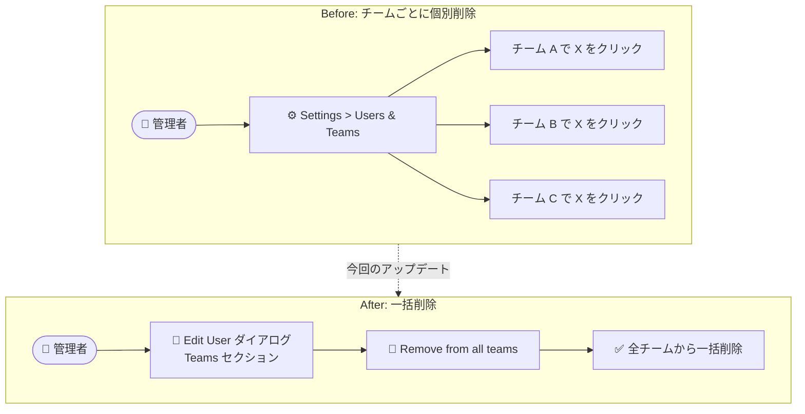

# Google Cloud Contact Center as a Service: 「Remove from all teams」ボタンの追加と多数のバグ修正

**リリース日**: 2026-09-21

**サービス**: Google Cloud Contact Center as a Service (CCaaS / CCAI Platform)

**機能**: ユーザーを全チームから一括削除する「Remove from all teams」ボタンの追加、および音声・チャット・連携機能に関する 22 件のバグ修正

**ステータス**: GA (Feature / Fixed)

📊 [このアップデートのインフォグラフィックを見る](https://takech9203.github.io/google-cloud-news-summary/20260921-ccaas-remove-from-all-teams-and-fixes.html)

## 概要

Google Cloud Contact Center as a Service (CCaaS、旧称 CCAI Platform) の 2026 年 9 月 21 日リリースでは、ユーザー管理を効率化する新機能「Remove from all teams」ボタンが追加されました。管理者は、Edit User ダイアログの Teams セクションから、ユーザーが所属するすべてのチームからワンクリックでそのユーザーを削除できるようになります。CCaaS ではユーザーを複数のチームに割り当てて、キューへのエージェント割り当て、データアクセス制御、レポーティングに活用するため、多数のチームに所属するユーザーの異動・退職時の管理作業が大幅に簡素化されます。

あわせて、本リリースでは 22 件のバグ修正が行われました。モバイル / Web チャットセッションの起動遅延、エージェントが正常にコールオファーを受信しているにもかかわらず Unresponsive ステータスに降格されてルーティングプールから除外される問題、Twilio BYOC SIP インバウンドコールでのダイヤル番号の不正フォーマット、仮想エージェントから人間のエージェントキューへの転送失敗など、コンタクトセンターの運用品質に直結する広範な修正が含まれています。

コンタクトセンターの管理者、スーパーバイザー、およびテレフォニー / CRM 連携を運用するエンジニアにとって、運用の安定性と管理効率の両面で重要なアップデートです。

**アップデート前の課題**

- ユーザーが複数のチームに所属している場合、チームから削除するには各チームの画面でユーザー名の横の X を個別にクリックする必要があり、多数のチームに所属するユーザーの一括削除ができなかった
- エージェントがコールオファーを正常に受信していても Unresponsive ステータスに誤って降格され、ルーティングプールから除外されることがあった
- キューに入った通話が空いているエージェントにルーティングされず、コールバックも提供されないケースがあった
- 仮想エージェントから人間のエージェントキューへの通話転送が失敗することがあった
- キュー個別の後処理 (wrap-up) / ディスポジション設定が、Queue Settings ページの無関係なフィールドを変更しただけでグローバルのデフォルト値にリセットされてしまうことがあった
- 通話保留がキャリア側で失敗した場合でも通話アダプターが保留中と表示し、エージェントと顧客の間で音声チャネルが開いたままになることがあった

**アップデート後の改善**

- Edit User ダイアログの Teams セクションにある「Remove from all teams」ボタンで、所属するすべてのチームからユーザーを一括削除できるようになった
- エージェントステータスの誤降格が修正され、コールオファーを受信できるエージェントがルーティングプールに正しく残るようになった
- キュー滞留時のルーティング / コールバック提供、仮想エージェントからの人間キューへの転送が正常に動作するようになった
- キュー個別の wrap-up / ディスポジション設定が意図せずリセットされる問題が解消された
- Twilio BYOC SIP、Nexmo 経由 DCR コール、Dialogflow CX、Salesforce 連携など、外部サービス連携に関する多数の不具合が修正された

## アーキテクチャ図



従来はユーザーが所属する各チームの画面で個別に削除操作が必要でしたが、今回のアップデートにより Edit User ダイアログの「Remove from all teams」ボタン 1 つで全チームから削除できるようになりました。

## サービスアップデートの詳細

### 主要機能

1. **Remove from all teams ボタン (新機能)**
   - Edit User ダイアログの Teams セクションに追加された新しいボタン
   - ユーザーが所属しているすべてのチームから、そのユーザーを一括で削除できる
   - 管理者向けの機能で、CCAI Platform ポータルの Settings > Users & Teams から利用する
   - CCaaS のチームはユーザーのグループ化、キューへのエージェント割り当て、チームマネージャーによるデータアクセス制御、レポーティングに使われており、1 ユーザーが複数チームに所属できるため、退職・異動時の整理が容易になる

2. **音声通話・ルーティング関連の修正**
   - コールオファーを正常に受信しているエージェントが Unresponsive ステータスに誤降格され、ルーティングプールから除外される問題を修正
   - キューに入った通話が空いているエージェントにルーティングされず、コールバックも提供されない問題を修正
   - 仮想エージェントが人間のエージェントキューに通話を転送できない問題を修正
   - キャリアが保留リクエストの処理に失敗した後も通話アダプターが保留中と誤表示し、エージェントと顧客間の音声チャネルが開いたままになる問題を修正
   - エージェントとエンドユーザーが別々のカンファレンスに参加してしまい、双方の音声が通じなくなる問題を修正
   - Nexmo 経由でルーティングされた未応答の DCR コールが再キューイングされず、発信者が切断されてしまう問題を修正
   - キャリアからの切断理由がない通話が、コールセンターが応答していない場合でも「customer abandoned (顧客放棄)」と誤分類される問題を修正

3. **チャット・エージェント支援関連の修正**
   - モバイルおよび Web チャットセッションの起動遅延とエラーの増加を修正
   - 構造化メッセージコンテンツを含むセッションでチャットトランスクリプトが生成・配信されない問題を修正
   - 仮想エージェント起点のセッションが非英語キューに転送された際に機械翻訳が有効化されない問題を修正
   - Generative Knowledge Assist の回答に長い URL が含まれるとパネルの端で切れてしまう問題を修正
   - 再生エラーが発生したボイスメールが自動的に既読・破棄扱いになる問題を修正

4. **テレフォニー・外部連携関連の修正**
   - Twilio BYOC SIP インバウンドコールで、ダイヤル番号に SIP ホストとポートの余分な数字が付加される問題を修正
   - 仮想エージェントによるデフレクション後に、エージェントの通話録音が欠落したり誤った通話レコードに紐付く問題を修正
   - DCR コールの call event API ペイロードに誤った仮想エージェントパラメータが含まれる問題を修正
   - チャットのカスタムデータが Salesforce レコードに記録されない問題を修正
   - 特定の構成で IVR 音声通話がカスタム wrap-up イベントを Dialogflow CX に送信しない問題を修正

5. **管理・設定関連の修正**
   - Queue Settings ページで無関係なフィールドを変更すると、キュー個別の wrap-up / ディスポジション設定がグローバルデフォルトにリセットされる問題を修正
   - メキシコのタイムゾーンに夏時間 (DST) 調整が誤って適用される問題を修正
   - プロバイダーが成功レスポンスを返さない場合に通話録音の削除タスクが無限ループに陥る問題を修正
   - メディアダウンロードの失敗によりサービスが予期せず再起動する問題を修正
   - ホスト URL 末尾のスラッシュが原因で、特定デプロイメント向けに無効化していた機能が Web SDK で再有効化されてしまう問題を修正

## 技術仕様

### Remove from all teams 機能

| 項目 | 詳細 |
|------|------|
| 操作場所 | CCAI Platform ポータル > Settings > Users & Teams > Edit User ダイアログ > Teams セクション |
| 対象ロール | 管理者 (Admin)。ユーザーとチームの管理権限を持つロール |
| 動作 | ユーザーが所属するすべてのチーム (サブチーム含む) からの一括削除 |
| 従来の方法 | 各チームの画面でユーザー名の横の X をクリックして個別に削除 |

### CCaaS のチームの役割 (参考)

| 用途 | 説明 |
|------|------|
| キュー割り当て | チーム単位でエージェントを通話 / チャットキューに割り当て。トップレベルチームをキューに割り当てるとサブチームも対象になる |
| データアクセス制御 | チームマネージャーとカスタムロールの「assigned teams only」設定により、チーム単位でデータ閲覧範囲を制御 |
| レポーティング | チーム単位のパフォーマンスレポート作成 |
| 複数所属 | 1 ユーザーは複数チームに所属可能。所属チームの優先順位 (トップレベルチームの並び順、サブチームの並び順) で適用される設定が決まる |

## 設定方法

### 前提条件

1. CCAI Platform ポータルへの管理者 (Admin) アクセス権限があること
2. 対象ユーザーが 1 つ以上のチームに所属していること

### 手順

#### ステップ 1: Edit User ダイアログを開く

CCAI Platform ポータルで **Settings > Users & Teams** に移動し、対象ユーザーを選択して Edit User ダイアログを開きます。

#### ステップ 2: Remove from all teams を実行

Edit User ダイアログの **Teams** セクションにある **Remove from all teams** ボタンをクリックします。ユーザーが所属するすべてのチームから削除されます。

なお、バグ修正はプラットフォーム側で自動的に適用されるため、利用者側での作業は不要です。

## メリット

### ビジネス面

- **ユーザー管理の効率化**: 退職や異動の際に、多数のチームに所属するユーザーをワンクリックで整理でき、管理者の作業時間を削減できる
- **運用品質の向上**: エージェントの誤った Unresponsive 降格やキュー滞留通話の未ルーティングなど、顧客体験と SLA に直結する不具合が解消される
- **正確なレポーティング**: 「customer abandoned」の誤分類やタイムゾーンの誤った DST 調整が修正され、レポートやメトリクスの正確性が向上する

### 技術面

- **削除漏れの防止**: チームごとの個別削除で発生しがちだった削除漏れ (キュー割り当てやデータアクセス権の残存) を防止できる
- **連携の安定化**: Twilio BYOC、Nexmo、Salesforce、Dialogflow CX との連携に関する不具合が修正され、外部システム連携の信頼性が向上する
- **コンプライアンス対応**: 通話録音の欠落・誤紐付けや録音削除タスクの無限ループが修正され、録音データのライフサイクル管理が正常化される

## デメリット・制約事項

### 考慮すべき点

- 「Remove from all teams」は一括削除操作のため、誤操作するとユーザーのキュー割り当て (チーム経由) やチームベースのデータアクセスに影響する。実行前に対象ユーザーの所属チームとキュー割り当てを確認することを推奨
- チーム経由でキューに割り当てられているエージェントを全チームから削除すると、そのキューからのコール / チャットのオファーを受けられなくなる
- 大量のユーザーを一括で操作する場合は、引き続き Bulk User Management (CSV による一括更新) の利用が適している

## ユースケース

### ユースケース 1: 退職者・異動者のオフボーディング

**シナリオ**: サポート部門のエージェントが退職することになった。このエージェントは言語別・スキル別に 5 つのチームに所属しており、従来は各チームの画面で個別に削除する必要があった。

**実装例**:
```
1. Settings > Users & Teams で対象ユーザーを検索
2. Edit User ダイアログを開く
3. Teams セクションの「Remove from all teams」をクリック
4. 必要に応じてユーザーを無効化 (deactivate)
```

**効果**: 削除漏れによるキュー割り当てやデータアクセス権の残存を防ぎ、オフボーディング作業を数分から数秒に短縮できる。

### ユースケース 2: 組織再編に伴うチーム構成の刷新

**シナリオ**: コンタクトセンターの組織再編で、一部のエージェントを既存のチーム構成から完全に外し、新しいチーム体系に再割り当てする。

**効果**: 「Remove from all teams」で所属をクリーンな状態にしてから新チームに追加することで、旧チームの設定 (チーム優先順位による設定の継承) が意図せず残ることを防げる。

## 料金

今回のアップデートによる料金体系の変更はありません。CCaaS はユーザーのライセンスタイプ (Admin / Manager / Agent / Screen Share agent) に基づく課金モデルで、ライセンスタイプはユーザーに割り当てられた権限によって決まります。

詳細は [Contact Center AI Platform の料金ページ](https://cloud.google.com/solutions/contact-center-ai-platform) を参照してください。

## 利用可能リージョン

本機能はプラットフォームのリリースとして CCaaS 環境全体に展開されます。リージョン別の提供状況については [公式ドキュメント](https://docs.cloud.google.com/contact-center/ccai-platform/docs) を参照してください。

## 関連サービス・機能

- **Dialogflow CX (Conversational Agents)**: CCaaS の仮想エージェント / IVR を構成するサービス。本リリースでカスタム wrap-up イベント送信や人間キューへの転送に関する修正が含まれる
- **Salesforce などの CRM 連携**: CCaaS はエージェントアダプターを CRM に組み込んで利用できる。本リリースでチャットのカスタムデータが Salesforce レコードに記録されない問題が修正された
- **BYOC (Bring Your Own Carrier)**: Twilio や Nexmo などの外部キャリアを利用する構成。本リリースで SIP 番号フォーマットや DCR コールの再キューイングに関する修正が含まれる
- **Bulk User Management**: CSV によるユーザーの一括登録・更新機能。大量ユーザーの管理には引き続きこちらが適している

## 参考リンク

- 📊 [インフォグラフィック](https://takech9203.github.io/google-cloud-news-summary/20260921-ccaas-remove-from-all-teams-and-fixes.html)
- [公式リリースノート](https://docs.cloud.google.com/release-notes#September_21_2026)
- [チームの追加と構成 (Add and configure teams)](https://docs.cloud.google.com/contact-center/ccai-platform/docs/add-configure-teams)
- [ユーザーロールと権限 (User roles and permissions)](https://docs.cloud.google.com/contact-center/ccai-platform/docs/user-roles-permissions)
- [Bulk User Management](https://docs.cloud.google.com/contact-center/ccai-platform/docs/bulk-user-management)
- [料金ページ](https://cloud.google.com/solutions/contact-center-ai-platform)

## まとめ

今回のリリースは、ユーザー管理を効率化する「Remove from all teams」ボタンの追加に加え、エージェントルーティング、通話保留、録音管理、外部キャリア / CRM 連携など運用品質に直結する 22 件のバグ修正を含む、CCaaS 運用者にとって実用性の高いアップデートです。特にエージェントの誤った Unresponsive 降格やキュー滞留通話の未ルーティングといった問題に心当たりがある場合は、修正が適用されていることを確認し、関連するモニタリング指標の改善をチェックすることを推奨します。

---

**タグ**: #GoogleCloud #CCaaS #CCAIPlatform #ContactCenter #ユーザー管理 #バグ修正 #Dialogflow #BYOC
