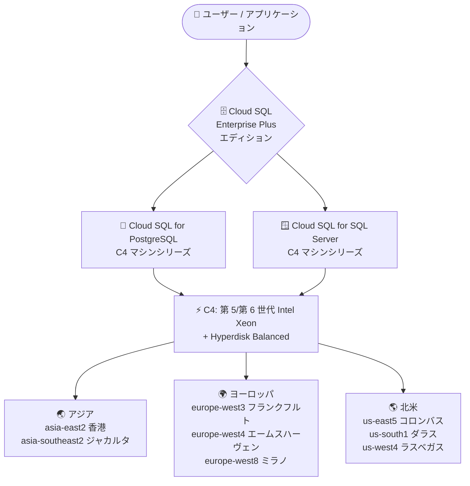

# Cloud SQL for PostgreSQL / SQL Server: C4 マシンシリーズの提供リージョン拡大

**リリース日**: 2026-09-21

**サービス**: Cloud SQL for PostgreSQL, Cloud SQL for SQL Server

**機能**: C4 マシンシリーズの提供リージョン拡大 (8 リージョン追加)

**ステータス**: Feature (リージョン拡大)

📊 [このアップデートのインフォグラフィックを見る](https://takech9203.github.io/google-cloud-news-summary/20260921-cloud-sql-c4-machine-series-region-expansion.html)

## 概要

Cloud SQL for PostgreSQL および Cloud SQL for SQL Server の Enterprise Plus エディションのインスタンスで、C4 マシンシリーズが新たに 8 つのリージョンで利用可能になりました。追加されたリージョンは asia-east2 (香港)、asia-southeast2 (ジャカルタ)、europe-west3 (フランクフルト)、europe-west4 (エームスハーヴェン)、europe-west8 (ミラノ)、us-east5 (コロンバス)、us-south1 (ダラス)、us-west4 (ラスベガス) です。

C4 マシンシリーズは第 5 世代および第 6 世代の Intel Xeon Scalable プロセッサをサポートし、一貫した予測可能な高パフォーマンスを提供するマシンシリーズです。ストレージには Google Cloud の最新世代ネットワークブロックストレージである Hyperdisk Balanced を使用します。高負荷なワークロードに適した価格性能バランスを備えており、データベースの性能要件が厳しいアプリケーションを運用するユーザーが対象です。

今回の拡大により、アジア・ヨーロッパ・北米の主要リージョンで C4 ベースの Cloud SQL Enterprise Plus インスタンスを展開できるようになり、データレジデンシー要件やレイテンシ要件を満たしながら最新世代のマシンシリーズを選択できる範囲が広がりました。

**アップデート前の課題**

- 上記 8 リージョンでは Cloud SQL の C4 マシンシリーズが利用できず、N2 や N4 など他のマシンシリーズを選択する必要があった
- 香港・ジャカルタ・ミラノなど、データレジデンシー要件で特定リージョンが必須の場合、最新の Intel Xeon Scalable プロセッサ (第 5/第 6 世代) ベースの構成を選択できなかった
- リージョンをまたいだ環境 (本番/DR/開発) でマシンシリーズを統一できず、性能特性の一貫性を保ちにくかった

**アップデート後の改善**

- 追加された 8 リージョンで、PostgreSQL および SQL Server の Enterprise Plus インスタンスに C4 マシンシリーズを選択できるようになった
- 第 5/第 6 世代 Intel Xeon Scalable プロセッサによる高い価格性能比を、より多くのリージョンで活用できるようになった
- 複数リージョンにまたがるデプロイでも C4 でマシンシリーズを統一しやすくなり、性能設計とサイジングの一貫性が向上した

## アーキテクチャ図



Cloud SQL Enterprise Plus エディションの C4 マシンシリーズが、今回新たにアジア 2 リージョン、ヨーロッパ 3 リージョン、北米 3 リージョンで利用可能になったことを示しています。

## サービスアップデートの詳細

### 主要機能

1. **C4 マシンシリーズの 8 リージョン追加**
   - Cloud SQL for PostgreSQL Enterprise Plus インスタンスと Cloud SQL for SQL Server Enterprise Plus インスタンスの両方が対象
   - 追加リージョン: asia-east2 (香港)、asia-southeast2 (ジャカルタ)、europe-west3 (フランクフルト)、europe-west4 (エームスハーヴェン)、europe-west8 (ミラノ)、us-east5 (コロンバス)、us-south1 (ダラス)、us-west4 (ラスベガス)

2. **最新世代 Intel Xeon Scalable プロセッサのサポート**
   - C4 マシンシリーズは第 5 世代および第 6 世代の Intel Xeon Scalable プロセッサをサポート
   - 一貫した予測可能な高パフォーマンスを提供し、高負荷ワークロードに適した価格性能バランスを実現

3. **Hyperdisk Balanced ストレージ**
   - C4 マシンシリーズは Google Cloud Hyperdisk の Hyperdisk Balanced ストレージオプションを使用
   - Hyperdisk は Google Cloud の最新世代ネットワークブロックストレージサービス

## 技術仕様

### C4 マシンシリーズの事前定義マシンタイプ

| マシンタイプ | vCPU | メモリ (GB) | オプションの Data Cache (GB) |
|------|------|------|------|
| db-perf-optimized-C4-2 | 2 | 15 | 提供なし |
| db-perf-optimized-C4-4 | 4 | 31 | 375 |
| db-perf-optimized-C4-8 | 8 | 62 | 375 |

### C4 マシンシリーズの主な特徴

| 項目 | 詳細 |
|------|------|
| 対象エディション | Cloud SQL Enterprise Plus |
| 対象データベースエンジン | PostgreSQL、SQL Server (MySQL も C4 対応済み) |
| プロセッサ | 第 5/第 6 世代 Intel Xeon Scalable プロセッサ |
| 最大構成 | 8 vCPU / 62 GB RAM |
| ストレージ | Hyperdisk Balanced |
| 利用可能リージョン | リージョンと構成に依存 (今回 8 リージョン追加) |

## 設定方法

### 前提条件

1. Cloud SQL Enterprise Plus エディションのインスタンスであること (C4 は Enterprise Plus 専用)
2. 対象リージョン (今回追加された 8 リージョンを含む C4 対応リージョン) を選択すること

### 手順

#### ステップ 1: C4 マシンタイプを指定して PostgreSQL インスタンスを作成

```bash
gcloud sql instances create my-pg-c4-instance \
  --database-version=POSTGRES_17 \
  --edition=ENTERPRISE_PLUS \
  --tier=db-perf-optimized-C4-8 \
  --region=asia-east2
```

Enterprise Plus エディションと C4 マシンタイプ (`db-perf-optimized-C4-8` など) を指定し、今回追加されたリージョン (例: 香港) にインスタンスを作成します。

#### ステップ 2: 既存インスタンスのマシンタイプを C4 に変更 (SQL Server の例)

```bash
gcloud sql instances patch my-sqlserver-instance \
  --tier=db-perf-optimized-C4-4
```

既存の Enterprise Plus インスタンスのマシンタイプを C4 に変更できます。マシンタイプの変更にはインスタンスの再起動が伴うため、メンテナンスウィンドウでの実施を推奨します。

## メリット

### ビジネス面

- **データレジデンシー対応の拡大**: 香港・ジャカルタ・ミラノなど、規制やデータ主権の要件で特定リージョンが必須の場合でも、最新の C4 マシンシリーズを選択可能になった
- **価格性能比の向上**: 高負荷ワークロードに適した価格性能バランスを持つ C4 を、より多くのリージョンで活用でき、コスト効率の改善余地が広がった

### 技術面

- **一貫した高パフォーマンス**: 第 5/第 6 世代 Intel Xeon Scalable プロセッサにより、一貫した予測可能な高パフォーマンスを実現
- **最新世代ストレージ**: Hyperdisk Balanced により、性能と容量を独立してプロビジョニング可能な最新世代のブロックストレージを利用できる
- **マルチリージョン設計の柔軟性向上**: 本番・DR・開発環境でマシンシリーズを統一しやすくなり、性能特性の予測とサイジングが容易になった

## デメリット・制約事項

### 制限事項

- C4 マシンシリーズは Cloud SQL Enterprise Plus エディション専用であり、Enterprise エディションでは利用できない
- C4 の最大構成は 8 vCPU / 62 GB RAM であり、より大規模な構成が必要な場合は N2 (最大 128 vCPU / 864 GB RAM) や C4A などの選択が必要
- 最小構成の db-perf-optimized-C4-2 では Data Cache を利用できない

### 考慮すべき点

- 利用可能なマシンタイプはリージョンと構成に依存するため、事前にリージョン別の提供状況を確認する必要がある
- 既存インスタンスからマシンシリーズを変更する場合、再起動によるダウンタイムを考慮した計画が必要

## ユースケース

### ユースケース 1: 香港リージョンでの高性能 PostgreSQL 基盤の刷新

**シナリオ**: 金融系サービスがデータレジデンシー要件により asia-east2 (香港) でのデータベース運用が必須で、既存の N2 ベースのインスタンスの性能・コスト効率を改善したい。

**実装例**:
```bash
gcloud sql instances patch my-hk-pg-instance \
  --tier=db-perf-optimized-C4-8
```

**効果**: リージョンを変更せずに第 5/第 6 世代 Intel Xeon Scalable プロセッサベースの C4 に移行でき、高負荷ワークロードに適した価格性能比を得られる。

### ユースケース 2: ヨーロッパ複数リージョンでの SQL Server DR 構成の統一

**シナリオ**: europe-west3 (フランクフルト) を本番、europe-west4 (エームスハーヴェン) を DR とする SQL Server Enterprise Plus 構成で、両リージョンのマシンシリーズを統一したい。

**効果**: 本番と DR の両リージョンで C4 を利用できるようになり、フェイルオーバー後も同等の性能特性を維持できる。

## 料金

C4 マシンシリーズ自体の追加料金体系はなく、Cloud SQL Enterprise Plus エディションの vCPU・メモリ・ストレージ (Hyperdisk Balanced) に基づく従量課金が適用されます。料金はリージョンとマシンタイプにより異なるため、詳細は料金ページを参照してください。

- [Cloud SQL 料金ページ](https://cloud.google.com/sql/pricing)

## 利用可能リージョン

今回のアップデートで C4 マシンシリーズが追加されたリージョン (PostgreSQL / SQL Server の Enterprise Plus 共通):

| リージョン | ロケーション |
|------|------|
| asia-east2 | 香港 |
| asia-southeast2 | ジャカルタ (インドネシア) |
| europe-west3 | フランクフルト (ドイツ) |
| europe-west4 | エームスハーヴェン (オランダ) |
| europe-west8 | ミラノ (イタリア) |
| us-east5 | コロンバス (オハイオ州、アメリカ) |
| us-south1 | ダラス (テキサス州、アメリカ) |
| us-west4 | ラスベガス (ネバダ州、アメリカ) |

その他の C4 対応リージョンは [リージョン別提供状況](https://docs.cloud.google.com/sql/docs/postgres/region-availability-overview) を参照してください。

## 関連サービス・機能

- **Cloud SQL Enterprise Plus エディション**: C4 マシンシリーズの利用に必要なエディション。99.99% SLA、Data Cache、1 秒未満のメンテナンスダウンタイムなどを提供
- **Google Cloud Hyperdisk (Hyperdisk Balanced)**: C4 マシンシリーズが使用する最新世代のネットワークブロックストレージ
- **Cloud SQL for MySQL**: MySQL でも C4 / C4A マシンシリーズが提供されており、エンジン間でマシンシリーズ戦略を統一できる
- **C4A マシンシリーズ**: Google Axion (Arm ベース) プロセッサを採用した姉妹シリーズ。最大 72 vCPU / 576 GB RAM までスケール可能

## 参考リンク

- 📊 [インフォグラフィック](https://takech9203.github.io/google-cloud-news-summary/20260921-cloud-sql-c4-machine-series-region-expansion.html)
- [公式リリースノート](https://docs.cloud.google.com/release-notes#September_21_2026)
- [Cloud SQL for PostgreSQL マシンシリーズ概要 (C4)](https://docs.cloud.google.com/sql/docs/postgres/machine-series-overview#c4)
- [Cloud SQL for SQL Server マシンシリーズ概要 (C4)](https://docs.cloud.google.com/sql/docs/sqlserver/machine-series-overview#c4)
- [Cloud SQL エディション概要](https://docs.cloud.google.com/sql/docs/postgres/editions-intro)
- [料金ページ](https://cloud.google.com/sql/pricing)

## まとめ

C4 マシンシリーズの提供リージョンが 8 リージョン拡大し、アジア・ヨーロッパ・北米の主要ロケーションで Cloud SQL for PostgreSQL / SQL Server の Enterprise Plus インスタンスに最新世代 Intel Xeon ベースの構成を選択できるようになりました。対象リージョンで N2 などの既存マシンシリーズを利用中の場合は、価格性能比の観点から C4 への移行を検討する価値があります。マシンタイプ変更には再起動が伴うため、メンテナンスウィンドウでの計画的な実施を推奨します。

---

**タグ**: Cloud SQL, PostgreSQL, SQL Server, C4, マシンシリーズ, リージョン拡大, Enterprise Plus, Intel Xeon, Hyperdisk
