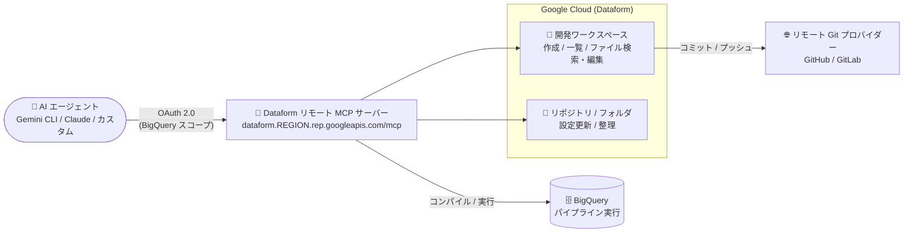

# Dataform: リモート MCP サーバーが開発ワークスペースでのパイプライン作成と Git 操作をサポート (GA)

**リリース日**: 2026-09-21

**サービス**: Dataform

**機能**: リモート Model Context Protocol (MCP) サーバーによる開発ワークスペースでのパイプライン作成・Git リポジトリ操作

**ステータス**: GA (一般提供)

📊 [このアップデートのインフォグラフィックを見る](https://takech9203.github.io/google-cloud-news-summary/20260921-dataform-remote-mcp-server-ga.html)

## 概要

Dataform のリモート Model Context Protocol (MCP) サーバーが、開発ワークスペース (development workspace) でのパイプライン作成 (pipeline authoring) と Git リポジトリ操作をサポートするようになりました。この機能は一般提供 (GA) です。AI エージェントは、ワークスペースの作成・一覧取得、ファイルの検索・編集、変更のコミットとリモート Git プロバイダーへのプッシュ、リポジトリ設定の更新、フォルダによるリポジトリの整理を実行できます。

Dataform リモート MCP サーバーは、Gemini CLI、ChatGPT、Claude、独自開発のカスタムアプリケーションなどの AI アプリケーションと接続でき、Dataform API を有効化すると自動的に利用可能になります。今回の拡張により、AI エージェントが Dataform の標準的な開発フロー (ワークスペースでの開発 → コミット → リモート Git へのプッシュ) を、人間の開発者と同じように MCP ツール経由で実行できるようになりました。

対象ユーザーは、BigQuery 上のデータ変換パイプライン (SQL ワークフロー) の開発を AI エージェントで自動化・支援したいデータエンジニアリングチームです。

**アップデート前の課題**

Dataform リモート MCP サーバーは 2026 年 8 月 17 日に GA となり、AI エージェントによるデータ変換ワークフローの管理が可能でしたが、提供されるツールには以下の範囲の制約がありました。

- リポジトリ直下の単一ファイルアセット (ノートブックや保存クエリなど) の管理、パイプライン・リリース構成の管理、実行のトラブルシューティングが中心だった
- Dataform の標準的な開発フローである開発ワークスペースでのパイプライン作成を MCP 経由で行うことができなかった
- リモート Git プロバイダー (GitHub、GitLab など) への変更のコミット・プッシュといった Git 操作を MCP 経由で行うことができなかった

**アップデート後の改善**

- AI エージェントが開発ワークスペースを作成・一覧取得し、ワークスペース内でファイルの検索・編集を行えるようになった
- 変更のコミットと、リモート Git プロバイダーへのプッシュが MCP ツール経由で可能になった
- リポジトリ設定の更新や、フォルダによるリポジトリの整理が MCP 経由で可能になった

## アーキテクチャ図



AI エージェントは OAuth 2.0 (BigQuery スコープ) で認証し、Dataform リモート MCP サーバー経由で開発ワークスペースでのパイプライン作成、リモート Git プロバイダーへのコミット・プッシュ、BigQuery でのパイプライン実行までを一貫して行えます。

## サービスアップデートの詳細

### 主要機能

1. **開発ワークスペースでのパイプライン作成**
   - AI エージェントがワークスペースの作成・一覧取得を実行可能
   - ワークスペース内のファイルの検索・編集に対応し、SQL ワークフローの開発を MCP 経由で完結できる

2. **Git リポジトリ操作**
   - 変更のコミットと、リモート Git プロバイダー (GitHub、GitLab など) へのプッシュに対応
   - Dataform の標準的な開発フロー (ワークスペースで編集 → コミット → プッシュ) をエージェントが実行できる

3. **リポジトリ管理**
   - リポジトリ設定の更新に対応
   - フォルダによるリポジトリの整理が可能

4. **既存のエージェント機能 (2026 年 8 月 GA 時から提供)**
   - 単一ファイルアセットのセットアップ: リポジトリ作成、ディレクトリ内容のクエリなど
   - パイプラインとリリースの管理: ワークフロー構成・リリース構成の管理、コンパイル結果の生成、ワークフロー実行のトリガー・キャンセル
   - トラブルシューティングと検証: コンパイル結果の取得やワークフロー実行アクションのクエリによる失敗原因の特定

## 技術仕様

### MCP サーバーの接続情報

| 項目 | 詳細 |
|------|------|
| サーバー URL | `https://dataform.REGION.rep.googleapis.com/mcp` (REGION はリポジトリのリージョン、例: `us-central1`) |
| トランスポート | Streamable HTTP |
| プロトコル | MCP バージョン 2026-07-28 (ステートレスコア) |
| 有効化 | Dataform API の有効化により自動的に利用可能 |
| 対応クライアント | Gemini CLI、ChatGPT、Claude、カスタムアプリケーションなど |

### 認証と認可

| 項目 | 詳細 |
|------|------|
| 認証プロトコル | OAuth 2.0 + IAM |
| 必要な OAuth スコープ | BigQuery スコープ (`https://www.googleapis.com/auth/bigquery`) |
| ツール一覧 (`tools/list`) | 認証不要 (エージェントが事前認可なしで利用可能なツールを確認できる) |
| ツール実行 (`tools/call`) | OAuth トークンによる認証が必要 |

### 必要な IAM ロール

| ロール | 用途 |
|--------|------|
| `roles/mcp.toolUser` (MCP Tool User) | MCP ツール呼び出しの実行 |
| `roles/dataform.editor` (Dataform Editor) | Dataform リポジトリ・ワークスペースの作成、ファイル編集 |
| `roles/bigquery.jobUser` (BigQuery Job User) | BigQuery ジョブの実行 |

ワークスペース関連の権限には `dataform.workspaces.create` / `list` / `searchFiles` / `writeFile` / `commit` / `push` / `pull` / `fetchHistory` / `fetchDiff` / `fetchFileGitStatuses` などが含まれます。

### ツール一覧の取得例

```bash
curl --location 'https://dataform.googleapis.com/mcp' \
  --header 'content-type: application/json' \
  --header 'accept: application/json, text/event-stream' \
  --data '{
    "jsonrpc": "2.0",
    "method": "tools/list",
    "id": 1
  }'
```

## 設定方法

### 前提条件

1. Dataform リポジトリをリモート Git プロバイダー (GitHub、GitLab など) に接続しておく
2. AI エージェントに BigQuery スコープを使用する有効な OAuth トークンを構成する
3. 必要な IAM ロール (`roles/mcp.toolUser`、`roles/dataform.editor`、`roles/bigquery.jobUser`) を付与する

### 手順

#### ステップ 1: MCP クライアントの設定

AI アプリケーションでリモート MCP サーバーの追加・接続を行います。

- サーバー名: Dataform MCP server
- サーバー URL: `https://dataform.REGION.rep.googleapis.com/mcp` (REGION はリポジトリのリージョン)
- トランスポート: Streamable HTTP
- 認証情報: Google Cloud 認証情報、OAuth クライアント ID とシークレット、またはエージェント ID と認証情報

#### ステップ 2: (任意) Model Armor によるツール呼び出しの保護

```bash
gcloud model-armor floorsettings update \
  --full-uri='projects/PROJECT_ID/locations/global/floorSetting' \
  --enable-floor-setting-enforcement=TRUE \
  --add-integrated-services=GOOGLE_MCP_SERVER \
  --google-mcp-server-enforcement-type=INSPECT_AND_BLOCK \
  --enable-google-mcp-server-cloud-logging \
  --malicious-uri-filter-settings-enforcement=ENABLED
```

Model Armor のフロア設定を有効にすると、プロジェクト内のすべての MCP ツール呼び出しとレスポンスに対して一貫したセキュリティフィルタが適用されます。

## メリット

### ビジネス面

- **データパイプライン開発の自動化**: AI エージェントがワークスペース作成からコミット・プッシュまでの開発フローを実行できるため、データ変換パイプラインの開発・保守を自動化できる
- **ガバナンスを維持した AI 活用**: IAM によるきめ細かい認可、集中監査ログ、Model Armor によるプロンプト・レスポンス保護など、Google Cloud のマネージド MCP サーバーの統制機能を利用できる

### 技術面

- **標準プロトコルによる接続**: MCP 標準に準拠しているため、Gemini CLI、Claude、ChatGPT、カスタムエージェントなど多様な AI アプリケーションから同じ方法で接続できる
- **Git ベースの開発フローとの統合**: ワークスペースでの編集内容をリモート Git プロバイダーへプッシュできるため、既存のコードレビューや CI/CD プロセスと組み合わせられる
- **マネージドなリモートサーバー**: サービス側インフラで動作する HTTP エンドポイントのため、ローカル MCP サーバーの構築・運用が不要

## デメリット・制約事項

### 考慮すべき点

- エージェント用に個別の ID (アイデンティティ) を作成し、リソースへのアクセスを制御・監視することが推奨されている
- ツール実行には BigQuery OAuth スコープが必要で、アクセスするリソースによっては追加のスコープが必要になる場合がある
- Model Armor を有効にすると、Dataform MCP サーバーはクロスジュリスディクショナルルーティングを使用するため、処理中・転送中データのデータレジデンシー要件に影響する可能性がある
- Model Armor のロギングを有効にするとペイロード全体が記録されるため、ログに機密情報が含まれる可能性がある

## ユースケース

### ユースケース 1: AI エージェントによるパイプラインの新規開発

**シナリオ**: データエンジニアが AI エージェントに「新しい売上集計テーブルを作る SQL ワークフローを追加して」と指示する。

**実装例**:
```
1. エージェントが MCP ツールで開発ワークスペースを作成
2. ワークスペース内のファイルを検索し、既存の定義を参照しながら SQLX ファイルを編集
3. コンパイル結果を生成して検証
4. 変更をコミットし、リモート Git プロバイダー (GitHub など) にプッシュ
5. 人間がプルリクエストをレビューしてマージ
```

**効果**: パイプライン開発の初期実装をエージェントに委譲しつつ、Git ベースのレビュープロセスで品質を担保できる。

### ユースケース 2: リポジトリの整理と設定の一括管理

**シナリオ**: 多数の Dataform リポジトリを運用するチームが、リポジトリの整理や設定変更をエージェントに指示する。

**効果**: フォルダによるリポジトリの整理やリポジトリ設定の更新を対話的に実行でき、管理作業の負担を軽減できる。

## 料金

Dataform 自体は無料のサービスです。ただし、Dataform を他のサービスと組み合わせて使用する場合、関連する費用が発生する可能性があります。MCP 経由でトリガーされるパイプラインの実行は BigQuery ジョブとして実行されるため、BigQuery の料金が適用されます。

詳細は [Dataform の料金ページ](https://cloud.google.com/dataform/pricing) を参照してください。

## 利用可能リージョン

MCP サーバーのエンドポイントはリポジトリが配置されているリージョンごとに提供されます (`https://dataform.REGION.rep.googleapis.com/mcp`)。利用可能なリージョンは [Dataform のドキュメント](https://docs.cloud.google.com/dataform/docs) を参照してください。

## 関連サービス・機能

- **BigQuery**: Dataform のパイプラインは BigQuery ジョブとして実行される。MCP ツールの認証にも BigQuery OAuth スコープを使用する
- **IAM (Identity and Access Management)**: MCP ツール呼び出しの認可を管理。エージェント専用 ID の作成が推奨される
- **Model Armor**: MCP ツール呼び出しとレスポンスをスクリーニングし、悪意のある入力や機密データの漏えいから保護する (任意設定)
- **GitHub / GitLab などのサードパーティ Git プロバイダー**: ワークスペースからのコミット・プッシュ先として連携する
- **Gemini CLI / Claude / ChatGPT などの AI アプリケーション**: MCP クライアントとして Dataform リモート MCP サーバーに接続する

## 参考リンク

- 📊 [インフォグラフィック](https://takech9203.github.io/google-cloud-news-summary/20260921-dataform-remote-mcp-server-ga.html)
- [公式リリースノート](https://docs.cloud.google.com/release-notes#September_21_2026)
- [Use the Dataform remote MCP server](https://docs.cloud.google.com/dataform/docs/use-dataform-mcp)
- [Dataform MCP reference](https://docs.cloud.google.com/dataform/docs/reference/mcp)
- [Google Cloud MCP servers overview](https://docs.cloud.google.com/mcp/overview)
- [料金ページ](https://cloud.google.com/dataform/pricing)

## まとめ

Dataform リモート MCP サーバーの GA 拡張により、AI エージェントが開発ワークスペースでのパイプライン作成からリモート Git プロバイダーへのプッシュまで、人間の開発者と同等の開発フローを実行できるようになりました。BigQuery 上のデータ変換パイプラインの開発を AI で自動化したいチームは、IAM ロールと OAuth 構成を整備した上で、Gemini CLI や Claude などの MCP クライアントからの接続を試すことをおすすめします。

---

**タグ**: `Dataform`, `MCP`, `Model Context Protocol`, `AI エージェント`, `BigQuery`, `Git`, `GA`, `データエンジニアリング`
