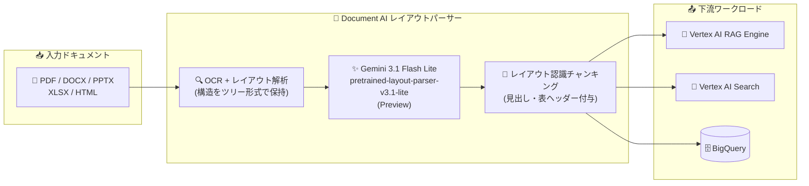

# Document AI: Gemini レイアウトパーサー新モデル pretrained-layout-parser-v3.1-lite が Preview に

**リリース日**: 2026-09-21

**サービス**: Document AI

**機能**: Gemini レイアウトパーサー モデル `pretrained-layout-parser-v3.1-lite-2026-08-11` (Preview)

**ステータス**: Preview (Release Candidate チャネル)

📊 [このアップデートのインフォグラフィックを見る](https://takech9203.github.io/google-cloud-news-summary/20260921-document-ai-gemini-layout-parser-v3-1-lite.html)

## 概要

Document AI のレイアウトパーサーに、新しいプロセッサーバージョン `pretrained-layout-parser-v3.1-lite-2026-08-11` が Preview として追加されました。このモデルは **Gemini 3.1 Flash Lite LLM** を搭載しており、Release Candidate チャネルで提供されます (モデル自体のリリース日は 2026 年 8 月 11 日)。

Document AI レイアウトパーサーは、Google の専用 OCR モデルと Gemini の生成 AI 能力を組み合わせた高度なドキュメント解析サービスです。テーブル、図、リスト、見出しなどの要素を識別し、「どの段落がどの見出しに属するか」といった文脈的な関係を保持したまま、非構造化ドキュメントを機械可読な構造化情報に変換します。標準的な OCR がドキュメントを平坦化して構造や文脈を失わせてしまうという、検索や RAG (Retrieval Augmented Generation) における重要な課題を解決するために設計されています。

今回の v3.1-lite は「Lite」の名が示すとおり軽量な Gemini 3.1 Flash Lite を基盤としており、RAG パイプラインの前処理として大量のドキュメントを解析するユーザーや、最新の Gemini 世代によるレイアウト解析を試したいユーザーが対象です。

**アップデート前の課題**

- Gemini ベースのレイアウトパーサーは、Gemini 2.5 Flash / 2.5 Pro を搭載した v1.5 系、Gemini 3.0 Flash / 3.0 Pro を搭載した v1.6 系までの提供であり、Gemini 3.1 世代のモデルを利用できなかった
- Pro 系モデル (v1.5-pro など) はレイテンシが高く、大量ドキュメントの高速処理には向いていなかった
- 軽量・低レイテンシ志向の「Lite」バリアントはラインナップに存在しなかった

**アップデート後の改善**

- 最新の Gemini 3.1 Flash Lite LLM を搭載したレイアウト解析が Preview で利用可能になった
- 軽量モデルベースの新しい選択肢が加わり、ワークロードの要件 (精度・レイテンシ・コスト) に応じたモデル選択の幅が広がった
- プロセッサーバージョンを切り替えるだけで既存のレイアウトパーサー処理パイプラインから新モデルを利用できる

## アーキテクチャ図



ドキュメントは OCR とレイアウト解析で構造ツリーに変換され、Gemini 3.1 Flash Lite が図表の言語化 (Verbalize) を行い、見出しなどの文脈を付与したチャンクとして RAG や検索、データ分析基盤に供給されます。

## サービスアップデートの詳細

### 主要機能

1. **Gemini 3.1 Flash Lite 搭載の新プロセッサーバージョン**
   - `pretrained-layout-parser-v3.1-lite-2026-08-11` として Preview 提供
   - リリースチャネルは Release Candidate、モデルのリリース日は 2026 年 8 月 11 日
   - プロセッサーバージョンの切り替えで利用可能 ([Manage processor versions](https://docs.cloud.google.com/document-ai/docs/manage-processor-versions) を参照)

2. **高度なテーブル解析**
   - 結合セルや複雑なヘッダーを持つテーブル (財務レポート、技術マニュアルなど) を正確に解析
   - 列・セルのアライメントを正しく認識し、データの整合性を保持

3. **ハルシネーションの低減**
   - 純粋な LLM ベースのパーサーと異なり、高度な OCR を基盤とすることでドキュメントの実際の内容にグラウンディング
   - 存在しないテキストの生成 (ハルシネーション) を大幅に抑制

4. **レイアウト認識チャンキングと図表の言語化**
   - ドキュメントの階層構造を理解し、祖先となる見出しや表ヘッダーを含む文脈付きチャンクを生成
   - 図・グラフ・テーブルを Gemini がテキスト記述として注釈化 (Annotate and Verbalize) し、検索可能なデータに変換

## 技術仕様

### レイアウトパーサーのプロセッサーバージョン一覧

| モデルバージョン | 搭載 LLM | チャネル | リリース日 |
|------|------|------|------|
| pretrained-layout-parser-v1.0-2024-06-03 | (OCR ベース、デフォルト) | Stable (GA) | 2024-06-03 |
| pretrained-layout-parser-v1.5-2025-08-25 | Gemini 2.5 Flash | Release Candidate | 2025-08-25 |
| pretrained-layout-parser-v1.5-pro-2025-08-25 | Gemini 2.5 Pro (高レイテンシ) | Release Candidate | 2025-08-25 |
| pretrained-layout-parser-v1.6-pro-2025-12-01 | Gemini 3.0 Pro | Release Candidate | 2025-12-01 |
| pretrained-layout-parser-v1.6-2026-01-13 | Gemini 3.0 Flash | Release Candidate | 2026-01-13 |
| **pretrained-layout-parser-v3.1-lite-2026-08-11** | **Gemini 3.1 Flash Lite** | **Release Candidate** | **2026-08-11** |

### 処理制限

| 項目 | 詳細 |
|------|------|
| オンライン処理: 最大ファイルサイズ | 20 MB (全ファイルタイプ) |
| オンライン処理: 最大ページ数 | 15 ページ / PDF |
| バッチ処理: 最大ファイルサイズ | 1 GB (PDF) |
| バッチ処理: 最大ページ数 | 500 ページ / PDF |

### 対応ファイルタイプ (GA・課金対象)

| ファイルタイプ | 検出要素 |
|------|------|
| PDF | 図、段落、テーブル、タイトル、見出し、ヘッダー、フッター |
| HTML | 段落、テーブル、リスト、タイトル、見出し、ヘッダー、フッター |
| DOCX | 段落、複数ページにまたがるテーブル、リスト、タイトル、見出し |
| PPTX | 段落、テーブル、リスト、タイトル、見出し |
| XLSX / XLSM | スプレッドシート内のテーブル (INT / FLOAT / STRING) |

上記以外のファイルタイプは Preview として無償で提供されます。

## 設定方法

### 前提条件

1. Google Cloud プロジェクトで Document AI API が有効化されていること
2. レイアウトパーサー プロセッサー (プロセッサータイプ: `LAYOUT_PARSER_PROCESSOR`) が作成済みであること

### 手順

#### ステップ 1: レイアウトパーサー プロセッサーの作成

```bash
# Google Cloud コンソールまたは API でレイアウトパーサーを作成
# プロセッサータイプ: LAYOUT_PARSER_PROCESSOR
```

[プロセッサーの作成と管理](https://docs.cloud.google.com/document-ai/docs/create-processor) の手順に従ってプロセッサーを作成します。

#### ステップ 2: プロセッサーバージョンを v3.1-lite に切り替え

```bash
# 処理リクエストでプロセッサーバージョンを明示的に指定
# projects/{project}/locations/{location}/processors/{processor_id}/processorVersions/pretrained-layout-parser-v3.1-lite-2026-08-11
```

[Manage processor versions](https://docs.cloud.google.com/document-ai/docs/manage-processor-versions) の手順で、使用するバージョンとして `pretrained-layout-parser-v3.1-lite-2026-08-11` を選択またはリクエストで指定します。

#### ステップ 3 (任意): Vertex AI RAG Engine から利用

```json
{
  "import_rag_files_config": {
    "gcs_source": { "uris": "gs://my-bucket/docs" },
    "rag_file_parsing_config": {
      "layout_parser": {
        "processor_name": "projects/PROJECT_ID/locations/us/processors/PROCESSOR_ID/processorVersions/pretrained-layout-parser-v3.1-lite-2026-08-11",
        "max_parsing_requests_per_min": 120
      }
    }
  }
}
```

RAG Engine のファイルインポート時に `layout_parser.processor_name` でプロセッサーバージョンまで指定することで、新モデルによる解析結果を RAG コーパスに取り込めます。

## メリット

### ビジネス面

- **RAG・検索の回答品質向上**: 文脈を保持したチャンキングにより、社内ドキュメント検索や生成 AI アプリケーションの回答精度向上が期待できる
- **モデル選択の柔軟性**: Pro / Flash / Flash Lite と精度・レイテンシ特性の異なるモデルから、ユースケースに合わせて選択できる

### 技術面

- **最新 Gemini 世代の活用**: Gemini 3.1 Flash Lite によるレイアウト解析・図表の言語化を既存のレイアウトパーサー API から透過的に利用可能
- **移行の容易さ**: プロセッサーバージョンの指定を変更するだけで済み、パイプラインの改修が不要

## デメリット・制約事項

### 制限事項

- Preview (Release Candidate チャネル) であり、本番ワークロードでの利用は [プロダクトのローンチステージ](https://cloud.google.com/products/#product-launch-stages) の条件に従う
- オンライン処理は 20 MB / 15 ページ (PDF)、バッチ処理は 1 GB / 500 ページ (PDF) の上限がある

### 考慮すべき点

- Gemini ベースのバージョン (v1.5 系) では、PDF 以外のファイルは Stable 版 v1.0 と同じ挙動になる旨が明記されている。v3.1-lite での非 PDF ファイルの挙動は公式ドキュメントで確認すること
- Gemini 3.0 系バージョン (v1.6 系) には Vertex AI Gemini グローバルエンドポイント使用によるデータレジデンシー (DMZ) 非準拠の注記がある。データレジデンシー要件がある場合は v3.1-lite の準拠状況を最新ドキュメントで確認すること
- デフォルトのプロセッサークォータを超える場合は [クォータ増加リクエスト](https://docs.cloud.google.com/docs/quotas/view-manage#managing_your_quota_console) が必要

## ユースケース

### ユースケース 1: 大量ドキュメントの RAG 前処理

**シナリオ**: 社内の規程集・マニュアル・財務レポート (PDF) を Vertex AI RAG Engine のコーパスに取り込み、生成 AI チャットボットで検索可能にする。軽量モデルで大量ページを効率的に処理したい。

**実装例**:
```python
from vertexai import rag

response = rag.import_files(
    corpus_name=corpus_name,
    paths=["gs://my_bucket/company_docs"],
    transformation_config=rag.TransformationConfig(
        rag.ChunkingConfig(chunk_size=1024, chunk_overlap=256)
    ),
    layout_parser=rag.LayoutParserConfig(
        processor_name="projects/{PROJECT_ID}/locations/us/processors/{PROCESSOR_ID}/processorVersions/pretrained-layout-parser-v3.1-lite-2026-08-11",
        max_parsing_requests_per_min=120,
    ),
)
```

**効果**: 見出し・表ヘッダー付きの文脈保持チャンクが生成され、検索精度と回答のグラウンディング品質が向上する。

### ユースケース 2: 財務レポートの構造化データ取り込み

**シナリオ**: 10-K などの財務報告書に含まれる複雑なテーブル (結合セル、多段ヘッダー) を解析し、パースしたテーブルや画像の説明文を BigQuery にインデックスして分析に活用する。

**効果**: 従来の OCR では崩れやすかったテーブル構造を正確に保持し、グラフや図の内容もテキスト化されるため、非構造化ドキュメントをデータ分析パイプラインに組み込める。

## 料金

Document AI の料金は月間の処理ページ数に基づきます。レイアウトパーサーの料金は以下のとおりです。

| パーサー | 料金 | 対象 |
|--------|-----------------|------|
| Layout Parser (初期チャンキングを含む) | $10 / 1,000 ページ | 月間 1〜1,000,000 ページ |

- PDF、HTML、DOCX、PPTX、XLSX、XLSM の GA 対応ファイルタイプが課金対象
- Preview 段階のその他のファイルタイプは無償で提供
- 詳細は [Document AI 料金ページ](https://cloud.google.com/document-ai/pricing) を参照

## 利用可能リージョン

Document AI はリージョンによって提供機能が異なります。最新の対応状況は [Document AI のリージョン](https://cloud.google.com/document-ai/docs/regions) を参照してください。

## 関連サービス・機能

- **Vertex AI RAG Engine**: レイアウトパーサーをファイルインポート時のパーサーとして指定でき、文脈保持チャンクを RAG コーパスに取り込める
- **Vertex AI Search**: 高精度な検索のためのドキュメント前処理としてレイアウトパーサーのチャンクを活用できる
- **BigQuery**: パースしたテーブルや画像説明を構造化コンテンツとしてインデックスし、分析に利用できる
- **Enterprise Document OCR**: テキスト抽出に特化した Document AI のプロセッサー。レイアウト構造が不要な場合の代替
- **Gemini (Vertex AI)**: レイアウトパーサーの図表言語化・レイアウト解析を支える基盤モデル

## 参考リンク

- 📊 [インフォグラフィック](https://takech9203.github.io/google-cloud-news-summary/20260921-document-ai-gemini-layout-parser-v3-1-lite.html)
- [公式リリースノート](https://docs.cloud.google.com/release-notes#September_21_2026)
- [Gemini レイアウトパーサーによるドキュメント処理 (公式ドキュメント)](https://docs.cloud.google.com/document-ai/docs/layout-parse-chunk)
- [プロセッサーバージョンの管理](https://docs.cloud.google.com/document-ai/docs/manage-processor-versions)
- [RAG Engine と Document AI レイアウトパーサーの統合](https://docs.cloud.google.com/gemini-enterprise-agent-platform/build/rag-engine/layout-parser-integration)
- [プロダクトのローンチステージ](https://cloud.google.com/products/#product-launch-stages)
- [料金ページ](https://cloud.google.com/document-ai/pricing)

## まとめ

Document AI レイアウトパーサーに Gemini 3.1 Flash Lite 搭載の新バージョン v3.1-lite が Preview として加わり、精度・レイテンシ・コストの要件に応じたモデル選択の幅がさらに広がりました。RAG や検索パイプラインでレイアウトパーサーを利用している場合は、プロセッサーバージョンを切り替えるだけで新モデルを試せるため、開発環境で既存バージョンとの解析品質・処理速度を比較評価することをおすすめします。

---

**タグ**: Document AI, Layout Parser, Gemini 3.1 Flash Lite, Preview, RAG, OCR, ドキュメント処理, チャンキング
