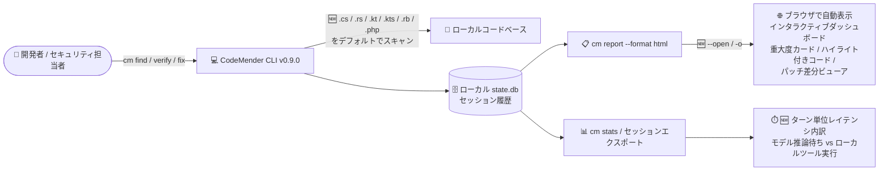

# Gemini Enterprise Agent Platform: CodeMender v0.9.0 (インタラクティブ HTML セキュリティレポート・対応言語拡大・ターン単位レイテンシメトリクス)

**リリース日**: 2026-09-21

**サービス**: Gemini Enterprise Agent Platform

**機能**: CodeMender アップデート v0.9.0 (インタラクティブ HTML レポート、対応言語拡大、レイテンシメトリクス、バグ修正)

**ステータス**: Fixed / Update (CodeMender は Preview)

📊 [このアップデートのインフォグラフィックを見る](https://takech9203.github.io/google-cloud-news-summary/20260921-gemini-agent-platform-codemender-v0-9-0.html)

## 概要

Gemini Enterprise Agent Platform 上のコードセキュリティエージェント CodeMender の v0.9.0 がリリースされた。CodeMender はコードベースの脆弱性をスキャン (`cm find`)、PoC エクスプロイトの実行により悪用可能性を検証 (`cm verify`)、検証済みパッチを生成・適用 (`cm fix`) する自律型 AI エージェントで、推論・オーケストレーションはクラウド側 (Gemini Enterprise Agent Platform) でホストされ、コードの読み取り・ビルド・エクスプロイト検証はローカルの CLI/サンドボックスで実行される。

v0.9.0 の目玉は `cm report --format html` の全面刷新である。重大度メトリクスカード、行番号付きのシンタックスハイライトされたコードスニペット、インラインのパッチ差分ビューアを備えたモダンなインタラクティブダッシュボードとして生成されるようになり、`--open` (`-o`) フラグで生成後にデフォルトブラウザで自動的に開けるようになった。あわせて、デフォルトの検出設定 (discovery configuration) と初期化テンプレートに C# (`.cs`)、Rust (`.rs`)、Kotlin (`.kt`, `.kts`)、Ruby (`.rb`)、PHP (`.php`) が追加され、追加設定なしでこれらの言語をスキャンできるようになった。さらに `cm stats` とセッションエクスポートがターンごとのレイテンシ内訳 (モデル推論の待ち時間とローカルツール実行時間の区別) を報告するようになった。

セキュリティスキャン結果をチームや経営層に共有するセキュリティチーム、C#/Kotlin/PHP など多言語のコードベースを扱う開発チーム、CodeMender の実行パフォーマンスを分析・最適化したい運用チームにとって価値のあるアップデートである。

**アップデート前の課題**

- `cm report --format html` の HTML レポートは刷新前の形式で、重大度メトリクスの一覧性やコードスニペットの可読性、パッチ差分の確認性が限られていた
- 生成した HTML レポートをブラウザで確認するには、手動でファイルを開く必要があった
- C# (`.cs`)、Rust (`.rs`)、Kotlin (`.kt`, `.kts`)、Ruby (`.rb`)、PHP (`.php`) はデフォルトの検出設定・初期化テンプレートに含まれておらず、スキャン対象にするには `config.yaml` の `scan.extensions.include` に拡張子を手動で追加する必要があった
- `cm stats` はトークン消費メトリクス (前回 v0.9.0 以前のアップデートで `--json` 出力とセッションドリルダウンに対応) が中心で、ターンごとのレイテンシの内訳 (モデル推論待ちかローカルツール実行か) を切り分ける手段がなかった
- 長時間のリポジトリスキャン中にセッションの信頼性やエラー回復に課題があった
- 旧バージョンの CLI からアップグレードした際に、ローカルワークスペース状態の互換性問題が発生することがあった

**アップデート後の改善**

- `cm report --format html` が重大度メトリクスカード、行番号付きシンタックスハイライトコードスニペット、インラインパッチ差分ビューアを備えたモダンなインタラクティブダッシュボードを生成するようになった
- `--open` (`-o`) フラグにより、生成した HTML レポートをデフォルトブラウザで自動的に開けるようになった
- C#、Rust、Kotlin、Ruby、PHP がデフォルトの検出設定と初期化テンプレートに追加され、追加設定なし (out-of-the-box) で脆弱性スキャンの対象になった
- `cm stats` とセッションエクスポートがターンごとのレイテンシ内訳を報告するようになり、モデル推論の待ち時間とローカルツール実行時間を区別して分析できるようになった
- 長時間のリポジトリスキャンにおけるセッションの信頼性とエラー回復が改善された
- 旧バージョン CLI からのアップグレード時のローカルワークスペース状態の互換性問題が修正された

## アーキテクチャ図



CodeMender はセッション状態をローカルの SQLite データベース (`state.db`) で管理しており、v0.9.0 では `cm report --format html` がインタラクティブダッシュボードとして刷新され、`cm stats` がターン単位のレイテンシ内訳に対応した。デフォルトのスキャン対象言語も 5 言語分の拡張子が追加された。

## サービスアップデートの詳細

### 主要機能

1. **インタラクティブ HTML セキュリティレポート: `cm report --format html` の刷新**
   - モダンなインタラクティブダッシュボードとして HTML レポートを生成
   - 重大度 (CRITICAL / HIGH / MEDIUM / LOW) のメトリクスカードで検出結果を一覧
   - 行番号付きのシンタックスハイライトされたコードスニペットで脆弱箇所を確認
   - インラインのパッチ差分 (diff) ビューアで生成された修正パッチをレポート内で直接レビュー
   - `--open` (`-o`) フラグを追加。生成したレポートをデフォルトブラウザで自動的に開ける (`cm report --format html --open`)

2. **対応言語の拡大 (デフォルト検出設定への追加)**
   - C# (`.cs`)、Rust (`.rs`)、Kotlin (`.kt`, `.kts`)、Ruby (`.rb`)、PHP (`.php`) をデフォルトの検出設定と初期化テンプレートに追加
   - 追加設定なし (out-of-the-box) でこれらの言語の脆弱性スキャンが可能に
   - これによりデフォルト対応言語は C/C++、C#/.NET、Go、Java、JavaScript/TypeScript、Kotlin、Python、Ruby、Rust、PHP に (公式ドキュメントの Supported languages より)
   - デフォルトセット以外の言語も、従来通り `config.yaml` の `scan.extensions.include` への拡張子追加で対応可能

3. **ターン単位レイテンシメトリクス**
   - `cm stats` とセッションエクスポートがターンごとのレイテンシ内訳 (per-turn latency breakdown) を報告
   - モデル推論の待ち時間 (クラウド側) とローカルツール実行時間 (ビルド・テスト・エクスプロイト実行など) を区別して表示
   - 前回アップデートで追加された `cm stats --json` / `cm stats --session <id>` のトークンメトリクスと組み合わせて、実行時間の観点からもボトルネック分析が可能に

4. **バグ修正**
   - 長時間のリポジトリスキャンにおけるセッションの信頼性とエラー回復を改善
   - 旧バージョンの CLI からアップグレードした際のローカルワークスペース状態の互換性問題を修正

## 技術仕様

### `cm report` の出力形式 (公式ドキュメントより)

| 形式 | コマンド | 説明 |
|------|---------|------|
| ターミナルテーブル (デフォルト) | `cm report` | 検出結果のサマリー一覧 |
| HTML 🆕 刷新 | `cm report --format html --open` | インタラクティブダッシュボード。`--open` (`-o`) でブラウザ自動起動 |
| Markdown | `cm report --format md` | GitHub-flavored Markdown レポート |
| JSON | `cm report --format json` | 全 findings の生 JSON エクスポート |
| SARIF | `cm report --format sarif` | SARIF v2.1.0 形式。他のセキュリティツールとの連携用 |

主なフィルタリングフラグ: `--patches` (パッチ diff を含める)、`--severity CRITICAL|HIGH|MEDIUM|LOW`、`--status OPEN|FIXED|DISMISSED|REOPENED`、`--session <id>`、`--artifacts`、`--sort severity|time`

### デフォルトスキャン対象の拡張子 (`scan.extensions.include`)

| 区分 | 拡張子 |
|------|--------|
| 従来からのデフォルト | `.py`, `.java`, `.go`, `.js`, `.jsx`, `.mjs`, `.cjs`, `.ts`, `.tsx`, `.c`, `.cc`, `.cpp`, `.cxx`, `.h`, `.hpp` |
| 🆕 v0.9.0 で追加 | `.cs` (C#), `.rs` (Rust), `.kt` / `.kts` (Kotlin), `.rb` (Ruby), `.php` (PHP) |

```yaml
# config.yaml (グローバル: ~/.codemender/config.yaml またはリポジトリ単位)
scan:
  extensions:
    include:
      # v0.9.0 からデフォルトに含まれる例
      - .cs
      - .rs
      - .kt
      - .kts
      - .rb
      - .php
      # さらに独自言語を追加する場合
      - .swift
      - .scala
  exclude_dirs:
    - node_modules
    - vendor
    - dist
    - build
```

### レイテンシメトリクスの内訳

| 区分 | 内容 |
|------|------|
| モデル推論待ち | クラウド側 (Gemini Enterprise Agent Platform) のホスト型推論エンジンの応答待ち時間 |
| ローカルツール実行 | ローカルサンドボックス内のファイル読み取り、ビルド、テスト、PoC エクスプロイト実行などの時間 |

## 設定方法

### 前提条件

1. CodeMender CLI がインストール・構成済みであること ([Set up environment](https://docs.cloud.google.com/gemini-enterprise-agent-platform/codemender/set-up-environment))
2. CodeMender は限定顧客向けの Public Preview であるため、利用には営業チームへの問い合わせが必要
3. 新機能を利用するには CLI を v0.9.0 に更新すること

### 手順

#### ステップ 1: CLI の更新

```bash
# 最新バージョン (v0.9.0) へ更新
cm update
```

#### ステップ 2: インタラクティブ HTML レポートの生成

```bash
# HTML レポートを生成し、ブラウザで自動的に開く
cm report --format html --open

# 短縮形
cm report --format html -o

# パッチ diff を含め、HIGH 以上に絞ったレポート
cm report --format html --patches --severity HIGH -o
```

#### ステップ 3: 追加言語のスキャン

```bash
# C# / Rust / Kotlin / Ruby / PHP は追加設定なしでスキャン可能に
cm find ./src/           # .cs, .rs, .kt, .kts, .rb, .php も自動的に対象
cm find ./api/handlers.php
```

#### ステップ 4: ターン単位レイテンシの確認

```bash
# セッション ID を確認
cm session list

# ターンごとのレイテンシ内訳 (推論待ち vs ツール実行) を確認
cm stats --session SESSION_ID

# JSON でエクスポートして分析基盤へ連携
cm stats --json
```

## メリット

### ビジネス面

- **レポート共有の効率化**: インタラクティブな HTML ダッシュボードにより、スキャン結果や修正パッチを開発チーム・セキュリティチーム・マネジメント層に見やすい形で共有でき、脆弱性対応の意思決定が迅速になる
- **多言語コードベースのカバレッジ拡大**: C#/.NET、Kotlin (Android/サーバーサイド)、PHP、Ruby、Rust を使うエンタープライズ環境で、設定作業なしにスキャン対象を広げられる

### 技術面

- **レビュー体験の向上**: 行番号付きシンタックスハイライトとインライン diff ビューアにより、ターミナルに戻らずにレポート内で脆弱箇所とパッチを確認できる
- **パフォーマンスボトルネックの切り分け**: ターン単位のレイテンシ内訳で、実行時間の長さがモデル推論起因かローカルのビルド・テスト起因かを特定でき、ビルドコマンドの最適化やモデル選択 (`--model`) の判断材料になる
- **長時間スキャンの安定性向上**: セッションの信頼性とエラー回復の改善により、大規模リポジトリのスキャンが中断しにくくなった
- **アップグレードの安全性**: 旧 CLI からのワークスペース状態互換性問題の修正により、バージョンアップ時の移行リスクが低減した

## デメリット・制約事項

### 制限事項

- CodeMender は Preview 段階であり、Pre-GA Offerings Terms が適用される (サポートが限定される場合がある)
- CodeMender は限定顧客向けの Public Preview であり、利用には営業チームを通じたアクセス申請が必要
- 追加された 5 言語について、公式ドキュメントは「デフォルト言語はベンチマークカバレッジが最も充実している言語を反映したもの」と述べており、言語ごとの正式な評価指標は公開されていない

### 考慮すべき点

- HTML レポートには脆弱性の詳細やコードスニペットが含まれるため、生成したレポートファイルの保管・共有には機密情報としての取り扱いが必要
- ターン単位レイテンシはローカルの `state.db` に基づくセッション統計であり、プロジェクト全体の課金済みトークン使用量の確認には Cloud Billing のレポートを併用する
- スキャン対象言語の拡大により、リポジトリによってはスキャン対象ファイル数が増え、トークン消費や実行時間が増加する可能性がある。対象を絞る場合は `config.yaml` の `include` / `exclude_dirs` を調整する

## ユースケース

### ユースケース 1: 経営層・開発チームへのセキュリティレポート共有

**シナリオ**: セキュリティチームが週次で `cm find` / `cm verify` を実行し、検出結果と修正状況をステークホルダーに報告している。従来はターミナル出力や JSON を手作業で整形していた。

**実装例**:
```bash
# 検証済み findings をパッチ付きの HTML ダッシュボードとして生成
cm report --format html --patches -o
```

**効果**: 重大度メトリクスカードで全体像を即座に把握でき、コードスニペットと diff ビューアで修正内容までワンストップで確認できるため、レポート整形の手作業が不要になる。

### ユースケース 2: C# / Kotlin / PHP 混在コードベースのスキャン導入

**シナリオ**: .NET 製バックエンド、Kotlin 製 Android アプリ、レガシー PHP アプリが混在する組織で、CodeMender の適用範囲を広げたい。従来は言語ごとに `config.yaml` へ拡張子を追加する必要があった。

**実装例**:
```bash
# v0.9.0 では追加設定なしでスキャン可能
cm find ./dotnet-api/
cm find ./android-app/src/
cm find ./legacy-php/
```

**効果**: 初期化テンプレートに 5 言語が含まれるため、新規ワークスペースのセットアップ直後から多言語スキャンを開始でき、設定漏れによるスキャン対象外ファイルの見落としを防げる。

### ユースケース 3: スキャン実行時間のボトルネック分析

**シナリオ**: 大規模リポジトリのスキャンに想定以上の時間がかかっている。原因がモデル推論の待ち時間なのか、ローカルのビルド・テスト実行なのかを切り分けて対策したい。

**実装例**:
```bash
# ターンごとのレイテンシ内訳を確認
cm stats --session SESSION_ID
cm stats --json | jq .
```

**効果**: ローカルツール実行が支配的であればビルドコマンド (`build.command`) や `exclude_dirs` の最適化、推論待ちが支配的であればモデル選択 (`--model gemini-3.8-flash` など) やスキャン対象の分割 (10〜50 ファイル単位の推奨バッチ) といった、根拠に基づく改善策を選択できる。

## 料金

今回のアップデート自体に追加料金はない。CodeMender の利用はトークン消費に基づいて課金され、プロジェクト全体の課金済みトークン使用量とコストトレンドは Cloud Billing のレポートで確認できる。なお、デフォルトスキャン対象言語の拡大により、対象ファイル数が増える場合はトークン消費が増加する可能性がある点に留意。

- [Gemini Enterprise Agent Platform 料金ページ](https://cloud.google.com/gemini-enterprise-agent-platform/generative-ai/pricing)
- [Cloud Billing レポートの確認方法](https://docs.cloud.google.com/billing/docs/how-to/reports)

## 利用可能リージョン

CodeMender はグローバルに利用可能 (限定顧客向け Public Preview)。

## 関連サービス・機能

- **Gemini Enterprise Agent Platform**: CodeMender のホスト基盤。エージェントの推論・オーケストレーションを Interactions API 経由で提供。ターン単位レイテンシの「モデル推論待ち」はこのホスト型推論エンジンの応答時間に対応する
- **Cloud Billing**: プロジェクト全体の課金済みトークン使用量とコストトレンドの確認。`cm stats` のローカル統計と併用する
- **SARIF 連携 (`cm report --format sarif`)**: HTML レポートが人向けの共有用であるのに対し、SARIF v2.1.0 形式は他のセキュリティツール・脆弱性管理基盤との機械連携に使用できる
- **サードパーティセキュリティスキャナ (Wiz など)**: 外部ツールの findings を `cm report import` で取り込み、検証・修復ワークフローに接続 ([Import third-party security findings](https://docs.cloud.google.com/gemini-enterprise-agent-platform/codemender/import-findings))
- **CodeMender セッション管理**: `cm session list` / `resume` / `cancel` によるステートフルなセッション運用。今回の信頼性改善とレイテンシメトリクスはこのセッション基盤の強化 ([Manage sessions and reports](https://docs.cloud.google.com/gemini-enterprise-agent-platform/codemender/manage-sessions))

## 参考リンク

- 📊 [インフォグラフィック](https://takech9203.github.io/google-cloud-news-summary/20260921-gemini-agent-platform-codemender-v0-9-0.html)
- [公式リリースノート](https://docs.cloud.google.com/release-notes#September_21_2026)
- [CodeMender ドキュメント](https://docs.cloud.google.com/gemini-enterprise-agent-platform/codemender)
- [Manage sessions and reports (レポート形式・フィルタリング)](https://docs.cloud.google.com/gemini-enterprise-agent-platform/codemender/manage-sessions)
- [Set up environment (config.yaml・対応言語設定)](https://docs.cloud.google.com/gemini-enterprise-agent-platform/codemender/set-up-environment)
- [Scan and verify vulnerabilities](https://docs.cloud.google.com/gemini-enterprise-agent-platform/codemender/scan-and-verify)
- [Google Cloud Blog: Find and fix software vulnerabilities with CodeMender](https://cloud.google.com/blog/products/identity-security/find-and-fix-software-vulnerabilities-with-codemender)
- [料金ページ](https://cloud.google.com/gemini-enterprise-agent-platform/generative-ai/pricing)
- [前回の CodeMender アップデートレポート (2026-09-02)](./2026-09-02-gemini-agent-platform-codemender-updates.md)

## まとめ

CodeMender v0.9.0 は、インタラクティブ HTML ダッシュボードによるレポーティング体験の刷新、C#/Rust/Kotlin/Ruby/PHP のデフォルトスキャン対応、ターン単位レイテンシメトリクスによる可観測性強化という、運用フェーズのチームに直接効くアップデートである。前回 (2026-09-02) のトークンメトリクス強化と合わせて、CodeMender の「見る・共有する・分析する」機能が着実に成熟してきている。まず `cm update` で CLI を v0.9.0 に更新し、`cm report --format html -o` で新しいダッシュボードを確認するとともに、スキャン対象言語の拡大による対象ファイル数・トークン消費への影響を確認することを推奨する。

---

**タグ**: Gemini Enterprise Agent Platform, CodeMender, セキュリティ, AI エージェント, 脆弱性管理, DevSecOps, レポーティング, 可観測性, 多言語対応
