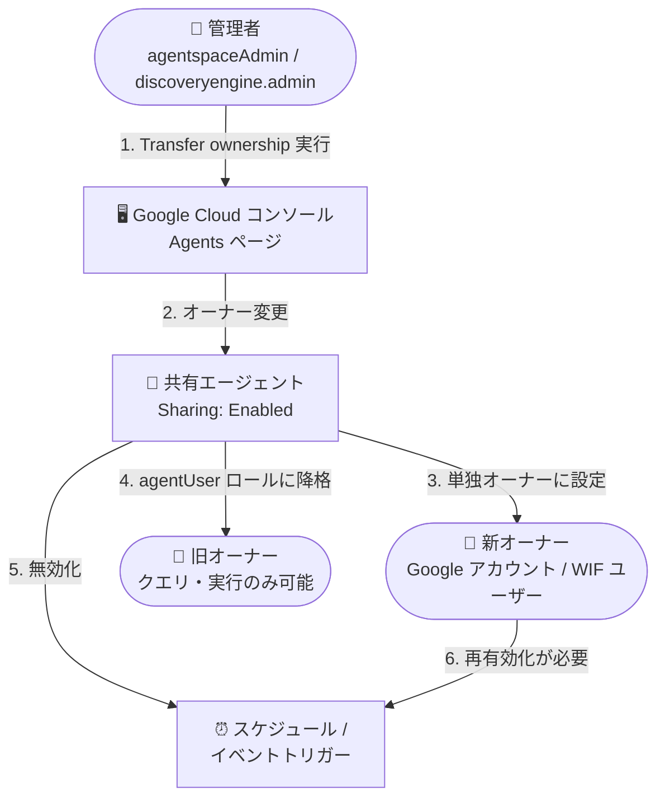

# Gemini Enterprise: 共有エージェントのオーナーシップ移管機能

**リリース日**: 2026-09-21

**サービス**: Gemini Enterprise

**機能**: 共有エージェントのオーナーシップ移管 (Transfer ownership of shared agents)

**ステータス**: Feature (一般提供)

📊 [このアップデートのインフォグラフィックを見る](https://takech9203.github.io/google-cloud-news-summary/20260921-gemini-enterprise-agent-ownership-transfer.html)

## 概要

Gemini Enterprise において、管理者が共有された従業員作成エージェント (employee-made agents) のオーナーシップを、組織内の別のユーザーまたは管理者自身に移管できる機能が追加された。移管操作は Google Cloud コンソールの Gemini Enterprise「Agents」ページから実行できる。

この機能は、退職する従業員が作成したエージェントを現役のチームメンバーに引き継いでメンテナンスを継続する、契約社員・派遣社員が作成したエージェントを正社員にハンドオーバーする、組織再編に伴ってエージェントの管理責任を再割り当てするといったシナリオで有用である。エージェントが個人に紐づいたまま放置されて「オーナー不在」になる事態を防ぎ、組織としてエージェント資産のライフサイクルを管理できるようになる。

対象ユーザーは、Gemini Enterprise を組織で運用し、Workflow Builder などで作成されたエージェントを複数ユーザーで共有している企業の管理者である。

**アップデート前の課題**

- エージェントのオーナーは作成者に固定されており、退職や異動が発生してもオーナーシップを別のユーザーへ引き継ぐ手段がなかった
- 退職者が作成したエージェントは設定変更やメンテナンスができなくなり、業務継続性にリスクがあった
- 契約社員や派遣社員が作成したエージェントを正社員に引き継ぐには、エージェントを作り直すなどの回避策が必要だった

**アップデート後の改善**

- 管理者が Google Cloud コンソールから共有エージェントのオーナーシップを別ユーザーまたは自分自身に移管できるようになった
- 退職者・異動者のエージェントを再作成することなく、そのまま新しいオーナーが編集・運用を継続できるようになった
- Google アカウント (メールアドレス) に加え、Workforce Identity Federation (WIF) プールのユーザーにも移管でき、外部 IdP を利用する組織にも対応した

## アーキテクチャ図



管理者がコンソールから移管を実行すると、指定ユーザーが単独オーナーとなり、旧オーナーは agentUser ロールの権限ユーザーとして保持される。スケジュール/イベントトリガーは無効化されるため、新オーナーによる再有効化が必要となる。

## サービスアップデートの詳細

### 主要機能

1. **オーナーシップの移管**
   - 管理者は共有エージェントのオーナーシップを、組織内の別ユーザーまたは自分自身 (Myself) に移管できる
   - 操作は Google Cloud コンソールの Gemini Enterprise「Agents」ページ →「User permissions」タブ →「Transfer ownership」から実行する
   - 各エージェントのオーナーは常に 1 人であり、移管すると指定されたユーザーが単独オーナーになる

2. **旧オーナーのアクセス保持**
   - 移管後、旧オーナーは `agentUser` ロールを持つ権限ユーザーとしてアクセスリストに保持される
   - エージェントへのクエリ実行は引き続き可能だが、構成や設定の編集はできなくなる

3. **複数の ID 形式への対応**
   - Google Identity / Cloud Identity: メールアドレス (例: `user@example.com`) で新オーナーを指定
   - Workforce Identity Federation (WIF): ワークフォース ID プールのプリンシパル識別子で指定
   - WIF のプリンシパル識別子は大文字・小文字が区別されるため、IdP の `google.subject` マッピングと正確に一致させる必要がある

4. **スケジュール/トリガーの安全な引き継ぎ**
   - 移管対象エージェントにスケジュールトリガーまたはイベントトリガーがある場合、移管操作によってそれらは無効化 (disabled) 状態になる
   - 新オーナーがトリガーを再有効化するまで、自動実行は行われない (意図しない実行を防止)

## 技術仕様

### 移管の条件と動作

| 項目 | 詳細 |
|------|------|
| 実行可能なユーザー | Gemini Enterprise Admin (`roles/discoveryengine.agentspaceAdmin`) または Discovery Engine Admin (`roles/discoveryengine.admin`) を持つ管理者のみ |
| エージェントオーナー自身 | 管理者ロールを併せ持たない限り移管不可 |
| 対象エージェント | 共有済み (Sharing 列が Enabled) のエージェントのみ。プライベート (未共有) エージェントは移管不可 |
| サポートされるエージェント種別 | 従業員作成エージェント (Web アプリの Workflow Builder で作成されたローコード/ワークフローエージェント) |
| オーナー数 | 常に 1 人 (移管先が単独オーナーになる) |
| 旧オーナーの扱い | `agentUser` ロールの権限ユーザーとして保持 (クエリ・実行可、編集不可) |
| スケジュール/イベントトリガー | 移管時に無効化され、新オーナーによる再有効化が必要 |
| 移管先の ID 形式 | Google アカウント (メールアドレス)、WIF プールユーザー (プリンシパル識別子) |

### WIF プリンシパル識別子の形式

```text
//iam.googleapis.com/locations/global/workforcePools/POOL_ID/subject/SUBJECT_ID

または principal: プレフィックス付き:
principal://iam.googleapis.com/locations/global/workforcePools/POOL_ID/subject/SUBJECT_ID
```

- `POOL_ID`: ワークフォース ID プールの一意の ID
- `SUBJECT_ID`: ワークフォース ID プールにおけるユーザーのサブジェクト識別子

## 設定方法

### 前提条件

1. Gemini Enterprise Web アプリが作成済みであること
2. 操作するユーザーが `roles/discoveryengine.agentspaceAdmin` または `roles/discoveryengine.admin` を持っていること
3. 対象エージェントが共有済み (Agents ページの Sharing 列が Enabled) であること

### 手順

#### ステップ 1: 対象エージェントの User permissions を開く

1. Google Cloud コンソールで「Gemini Enterprise」ページに移動し、プロジェクトを選択する
2. 「Name」列からアプリをクリックする
3. ナビゲーションメニューから「Agents」をクリックする
4. 共有エージェントの「Display name」をクリックする
5. 「User permissions」タブをクリックし、権限ユーザーの一覧を表示する

#### ステップ 2: オーナーシップを移管する

1. 「Transfer ownership」をクリックしてダイアログを開く
2. 「Transfer ownership to」で移管先を選択する
   - **Myself**: 自分の管理者アカウントに移管 (すでにオーナーの場合は選択不可)
   - **Another user**: 組織内の別ユーザーに移管
3. 「Another user」を選択した場合、新オーナーを指定する
   - Google Identity / Cloud Identity: 「New owner email」にメールアドレスを入力
   - WIF アカウント: 「New owner principal」にプリンシパル識別子を入力
4. 「Transfer ownership」をクリックすると、オーナーが更新され、旧オーナーは `agentUser` ロールの権限ユーザーとして保持される

#### ステップ 3: トリガーの再有効化 (該当する場合)

移管したエージェントにスケジュールトリガーまたはイベントトリガーがある場合、それらは無効化されている。新オーナーがトリガーを再有効化してからエージェントを利用する。

## メリット

### ビジネス面

- **業務継続性の確保**: 退職・異動・契約終了に伴うエージェント作成者の離脱時にも、エージェントを再作成することなく運用を継続できる
- **エージェント資産のガバナンス強化**: 組織としてエージェントのオーナーシップを一元管理でき、オーナー不在エージェントの放置を防止できる
- **オンボーディング/オフボーディングの効率化**: 派遣社員から正社員への引き継ぎなど、人事イベントに合わせた引き継ぎプロセスを標準化できる

### 技術面

- **管理者による集中管理**: 移管操作は管理者ロールに限定されており、勝手なオーナー変更を防ぐ統制が効いている
- **旧オーナーの権限自動調整**: 移管と同時に旧オーナーが `agentUser` に降格されるため、手動での権限整理が不要
- **トリガーの自動無効化**: 移管時にスケジュール/イベントトリガーが無効化されるため、新オーナーが内容を確認する前に自動実行される事故を防げる
- **WIF 対応**: 外部 IdP (Workforce Identity Federation) を利用する組織でも移管先を指定できる

## デメリット・制約事項

### 制限事項

- 移管できるのは管理者 (`roles/discoveryengine.agentspaceAdmin` または `roles/discoveryengine.admin`) のみで、エージェントオーナー自身は管理者でない限り移管できない
- 共有済みエージェントのみが対象で、プライベート (未共有) エージェントは移管できない
- サポート対象は従業員作成エージェント (Workflow Builder で作成されたローコード/ワークフローエージェント) に限られる
- オーナーは常に 1 人であり、複数オーナーの設定はできない

### 考慮すべき点

- スケジュール/イベントトリガーは移管時に無効化されるため、新オーナーによる再有効化を忘れると定期実行が停止したままになる。移管手順に再有効化のチェックを組み込むべき
- 旧オーナーは `agentUser` として実行権限を保持し続けるため、退職者の場合はアクセスリストからの削除も別途検討が必要
- WIF プリンシパル識別子は大文字・小文字が区別されるため、IdP 側の `google.subject` マッピングと正確に一致させる必要がある
- エージェント共有には IAM allow ポリシーの上限 (1 ポリシーあたり 1,500 メンバー) が適用される

## ユースケース

### ユースケース 1: 退職者が作成したエージェントの引き継ぎ

**シナリオ**: 営業部門の担当者が Workflow Builder で作成し、部門全体に共有していた案件サマリー生成エージェントの作成者が退職することになった。エージェントには毎朝のスケジュールトリガーが設定されている。

**実装例**:
```text
1. 管理者がコンソールの Agents ページで対象エージェントを開く
2. User permissions タブ → Transfer ownership
3. Another user を選択し、後任者のメールアドレスを入力して移管
4. 後任者 (新オーナー) がスケジュールトリガーを再有効化
5. 必要に応じて退職者を権限ユーザーリストから削除
```

**効果**: エージェントを再作成せずに後任者が編集・運用を継続でき、部門の業務が中断しない。

### ユースケース 2: 契約社員から正社員へのハンドオーバー

**シナリオ**: プロジェクト支援で参画していた契約社員が、社内 FAQ 応答エージェントを作成・共有していた。契約終了に伴い、正社員の担当者に運用を引き継ぐ。

**効果**: 管理者が正社員へオーナーシップを移管することで、契約終了後もエージェントの設定変更や改善を正社員側で実施できる。旧オーナーの権限は自動的に `agentUser` に調整される。

## 料金

このアップデートによる追加料金は発表されていない。オーナーシップ移管は Gemini Enterprise の管理機能として提供される。Gemini Enterprise 自体の料金は公式料金ページを参照。

- [Gemini Enterprise の料金](https://cloud.google.com/gemini/enterprise/pricing)

## 関連サービス・機能

- **Workflow Builder**: 移管対象となる従業員作成エージェント (ローコード/ワークフローエージェント) の作成機能。エージェント共有の起点となる
- **Cloud IAM / Discovery Engine ロール**: 移管操作には `roles/discoveryengine.agentspaceAdmin` または `roles/discoveryengine.admin` が必要。エージェント共有は IAM allow ポリシーで管理される
- **Workforce Identity Federation (WIF)**: 外部 IdP のユーザーを移管先として指定可能。プリンシパル識別子で新オーナーを指定する
- **エージェント共有の管理者レビュー**: エージェント共有には管理者の承認フローを設定でき、オーナーシップ移管と合わせてエージェントのガバナンスを構成する

## 参考リンク

- 📊 [インフォグラフィック](https://takech9203.github.io/google-cloud-news-summary/20260921-gemini-enterprise-agent-ownership-transfer.html)
- [公式リリースノート](https://docs.cloud.google.com/release-notes#September_21_2026)
- [ドキュメント: Share agents from Google Cloud console (Transfer ownership)](https://docs.cloud.google.com/gemini/enterprise/docs/share-custom-agents#transfer-ownership)
- [ドキュメント: Agents overview](https://docs.cloud.google.com/gemini/enterprise/docs/agents-overview)
- [ドキュメント: Gemini Enterprise access control](https://docs.cloud.google.com/gemini/enterprise/docs/access-control)
- [料金ページ](https://cloud.google.com/gemini/enterprise/pricing)

## まとめ

Gemini Enterprise の共有エージェントに対するオーナーシップ移管機能により、退職・異動・契約終了といった人事イベント時にもエージェント資産を組織として安全に引き継げるようになった。管理者は移管手順にトリガーの再有効化と旧オーナーのアクセス整理を組み込み、エージェントのライフサイクル管理プロセスを標準化することを推奨する。

---

**タグ**: #GeminiEnterprise #エージェント #ガバナンス #IAM #WorkforceIdentityFederation #WorkflowBuilder
