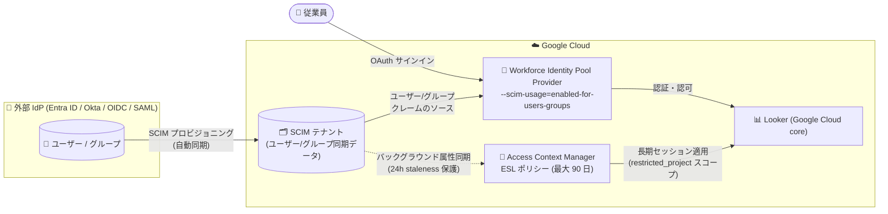

# Identity and Access Management: Looker の OAuth サインインで SCIM データをユーザー/グループクレームのソースとして利用可能に + SCIM での Extended Session Length (ESL) サポート (Preview)

**リリース日**: 2026-09-21

**サービス**: Identity and Access Management (IAM) / Workforce Identity Federation

**機能**: SCIM データを Looker の OAuth サインインにおけるユーザー/グループクレームのソースとして利用、および SCIM 利用時の Extended Session Length (ESL) サポート

**ステータス**: Preview

📊 [このアップデートのインフォグラフィックを見る](https://takech9203.github.io/google-cloud-news-summary/20260921-iam-scim-claims-looker-oauth.html)

## 概要

Workforce Identity Federation において、System for Cross-domain Identity Management (SCIM) で同期されたユーザー・グループデータを、Looker (Google Cloud core) の OAuth サインインワークフローにおける **ユーザークレームとグループクレームの両方のソース** として利用できるようになりました (Preview)。これまで SCIM 連携はグループクレームのみが対象 (Gemini Enterprise 向けの `enabled-for-groups` モード) でしたが、新たに `enabled-for-users-groups` モードが追加され、`google.subject`、`google.group` に加えて `google.display_name`、`google.email`、`google.posix_username`、カスタム属性 (`attribute.KEY`) などのユーザークレームも SCIM 同期データから評価されます。

あわせて、SCIM を利用している環境でも **Extended Session Length (ESL)** が使用可能になりました。ESL は Workforce Identity Federation のセッションをデフォルトの最大 12 時間から最大 90 日まで延長できる機能で、Looker (Google Cloud core) のユーザーが毎日外部 IdP に対して再認証することなく、継続的に Looker へ接続し続けられます。セッション中のセキュリティは、SCIM プロビジョニングによるユーザー属性・グループメンバーシップのバックグラウンド同期によって維持されます。

対象ユーザーは、Microsoft Entra ID や Okta などの外部 IdP を利用して Workforce Identity Federation 経由で Looker (Google Cloud core) にサインインしている組織の管理者・セキュリティチームです。

**アップデート前の課題**

- SCIM 同期データをクレームソースとして利用できるのはグループクレームのみ (`enabled-for-groups`、Gemini Enterprise 向け) であり、ユーザー属性は IdP のログイントークンから取得する必要があった
- Looker の OAuth サインインでユーザー属性を充実させるには Extra Attributes (`extra_attributes_oauth2_client`) などの追加構成が必要だった
- Workforce Identity Federation のセッションは最大 12 時間であり、Looker ユーザーは毎日外部 IdP への再認証が必要だった
- SAML プロバイダーではリフレッシュトークンによるバックグラウンド属性更新ができず、長時間セッションの実現手段が限られていた

**アップデート後の改善**

- `--scim-usage=enabled-for-users-groups` (Preview) により、SCIM 同期したユーザー・グループデータが IAM 認可と Looker の OAuth サインインワークフローの両方でクレームの主要ソースとして評価されるようになった
- `google.subject`、`google.group` に加え、`google.display_name`、`google.profile_photo`、`google.email`、`google.posix_username`、カスタム属性などすべての構成済みユーザークレームが SCIM データから評価される
- SCIM プロビジョニングと組み合わせて ESL を利用でき、最大 90 日間の長期セッションを Looker (Google Cloud core) で実現できる (OIDC/SAML 双方に対応)
- IdP 側でユーザーが無効化された場合も、24 時間の staleness 保護によりセッションが自動終了され、セキュリティが維持される

## アーキテクチャ図



外部 IdP から SCIM でユーザー・グループを Google Cloud に同期し、その同期データが Looker の OAuth サインインにおけるユーザー/グループクレームのソースとなります。ESL は Access Context Manager のアクセスバインディングで構成し、SCIM のバックグラウンド同期によって長期セッション中も属性の鮮度を保ちます。

## サービスアップデートの詳細

### 主要機能

1. **SCIM 利用モード `enabled-for-users-groups` (Looker 向け、Preview)**
   - SCIM 同期したユーザー・グループデータを、IAM 認可と OAuth サインインワークフローにおけるクレームのソースとして使用
   - `google.subject`、`google.group` に加えて、`google.display_name`、`google.profile_photo`、`google.email`、`google.posix_username`、カスタム属性 (`attribute.KEY`) を含むすべての構成済みユーザークレームを評価
   - 既存の `enabled-for-groups` モード (Gemini Enterprise 向け) は `google.subject` と `google.group` のみを評価し、ユーザー属性はログイントークンから取得する点が異なる

2. **SCIM 利用時の Extended Session Length (ESL) サポート (Preview)**
   - Workforce Identity Federation のセッションをデフォルトの最大 12 時間から、最大 90 日 (`7776000s`) まで延長可能
   - Access Context Manager の Google Cloud アクセスバインディング (`restricted_project` クライアントスコープ) で構成し、指定プロジェクトが所有する Looker (Google Cloud core) インスタンスのみに適用
   - OIDC プロバイダーは「Authorization Code フロー + `offline_access` スコープ (リフレッシュトークン)」または「SCIM プロビジョニング」、SAML プロバイダーは SCIM プロビジョニングでバックグラウンド属性更新を実現
   - 属性が 24 時間以内に IdP から更新できない場合 (ユーザーのデプロビジョニングや認証情報の失効など)、セッションを自動的に無効化する staleness 保護を搭載

3. **主要 IdP との構成ガイド**
   - Microsoft Entra ID、Okta、および汎用の OIDC/SAML IdP 向けの SCIM 構成手順が提供されている
   - SCIM プロトコルの標準エンドポイント `/Users` (Create/Get/Update/Delete/Patch/Put)、`/Groups` (Put を除く)、`/Schemas`、`/ServiceProviderConfig` をサポート

## 技術仕様

### SCIM 利用モードの比較

| 項目 | `enabled-for-groups` (Gemini Enterprise) | `enabled-for-users-groups` (Looker、Preview) |
|------|------|------|
| 評価されるクレーム | `google.subject`、`google.group` のみ | `google.subject`、`google.group`、すべての構成済みユーザークレーム |
| ユーザー属性のソース | IdP のログイントークン | SCIM 同期データ |
| 用途 | IAM 認可・ポリシー評価 | IAM 認可 + OAuth サインインワークフロー |
| Extra/Extended Attributes との併用 | - | 不可 (相互排他) |

### Extended Session Length (ESL) の仕様

| 項目 | 詳細 |
|------|------|
| 対象アプリケーション | Looker (Google Cloud core) のみ |
| セッション長 | 最小 1 時間 (`3600s`) 〜 最大 90 日 (`7776000s`) |
| スコープ | `restricted_project` (Looker インスタンスを所有するプロジェクト番号) 必須 |
| 対応プロトコル | OIDC (Authorization Code フロー + `offline_access`、または SCIM)、SAML 2.0 (SCIM 必須) |
| staleness 保護 | 24 時間以内に属性更新ができない場合セッションを無効化 (固定値) |
| バインディング制約 | 組織の全 Workforce Pool を対象とするバインディングは組織あたり 1 つのみ |
| `session_reauth_method` | 未設定または `LOGIN` |
| `max_inactivity` | 未サポート (未設定必須) |

### SCIM テナントの主な制約

- 1 つの Workforce Identity Pool につき SCIM テナントは 1 つのみ (単一プロバイダーにリンク)
- `google.subject` / `google.group` にマップされる属性は一意かつ非空である必要があり、重複時は HTTP 409、null/空の場合は HTTP 400 で同期が失敗
- `google.subject` にマップされる値は不変の識別子として扱われ、変更するには IdP 側でユーザー/グループを削除・再作成する必要がある
- 各ユーザーは `work` タイプのメールアドレスをちょうど 1 つ持つ必要がある
- SCIM テナントの削除はデフォルトで 30 日間のソフト削除 (即時削除には `--hard-delete` フラグ)
- CEL 変換は `user.userName` / `user.emails[0].value` に対する `.lowerAscii()` のみサポート

## 設定方法

### 前提条件

1. Google Cloud 組織と Workforce Identity Pool / プロバイダーが構成済みであること
2. Workforce Pool Admin (`roles/iam.workforcePoolAdmin`) ロール (ESL 構成には加えて Cloud Access Binding Admin (`roles/accesscontextmanager.gcpAccessAdmin`) が組織レベルで必要)
3. 外部 IdP (Microsoft Entra ID、Okta、または OIDC/SAML 対応 IdP) が SCIM プロビジョニングをサポートしていること

### 手順

#### ステップ 1: プロバイダーで SCIM をユーザー/グループ向けに有効化

```bash
# OIDC プロバイダーの場合
gcloud iam workforce-pools providers update-oidc PROVIDER_ID \
  --workforce-pool=WORKFORCE_POOL_ID \
  --location=LOCATION \
  --scim-usage=enabled-for-users-groups

# SAML プロバイダーの場合
gcloud iam workforce-pools providers update-saml PROVIDER_ID \
  --workforce-pool=WORKFORCE_POOL_ID \
  --location=LOCATION \
  --scim-usage=enabled-for-users-groups
```

SCIM テナントの作成と IdP 側のプロビジョニング設定 (Entra ID / Okta / OIDC / SAML) は各構成ガイドに従います。`google.subject` はプロバイダーの `--attribute-mapping` と SCIM テナントの `--claim-mapping` で同一の識別子を参照するように構成します (例: Entra ID では `assertion.oid` ↔ `user.externalId`)。

#### ステップ 2: ESL ポリシーの構成 (Access Context Manager)

```bash
# 必要な API を有効化
gcloud services enable accesscontextmanager.googleapis.com iam.googleapis.com

# esl-binding.yaml を作成
cat > esl-binding.yaml << 'EOF'
scopedAccessSettings:
- scope:
    clientScope:
      restrictedProject:
        name: projects/PROJECT_NUMBER
  activeSettings:
    sessionSettings:
      sessionLength: 7776000s
      sessionLengthEnabled: true
      sessionReauthMethod: LOGIN
EOF

# 組織の全 Workforce Pool を対象にアクセスバインディングを作成
gcloud access-context-manager cloud-bindings create \
  --organization=ORG_ID \
  --federated-principal="principalSet://cloudresourcemanager.googleapis.com/organizations/ORG_ID/type/WorkforcePool" \
  --binding-file="esl-binding.yaml"
```

`PROJECT_NUMBER` には Looker (Google Cloud core) インスタンスを所有するプロジェクト番号を指定します。このプロジェクトが所有する Looker インスタンスのみに ESL が適用されます。

## メリット

### ビジネス面

- **ユーザー体験の向上**: Looker ユーザーが毎日の再認証から解放され、最大 90 日間の継続的なセッションでダッシュボードやレポートにシームレスにアクセスできる
- **ID 管理の一元化**: 外部 IdP を信頼できる唯一の情報源 (source of truth) とし、SCIM でユーザー・グループのライフサイクル (入退社・異動) を Google Cloud に自動反映できる

### 技術面

- **クレームソースの統一**: ユーザークレームとグループクレームの両方が SCIM 同期データから評価され、ログイントークンの内容に依存しない一貫した属性評価が可能
- **SAML 環境での長期セッション実現**: リフレッシュトークンを持たない SAML プロバイダーでも、SCIM プロビジョニングにより ESL のバックグラウンド属性更新が可能
- **staleness 保護によるセキュリティ担保**: IdP 側でのユーザー無効化・認証情報失効が 24 時間以内にセッション終了へ反映される

## デメリット・制約事項

### 制限事項

- 本機能は Preview であり、SLA の対象外。本番環境への適用は慎重に検討が必要
- SCIM プロビジョニングの対象は Gemini Enterprise と Looker のみ。`enabled-for-users-groups` モードは Looker 向け
- ESL は Looker (Google Cloud core) 専用で、他の Google Cloud アプリケーションには適用されない
- `enabled-for-users-groups` は Extra Attributes (`extra_attributes_oauth2_client`) / Extended Attributes (`extended_attributes_oauth2_client`) と相互排他
- SCIM API はページネーション非対応 (1 レスポンス最大 100 件)、フィルタは `eq` 演算子 (および `and` での結合) のみサポート

### 考慮すべき点

- SCIM テナントが未アタッチの状態でプロバイダーの SCIM 利用を有効化すると、サインインが失敗する
- `google.subject` / `google.group` に一意でない値をマップすると、異なる IdP アイデンティティが同一人物として扱われ、アクセス権が意図せず拡大・残存するリスクがある
- 組織の全 Workforce Pool に適用されるバインディングは 1 つのみのため、複数の Looker プロジェクトに ESL を適用する場合は単一バインディング内に複数の `restricted_project` スコープを定義する
- OIDC でトークンベースの属性更新を使う場合、組織内のすべての Workforce Pool で `offline_access` を構成しないと、一部ユーザーが想定より早くログアウトされる可能性がある

## ユースケース

### ユースケース 1: Entra ID + SAML 環境での Looker 長期セッション

**シナリオ**: Microsoft Entra ID を SAML 2.0 で Workforce Identity Federation に連携している企業が、経営ダッシュボードを常時参照する Looker ユーザーの毎日の再認証を廃止したい。SAML はリフレッシュトークンを持たないため、従来 ESL の実現手段がなかった。

**実装例**:
```bash
# 1. Entra ID から SCIM テナントへのプロビジョニングを構成
# 2. プロバイダーで SCIM を有効化
gcloud iam workforce-pools providers update-saml entra-saml-provider \
  --workforce-pool=corp-pool \
  --location=global \
  --scim-usage=enabled-for-users-groups
# 3. Access Context Manager で 90 日の ESL バインディングを作成
```

**効果**: SAML 環境のまま最大 90 日のセッションを実現し、退職者は Entra ID 側の無効化が SCIM 同期と 24 時間 staleness 保護で自動的にセッション終了へ反映される。

### ユースケース 2: Looker のユーザー属性を SCIM で一元管理

**シナリオ**: Okta を IdP として利用する組織が、Looker の表示名・メール・カスタム属性 (部署、コストセンターなど) を Okta のプロファイルから一元管理し、ログイントークンのカスタマイズや Extra Attributes の構成を廃止したい。

**効果**: SCIM 同期データが OAuth サインインのユーザークレームソースとなるため、IdP 側でプロファイルを更新するだけで Looker 側の属性 (エンタープライズユーザースキーマ拡張の `department`、`costCenter` などを含む) が最新化される。

## 料金

Workforce Identity Federation は追加費用なしで利用できる機能です。ただし、詳細監査ロギング (detailed audit logging) を有効にすると Cloud Logging の料金が発生します。Looker (Google Cloud core) 自体の料金は別途かかります。

- [Google Cloud Observability の料金](https://cloud.google.com/stackdriver/pricing#logs-costs)
- [Looker (Google Cloud core) の料金](https://cloud.google.com/looker/pricing)

## 関連サービス・機能

- **Looker (Google Cloud core)**: 本アップデートの対象アプリケーション。OAuth サインインワークフローと ESL の適用先
- **Access Context Manager**: ESL のセッションポリシー (Google Cloud アクセスバインディング) を定義するサービス
- **Gemini Enterprise**: SCIM プロビジョニングのもう 1 つの対象サービス (`enabled-for-groups` モードでグループクレームを利用)
- **Cloud Logging**: Workforce Identity Federation の詳細監査ロギングの出力先。SCIM 同期やサインインのトラブルシューティングに活用
- **Microsoft Entra ID / Okta**: SCIM プロビジョニングの構成ガイドが提供されている代表的な外部 IdP

## 参考リンク

- 📊 [インフォグラフィック](https://takech9203.github.io/google-cloud-news-summary/20260921-iam-scim-claims-looker-oauth.html)
- [公式リリースノート](https://docs.cloud.google.com/release-notes#September_21_2026)
- [SCIM provisioning for Workforce Identity Federation](https://docs.cloud.google.com/iam/docs/workforce-identity-federation-scim)
- [Configure SCIM with Microsoft Entra ID](https://docs.cloud.google.com/iam/docs/configure-scim-ms-entra)
- [Configure SCIM with Okta](https://docs.cloud.google.com/iam/docs/configure-scim-okta)
- [Configure SCIM with OIDC or SAML](https://docs.cloud.google.com/iam/docs/configure-scim-oidc-saml)
- [Extended session length for Workforce Identity Federation](https://docs.cloud.google.com/access-context-manager/docs/extended-session-length-for-workforce-identity-federation)
- [Troubleshoot SCIM provisioning and synchronization](https://docs.cloud.google.com/iam/docs/troubleshooting-workforce-identity-federation#scim-signin-users-groups-fail)

## まとめ

SCIM 同期データがユーザー・グループ両方のクレームソースとして Looker の OAuth サインインで利用可能になり、あわせて SCIM 環境での ESL サポートにより最大 90 日の長期セッションが実現しました。外部 IdP を Workforce Identity Federation 経由で Looker (Google Cloud core) に連携している組織は、Preview であることを踏まえた上で、検証環境で `enabled-for-users-groups` モードと ESL バインディングの動作確認から始めることを推奨します。

---

**タグ**: IAM, Workforce Identity Federation, SCIM, Looker, OAuth, Extended Session Length, Access Context Manager, Preview
