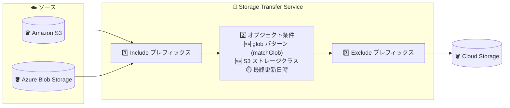

# Storage Transfer Service: S3 ストレージクラスフィルタと glob パターンフィルタのサポート

**リリース日**: 2026-09-21

**サービス**: Storage Transfer Service

**機能**: Amazon S3 ソースオブジェクトのストレージクラスによるフィルタリング、および glob パターン (ワイルドカード) によるフィルタリング

**ステータス**: GA (一般提供)

📊 [このアップデートのインフォグラフィックを見る](https://takech9203.github.io/google-cloud-news-summary/20260921-storage-transfer-service-s3-storage-class-glob-filtering.html)

## 概要

Storage Transfer Service に、転送対象オブジェクトを柔軟に絞り込むための 2 つのフィルタリング機能が追加されました。1 つ目は **Amazon S3 ソースオブジェクトのストレージクラスによるフィルタリング**で、転送ジョブの作成・更新時に転送対象として含めるストレージクラスのリストを指定できます。Google Cloud コンソール、gcloud CLI、REST API から設定可能です。

2 つ目は **glob パターン (ワイルドカード) によるフィルタリング**で、`*` や `?` などのワイルドカード文字を使った検索文字列でファイル名やパスをマッチングし、転送対象オブジェクトを指定できます。Amazon S3 および Microsoft Azure Blob Storage からの転送で、gcloud CLI または REST API から利用できます。

これらの機能は、AWS や Azure から Cloud Storage へのデータ移行・レプリケーションを行うユーザーにとって、従来のプレフィックスフィルタや最終更新日時フィルタでは実現できなかった、きめ細かな転送対象の制御を可能にします。転送データ量の削減はソース側の Egress コストの削減にも直結します。

**アップデート前の課題**

- オブジェクトの絞り込みはプレフィックス (前方一致) と最終更新日時が中心で、「特定の拡張子のファイルだけ転送する」「特定の命名パターンに一致するファイルだけ転送する」といった条件はプレフィックスでは表現できなかった (プレフィックスフィルタはワイルドカード非対応)
- S3 のストレージクラスに基づく転送対象の制御ができず、デフォルトの動作 (標準・非アーカイブクラスは転送、GLACIER はスキップ、DEEP_ARCHIVE は復元済みのみ転送) に従うしかなかった
- 条件に合わないオブジェクトも含めて転送するか、マニフェストファイルで対象を明示的に列挙する必要があり、運用負荷や不要な転送コストが発生していた

**アップデート後の改善**

- `includeStorageClasses` (REST) / `--include-storage-classes` (gcloud CLI) で、転送対象に含める S3 ストレージクラスのリストを明示的に指定できるようになった (例: `STANDARD` と `GLACIER` のみ転送)
- `matchGlob` (REST) / `--match-glob` (gcloud CLI) により、`*`、`?`、`**`、`[a-z]`、`{abc,xyz}` などの glob 構文でファイル名・パスのパターンマッチングが可能になった
- 既存のプレフィックスフィルタ・最終更新日時フィルタと組み合わせて使用でき、マニフェストを作成せずにきめ細かな転送対象の制御が可能になった

## アーキテクチャ図



Amazon S3 / Azure Blob Storage からの転送で、フィルタは「Include プレフィックス → オブジェクト条件 (glob・ストレージクラス・最終更新日時) → Exclude プレフィックス」の順に適用されます。今回のアップデートで、オブジェクト条件に glob パターンと S3 ストレージクラスが追加されました。

## サービスアップデートの詳細

### 主要機能

1. **S3 ストレージクラスによるフィルタリング**
   - 転送ジョブの作成・更新時に、転送対象に含めるストレージクラスのリストを指定できる (`transferSpec.objectConditions.includeStorageClasses`)
   - `includeStorageClasses` を指定した場合、指定したストレージクラスに属するオブジェクトのみが転送される
   - 有効な値は AWS がドキュメントで定義するストレージクラス (STANDARD、STANDARD_IA、GLACIER など)
   - Google Cloud コンソールでは、転送のソースと宛先を指定した後に「Filter by storage class」を選択して対象クラスを選ぶ

2. **glob パターン (ワイルドカード) によるフィルタリング**
   - `*` や `?` などのワイルドカード文字を含む検索文字列 (glob パターン) でファイル名・パスをマッチングし、転送対象を指定できる
   - Amazon S3 および Microsoft Azure Blob Storage からの転送でサポート
   - gcloud CLI の `--match-glob` フラグ、または REST API の `transferSpec.objectConditions.matchGlob` フィールドで指定 (Google Cloud コンソールは非対応)
   - プレフィックスフィルタよりもきめ細かな制御が可能

3. **既存フィルタとの組み合わせ**
   - プレフィックスフィルタ、最終更新日時フィルタと同時に使用可能
   - 適用順序は (1) Include プレフィックスで対象を絞り込み → (2) オブジェクト条件 (glob・最終更新日時・S3 ストレージクラス) をすべて満たすものを抽出 → (3) Exclude プレフィックスで除外
   - glob パターンがすべての Include プレフィックスと矛盾する場合 (例: include が `foo/` なのに glob が `bar/**`) はエラーになる

## 技術仕様

### glob パターンの構文

| 構文 | 説明 |
|------|------|
| `?` | `/` を除く任意の 1 文字にマッチ |
| `*` | `/` を除く 0 文字以上にマッチ |
| `**` | `/` を含む 0 文字以上にマッチ |
| `[abc]` | いずれか 1 文字 (`a`、`b`、`c`) にマッチ |
| `[a-z]` | 範囲内の 1 文字 (`a`〜`z`) にマッチ |
| `[!abc]` / `[^abc]` | `a`、`b`、`c` 以外の 1 文字にマッチ |
| `{abc,xyz}` | いずれかの文字列 (`abc` または `xyz`) にマッチ。`/` や `**` は含められない |
| `\?` | バックスラッシュの後の文字をリテラルとしてマッチ (例: `\?` はリテラルの `?`) |

**パターン例:**

- `logs_by_year/**/december/*.log` — 任意の階層の `december` ディレクトリ配下の `.log` ファイル
- `data_analytics/[!._]*` — `data_analytics/` 直下の、`.` や `_` で始まらないファイル
- `quarterly_reports/2025/{q1-final,q4-final}/*.pdf` — 2 つの特定ディレクトリ内の PDF ファイル

### S3 ストレージクラスのデフォルト動作

| ストレージクラス | デフォルトの転送動作 |
|------|------|
| 標準・非アーカイブクラス (GLACIER_IR 含む) | 転送される |
| Glacier Deep Archive (`DEEP_ARCHIVE`) | 復元 (restore) 済みの場合のみ転送 |
| Glacier Flexible Retrieval (`GLACIER`) | 復元状態にかかわらずスキップ |

アーカイブオブジェクト (`DEEP_ARCHIVE`、`GLACIER`) は転送前に復元が必要です。スキップされたアーカイブオブジェクトは、転送オペレーションのカウンタ `unrestoredDeepArchiveObjectsSkippedCount` (未復元のため転送されなかった DEEP_ARCHIVE オブジェクト数) と `unsupportedS3GlacierObjectsSkippedCount` (未復元、または GLACIER が対象クラスに指定されていないためスキップされた GLACIER オブジェクト数) で追跡できます。

### REST API 設定例 (ストレージクラスフィルタ)

```json
POST https://storagetransfer.googleapis.com/v1/transferJobs
{
  "description": "DESCRIPTION",
  "status": "ENABLED",
  "projectId": "PROJECT_ID",
  "transferSpec": {
    "awsS3DataSource": {
      "bucketName": "AWS_SOURCE_NAME",
      "awsAccessKey": {
        "accessKeyId": "AWS_ACCESS_KEY_ID",
        "secretAccessKey": "AWS_SECRET_ACCESS_KEY"
      }
    },
    "gcsDataSink": {
      "bucketName": "GCS_SINK_NAME"
    },
    "objectConditions": {
      "includeStorageClasses": ["STANDARD", "GLACIER"]
    }
  }
}
```

## 設定方法

### 前提条件

1. Amazon S3 (または Azure Blob Storage) のソースバケットへのアクセスが構成済みであること
2. 転送を作成するユーザーアカウントと、Storage Transfer Service のサービスエージェント (`project-PROJECT_NUMBER@storage-transfer-service.iam.gserviceaccount.com`) に必要な権限が付与されていること

### 手順

#### ステップ 1: glob パターンを指定して転送ジョブを作成 (gcloud CLI)

```bash
gcloud transfer jobs create s3://my-source-bucket gs://my-sink-bucket \
  --source-creds-file="relative_path/to/creds.json" \
  --match-glob="logs_by_year/**/december/*.log"
```

`--match-glob` フラグに glob パターンを指定します。`gcloud transfer jobs update` で既存ジョブへの追加・変更も可能です。

#### ステップ 2: ストレージクラスフィルタを指定して転送ジョブを作成 (REST API)

```bash
curl -X POST https://storagetransfer.googleapis.com/v1/transferJobs \
  -H "Authorization: Bearer $(gcloud auth print-access-token)" \
  -H "Content-Type: application/json" \
  -d '{
    "projectId": "PROJECT_ID",
    "status": "ENABLED",
    "transferSpec": {
      "awsS3DataSource": {"bucketName": "AWS_SOURCE_NAME"},
      "gcsDataSink": {"bucketName": "GCS_SINK_NAME"},
      "objectConditions": {
        "includeStorageClasses": ["STANDARD", "GLACIER"]
      }
    }
  }'
```

`objectConditions.includeStorageClasses` に転送対象として含めるストレージクラスを指定します。Google Cloud コンソールの場合は、S3 からの転送作成フローでソースと宛先を指定した後、「Filter by storage class」で対象クラスを選択します。

## メリット

### ビジネス面

- **転送コストの削減**: 不要なオブジェクトを転送前に除外することで転送データ量が減り、AWS/Azure 側の Egress 料金や Cloud Storage の保存コストを削減できる
- **移行計画の柔軟性向上**: 「ホットデータ (STANDARD) を先に移行し、アーカイブデータは後で」といったストレージクラス単位の段階的な移行戦略を実装できる

### 技術面

- **マニフェスト不要のきめ細かな制御**: 従来はマニフェストファイルで対象を列挙する必要があった細かい絞り込みが、glob パターンの宣言的な指定で実現できる
- **既存フィルタとの合成**: プレフィックス・最終更新日時・ストレージクラス・glob を組み合わせ、複雑な選択条件を 1 つの転送ジョブで表現できる
- **スキップ状況の可観測性**: アーカイブオブジェクトのスキップ数をカウンタで追跡でき、転送の完全性を検証しやすい

## デメリット・制約事項

### 制限事項

- glob パターンフィルタは Google Cloud コンソールでは設定できない (gcloud CLI と REST API のみ)
- glob フィルタの対象は Amazon S3 と Microsoft Azure Blob Storage からの転送のみ
- ストレージクラスフィルタは Amazon S3 ソースのみが対象
- glob パターンの `{abc,xyz}` (ブレース展開) には `/` や `**` を含められない
- glob パターンがすべての Include プレフィックスと矛盾する場合はエラーになる

### 考慮すべき点

- S3 Glacier Deep Archive (`DEEP_ARCHIVE`) と Glacier Flexible Retrieval (`GLACIER`) のオブジェクトは、ストレージクラスフィルタで指定しても転送前に AWS 側で復元 (restore) しておく必要がある
- フィルタの適用順序 (Include プレフィックス → オブジェクト条件 → Exclude プレフィックス) を理解していないと、意図しない対象範囲になる可能性がある。オブジェクト条件は指定したすべての条件を満たすオブジェクトのみ転送される (AND 条件)
- Exclude プレフィックスは glob パターンより後に適用されるため、glob にマッチしても Exclude プレフィックスに一致するオブジェクトは転送されない

## ユースケース

### ユースケース 1: S3 のログバケットから特定パターンのログのみ移行

**シナリオ**: S3 バケットに年別・月別のディレクトリ構造でログが保存されており、分析用に 12 月分の `.log` ファイルだけを BigQuery 分析基盤の手前の Cloud Storage に転送したい。

**実装例**:
```bash
gcloud transfer jobs create s3://logs-bucket gs://analytics-landing-bucket \
  --source-creds-file="creds.json" \
  --match-glob="logs_by_year/**/december/*.log"
```

**効果**: 対象外の月やログ以外のファイルを転送せずに済み、転送時間と AWS Egress コストを削減。マニフェストファイルの生成・管理も不要になる。

### ユースケース 2: ストレージクラス単位の段階的な S3 移行

**シナリオ**: S3 から Cloud Storage への大規模移行で、まずアクセス頻度の高い STANDARD クラスのデータのみを先行移行し、アーカイブ (GLACIER) データは復元作業の計画に合わせて後から移行する。

**実装例**:
```json
"objectConditions": {
  "includeStorageClasses": ["STANDARD"]
}
```

**効果**: アーカイブデータの復元費用・復元待ち時間に影響されずにホットデータの移行を先行完了できる。GLACIER 分は復元後に `includeStorageClasses: ["GLACIER"]` の別ジョブで移行し、スキップカウンタで漏れを検証できる。

## 料金

今回のフィルタリング機能自体に追加料金はありません。Storage Transfer Service の転送料金は転送の構成 (エグレスオプション) によって異なります。

- **デフォルト (エージェントレス)**: AWS 側の Egress 料金が Amazon から課金される
- **Google マネージドプライベートネットワーク経由**: S3 の Egress 料金は不要で、代わりに Google Cloud から GiB 単位の料金が課金される (AWS の LIST/GET などのオペレーション料金は別途発生する場合あり)

フィルタリングにより転送データ量を削減することで、これらのコストを抑えられます。詳細は [Storage Transfer Service の料金ページ](https://cloud.google.com/storage-transfer/pricing)を参照してください。

## 利用可能リージョン

リージョン固有の制限は Release Notes およびドキュメントに記載されていません。Storage Transfer Service がサポートするソース・宛先の組み合わせについては[公式ドキュメント](https://docs.cloud.google.com/storage-transfer/docs/sources-and-sinks)を参照してください。

## 関連サービス・機能

- **Cloud Storage**: 転送の宛先。宛先バケットのストレージクラス指定 (`--custom-storage-class`) や Autoclass と組み合わせて、移行後の保存コストも最適化できる
- **プレフィックスフィルタ / 最終更新日時フィルタ**: 今回追加された glob・ストレージクラスフィルタと組み合わせて使用できる既存のフィルタリング機能 (1 ジョブあたりプレフィックスは最大 1,000 個)
- **イベントドリブン転送**: S3 Event Notifications (SQS 経由) や Azure Event Grid を利用し、新規・更新オブジェクトを自動転送する機能。時刻ベースフィルタの取りこぼしリスクを避けたい場合の代替手段
- **Cloud Logging / Cloud Monitoring**: 転送の実行状況やスキップされたオブジェクトの監視に利用できる

## 参考リンク

- 📊 [インフォグラフィック](https://takech9203.github.io/google-cloud-news-summary/20260921-storage-transfer-service-s3-storage-class-glob-filtering.html)
- [公式リリースノート](https://docs.cloud.google.com/release-notes#September_21_2026)
- [ドキュメント: Filter source objects by storage class](https://docs.cloud.google.com/storage-transfer/docs/filtering-by-storage-class)
- [ドキュメント: Filter source objects using wildcards](https://docs.cloud.google.com/storage-transfer/docs/filter-by-glob-pattern)
- [ドキュメント: Filter source objects by prefix](https://docs.cloud.google.com/storage-transfer/docs/filtering-objects-from-transfers)
- [料金ページ](https://cloud.google.com/storage-transfer/pricing)

## まとめ

Storage Transfer Service に S3 ストレージクラスフィルタと glob パターンフィルタが追加され、AWS/Azure から Cloud Storage への転送対象をマニフェストなしできめ細かく制御できるようになりました。マルチクラウド間のデータ移行やレプリケーションを運用しているチームは、既存の転送ジョブに `--match-glob` や `includeStorageClasses` を追加することで、転送データ量と Egress コストの削減を検討することをおすすめします。フィルタの適用順序 (Include プレフィックス → オブジェクト条件 → Exclude プレフィックス) を踏まえたジョブ設計がポイントです。

---

**タグ**: Storage Transfer Service, Cloud Storage, Amazon S3, Azure Blob Storage, データ移行, マルチクラウド, glob パターン, ストレージクラス
