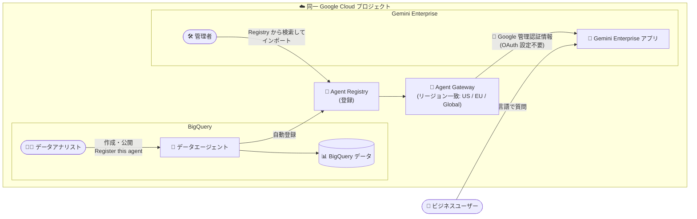

# BigQuery: Agent Registry と Google 管理認証情報による Gemini Enterprise へのデータエージェント公開

**リリース日**: 2026-09-22

**サービス**: BigQuery

**機能**: Agent Registry 経由での BigQuery データエージェントの Gemini Enterprise 公開 (Google 管理認証情報対応)

**ステータス**: Preview

📊 [このアップデートのインフォグラフィックを見る](https://takech9203.github.io/google-cloud-news-summary/20260922-bigquery-data-agent-gemini-enterprise.html)

## 概要

BigQuery で作成したデータエージェントを、Agent Registry に登録して Gemini Enterprise に公開できるようになりました。BigQuery と Gemini Enterprise が同一の Google Cloud プロジェクトにあり、Agent Gateway のリージョンが一致するように構成されている場合、Agent-to-Agent (A2A) JSON カードを手動でコピーしたり、OAuth クライアント認証情報を設定したりする必要がなくなります。インポート時にはデフォルトの Google 管理認証情報 (Google-managed credentials) を利用でき、OAuth クライアント ID / シークレットの作成・管理が不要になります。本機能は Preview として提供されます。

このアップデートにより、データアナリストが BigQuery Studio で作成・公開したデータエージェントを、Gemini Enterprise 管理者が Agent Registry から検索してワンクリックで追加できるようになり、ビジネスユーザーは Gemini Enterprise 内から自然言語で BigQuery のデータを直接クエリ・分析できます。データアナリスト、Gemini Enterprise 管理者、ビジネスユーザーの 3 者にまたがる公開ワークフローが大幅に簡素化されます。

**アップデート前の課題**

- BigQuery データエージェントを Gemini Enterprise に公開するには、BigQuery 側で A2A JSON カードをコピーし、Gemini Enterprise 側に手動で貼り付ける必要があった
- エージェントの認証のために OAuth クライアント ID とクライアントシークレットを手動で作成・設定・管理する必要があった
- JSON カードの受け渡しをデータアナリストと Gemini Enterprise 管理者の間で行う運用上の手間が発生していた

**アップデート後の改善**

- 同一プロジェクト構成では、BigQuery の公開時に「Register this agent」を選択するだけで Agent Registry に登録され、Gemini Enterprise 側は Agent Registry からエージェントを検索してインポートできるようになった
- デフォルトの Google 管理認証情報により OAuth 認証情報が自動管理され、クライアント ID / シークレットの手動設定が不要になった
- BigQuery と Gemini Enterprise が別プロジェクトの場合 (A2A JSON カード方式) でも、Google 管理認証情報を選択でき、OAuth クライアント認証情報の作成が不要になった

## アーキテクチャ図



同一プロジェクト内で BigQuery データエージェントを Agent Registry に登録すると、Gemini Enterprise 管理者は Agent Gateway 経由でエージェントを検索・インポートでき、認証は Google 管理認証情報で自動処理されます。

## サービスアップデートの詳細

### 主要機能

1. **Agent Registry 経由のエージェント公開 (同一プロジェクト)**
   - BigQuery のエージェント公開時に、Publishing channels ペインの Agent Registry セクションで「Register this agent」チェックボックスを選択するだけで登録が完了する
   - A2A JSON カードのコピー & ペーストが不要になる
   - 登録解除も「Unregister」をクリックするだけで可能

2. **デフォルト Google 管理認証情報によるインポート**
   - Gemini Enterprise へのエージェント追加時に「Default Google-managed credentials」を選択すると、OAuth 認証情報を Google が自動管理する
   - クライアント ID、クライアントシークレット、認可 URL、トークン URL の手動入力が不要
   - 組織で独自の OAuth クライアント認証情報が必要な場合は、従来どおり Custom OAuth も選択可能

3. **クロスプロジェクト構成での認証簡素化**
   - BigQuery と Gemini Enterprise が異なるプロジェクトにある場合は、従来どおり A2A JSON カードのコピーが必要
   - ただしこの場合でも Google 管理認証情報を選択でき、OAuth クライアント ID / シークレットの作成・入力は不要になった

4. **Agent Gateway によるリージョン整合**
   - Agent Registry を使用する場合、BigQuery データエージェントのストレージリージョンと、Gemini Enterprise 側の Agent Gateway のレジストリバインディングのリージョンが一致している必要がある
   - リージョンの選択肢は US、EU、Global

## 技術仕様

### 公開ワークフローの比較

| 構成 | 公開方法 | 認証設定 |
|------|---------|---------|
| BigQuery と Gemini Enterprise が同一プロジェクト | Agent Registry に登録 → Registry からインポート (JSON コピー不要) | Google 管理認証情報 (OAuth 設定不要) |
| BigQuery と Gemini Enterprise が別プロジェクト | A2A JSON カードをコピーして貼り付け | Google 管理認証情報を選択可能 (OAuth クライアント作成は不要) |

### リージョンに関する制約

| 項目 | 詳細 |
|------|------|
| 選択可能なリージョン | US、EU、Global |
| エージェントのストレージリージョン | BigQuery Web UI のエージェントエディタの Region セクションで設定。保存後は変更不可 |
| Agent Gateway | エージェントのリージョンと一致するレジストリバインディングを持つ Agent Gateway の構成が必要 |
| Agent Gateway の制限 | 1 つの Agent Gateway インスタンスで管理できる Agent Registry 登録リソースは最大 5,000 件 |

### 必要な IAM ロール

| 操作 | 必要なロール |
|------|------------|
| データエージェントの作成 | Gemini Data Analytics Data Agent Creator (`roles/geminidataanalytics.dataAgentCreator`) |
| エージェントの編集・共有・削除 | Gemini Data Analytics Data Agent Owner (`roles/geminidataanalytics.dataAgentOwner`) |
| エージェントとのチャット | Gemini Data Analytics Data Agent User (`roles/geminidataanalytics.dataAgentUser`) |
| Gemini Enterprise でのプロビジョニング | カスタムエージェントの登録・管理権限と Agent Gateway の構成権限 |

## 設定方法

### 前提条件

1. 課金が有効な Google Cloud プロジェクト
2. BigQuery、Gemini Data Analytics、Gemini for Google Cloud、Knowledge Catalog の各 API の有効化
3. Agent Registry を使用する場合、BigQuery データエージェントのストレージリージョンと一致するレジストリバインディングを持つ Agent Gateway

### 手順

#### ステップ 1: BigQuery でデータエージェントを作成・公開する (データアナリスト)

1. BigQuery でデータエージェントを作成または編集する
2. Region セクションで、ストレージリージョン (US / EU / Global) がデータソースおよび Agent Gateway の構成と一致していることを確認する
3. **Publish** をクリックし、Publishing channels ペインの **Agent Registry** セクションで **Register this agent** チェックボックスを選択する
4. **Publish** をクリックし、利用ユーザー・グループに `roles/geminidataanalytics.dataAgentUser` を付与してエージェントを共有する

#### ステップ 2: Agent Gateway を構成する (Gemini Enterprise 管理者)

1. データエージェントのリージョンと一致する Agent Registry バインディングを含む Agent Gateway をセットアップする
2. Gemini Enterprise でアプリケーションを開き、**Security > Configuration** の Agent Gateway configuration セクションにゲートウェイのリソース名を入力する

#### ステップ 3: Gemini Enterprise でエージェントをインポートする (Gemini Enterprise 管理者)

1. Gemini Enterprise でアプリを開き、**Agents > Add agent** をクリックする
2. **Agents from Agent Registry** を選択し、エージェントを名前・Registry ID・タイプなどで検索する
3. エージェントカードで **Add agent** をクリックし、A2A カードから取得されたメタデータ (名前、説明、URL、機能、スキル) を確認する
4. 認証ステップで **Default Google-managed credentials** を選択し、**Finish** をクリックする
5. エージェントが **Enabled** 状態・タイプ **A2A (Custom)** として Agents テーブルに表示されたら、必要なユーザー・グループに共有する

## メリット

### ビジネス面

- **データ民主化の加速**: ビジネスユーザーが Gemini Enterprise 内から自然言語で BigQuery のデータを直接分析でき、データチームへの依頼を待たずに意思決定できる
- **導入リードタイムの短縮**: JSON カードの受け渡しや OAuth クライアントの発行といった部門間調整が不要になり、エージェント公開までの時間が短縮される

### 技術面

- **認証情報管理の負荷軽減**: OAuth クライアント ID / シークレットの作成・保管・ローテーションが不要になり、認証情報漏えいのリスクが低減する
- **ガバナンスの一元化**: Agent Registry が組織内の承認済みエージェントの中央ディレクトリとして機能し、Agent Gateway が IAM ポリシーや Model Armor などのポリシー適用ポイントとなる

## デメリット・制約事項

### 制限事項

- Preview 段階の機能であり、Pre-GA Offerings Terms が適用される (サポートが限定される可能性がある)
- Agent Registry を使用する場合、BigQuery データエージェントのストレージリージョンと Agent Gateway のレジストリバインディングのリージョンが一致している必要がある
- エージェントのストレージリージョンは保存後に変更できない
- JSON コピー不要のワークフローは BigQuery と Gemini Enterprise が同一プロジェクトの場合のみ。別プロジェクトの場合は引き続き A2A JSON カードのコピーが必要
- Gemini Enterprise では Agent Gateway の Client-to-Agent (ingress) モードはサポートされない (Agent-to-Anywhere モードのみ)

### 考慮すべき点

- エージェントはユーザーの権限で動作するため、ユーザーがアクセス権を持つデータ・リソースにのみアクセスできる。IAM 設計を事前に整理する必要がある
- 組織のセキュリティ要件によっては Custom OAuth の選択が必要になる場合がある
- エージェントのクエリコスト管理のため、`big_query_max_billed_bytes` によるクエリ単位のコスト上限設定やプロジェクト / ユーザー単位のクォータ設定を検討するとよい

## ユースケース

### ユースケース 1: 営業部門向けセルフサービス分析

**シナリオ**: データアナリストが売上データを対象とした BigQuery データエージェントを作成し、営業部門が日常的に使用する Gemini Enterprise から自然言語で売上分析を行えるようにする。

**実装例**:
```text
1. データアナリスト: BigQuery で売上データセットを参照するデータエージェントを作成
   - Region: US (データソースと Agent Gateway に合わせる)
   - Publish 時に「Register this agent」を選択
2. Gemini Enterprise 管理者: Agent Registry からエージェントを検索し、
   Default Google-managed credentials でインポート
3. 営業チームに roles/geminidataanalytics.dataAgentUser を付与して共有
4. 営業担当者: Gemini Enterprise で「今四半期の地域別売上トップ 5 は?」と質問
```

**効果**: OAuth 設定や JSON カードの受け渡しなしで数ステップで公開が完了し、営業担当者は使い慣れた Gemini Enterprise の画面からデータ分析を実行できる。

### ユースケース 2: 全社共通データエージェントのガバナンス統制

**シナリオ**: 企業のプラットフォームチームが、複数のデータエージェントを Agent Registry で一元管理し、Agent Gateway 経由で Model Armor や IAM Unified Access Policies を適用して安全にビジネスユーザーへ提供する。

**効果**: 承認済みエージェントのみが Registry 経由で公開され、プロンプトインジェクション対策や機密データ漏えい防止などのポリシーをゲートウェイで一元的に適用できる。

## 料金

BigQuery データエージェントとの会話 (Conversational Analytics) では、エージェントが実行するクエリに対して BigQuery のコンピューティング料金が適用されるほか、エージェントのトークン使用量に応じた料金が発生します。

### 料金例 (Conversational Analytics Agent)

| 項目 | 料金 (USD) |
|--------|-----------------|
| 入力データ | $3 / 100 万トークン |
| 出力データ | $20 / 100 万トークン |
| クエリ実行 (オンデマンド) | $6.25 / TiB スキャンから (毎月最初の 1 TiB は無料) |

コスト管理には、エージェント設定の `big_query_max_billed_bytes` によるクエリ単位の上限設定 (オンデマンド課金のみ対象) や、プロジェクト / ユーザー単位のクォータ設定が利用できます。詳細は [BigQuery 料金ページ](https://cloud.google.com/bigquery/pricing) および [データエージェント料金](https://cloud.google.com/products/data-agents/pricing) を参照してください。

## 利用可能リージョン

データエージェントのストレージリージョンおよび Agent Gateway のレジストリバインディングとして **US**、**EU**、**Global** を選択できます。Agent Registry を使用する場合は両者のリージョンを一致させる必要があります。

## 関連サービス・機能

- **Gemini Enterprise**: ビジネスユーザー向けの AI アシスタントプラットフォーム。本アップデートによりデータエージェントの公開先としての連携が簡素化された
- **Agent Registry**: 組織内の承認済みエージェント・ツール・MCP サーバー・エンドポイントの中央ディレクトリ。Agent Gateway が接続許可の判断に使用する
- **Agent Gateway**: エージェント間トラフィックのエントリ / イグジットポイント。IAM ポリシー、Model Armor、Semantic Governance ポリシーなどの適用ポイントとなる
- **Conversational Analytics API**: データエージェントとの会話をプログラムから利用するための API。独自のチャットインターフェース構築にも利用できる
- **Model Armor**: Agent Gateway に接続し、プロンプトインジェクションや機密データ漏えいをリアルタイムで検査するコンテンツセキュリティフィルタ

## 参考リンク

- 📊 [インフォグラフィック](https://takech9203.github.io/google-cloud-news-summary/20260922-bigquery-data-agent-gemini-enterprise.html)
- [公式リリースノート](https://docs.cloud.google.com/release-notes#September_22_2026)
- [ドキュメント: Gemini Enterprise でのデータエージェント公開](https://docs.cloud.google.com/bigquery/docs/create-data-agents#publish-agent-gemini-enterprise)
- [ドキュメント: Agent Gateway の概要](https://docs.cloud.google.com/gemini-enterprise-agent-platform/govern/gateways/agent-gateway-overview)
- [料金ページ (BigQuery)](https://cloud.google.com/bigquery/pricing)
- [プロダクトのローンチステージ](https://cloud.google.com/products#product-launch-stages)

## まとめ

BigQuery データエージェントの Gemini Enterprise への公開が、Agent Registry への登録と Google 管理認証情報によって大幅に簡素化されました。A2A JSON カードのコピーや OAuth クライアント認証情報の手動管理が不要になり、ビジネスユーザーへのデータエージェント展開のハードルが下がります。Preview 段階ですが、Gemini Enterprise を導入済みで BigQuery のセルフサービス分析を推進したい組織は、同一プロジェクト構成と Agent Gateway のリージョン設計を確認したうえで検証を始めることをおすすめします。

---

**タグ**: BigQuery, Gemini Enterprise, Agent Registry, Agent Gateway, データエージェント, Conversational Analytics, A2A, Preview
