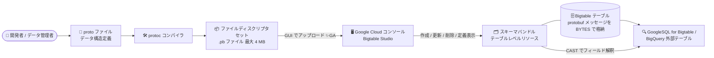

# Bigtable: Google Cloud コンソールでのプロトコルバッファスキーマ (スキーマバンドル) の作成・管理が GA

**リリース日**: 2026-09-22

**サービス**: Bigtable

**機能**: Google Cloud コンソールによるスキーマバンドルの作成・管理、Bigtable Studio でのスキーマバンドル定義の表示

**ステータス**: GA (一般提供)

📊 [このアップデートのインフォグラフィックを見る](https://takech9203.github.io/google-cloud-news-summary/20260922-bigtable-schema-bundles-console-ga.html)

## 概要

Bigtable のプロトコルバッファ (protobuf) スキーマを格納する「スキーマバンドル」を、Google Cloud コンソールから作成・管理できる機能が一般提供 (GA) となりました。あわせて、Bigtable Studio 上でスキーマバンドルの定義を直接表示できるようになりました。

スキーマバンドルは、テーブルレベルのリソースとして 1 つ以上の protobuf スキーマを保持し、カラムに BYTES として格納された protobuf メッセージ内の個々のフィールドを GoogleSQL for Bigtable でクエリ可能にする機能です。proto ファイルを単一の情報源 (Single Source of Truth) として扱うことで、複数のアプリケーションやサービス間でのデータモデルの一貫性を保ち、データ構造の重複定義を排除できます。

今回の GA により、gcloud CLI やクライアントライブラリに加えて、コンソールの GUI 操作だけでスキーマバンドルのライフサイクル (作成・更新・削除・閲覧) を完結できるようになり、データ管理者やアナリストなど CLI に不慣れなユーザーでも protobuf データの活用を始めやすくなりました。

**アップデート前の課題**

- スキーマバンドルの作成・更新・削除には gcloud CLI (`gcloud bigtable schema-bundles` コマンド群) またはクライアントライブラリ (Java など) の利用が必要だった
- テーブルにどのようなスキーマバンドルが登録されているか、その定義内容 (メッセージ型やフィールド構成) を確認するには CLI やコードでの記述が必要だった
- スキーマバンドルを使ったクエリを書き始める際、メッセージの完全修飾名などを別途確認する手間があった

**アップデート後の改善**

- Google Cloud コンソールの Bigtable Studio から、ファイルディスクリプタセット (.pb ファイル) をアップロードするだけでスキーマバンドルを作成できるようになった
- Bigtable Studio の Explorer ペインでテーブル配下のスキーマバンドル一覧と定義の詳細をタブ表示で確認できるようになった
- アクションメニューの「Sample query」から、スキーマバンドルを使用したサンプル SQL クエリ付きのクエリエディタを開けるようになり、クエリ作成の初動が容易になった
- 更新・削除もコンソールのダイアログ操作で完結するようになった

## アーキテクチャ図



proto ファイルから protoc で生成したファイルディスクリプタセットを、コンソール (Bigtable Studio) から GUI でアップロードしてスキーマバンドルを作成し、GoogleSQL や BigQuery 外部テーブルで protobuf データのフィールドを直接クエリするまでの流れを示しています。

## サービスアップデートの詳細

### 主要機能

1. **コンソールからのスキーマバンドル作成**
   - Bigtable Studio の Explorer ペインで、対象テーブルのアクションメニューから「Create schema bundle」を選択
   - スキーマバンドル ID を入力し、protoc で生成したファイルディスクリプタセット (.pb ファイル、最大 4 MB) を選択してアップロードするだけで作成が完了する
   - 作成後、スキーマバンドルが新しいタブで開き、内容をすぐに確認できる

2. **Bigtable Studio でのスキーマバンドル定義の表示**
   - Explorer ペインでテーブルを展開すると「Schema Bundles」の下にバンドル一覧が表示される
   - バンドルをクリック (または「View details」) すると、スキーマバンドル定義 (メッセージ型やフィールド構成) がタブで表示される
   - 「Sample query」を選択すると、そのスキーマバンドルを使用したサンプルクエリ入りの SQL クエリエディタタブが開く

3. **コンソールからの更新・削除**
   - 更新時は新しいファイルディスクリプタセットを選択してアップロードする。Bigtable が既存スキーマとの後方互換性を自動チェックし、非互換の場合は `FailedPrecondition` エラーで更新が失敗する
   - 削除もアクションメニューから実行可能。連続マテリアライズドビューや論理ビューが参照中のスキーマバンドルは削除できない

## 技術仕様

### スキーマバンドルの仕様と制限

| 項目 | 詳細 |
|------|------|
| リソースレベル | テーブルレベル (1 バンドルに複数の protobuf スキーマを格納可能) |
| バンドル数の上限 | テーブルあたり最大 10 個 |
| ディスクリプタセットのサイズ上限 | シリアライズ済みで最大 4 MB (バンドル内のスキーマ数自体に直接の上限なし) |
| スキーマバンドル ID | 1〜50 文字。英数字・アンダースコア・ハイフンのみ。先頭にハイフン不可、ピリオド (`.`) 不可 |
| 更新時の互換性チェック | 後方互換性を自動検証。非互換な変更は `--ignore-warnings` (gcloud) で強制可能だが、ビューが参照中の場合は強制不可 |
| 操作手段 | Google Cloud コンソール (GA)、gcloud CLI、クライアントライブラリ (Java など) |
| クエリ手段 | Bigtable Studio クエリビルダー、GoogleSQL for Bigtable、BigQuery 外部テーブル (PROTO_BINARY エンコーディング) |

### 必要な IAM 権限

スキーマバンドルの操作には、テーブルに対する Bigtable 管理者ロール (`roles/bigtable.admin`) に含まれる以下の権限が必要です。

```text
bigtable.schemaBundles.create
bigtable.schemaBundles.update
bigtable.schemaBundles.delete
bigtable.schemaBundles.get
bigtable.schemaBundles.list
```

## 設定方法

### 前提条件

1. Bigtable インスタンスとテーブルが作成済みであること
2. テーブルに対する `roles/bigtable.admin` 相当の IAM 権限を持っていること
3. proto ファイルから protoc でファイルディスクリプタセット (.pb) を生成済みであること

### 手順

#### ステップ 1: ファイルディスクリプタセットの生成

```bash
# proto ファイルからディスクリプタセットを生成
protoc --include_imports \
  --descriptor_set_out=my_schema.pb \
  album.proto artist.proto
```

protoc コンパイラで proto ファイルを機械可読なディスクリプタセット (.pb) に変換します。

#### ステップ 2: コンソールでスキーマバンドルを作成

1. Google Cloud コンソールで Bigtable インスタンスの一覧を開き、インスタンスを選択
2. ナビゲーションペインで **Bigtable Studio** をクリック
3. Explorer ペインで対象テーブルのアクションメニューから **Create schema bundle** をクリック
4. **Schema Bundle ID** に一意の ID を入力し、**File Descriptor Set (.pb file)** でステップ 1 のファイルを選択
5. **Create** をクリック (作成されたスキーマバンドルが新しいタブで開く)

#### ステップ 3: スキーマバンドルを使ってクエリを実行

```sql
-- BYTES カラムを protobuf メッセージとして CAST してフィールドにアクセス
SELECT CAST(album_details['album'] AS bundle_name.package_name.Album).title
FROM Music
WHERE CAST(album_details['album'] AS bundle_name.package_name.Album).artist.name = 'Dana A.';
```

Bigtable Studio では、スキーマバンドルのアクションメニューから **Sample query** を選ぶと、サンプルクエリ付きのエディタが開きます。

## メリット

### ビジネス面

- **導入ハードルの低下**: CLI やクライアントライブラリのセットアップなしに GUI だけで protobuf スキーマ活用を始められ、データ管理者・アナリストにも利用者層が広がる
- **データモデルの一貫性向上**: proto ファイルを単一の情報源とすることで、複数アプリケーション・プロジェクト間でのデータ定義の重複や不整合を排除できる

### 技術面

- **スキーマの可視性向上**: Bigtable Studio 上でバンドル定義 (メッセージ型・フィールド) を直接確認でき、クエリ作成前の調査が容易になる
- **安全な更新フロー**: コンソールからの更新でも後方互換性チェックが働き、ビュー (論理ビュー / 連続マテリアライズドビュー) を破壊するスキーマ変更を防止できる
- **クエリ着手の高速化**: Sample query 機能により、`CAST(... AS bundle.package.Message)` 構文のひな形がすぐに得られる

## デメリット・制約事項

### 制限事項

- スキーマバンドルはテーブルあたり最大 10 個まで
- シリアライズ済みディスクリプタセットの合計サイズは 4 MB まで (コンソールでアップロードする .pb ファイルも 4 MB 以下)
- スキーマバンドル ID にピリオド (`.`) は使用不可
- 論理ビューまたは連続マテリアライズドビューが参照しているスキーマバンドルは、削除や非互換な強制更新ができない (先にビューの更新・削除が必要)

### 考慮すべき点

- ディスクリプタセットの生成には引き続き protoc の実行が必要 (コンソールで proto ファイルを直接編集する機能ではない)
- 後方互換性のないスキーマ変更を行う場合は、削除したフィールド番号を `reserved` にするなど protobuf のベストプラクティスに従う必要がある
- 非互換変更を `--ignore-warnings` で強制すると既存クエリやビューが壊れる可能性があるため慎重な運用が必要

## ユースケース

### ユースケース 1: 既存の protobuf ベースのイベントデータを SQL で分析

**シナリオ**: マイクロサービス群が protobuf でシリアライズしたイベントデータを Bigtable に BYTES として書き込んでいる。分析チームがフィールド単位の集計を行いたいが、CLI 運用の権限やスキルがない。

**実装例**:
```sql
SELECT AVG(CAST(album_details['album'] AS bundle_name.package_name.Album).release_year)
FROM Music;
```

**効果**: 分析チームがコンソールからスキーマバンドルを登録・確認し、デシリアライズ用のコードを書かずに GoogleSQL でフィールド単位の集計・フィルタリングを実行できる。

### ユースケース 2: BigQuery 外部テーブル経由での protobuf データ活用

**シナリオ**: Bigtable 上の protobuf データを BigQuery から直接分析したい。

**効果**: スキーマバンドルを関連付けた BigQuery 外部テーブル (カラム型 `JSON`、エンコーディング `PROTO_BINARY`) を定義することで、protobuf メッセージを JSON として BigQuery からクエリできる。スキーマ定義はコンソールで一元管理・確認できる。

### ユースケース 3: 論理ビューによる protobuf フィールドの公開

**シナリオ**: protobuf メッセージ内のフィールドを展開した論理ビューを作成し、下流の利用者に使いやすい形で公開したい。

**効果**: `CAST(...).* ` を使った論理ビューや連続マテリアライズドビューでフィールドを展開して提供でき、スキーマバンドルの互換性チェックによりビューを壊す変更が防止される。

## 料金

スキーマバンドル機能自体に対する追加料金の記載はありません。Bigtable の利用料金 (ノード、ストレージ、ネットワーク) は通常どおり適用されます。詳細は料金ページを参照してください。

- [Bigtable 料金](https://cloud.google.com/bigtable/pricing)

## 利用可能リージョン

リージョン固有の制限に関する記載はありません。Bigtable の利用可能ロケーションは公式ドキュメントを参照してください。

- [Bigtable のロケーション](https://cloud.google.com/bigtable/docs/locations)

## 関連サービス・機能

- **GoogleSQL for Bigtable**: スキーマバンドルに登録したメッセージ型へ `CAST` することで、protobuf フィールドの参照・フィルタ・集計・ソートが可能
- **Bigtable Studio**: 今回のアップデートでスキーマバンドルの一覧・定義表示・サンプルクエリ生成に対応したコンソール内の統合ワークスペース
- **BigQuery 外部テーブル**: `PROTO_BINARY` エンコーディングとスキーマバンドルの関連付けにより、Bigtable 上の protobuf データを JSON として BigQuery から直接クエリ可能
- **論理ビュー / 連続マテリアライズドビュー**: スキーマバンドルを参照するビューを定義可能。参照中のバンドルは削除・非互換更新から保護される
- **Cloud IAM**: スキーマバンドル操作の権限管理 (`roles/bigtable.admin` および `bigtable.schemaBundles.*` 権限)

## 参考リンク

- 📊 [インフォグラフィック](https://takech9203.github.io/google-cloud-news-summary/20260922-bigtable-schema-bundles-console-ga.html)
- [公式リリースノート](https://docs.cloud.google.com/release-notes#September_22_2026)
- [ドキュメント: Create and manage protobuf schemas](https://docs.cloud.google.com/bigtable/docs/create-manage-protobuf-schemas)
- [ドキュメント: Query protobuf data](https://docs.cloud.google.com/bigtable/docs/query-protobuf-data)
- [料金ページ](https://cloud.google.com/bigtable/pricing)

## まとめ

Bigtable のスキーマバンドルがコンソールから GUI で作成・管理できるようになり、Bigtable Studio でスキーマ定義の確認やサンプルクエリの生成まで完結するようになりました。protobuf データを BYTES で格納している既存の Bigtable ユーザーは、CLI を使わずにスキーマ活用を開始できるため、まずは対象テーブルにディスクリプタセットをアップロードして GoogleSQL でのフィールド単位クエリを試すことを推奨します。

---

**タグ**: #Bigtable #ProtocolBuffers #SchemaBundle #BigtableStudio #GoogleSQL #GA
