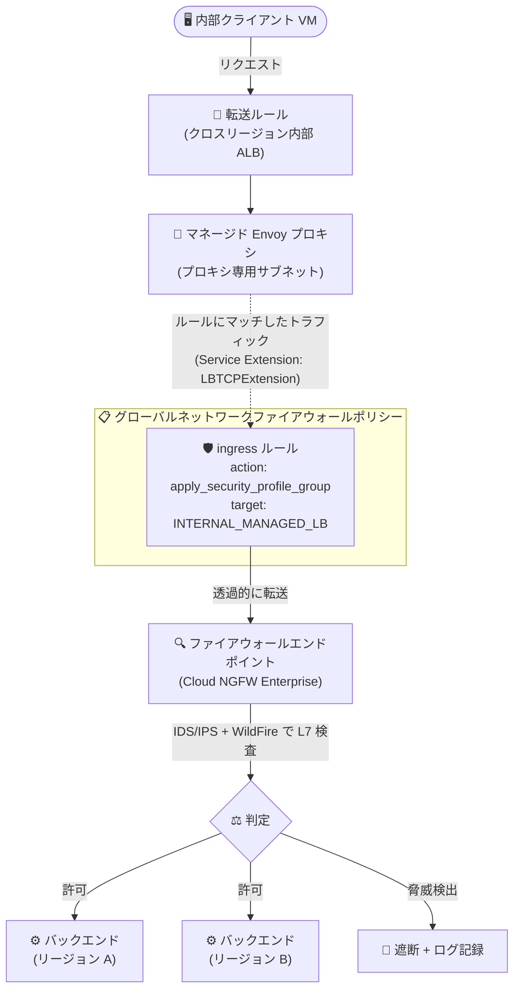

# Cloud NGFW: クロスリージョン内部 Application Load Balancer での高度な脅威防御 (Preview)

**リリース日**: 2026-09-22

**サービス**: Cloud NGFW (Cloud Next Generation Firewall)

**機能**: クロスリージョン内部 Application Load Balancer に対する Cloud NGFW Enterprise の高度な脅威防御

**ステータス**: Preview

📊 [このアップデートのインフォグラフィックを見る](https://takech9203.github.io/google-cloud-news-summary/20260922-cloud-ngfw-cross-region-internal-alb-threat-prevention.html)

## 概要

Cloud NGFW Enterprise の高度な脅威防御 (advanced threat prevention) が、クロスリージョン内部 Application Load Balancer で利用可能になりました (Preview)。グローバルネットワークファイアウォールポリシーにセキュリティプロファイルグループを設定し、ロードバランサーの転送ルール (フォワーディングルール) 宛ての受信トラフィックを検査できます。

この統合により、侵入検知・防御サービス (IDS/IPS) と Advanced malware sandbox (WildFire) を使用して、ロードバランサー配下のワークロードとバックエンドを保護できます。`apply_security_profile_group` アクションを持つファイアウォールルールを、クロスリージョン内部 Application Load Balancer の特定の転送ルールをターゲットとして作成することで、マッチしたトラフィックがファイアウォールエンドポイントへ透過的に転送され、レイヤー 7 (アプリケーション層) の検査が行われます。

マルチリージョンで内部向け Web アプリケーションや API を展開しているエンタープライズ企業、特にゼロトラストや多層防御 (Defense in Depth) の実装を進めるセキュリティチームにとって重要なアップデートです。

**アップデート前の課題**

このアップデート以前は、内部 Application Load Balancer のトラフィックに対する Cloud NGFW の保護には以下の制限がありました。

- 内部 Application Load Balancer を経由する受信トラフィックには、レイヤー 3/4 のフィルタリング (IP レンジ、ポート、プロトコルベース) しか適用できず、Enterprise ティアのレイヤー 7 検査 (IDS/IPS、マルウェア検査) は利用できなかった
- ロードバランサーを通過した後のトラフィックに含まれるマルウェア、スパイウェア、C2 (コマンド & コントロール) 攻撃などの脅威をロードバランサー入口で検知・遮断できず、バックエンド側での別途対策が必要だった
- クロスリージョン構成の内部ロードバランサーに対して、脅威防御を一元的なグローバルポリシーで適用する手段がなかった

**アップデート後の改善**

- クロスリージョン内部 Application Load Balancer の転送ルール宛てトラフィックに対して、セキュリティプロファイルグループを使ったレイヤー 7 検査を適用できるようになった
- 侵入検知・防御サービス (IDS/IPS) により、ロードバランサー入口でマルウェア、スパイウェア、C2 攻撃などのネットワークベースの脅威を検知・遮断できるようになった
- Advanced malware sandbox (WildFire) により、ファイル転送のディープインスペクションとゼロデイマルウェアのブロックが可能になった
- グローバルネットワークファイアウォールポリシーで一元管理でき、VPC ネットワーク単位で一貫した脅威防御を適用できるようになった

## アーキテクチャ図



内部クライアントからクロスリージョン内部 Application Load Balancer の転送ルールに届いたトラフィックは、グローバルネットワークファイアウォールポリシーのルールにマッチするとファイアウォールエンドポイントへ透過的に転送され、IDS/IPS と Advanced malware sandbox によるレイヤー 7 検査を経てバックエンドに到達します。

## サービスアップデートの詳細

### 主要機能

1. **セキュリティプロファイルグループによるレイヤー 7 検査**
   - `apply_security_profile_group` アクションを持つ ingress ルールを、クロスリージョン内部 Application Load Balancer の特定の転送ルールをターゲットとして作成できる
   - ルールにマッチしたトラフィックはファイアウォールエンドポイントへ透過的に転送され、アプリケーション層で検査される
   - `--target-type=INTERNAL_MANAGED_LB` と `--target-forwarding-rules` フラグで対象を指定する

2. **侵入検知・防御サービス (IDS/IPS) の適用**
   - シグネチャベースの脅威検知により、マルウェア、スパイウェア、C2 攻撃からロードバランサー配下のワークロードを保護
   - 脅威の重大度に応じたアクション (許可、アラート、拒否) をセキュリティプロファイルで制御可能

3. **Advanced malware sandbox (WildFire) の適用**
   - ネットワーク経由のファイル転送をディープインスペクションし、ゼロデイマルウェアをワークロード到達前にブロック
   - 動的な機械学習 (ML) とクラウドベースの挙動サンドボックスを統合した解析を実施

4. **Service Extension (LBTCPExtension) との連携**
   - アプリケーション層検査を有効にするには、VPC ネットワークに Service Extension (`LBTCPExtension` リソース) をアタッチする必要がある
   - Service Extension は、その VPC ネットワーク内のすべてのクロスリージョン内部 Application Load Balancer に適用される

## 技術仕様

### ポリシータイプ別のロードバランサーサポート状況

| ポリシータイプ | Cloud NGFW ティア | サポートされるロードバランサー |
|------|------|------|
| グローバルネットワークファイアウォールポリシー | Essentials / Standard | リージョン / クロスリージョン内部 ALB、リージョン / クロスリージョン内部プロキシ NLB |
| グローバルネットワークファイアウォールポリシー | **Enterprise** | **クロスリージョン内部 ALB (Preview) ← 今回のアップデート** |
| リージョンネットワークファイアウォールポリシー | Essentials / Standard | リージョン / クロスリージョン内部 ALB、リージョン / クロスリージョン内部プロキシ NLB |
| リージョンネットワークファイアウォールポリシー | Enterprise | 非サポート |
| 階層型ファイアウォールポリシー | 全ティア | 非サポート |
| VPC ファイアウォールルール | 全ティア | 非サポート |

### 必要な権限

| 項目 | 詳細 |
|------|------|
| 必要な権限 | `compute.firewallPolicies.update` |
| 必要なロール | Compute セキュリティ管理者 (`roles/compute.securityAdmin`) — ファイアウォールポリシーまたはそれを含むプロジェクトに対して付与 |

## 設定方法

### 前提条件

1. クロスリージョン内部 Application Load Balancer (VPC ネットワーク、サブネット、プロキシ専用サブネット、バックエンド、転送ルール) が構成済みであること
2. セキュリティプロファイルおよびセキュリティプロファイルグループ (脅威防御用) が作成済みであること
3. グローバルネットワークファイアウォールポリシーが作成され、転送ルールを含む VPC ネットワークに関連付けられていること
4. VPC ネットワークに Service Extension (`LBTCPExtension` リソース) がアタッチされていること (アプリケーション層検査の必須要件)

### 手順

#### ステップ 1: グローバルネットワークファイアウォールポリシーの作成と関連付け

```bash
# グローバルネットワークファイアウォールポリシーを作成
gcloud compute network-firewall-policies create FIREWALL_POLICY_NAME \
    --global \
    --description="Threat prevention for cross-region internal ALB"

# VPC ネットワークに関連付け
gcloud compute network-firewall-policies associations create \
    --firewall-policy=FIREWALL_POLICY_NAME \
    --network=VPC_NETWORK_NAME \
    --global-firewall-policy
```

ファイアウォールポリシールールをロードバランサーの転送ルールに適用するには、転送ルールを含む VPC ネットワークにポリシーを関連付ける必要があります。

#### ステップ 2: セキュリティプロファイルグループを適用する ingress ルールの作成

```bash
gcloud compute network-firewall-policies rules create PRIORITY \
    --action=apply_security_profile_group \
    --security-profile-group=SECURITY_PROFILE_GROUP_NAME \
    --firewall-policy=NETWORK_FIREWALL_POLICY_NAME \
    --global-firewall-policy \
    --direction=INGRESS \
    --target-type=INTERNAL_MANAGED_LB \
    --target-forwarding-rules=projects/PROJECT_ID/global/forwardingRules/FORWARDING_RULE_NAME
```

`apply_security_profile_group` アクションのルールは、クロスリージョン内部 Application Load Balancer に属する特定の転送ルールをターゲットにする必要があります。あわせて、VPC ネットワークに Service Extension (`LBTCPExtension`) をアタッチしてください。

## メリット

### ビジネス面

- **多層防御の強化**: 内部ロードバランサーの入口で脅威を遮断できるため、バックエンド到達前に攻撃を封じ込め、セキュリティインシデントのリスクとコンプライアンス対応の負担を軽減できる
- **運用の一元化**: グローバルネットワークファイアウォールポリシーで管理できるため、マルチリージョン構成でもリージョンごとに個別のセキュリティ対策を構築・維持する必要がない

### 技術面

- **レイヤー 7 の脅威検知**: 従来のレイヤー 3/4 フィルタリングでは検知できないマルウェア、スパイウェア、C2 攻撃をシグネチャベースで検知・遮断できる
- **ゼロデイマルウェア対策**: Advanced malware sandbox (WildFire) により、ML とサンドボックス解析でファイルベースの未知の脅威をブロックできる
- **透過的な検査**: トラフィックはルールにマッチした場合のみファイアウォールエンドポイントへ透過的に転送されるため、アプリケーションやロードバランサーの構成変更が不要

## デメリット・制約事項

### 制限事項

- Preview 段階の機能であり、Pre-GA 利用規約が適用される (サポートが限定される可能性がある)
- Enterprise ティアのレイヤー 7 検査は、グローバルネットワークファイアウォールポリシー × クロスリージョン内部 Application Load Balancer の組み合わせのみサポート (リージョンネットワークファイアウォールポリシーや内部プロキシ Network Load Balancer は非サポート)
- `apply_security_profile_group` ルールは特定の転送ルールをターゲットとする必要がある

### 考慮すべき点

- Service Extension (`LBTCPExtension`) は VPC ネットワーク内のすべてのクロスリージョン内部 Application Load Balancer に適用されるため、ネットワーク単位での影響範囲を事前に確認する必要がある
- Enterprise ティアの利用にはファイアウォールエンドポイントの時間課金と検査トラフィックの GB 単位課金が発生するため、検査対象トラフィック量に応じたコスト試算が必要
- セキュリティプロファイルグループのプロジェクトあたりの上限 (脅威防御: 35 個) などのクォータに留意する

## ユースケース

### ユースケース 1: マルチリージョン社内 API 基盤の入口での脅威遮断

**シナリオ**: 複数リージョンにバックエンドを展開した社内 API 基盤をクロスリージョン内部 Application Load Balancer で公開している。社内ネットワークからのトラフィックであっても、侵害された端末やワークロードからの攻撃 (ラテラルムーブメント) を想定した検査を入口で行いたい。

**実装例**:
```bash
gcloud compute network-firewall-policies rules create 1000 \
    --action=apply_security_profile_group \
    --security-profile-group=organizations/ORG_ID/locations/global/securityProfileGroups/threat-prevention-spg \
    --firewall-policy=internal-api-fw-policy \
    --global-firewall-policy \
    --direction=INGRESS \
    --target-type=INTERNAL_MANAGED_LB \
    --target-forwarding-rules=projects/my-project/global/forwardingRules/internal-api-fr
```

**効果**: ロードバランサーの転送ルール宛てトラフィックが IDS/IPS で検査され、C2 通信やエクスプロイト試行をバックエンド到達前に遮断できる。

### ユースケース 2: ファイルアップロードを受け付ける内部アプリのゼロデイマルウェア対策

**シナリオ**: 社内の文書管理アプリケーションがクロスリージョン内部 Application Load Balancer 経由でファイルアップロードを受け付けており、ゼロデイマルウェアの持ち込みを防ぎたい。

**効果**: Advanced malware sandbox (WildFire) を含むセキュリティプロファイルグループを適用することで、ネットワーク経由のファイル転送がディープインスペクションされ、未知のマルウェアがワークロードに到達する前にブロックされる。

## 料金

Cloud NGFW Enterprise ティアの機能を使用するルールでトラフィックが評価されると、以下のコンポーネントに基づく追加料金が発生します。

- デプロイされたファイアウォールエンドポイントごとの時間課金
- 検査されたトラフィックの GB 単位課金

Enterprise ティアでは、南北トラフィック (VM とインターネット間)、東西トラフィック (VPC ネットワーク内のリソース間)、およびサポート対象の内部ロードバランサー宛てトラフィックが課金対象です。同一のトラフィックフローが複数のルールで評価されても二重課金はされません。

最新の料金の詳細は [Cloud NGFW の料金ページ](https://cloud.google.com/firewall/pricing) を参照してください。

## 利用可能リージョン

公式ドキュメントに本機能 (Preview) のリージョン制限の明記はありません。クロスリージョン内部 Application Load Balancer とファイアウォールエンドポイントの利用可能リージョンは、各サービスのドキュメントを参照してください。

- [Cloud NGFW ドキュメント](https://docs.cloud.google.com/firewall/docs/about-firewalls)
- [クロスリージョン内部 Application Load Balancer のセットアップ](https://docs.cloud.google.com/load-balancing/docs/l7-internal/setting-up-l7-cross-reg-internal)

## 関連サービス・機能

- **Cloud Load Balancing (クロスリージョン内部 Application Load Balancer)**: 今回の保護対象。マネージド Envoy プロキシ上で動作し、マルチリージョンのバックエンドへトラフィックを分散する
- **Service Extensions (LBTCPExtension)**: アプリケーション層検査を有効化するために VPC ネットワークにアタッチする必須リソース
- **セキュリティプロファイル / セキュリティプロファイルグループ**: 脅威防御の動作 (検知・遮断ポリシー) を定義し、ファイアウォールルールから参照するリソース
- **侵入検知・防御サービス (IDS/IPS)**: Cloud NGFW Enterprise のシグネチャベース脅威検知機能。今回の統合で内部 ALB トラフィックに適用可能になった
- **Advanced malware sandbox (WildFire)**: ML とサンドボックス解析によるゼロデイマルウェア対策 (Preview)。今回の統合でサポートされる
- **Cloud Logging / ファイアウォールルールロギング**: ファイアウォールポリシールールのログを記録し、脅威検知イベントの監査・分析に利用できる

## 参考リンク

- 📊 [インフォグラフィック](https://takech9203.github.io/google-cloud-news-summary/20260922-cloud-ngfw-cross-region-internal-alb-threat-prevention.html)
- [公式リリースノート](https://docs.cloud.google.com/release-notes#September_22_2026)
- [サポートされるロードバランサー (Cloud NGFW の概要)](https://docs.cloud.google.com/firewall/docs/about-firewalls#ngfw-load-balancers)
- [グローバルネットワークファイアウォールポリシーで Envoy ベースのロードバランサーを保護する](https://docs.cloud.google.com/firewall/docs/global-network-app-lb)
- [ロードバランサーにセキュリティプロファイルグループを適用する ingress ルールの作成](https://docs.cloud.google.com/firewall/docs/use-network-firewall-policies)
- [Cloud NGFW ティア](https://docs.cloud.google.com/firewall/docs/ngfw_tiers)
- [料金ページ](https://cloud.google.com/firewall/pricing)

## まとめ

Cloud NGFW Enterprise の高度な脅威防御がクロスリージョン内部 Application Load Balancer に対応したことで、マルチリージョンの内部アプリケーションに対しても IDS/IPS と Advanced malware sandbox によるレイヤー 7 の脅威防御を入口で適用できるようになりました。内部トラフィックにもゼロトラストの考え方を適用したい組織は、Preview 段階のうちに検証環境でセキュリティプロファイルグループと Service Extension の構成を試し、コスト影響とあわせて本番適用を計画することを推奨します。

---

**タグ**: Cloud NGFW, Cloud Firewall, セキュリティ, ネットワーク, ロードバランサー, IDS/IPS, WildFire, Preview
