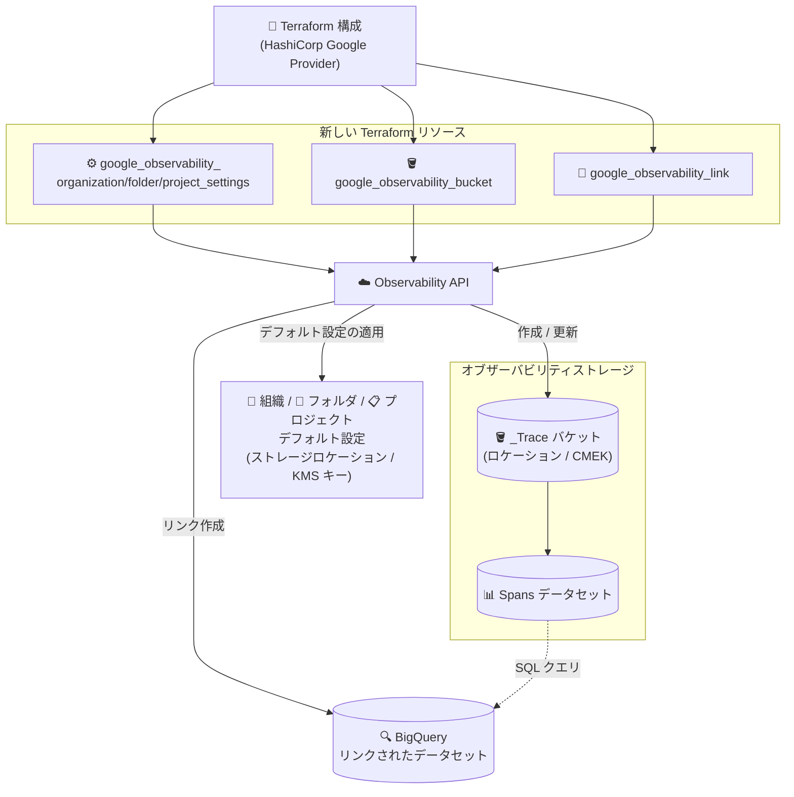

# Cloud Observability: Terraform による Observability API リソース管理サポート

**リリース日**: 2026-09-22

**サービス**: Cloud Observability (Cloud Trace)

**機能**: Terraform による Observability API リソースの構成サポート

**ステータス**: リリース済み (Feature)

📊 [このアップデートのインフォグラフィックを見る](https://takech9203.github.io/google-cloud-news-summary/20260922-cloud-observability-terraform-support.html)

## 概要

Google Cloud は、Observability API が管理するリソースを Terraform で構成できるようになったことを発表した。具体的には、Observability Bucket の作成・更新、データセットへのリンク (BigQuery リンク) の作成、そして組織・フォルダ・プロジェクト単位のデフォルト設定 (デフォルトストレージロケーションと CMEK) の構成が、HashiCorp Google プロバイダーの新しい Terraform リソースとして提供される。

Observability Bucket は Cloud Trace のスパンデータを格納するストレージの管理エンティティであり、これまで REST API (Observability API) を直接呼び出して構成する必要があった。今回のアップデートにより、`google_observability_bucket`、`google_observability_link`、`google_observability_organization_settings` / `google_observability_folder_settings` / `google_observability_project_settings` といった Terraform リソースを使用して、オブザーバビリティストレージの構成を Infrastructure as Code (IaC) として宣言的に管理できるようになった。

主な対象ユーザーは、Terraform でクラウドインフラを管理しているプラットフォームエンジニアリングチーム、データレジデンシーや CMEK 要件を組織全体に適用したいクラウドアーキテクト・セキュリティ管理者である。なお、同日の Google Cloud CLI リリースでは `gcloud observability buckets create/update` コマンドが追加され、Observability 関連の gcloud コマンド群が BETA から GA に昇格しており、IaC / CLI の両面で Observability リソースの管理手段が拡充されている。

**アップデート前の課題**

- Observability Bucket の作成・更新は Observability API (REST) を直接呼び出す必要があり、Terraform で管理するクラウド環境の中で構成がコード化できない例外領域となっていた
- 組織・フォルダ・プロジェクトのデフォルトストレージロケーションや CMEK の設定は `updateSettings` エンドポイントへの手動リクエストが必要で、環境の再現・レビュー・監査が困難だった
- BigQuery リンクの作成も API 経由のみで、トレース分析基盤のプロビジョニングを他の IaC リソースと一元管理できなかった

**アップデート後の改善**

- `google_observability_bucket` リソースで Observability Bucket の作成 (ロケーション、説明、表示名、CMEK の指定) と更新が Terraform で可能になった
- `google_observability_link` リソースでデータセット (例: `Spans`) への BigQuery リンクの作成・更新・削除が Terraform で可能になった
- `google_observability_organization_settings` / `google_observability_folder_settings` / `google_observability_project_settings` リソースで、デフォルトストレージロケーションとデフォルト Cloud KMS キーをリソース階層ごとにコードで管理できるようになった
- オブザーバビリティストレージの構成を Git 管理・コードレビュー・CI/CD パイプラインに組み込めるようになり、環境間の一貫性と監査性が向上した

## アーキテクチャ図



Terraform の新しいリソースが Observability API を介して、Observability Bucket の作成・更新、データセットへの BigQuery リンク作成、リソース階層のデフォルト設定を宣言的に管理する。

## サービスアップデートの詳細

### 主要機能

1. **Observability Bucket の作成・更新 (`google_observability_bucket`)**
   - `project`、`location`、`bucket_id` を指定してバケットを作成する。`bucket_id` は `_Trace` に設定する必要がある
   - 説明 (`description`)、表示名 (display name)、CMEK の指定が可能
   - 更新できるのは説明、表示名、CMEK のみ (ロケーションや ID は変更不可)
   - CMEK を指定しない場合は、親リソースのデフォルト設定 (デフォルト KMS キーまたは Google のデフォルト暗号化) が適用される

2. **データセットへのリンク作成 (`google_observability_link`)**
   - `project`、`location` (バケットのロケーションと一致させる)、`bucket` (例: `_Trace`)、`dataset` (例: `Spans`)、`link_id` (BigQuery データセットの ID) を指定してリンクを作成
   - リンクを作成すると、BigQuery からトレースデータ (スパン) を SQL でクエリできるようになる
   - リンクの更新・削除も Terraform で可能

3. **デフォルト設定の構成 (`google_observability_organization_settings` / `google_observability_folder_settings` / `google_observability_project_settings`)**
   - デフォルトストレージロケーションの設定: `location` フィールドを `global` に、`default_storage_location` をサポート対象ロケーションに設定
   - デフォルト CMEK の設定: `location` フィールドを Cloud KMS キーのロケーションに、`kms_key_name` を KMS キーの完全修飾名に設定
   - 組織はそれぞれ `organization`、フォルダは `folder`、プロジェクトは `project` フィールドで対象リソースの ID を指定
   - 下位リソースは、自身で設定を持たない限り上位リソースのデフォルト設定を継承する

4. **gcloud CLI の拡充 (同日の Cloud SDK リリース)**
   - `gcloud observability buckets create` / `gcloud observability buckets update` コマンドが追加
   - Observability 関連の gcloud コマンド群が BETA から GA に昇格

## 技術仕様

### Terraform リソースと対応する操作

| Terraform リソース | 対応する操作 | 主なフィールド |
|------|------|------|
| `google_observability_bucket` | バケットの作成・更新 | `project`, `location`, `bucket_id` (=`_Trace`), 説明, 表示名, CMEK |
| `google_observability_link` | リンクの作成・更新・削除 | `project`, `location`, `bucket`, `dataset`, `link_id` |
| `google_observability_organization_settings` | 組織のデフォルト設定 | `organization`, `location`, `default_storage_location`, `kms_key_name` |
| `google_observability_folder_settings` | フォルダのデフォルト設定 | `folder`, `location`, `default_storage_location`, `kms_key_name` |
| `google_observability_project_settings` | プロジェクトのデフォルト設定 | `project`, `location`, `default_storage_location`, `kms_key_name` |

### Terraform でサポートされない操作

| 操作 | 代替手段 |
|------|------|
| バケットの一覧表示 (list) | gcloud (`gcloud observability buckets list`) または REST API |
| リンクの一覧表示 (list) | gcloud (`gcloud observability buckets datasets links list`) または REST API |
| デフォルトストレージロケーションの参照 (get) | gcloud (`gcloud observability settings describe`) または REST API |

### 必要な IAM ロール

| 操作 | 必要なロール |
|------|-------------|
| バケット・リンク・ビューの一覧表示 | `roles/observability.viewer` |
| デフォルト設定の変更 | `roles/observability.editor` |
| CMEK の暗号化/復号 (サービスアカウント) | `roles/cloudkms.cryptoKeyEncrypterDecrypter` |

## 設定方法

### 前提条件

1. Google Cloud CLI をインストールし、`gcloud auth application-default login` で Application Default Credentials を設定する (ローカル開発環境の場合)
2. 対象リソースに対する適切な IAM ロール (`roles/observability.editor` など) を保持していること
3. CMEK を使用する場合は、バケットと同じロケーションの Cloud KMS キーと、Observability サービスアカウントへの `roles/cloudkms.cryptoKeyEncrypterDecrypter` の付与

### 手順

#### ステップ 1: デフォルトストレージロケーションを Terraform で設定

組織レベルでデフォルトストレージロケーションを設定する例。`location` は `global` に設定する。

```hcl
resource "google_observability_organization_settings" "default_location" {
  organization             = "ORGANIZATION_ID"
  location                 = "global"
  default_storage_location = "us"
}
```

フォルダの場合は `google_observability_folder_settings` (フィールド: `folder`)、プロジェクトの場合は `google_observability_project_settings` (フィールド: `project`) を使用する。

#### ステップ 2: デフォルト CMEK を設定 (必要な場合)

`location` を Cloud KMS キーのロケーションに設定し、`kms_key_name` にキーの完全修飾名を指定する。

```hcl
resource "google_observability_organization_settings" "default_cmek" {
  organization = "ORGANIZATION_ID"
  location     = "us"
  kms_key_name = "projects/KMS_PROJECT_ID/locations/us/keyRings/KMS_KEY_RING/cryptoKeys/KMS_KEY_NAME"
}
```

#### ステップ 3: Observability Bucket を作成

`bucket_id` は `_Trace` に設定する必要がある。

```hcl
resource "google_observability_bucket" "trace_bucket" {
  project   = "PROJECT_ID"
  location  = "us"
  bucket_id = "_Trace"
}
```

#### ステップ 4: データセットへの BigQuery リンクを作成

リンクの `location` はバケットのロケーションと一致させる。`link_id` が BigQuery データセットの ID になる。

```hcl
resource "google_observability_link" "spans_link" {
  project  = "PROJECT_ID"
  location = "us"
  bucket   = "_Trace"
  dataset  = "Spans"
  link_id  = "my_trace_dataset"
}
```

`terraform plan` / `terraform apply` を実行して構成を適用する。作成結果は gcloud で確認できる。

```bash
gcloud observability buckets list --location=- --project=PROJECT_ID
```

## メリット

### ビジネス面

- **ガバナンスと監査性の向上**: オブザーバビリティストレージの構成 (ロケーション、CMEK) が Terraform コードとして Git 管理されるため、変更履歴の追跡・コードレビュー・監査対応が容易になる
- **コンプライアンス適用の自動化**: データレジデンシーや暗号化要件を Terraform モジュールとして標準化し、新規プロジェクトへ一貫して適用できる

### 技術面

- **IaC への統合**: これまで REST API の手動呼び出しが必要だった Observability API リソースを、他の Google Cloud リソースと同じ Terraform ワークフローで管理できる
- **環境の再現性**: 開発・ステージング・本番環境で同一のオブザーバビリティストレージ構成をコードから再現できる
- **BigQuery 分析基盤のプロビジョニング自動化**: トレースデータの SQL 分析に必要な BigQuery リンクの作成を、分析パイプラインの IaC に組み込める

## デメリット・制約事項

### 制限事項

- `google_observability_bucket` の `bucket_id` は `_Trace` に設定する必要がある (任意の名前のバケットは作成できない)
- バケットの更新で変更できるのは説明・表示名・CMEK のみで、ロケーションは変更できない
- Terraform ではバケットやリンクの一覧表示 (list) はできない (gcloud または REST API を使用)
- Terraform ではデフォルトストレージロケーションの参照 (読み取り) はできない (設定のみ可能)
- デフォルト設定は新規に作成されるリソースにのみ適用され、既存リソースには影響しない

### 考慮すべき点

- リンクの `location` は Observability Bucket のロケーションと一致させる必要がある
- `link_id` (BigQuery データセット名) はプロジェクト内で一意で、100 文字以内、英数字とアンダースコアのみ使用可能
- CMEK を使用する場合、Cloud KMS キーはバケットと同じロケーションに存在する必要があり、Observability サービスアカウントに事前にキーへのアクセス権を付与しておく必要がある
- gcloud で Observability コマンドを使用する場合は gcloud CLI バージョン 563.0.0 以降が必要

## ユースケース

### ユースケース 1: 新規プロジェクトのオブザーバビリティ標準構成をモジュール化

**シナリオ**: 多数のプロジェクトを運用するエンタープライズ企業が、新規プロジェクト作成時にトレースデータの保存先ロケーションと CMEK を必ず適用したい場合。

**実装例**:
```hcl
module "observability_defaults" {
  source = "./modules/observability"

  project                  = var.project_id
  default_storage_location = "us"
  kms_key_name             = var.trace_kms_key
}
```

**効果**: プロジェクト払い出しパイプラインに組み込むことで、すべての新規プロジェクトでデータレジデンシーと暗号化ポリシーが自動的に適用され、設定漏れによるコンプライアンス違反を防止できる。

### ユースケース 2: トレース分析基盤の IaC プロビジョニング

**シナリオ**: SRE チームがトレースデータを BigQuery で SQL 分析するための基盤 (Observability Bucket + BigQuery リンク + 分析用ビュー) を、環境ごとに一貫して構築したい場合。

**効果**: `google_observability_bucket` と `google_observability_link` を BigQuery や Looker Studio などの分析リソースと同じ Terraform 構成で管理でき、開発環境から本番環境まで同一の分析基盤をコードから再現できる。

## 料金

Terraform サポート自体に追加料金は発生しない。Cloud Trace の料金はスパンの取り込み量に基づいて計算される。CMEK を使用する場合は Cloud KMS の料金、BigQuery リンク経由でのクエリには BigQuery の料金が別途発生する。

- [Cloud Trace の料金](https://cloud.google.com/stackdriver/pricing#trace-costs)
- [Cloud KMS の料金](https://cloud.google.com/kms/pricing)
- [BigQuery の料金](https://cloud.google.com/bigquery/pricing)

## 利用可能リージョン

Observability Bucket のロケーションについては、公式ドキュメントの [Observability Bucket のロケーション一覧](https://docs.cloud.google.com/stackdriver/docs/observability/observability-bucket-locations) を参照のこと。

## 関連サービス・機能

- **Cloud Trace**: Observability Bucket (`_Trace`) はスパンデータの格納先であり、今回の Terraform サポートの主な対象
- **BigQuery**: `google_observability_link` でリンクを作成すると、BigQuery からトレースデータを SQL でクエリ・分析可能
- **Cloud KMS**: CMEK によるトレースデータの暗号化に使用。Terraform の設定リソースでデフォルト KMS キーを構成できる
- **Google Cloud CLI (gcloud)**: 同日のリリースで `gcloud observability buckets create/update` が追加され、Observability コマンド群が GA に昇格
- **Cloud Logging**: ログバケットには以前から Terraform サポート (`google_logging_project_bucket_config` など) があり、今回のアップデートでトレース側のストレージも同様に IaC 管理が可能になった

## 参考リンク

- 📊 [インフォグラフィック](https://takech9203.github.io/google-cloud-news-summary/20260922-cloud-observability-terraform-support.html)
- [公式リリースノート](https://docs.cloud.google.com/release-notes#September_22_2026)
- [Observability Bucket のデフォルト設定](https://docs.cloud.google.com/stackdriver/docs/observability/set-defaults-for-observability-buckets)
- [Observability Bucket の作成](https://docs.cloud.google.com/stackdriver/docs/observability/create-observability-buckets)
- [Observability Bucket の更新](https://docs.cloud.google.com/stackdriver/docs/observability/update-observability-buckets)
- [バケットの一覧表示とデータセットの管理](https://docs.cloud.google.com/stackdriver/docs/observability/storage-manage)
- [Terraform: google_observability_bucket](https://registry.terraform.io/providers/hashicorp/google/latest/docs/resources/observability_bucket)
- [Terraform: google_observability_link](https://registry.terraform.io/providers/hashicorp/google/latest/docs/resources/observability_link)
- [Cloud Trace の料金](https://cloud.google.com/stackdriver/pricing#trace-costs)

## まとめ

今回のアップデートにより、Observability API が管理するリソース (Observability Bucket、BigQuery リンク、デフォルト設定) を Terraform で宣言的に管理できるようになり、オブザーバビリティストレージの構成が IaC ワークフローに完全に統合された。Terraform で Google Cloud 環境を管理している組織は、データレジデンシーや CMEK のポリシーを Terraform モジュールとして標準化し、プロジェクト払い出しの自動化に組み込むことを推奨する。同日に GA となった gcloud Observability コマンド群と合わせて、運用の選択肢が大きく広がったアップデートである。

---

**タグ**: #CloudObservability #CloudTrace #Terraform #IaC #ObservabilityAPI #BigQuery #CMEK #DevOps
