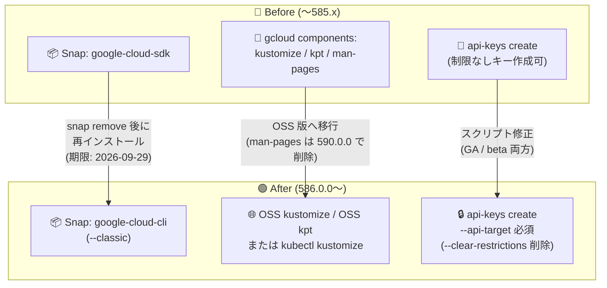

# Cloud SDK (gcloud CLI): 586.0.0 リリース — Snap パッケージ廃止・Kustomize/kpt コンポーネント削除などの破壊的変更

**リリース日**: 2026-09-22

**サービス**: Cloud SDK (gcloud CLI)

**機能**: バージョン 586.0.0 — 破壊的変更 (Breaking Changes) と主要な GA 昇格

**ステータス**: Breaking Change (一部 GA 昇格を含む)

📊 [このアップデートのインフォグラフィックを見る](https://takech9203.github.io/google-cloud-news-summary/20260922-cloud-sdk-586-breaking-changes.html)

## 概要

2026 年 9 月 22 日、Cloud SDK (gcloud CLI) バージョン 586.0.0 がリリースされました。このリリースには、gcloud CLI の利用者・CI/CD パイプライン運用者に直接影響する複数の破壊的変更が含まれています。特に重要なのは、(1) `google-cloud-sdk` Snap パッケージが 2026 年 9 月 29 日に廃止・削除されること、(2) バンドルされていた Kustomize コンポーネント (`kustomize`) と kpt コンポーネントが gcloud CLI から削除されたこと、(3) `gcloud services api-keys create/update` で `--api-target` による API 制限の指定が必須化されたことの 3 点です。

これらの変更は、Ubuntu で Snap 経由で gcloud CLI をインストールしている環境、`gcloud components install kustomize` / `kpt` に依存しているビルドパイプライン、API キーをスクリプトで自動作成しているワークフローに影響します。対象ユーザーは期限 (Snap: 2026 年 9 月 29 日、man ページコンポーネント: 590.0.0 / 2026 年 10 月 20 日) までに移行対応が必要です。

一方で、Cloud Observability コマンド群の BETA → GA 昇格、BigLake Iceberg カタログ関連フラグの GA 昇格、Cloud Run の `<user-chosen>.cloud.run` 形式のカスタム URL サポート、Developer Knowledge コマンドの GA 化、Compute Engine の `--preemption-notice-duration` フラグの GA 化など、注目すべき機能昇格も含まれています。

**アップデート前の課題**

- Snap ユーザーは旧名称の `google-cloud-sdk` パッケージを利用しており、新パッケージ `google-cloud-cli` との名称不一致・二重管理が生じていた
- Kustomize と kpt は gcloud CLI にバンドルされており、OSS 本家のリリースサイクルと乖離した古いバージョンが配布されるケースがあった
- `gcloud services api-keys create` で `--api-target` を指定しない場合、**無制限 (unrestricted) の API キー**が作成され、セキュリティリスクとなっていた (コンソールでは制限必須だが CLI では任意だった)
- `--clear-restrictions` フラグにより、既存キーの API 制限を一括解除して無制限キーに戻すことが可能だった

**アップデート後の改善**

- Snap パッケージは `google-cloud-cli` に一本化され、パッケージ名が他のディストリビューション (apt/dnf の `google-cloud-cli`) と統一された
- Kustomize / kpt は OSS 版の利用に統一され、常に最新の上流バージョンを利用できるようになった (`kubectl kustomize` 組み込み版も利用可能)
- API キー作成・更新時に API 制限 (`--api-target`) が必須となり、無制限 API キーの誤作成が CLI レベルで防止されるようになった (セキュアバイデフォルト)
- `--clear-restrictions` の削除により、制限解除による意図しないセキュリティ低下の経路が塞がれた

## アーキテクチャ図



gcloud CLI 586.0.0 で必要となる 3 系統の移行パス (Snap パッケージ、バンドルコンポーネント、API キーコマンド) を Before/After で示しています。

## サービスアップデートの詳細

### 破壊的変更 (Breaking Changes)

1. **`google-cloud-sdk` Snap パッケージの廃止 (2026 年 9 月 29 日削除)**
   - 旧 Snap パッケージ `google-cloud-sdk` は 2026 年 9 月 29 日に廃止・削除される
   - 新パッケージ `google-cloud-cli` への移行が必要。両パッケージは同じエイリアスを使用するため、旧パッケージを削除してから新パッケージをインストールする
   - Snap 版には gcloud / gcloud alpha / gcloud beta / gsutil / docker-credential-gcloud / bq が含まれる (kubectl や App Engine 拡張は含まれない)

2. **Kustomize コンポーネント (`kustomize`) の削除**
   - gcloud CLI にバンドルされていた Kustomize コンポーネントが廃止・削除された
   - Kustomize 自体は OSS プロジェクトとして継続的にメンテナンスされている
   - 標準の OSS kustomize インストール、または kubectl 組み込みの `kubectl kustomize` へ移行する

3. **kpt コンポーネントの削除**
   - gcloud CLI から kpt コンポーネントが削除された
   - kpt は OSS プロジェクトとして活発にメンテナンスが継続している。標準の OSS kpt インストールへ移行する

4. **`gcloud-man-pages` コンポーネントの非推奨化 (590.0.0 / 2026 年 10 月 20 日に削除)**
   - man ページコンポーネントは非推奨となり、リリース 590.0.0 (2026 年 10 月 20 日) で削除予定
   - 今後はコマンド組み込みの `--help` フラグでドキュメントを参照する

5. **API キーコマンドのセキュリティ強化 (Cloud Services)**
   - `gcloud services api-keys create` および `gcloud services api-keys update` で、GA・beta の両トラックにおいて `--api-target` による API 制限の指定が必須化された
   - `gcloud services api-keys update` から `--clear-restrictions` フラグが削除された

### 主要な GA 昇格・機能追加

1. **Cloud Observability**: `gcloud observability buckets` に create / update メソッドが追加され、Observability コマンド群が BETA から GA に昇格
2. **BigLake**: `gcloud biglake iceberg catalogs create/update` の多数のフラグ (AWS Glue、Snowflake、Unity Catalog、Workday 連携など) が GA に昇格
3. **Cloud Run**: `gcloud domain mappings create` にカスタム URL サポートが追加され、`<user-chosen>.cloud.run` 形式の覚えやすいサブドメインを作成可能に
4. **Developer Knowledge**: `gcloud developer-knowledge` コマンドが GA に昇格
5. **Compute Engine**: `--preemption-notice-duration` フラグが GA に昇格

## 技術仕様

### 破壊的変更のタイムライン

| 項目 | 影響 | 期限 / ステータス |
|------|------|-------------------|
| `google-cloud-sdk` Snap パッケージ | インストール・更新不可に | 2026 年 9 月 29 日に削除 |
| `kustomize` コンポーネント | `gcloud components install kustomize` 不可 | 586.0.0 で削除済み |
| `kpt` コンポーネント | `gcloud components install kpt` 不可 | 586.0.0 で削除済み |
| `gcloud-man-pages` コンポーネント | man ページ参照不可に | 590.0.0 (2026 年 10 月 20 日) で削除 |
| `api-keys create/update` | `--api-target` 未指定でエラー | 586.0.0 から必須 (GA / beta) |
| `--clear-restrictions` フラグ | 制限の一括解除不可 | 586.0.0 で削除済み |

### `--api-target` フラグの仕様

| 項目 | 詳細 |
|------|------|
| 形式 | `--api-target=service=SERVICE[,methods=METHOD:...]` |
| 繰り返し指定 | 可能 (複数 API を許可する場合はフラグを複数指定) |
| service の値 | `bigquery.googleapis.com` のようなサービス名 (API ダッシュボードで確認可能) |
| methods | コロン区切りで特定メソッドのみに制限可能 |
| 併用可能な制限 | `--allowed-ips` / `--allowed-referrers` / `--allowed-bundle-ids` / `--allowed-application` (アプリケーション制限、いずれか 1 種) |

## 設定方法

### 前提条件

1. 現在の gcloud CLI のインストール方法 (Snap / apt / dnf / tar.gz など) と、`gcloud components list` でインストール済みコンポーネントを確認する
2. CI/CD パイプラインやスクリプトで `kustomize`、`kpt`、`gcloud services api-keys` を使用している箇所を洗い出す

### 手順

#### ステップ 1: Snap パッケージの移行 (Ubuntu / Snap ユーザー)

```bash
# 旧パッケージを削除 (同じエイリアスを使うため削除が必須)
snap remove google-cloud-sdk

# 新パッケージをインストール
snap install google-cloud-cli --classic

# (任意) コマンド補完を有効化 (Bash の場合)
echo "source /snap/google-cloud-cli/current/completion.bash.inc" >> ~/.bashrc
```

2026 年 9 月 29 日以降、旧パッケージは削除されるため、それまでに移行を完了させます。

#### ステップ 2: Kustomize / kpt を OSS 版へ移行

```bash
# OSS kustomize のインストール (公式インストールスクリプト)
curl -s "https://raw.githubusercontent.com/kubernetes-sigs/kustomize/master/hack/install_kustomize.sh" | bash

# または kubectl 組み込み版を使用
kubectl kustomize <ディレクトリ>

# OSS kpt のインストール方法は https://kpt.dev/installation/kpt-cli/ を参照
```

CI/CD パイプラインで `gcloud components install kustomize` / `kpt` を実行している場合は、OSS 版のインストール手順に置き換えます。

#### ステップ 3: API キー作成スクリプトの修正

```bash
# 586.0.0 以降: --api-target の指定が必須
gcloud services api-keys create \
  --display-name="my-app-key" \
  --api-target=service=bigquery.googleapis.com \
  --api-target=service=translate.googleapis.com

# 更新時も同様に必須 (指定したサービスで既存の制限が置き換えられる)
gcloud services api-keys update KEY_ID \
  --api-target=service=bigquery.googleapis.com
```

`--clear-restrictions` は削除されたため、制限の変更は `--api-target` の再指定で行います。

#### ステップ 4: man ページから --help への移行

```bash
# man gcloud の代わりに組み込みヘルプを使用
gcloud compute instances create --help
```

## メリット

### ビジネス面

- **セキュリティ体制の強化**: 無制限 API キーの作成が CLI レベルで防止され、キー漏洩時の影響範囲 (blast radius) が縮小し、コンプライアンス対応が容易になる
- **運用の一貫性**: パッケージ名が `google-cloud-cli` に統一され、インストール手順やドキュメントの管理コストが低減する

### 技術面

- **最新の OSS ツールの利用**: Kustomize / kpt はバンドル版の古いバージョンに縛られず、上流の最新版を直接利用できる
- **CLI 本体の軽量化**: バンドルコンポーネントの削減により、gcloud CLI 本体の配布サイズと更新の複雑さが低減される
- **セキュアバイデフォルト**: コンソールと CLI で API キー作成時の制限必須ポリシーが揃い、作成経路によるセキュリティ差異が解消される

## デメリット・制約事項

### 制限事項

- Snap の旧パッケージ `google-cloud-sdk` は 2026 年 9 月 29 日以降利用不可となる (移行猶予は約 1 週間)
- `kustomize` / `kpt` コンポーネントは 586.0.0 時点ですでに削除済みのため、`gcloud components install` での再インストールはできない
- `gcloud services api-keys create/update` は `--api-target` なしでは実行できず、既存の自動化スクリプトはそのままでは失敗する

### 考慮すべき点

- CI/CD イメージ (Cloud Build、GitHub Actions など) 内で gcloud バンドル版の kustomize / kpt に依存している場合、gcloud CLI の更新タイミングでビルドが突然失敗する可能性があるため、事前に OSS 版のインストール手順を組み込むこと
- `--api-target` による update は既存の制限を**置き換える**動作のため、更新時は許可したいすべてのサービスを毎回指定する必要がある
- man ページに依存した社内ドキュメントや運用手順がある場合、590.0.0 (2026 年 10 月 20 日) までに `--help` ベースへ更新する

## ユースケース

### ユースケース 1: CI/CD パイプラインの Kustomize 依存の移行

**シナリオ**: Cloud Build で `gcloud components install kustomize` を実行し、GKE 用マニフェストをビルドしているチームが、586.0.0 への更新でビルドが失敗するようになった。

**実装例**:
```yaml
# cloudbuild.yaml (修正後)
steps:
  - name: 'gcr.io/cloud-builders/kubectl'
    entrypoint: 'bash'
    args:
      - '-c'
      - |
        # kubectl 組み込みの kustomize を使用 (追加インストール不要)
        kubectl kustomize ./overlays/production > manifest.yaml
```

**効果**: gcloud バンドル版への依存を排除し、kubectl 組み込み版でツールチェーンを簡素化。以降の gcloud CLI 更新の影響を受けない。

### ユースケース 2: API キー自動発行スクリプトのセキュリティ準拠化

**シナリオ**: 新規プロジェクトのセットアップスクリプトで API キーを自動作成していたが、`--api-target` 必須化により失敗するようになった。これを機に最小権限のキー発行に見直す。

**実装例**:
```bash
gcloud services api-keys create \
  --display-name="maps-frontend-key" \
  --api-target=service=maps-backend.googleapis.com \
  --allowed-referrers="https://www.example.com/*"
```

**効果**: API 制限とアプリケーション制限 (リファラ制限) を併用した最小権限のキーが標準で発行され、キー漏洩時のリスクを大幅に低減。

### ユースケース 3: Ubuntu 開発端末フリートの Snap 移行

**シナリオ**: 開発者の Ubuntu 端末に Snap で `google-cloud-sdk` を配布している組織が、9 月 29 日の削除までに全端末を移行する。

**効果**: `snap remove google-cloud-sdk && snap install google-cloud-cli --classic` の 2 コマンドで移行が完了し、以降は Snap の自動更新で最新の gcloud CLI が維持される。

## 料金

gcloud CLI 自体は無料で利用できます。本アップデートによる料金への影響はありません。API キーで呼び出す各 API の料金は、それぞれのサービスの料金体系に従います。

- [Google Cloud の料金](https://cloud.google.com/pricing)

## 利用可能リージョン

gcloud CLI はクライアントサイドツールのため、リージョンの制約はありません。バージョン 586.0.0 は 2026 年 9 月 22 日よりすべてのプラットフォーム (Linux x86_64/Arm/x86、macOS、Windows) で利用可能です。

## 関連サービス・機能

- **Kustomize / kubectl**: 削除されたバンドル版 Kustomize の移行先。`kubectl kustomize` は kubectl に組み込まれており追加インストール不要
- **kpt**: Config as Data を実現する OSS ツール。gcloud バンドル版削除後は OSS 版 (kpt.dev) を利用
- **API Keys API (apikeys.googleapis.com)**: `gcloud services api-keys` コマンドのバックエンド。REST / クライアントライブラリでも同様のキー管理が可能
- **Cloud Observability**: 本リリースで `gcloud observability` コマンド群が BETA から GA に昇格
- **Cloud Run**: `<user-chosen>.cloud.run` 形式のカスタム URL がドメインマッピングでサポート
- **BigLake**: Iceberg カタログの外部カタログ連携 (AWS Glue、Snowflake、Unity Catalog など) フラグが GA に昇格

## 参考リンク

- 📊 [インフォグラフィック](https://takech9203.github.io/google-cloud-news-summary/20260922-cloud-sdk-586-breaking-changes.html)
- [公式リリースノート](https://docs.cloud.google.com/release-notes#September_22_2026)
- [gcloud CLI リリースノート](https://docs.cloud.google.com/sdk/docs/release-notes)
- [Snap パッケージでのインストール (google-cloud-cli)](https://docs.cloud.google.com/sdk/docs/downloads-snap)
- [OSS Kustomize のインストール](https://kubectl.docs.kubernetes.io/installation/kustomize/)
- [OSS kpt のインストール](https://kpt.dev/installation/kpt-cli/)
- [API キーによる認証と制限](https://docs.cloud.google.com/docs/authentication/api-keys)
- [gcloud services api-keys create リファレンス](https://docs.cloud.google.com/sdk/gcloud/reference/services/api-keys/create)

## まとめ

gcloud CLI 586.0.0 は、Snap パッケージの改名 (期限 9 月 29 日)、Kustomize / kpt バンドルの削除、API キー作成時の制限必須化という、運用に直結する破壊的変更を含むリリースです。Snap ユーザーと CI/CD パイプラインの管理者は速やかに移行対応を行い、API キーを自動発行しているスクリプトは `--api-target` を明示する形に修正してください。これを機に、API キーの最小権限化とツールチェーンの OSS 版への統一を進めることを推奨します。

---

**タグ**: #CloudSDK #gcloudCLI #BreakingChange #Snap #Kustomize #kpt #APIKeys #セキュリティ #CloudObservability #BigLake #CloudRun
