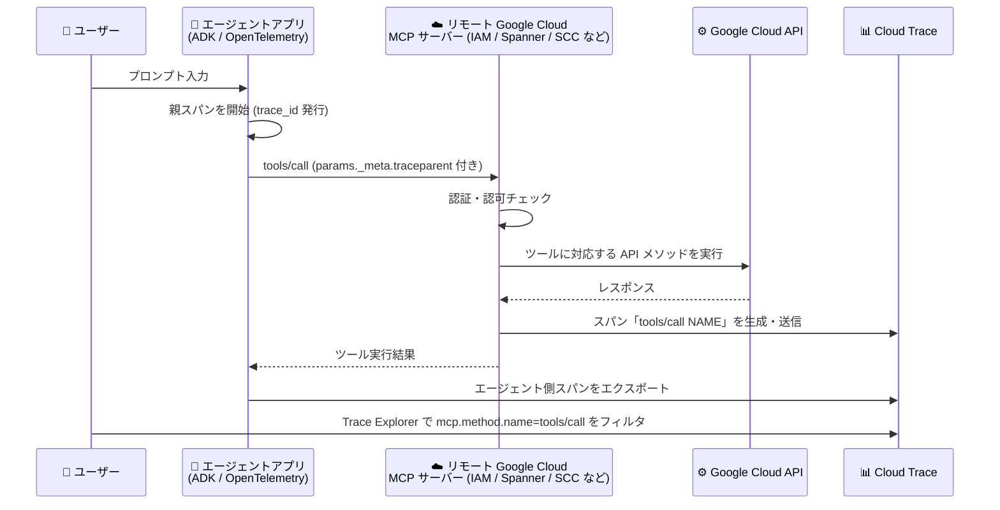

# Cloud Trace: リモート Google Cloud MCP サーバー 6 製品が tools/call のトレーススパンを自動生成

**リリース日**: 2026-09-22

**サービス**: Cloud Trace

**機能**: リモート MCP サーバーによる tools/call トレーススパンの自動生成 (対象製品の追加)

**ステータス**: Feature

📊 [このアップデートのインフォグラフィックを見る](https://takech9203.github.io/google-cloud-news-summary/20260922-cloud-trace-mcp-server-trace-spans.html)

## 概要

Google Cloud は、リモート Google Cloud MCP (Model Context Protocol) サーバーによるトレーススパン自動生成の対象製品を拡大しました。今回新たに **Identity and Access Management (IAM)**、**Organization Policy Service**、**Policy Analyzer**、**Security Command Center**、**Spanner**、**Unified Maintenance** の 6 製品のリモート MCP サーバーが、`tools/call` オペレーションを受信した際にトレーススパンを自動生成するようになりました。

生成されたスパンは Cloud Trace に保存され、エージェントアプリケーションが「どのツールを」「どの順序で」「どれだけのレイテンシで」呼び出したかを可視化できます。AI エージェントから Google Cloud API をツールとして呼び出す構成が広がる中で、エージェントの挙動を分単位ではなくスパン単位で追跡できることは、デバッグ・パフォーマンス分析・監査の観点で重要な価値を提供します。

対象ユーザーは、ADK (Agent Development Kit) などのフレームワークや OpenTelemetry MCP セマンティック規約に対応した SDK を使って、リモート Google Cloud MCP サーバーのツールを呼び出すエージェントアプリケーションを開発・運用するチームです。

**アップデート前の課題**

- IAM、Organization Policy Service、Policy Analyzer、Security Command Center、Spanner、Unified Maintenance の各リモート MCP サーバーは、`tools/call` オペレーションに対するトレーススパンの生成に対応していなかった
- これらのサービスへの MCP ツール呼び出しは、エージェント側 (クライアント側) のスパンでしか把握できず、サーバー側の処理状況やレイテンシがトレース上で分断されていた
- エージェントアプリケーションのエンドツーエンドの挙動 (呼び出しシーケンス全体) を単一のトレースとして俯瞰することが難しかった

**アップデート後の改善**

- 上記 6 製品のリモート MCP サーバーが `tools/call` オペレーションに対してトレーススパンを自動生成するようになった
- クライアントが `_meta` フィールドで W3C Trace Context (`traceparent`) を渡すことで、エージェント側のトレースと MCP サーバー側のスパンが 1 つのトレースに紐づき、エンドツーエンドの可視化が可能になった
- Trace Explorer で `mcp.method.name = tools/call` の属性フィルタを使い、MCP ツール呼び出しのスパンを横断的に検索・分析できるようになった

## アーキテクチャ図



エージェントが `_meta` フィールドで trace context を渡して MCP ツールを呼び出すと、リモート MCP サーバーが `tools/call NAME` という名前のスパンを生成して Cloud Trace に記録し、エージェント側のスパンと同一トレースに関連付けられます。

## サービスアップデートの詳細

### 主要機能

1. **対象 6 製品のリモート MCP サーバーでのスパン自動生成**
   - Identity and Access Management、Organization Policy Service、Policy Analyzer、Security Command Center、Spanner、Unified Maintenance の各リモート MCP サーバーが `tools/call` オペレーション受信時にトレーススパンを自動生成
   - 既に対応済みの Cloud Logging、Cloud Monitoring、GKE、Cloud Run、Compute Engine、BigQuery、Cloud SQL、AlloyDB などに加わる形で対象が拡大

2. **W3C Trace Context によるトレースの関連付け**
   - MCP 標準の `_meta` フィールドで `traceparent` (`00-TRACE_ID-PARENT_SPAN_ID-SAMPLED_FLAG` 形式) と `tracestate` を渡すことで、クライアント側スパンとサーバー側スパンを同一トレースに関連付け
   - OpenTelemetry の MCP セマンティック規約に対応したフレームワーク・SDK (ADK など) から利用可能

3. **Trace Explorer での MCP 呼び出し分析**
   - スパン名は `tools/call NAME` (NAME は呼び出されたツール名、例: `list_keys`) の命名規則に従う
   - 属性フィルタ `mcp.method.name = tools/call` で MCP ツール呼び出しのスパンを検索し、ステータスやレイテンシを分析可能

## 技術仕様

### スパン生成の仕様

| 項目 | 詳細 |
|------|------|
| 対象オペレーション | `tools/call` のみ (他のオペレーションや子スパンは生成されない) |
| スパン名 | `tools/call NAME` (NAME はツール名) |
| 命名規則 | OpenTelemetry Semantic Conventions for MCP に準拠 |
| trace context | W3C Trace Context 標準に準拠、`_meta.traceparent` で伝播 |
| サンプリング要件 | `traceparent` の sampled フラグが `1` (サンプリング有効) である必要あり |
| スパン生成条件 | リクエストが認証・認可され、内部チェックを通過した場合のみ生成 |

### tools/call リクエストの trace context 伝播例

```json
{
  "jsonrpc": "2.0",
  "method": "tools/call",
  "params": {
    "name": "NAME",
    "arguments": {
      // ツールの MCP 仕様に従って指定
    },
    "_meta": {
      "traceparent": "00-TRACE_ID-PARENT_SPAN_ID-01",
      "tracestate": "Vendor specific information."
    }
  },
  "id": 1
}
```

## 設定方法

### 前提条件

1. エージェントアプリケーションが、`_meta` フィールドで trace context を渡せるフレームワークまたは SDK (例: ADK、OpenTelemetry MCP セマンティック規約対応 SDK) を使用していること
2. `traceparent` の sampled フラグが `1` に設定されていること
3. MCP サーバーへのリクエストが認証・認可されること

### 手順

#### ステップ 1: エージェントアプリケーションを構成する

ADK などのフレームワークを使用し、MCP 呼び出し時に `_meta` フィールドで trace context が伝播されるように OpenTelemetry 計装を構成します。ADK アプリケーションの計装方法は「[Instrument ADK applications with OpenTelemetry](https://docs.cloud.google.com/stackdriver/docs/instrumentation/ai-agent-adk)」を参照してください。

#### ステップ 2: Trace Explorer でスパンを確認する

```text
1. Google Cloud コンソールで「Trace Explorer」を開く
2. フィルタバーに属性フィルタ「mcp.method.name」を追加
3. 値を「tools/call」に設定して検索
```

`tools/call NAME` という名前のスパンが表示され、各ツール呼び出しのステータスとレイテンシを確認できます。詳細は「[View calls to remote MCP servers](https://docs.cloud.google.com/trace/docs/finding-traces#mcp-tool-calls)」を参照してください。

## メリット

### ビジネス面

- **エージェント運用の信頼性向上**: AI エージェントが IAM ポリシーの照会や Spanner へのアクセス、Security Command Center の検出結果取得などを行う際の挙動を追跡でき、想定外のツール呼び出しやエラーの早期発見につながる
- **追加実装コストなし**: サーバー側のスパン生成は自動で行われるため、対象製品の MCP サーバーを利用するだけで可視化の恩恵を受けられる (クライアント側は trace context の伝播設定のみ)

### 技術面

- **エンドツーエンドの分散トレーシング**: エージェント側スパンとサーバー側スパンが単一トレースに統合され、呼び出しシーケンス全体とレイテンシの内訳を把握できる
- **標準準拠**: W3C Trace Context と OpenTelemetry MCP セマンティック規約に準拠しており、特定ベンダーにロックインされない計装が可能

## デメリット・制約事項

### 制限事項

- リモート Google Cloud MCP サーバーが生成するのは `tools/call` オペレーションに対する単一スパンのみで、他の種類のオペレーションのスパンや `tools/call` の子スパンは生成されない
- trace context は W3C Trace Context 標準に従う必要があり、sampled フラグが `1` でなければスパンは生成されない
- リクエストが認証・認可され、内部チェックを通過した場合にのみスパンが生成される (失敗したリクエストの可視化には利用できない場合がある)

### 考慮すべき点

- Cloud Trace へのスパン取り込みは課金対象のため、エージェントのツール呼び出しが大量になる場合はサンプリング比率の調整によるコスト管理を検討する
- セルフホスト型 MCP サーバーは自動生成の対象外であり、OpenTelemetry による自前の計装が推奨される

## ユースケース

### ユースケース 1: エージェントによる IAM 監査ワークフローのデバッグ

**シナリオ**: ADK で構築した運用エージェントが、IAM MCP サーバーと Policy Analyzer MCP サーバーのツールを組み合わせて権限の棚卸しを行っているが、特定の処理に時間がかかる原因を特定したい。

**実装例**:
```text
Trace Explorer で対象期間を指定し、
属性フィルタ: mcp.method.name = tools/call
を設定してエージェントのトレースを開く。
「tools/call <ツール名>」スパンごとのレイテンシとステータスを比較する。
```

**効果**: どの MCP ツール呼び出しがボトルネックか、どの呼び出しでエラーが発生しているかをスパン単位で特定でき、デバッグ時間を短縮できる。

### ユースケース 2: Spanner を利用するエージェントアプリのレイテンシ分析

**シナリオ**: エージェントアプリケーションが Spanner MCP サーバー経由でデータを参照しており、応答遅延がエージェント側の処理によるものか、Spanner 側の処理によるものかを切り分けたい。

**効果**: エージェント側スパンと Spanner MCP サーバー側の `tools/call` スパンが同一トレースに並ぶため、レイテンシの発生箇所 (ネットワーク・エージェント・サーバー) を切り分けて分析できる。

## 料金

MCP サーバーによるスパン生成自体に固有の追加料金の記載はありませんが、Cloud Trace へのスパン取り込みは Cloud Trace の料金体系に従って課金されます。

### 料金例

| 項目 | 料金 |
|------|------|
| Trace 取り込み | $0.20 / 100 万スパン |
| 無料枠 | 月間最初の 250 万スパン |

詳細は [Google Cloud Observability の料金ページ](https://cloud.google.com/products/observability/pricing) を参照してください。

## 関連サービス・機能

- **Cloud Trace / Trace Explorer**: 生成されたスパンの保存・検索・分析基盤。`mcp.method.name` 属性フィルタで MCP 呼び出しを抽出できる
- **Agent Development Kit (ADK)**: trace context を `_meta` フィールドで伝播できるエージェント開発フレームワーク。OpenTelemetry 計装と組み合わせて利用
- **OpenTelemetry**: 分散トレーシングの標準フレームワーク。セルフホスト型 MCP サーバーの計装や、エージェント側スパンのエクスポートに使用
- **対象 6 製品の MCP サーバー**: IAM、Organization Policy Service、Policy Analyzer、Security Command Center、Spanner、Unified Maintenance。それぞれ MCP リファレンスドキュメントが提供されている

## 参考リンク

- 📊 [インフォグラフィック](https://takech9203.github.io/google-cloud-news-summary/20260922-cloud-trace-mcp-server-trace-spans.html)
- [公式リリースノート](https://docs.cloud.google.com/release-notes#September_22_2026)
- [ドキュメント: Investigate MCP calls using Trace](https://docs.cloud.google.com/stackdriver/docs/instrumentation/trace-remote-mcp-server-calls)
- [ドキュメント: View calls to remote MCP servers (Trace Explorer)](https://docs.cloud.google.com/trace/docs/finding-traces#mcp-tool-calls)
- [ドキュメント: Instrument a self-hosted MCP server with OpenTelemetry](https://docs.cloud.google.com/stackdriver/docs/instrumentation/self-hosted-mcp-servers)
- [料金ページ](https://cloud.google.com/products/observability/pricing)

## まとめ

AI エージェントから Google Cloud を操作する MCP ベースのアーキテクチャにおいて、IAM や Spanner、Security Command Center といった主要製品のツール呼び出しがサーバー側スパンとして自動記録されるようになり、エージェントの可観測性が大きく向上しました。対象製品の MCP サーバーを利用しているチームは、エージェントアプリケーションで W3C Trace Context の伝播を有効にし、Trace Explorer の `mcp.method.name` フィルタで MCP 呼び出しの分析を始めることを推奨します。

---

**タグ**: Cloud Trace, MCP, Model Context Protocol, OpenTelemetry, Observability, AI Agent, IAM, Spanner, Security Command Center, Policy Analyzer, Organization Policy, Unified Maintenance
