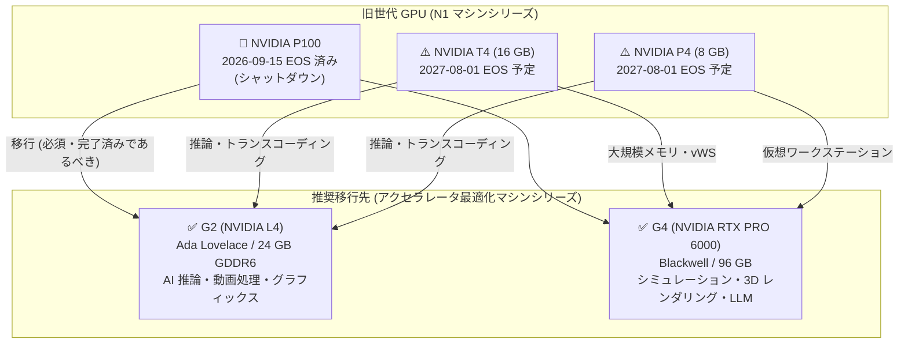

# Compute Engine: NVIDIA P100 GPU のサポート終了 (EOS) と NVIDIA T4 / P4 GPU の非推奨化

**リリース日**: 2026-09-22

**サービス**: Compute Engine

**機能**: NVIDIA P100 GPU の End of Support (EOS) 到達、および NVIDIA T4 / P4 GPU の非推奨化 (2027 年 8 月 1 日 EOS 予定)

**ステータス**: Deprecated

📊 [このアップデートのインフォグラフィックを見る](https://takech9203.github.io/google-cloud-news-summary/20260922-compute-engine-gpu-p100-eos-t4-p4-deprecation.html)

## 概要

Google Cloud は、旧世代 GPU のライフサイクルに関する 2 件の重要な発表を行いました。1 つ目は、2026 年 9 月 15 日をもって NVIDIA P100 GPU (`nvidia-tesla-p100` および `nvidia-tesla-p100-vws`) が End of Support (EOS) に到達し、シャットダウンされたことです。これにより、NVIDIA P100 GPU を使用する Compute Engine インスタンスやその他の Google Cloud リソースの作成・起動・アクセスは一切できなくなりました。

2 つ目は、NVIDIA T4 GPU (`nvidia-tesla-t4`、`nvidia-tesla-t4-vws`) および NVIDIA P4 GPU (`nvidia-tesla-p4`、`nvidia-tesla-p4-vws`) の非推奨化です。これらの GPU は 2027 年 8 月 1 日に EOS に到達する予定で、それ以降は T4 / P4 GPU を実行するインスタンスの作成・起動・アクセスができなくなります。また、発表と同時に T4 / P4 GPU 向けの 3 年間の確約利用割引 (CUD) の新規購入・更新はできなくなりました。

この変更は、Compute Engine だけでなく、GKE ノード、Cloud Workstations、Dataflow パイプライン、Managed Service for Apache Spark、Deep Learning VM など、これらの GPU に依存するすべての Google Cloud サービスに影響します。Google Cloud は移行先として、G2 マシンシリーズ (NVIDIA L4) または G4 マシンシリーズ (NVIDIA RTX PRO 6000) を推奨しています。ML 推論、動画トランスコーディング、仮想ワークステーションなどで T4 / P4 を利用している組織は、約 10 か月の猶予期間内に計画的な移行が必要です。

**アップデート前の課題**

- Pascal 世代 (2016 年) の P100、P4 や Turing 世代 (2018 年) の T4 といった旧世代 GPU は、最新の生成 AI・推論ワークロードに対して性能・メモリ容量の面で見劣りするようになっていた
- 旧世代 GPU は N1 汎用マシンタイプへのアタッチ方式であり、GPU が自動的に構成されるアクセラレータ最適化マシンシリーズと比べて構成管理が煩雑だった
- EOS 日程が確定していない GPU を使い続けることは、長期的なキャパシティ計画・コスト計画上のリスクとなっていた

**アップデート後の改善**

- P100 の EOS 到達と T4 / P4 の EOS 日程 (2027 年 8 月 1 日) が確定し、移行計画を立てるための明確なタイムラインが提示された
- 移行先として G2 (NVIDIA L4) と G4 (NVIDIA RTX PRO 6000) が公式に推奨され、ワークロード別の選定基準と移行手順が公式ドキュメントとして整備された
- L4 GPU は T4 GPU の最大 4 倍の推論性能を提供し、移行によって性能効率の向上が期待できる

## アーキテクチャ図



P100 はすでにシャットダウン済み、T4 / P4 は 2027 年 8 月 1 日の EOS に向けて、ワークロード特性に応じて G2 (NVIDIA L4) または G4 (NVIDIA RTX PRO 6000) への移行が推奨されます。

## サービスアップデートの詳細

### 主要機能

1. **NVIDIA P100 GPU の EOS 到達とシャットダウン (2026 年 9 月 15 日)**
   - `nvidia-tesla-p100` および `nvidia-tesla-p100-vws` を使用する Compute Engine インスタンスやその他の Google Cloud リソースは作成・起動・アクセスが不可能になった
   - 影響対象: Compute Engine インスタンス、GKE ノード、Cloud Workstations、Dataflow パイプライン、Managed Service for Apache Spark、Deep Learning VM / Container-Optimized OS インスタンスなど

2. **NVIDIA T4 / P4 GPU の非推奨化 (2027 年 8 月 1 日 EOS 予定)**
   - `nvidia-tesla-t4`、`nvidia-tesla-t4-vws`、`nvidia-tesla-p4`、`nvidia-tesla-p4-vws` が非推奨となった
   - EOS 日までは既存リソースは通常どおり動作するが、EOS 日以降は残存するインスタンス・リソースはシャットダウンされ、作成・起動・アクセスができなくなる

3. **T4 / P4 向け 3 年 CUD の購入・更新停止**
   - NVIDIA T4 / P4 GPU 向けの 3 年間の確約利用割引 (CUD) は新規購入・更新ができなくなった
   - 既存の有効な 1 年・3 年のコミットメントは期限まで有効。EOL 日以降に期限が切れるコミットメントを保有している場合は、アカウントチームまたは TAM に移行オプションを相談することが推奨されている

4. **公式移行ガイドの提供**
   - P100 / T4 / P4 それぞれについて、G2 / G4 への移行手順を記載した EOS ガイドが公開された

## 技術仕様

### 旧世代 GPU と推奨移行先の比較

| 項目 | N1 + T4 | N1 + P4 | G2 (NVIDIA L4) | G4 (NVIDIA RTX PRO 6000) |
|------|---------|---------|----------------|--------------------------|
| GPU アーキテクチャ | Turing | Pascal | Ada Lovelace | Blackwell |
| GPU メモリ | 16 GB GDDR6 @ 320 GBps | 8 GB GDDR5 @ 192 GBps | 24 GB GDDR6 @ 300 GBps | 96 GB GDDR7 (ECC) @ 1,597 GBps |
| マシンシリーズ | N1 汎用 (GPU アタッチ) | N1 汎用 (GPU アタッチ) | G2 アクセラレータ最適化 | G4 アクセラレータ最適化 |
| vWS 対応 | あり (`-vws`) | あり (`-vws`) | あり (`nvidia-l4-vws`) | あり (`nvidia-rtx-pro-6000-vws`) |
| 主な用途 | ML 推論、動画トランスコーディング、仮想ワークステーション | 仮想ワークステーション、ML 推論、動画トランスコーディング | 高性能 AI 推論、生成 AI、動画処理・ストリーミング、軽量 ML トレーニング (T4 比で最大 4 倍の推論性能) | 高性能シミュレーション、NVIDIA Omniverse、3D レンダリング、ローカル LLM のファインチューニング・推論、vWS、フラクショナル GPU (vGPU) 共有 |
| EOS 日 | 2027-08-01 | 2027-08-01 | - | - |

### 影響を受けるサービス

| サービス | 影響を受けるリソース |
|----------|---------------------|
| Compute Engine | VM インスタンス |
| Google Kubernetes Engine (GKE) | ノード |
| Cloud Workstations | ワークステーション |
| Dataflow | パイプラインジョブ |
| Managed Service for Apache Spark | クラスタ、サーバーレスバッチ |
| Deep Learning VM / Container-Optimized OS | VM インスタンス |

## 設定方法

### 前提条件

1. T4 / P4 GPU を使用しているリソースの棚卸し (Compute Engine、GKE、Dataflow などサービス横断で確認)
2. 移行先 GPU モデル (G2 または G4) の選定と、対象リージョン・ゾーンでの提供状況の確認 ([GPU リージョンとゾーン](https://docs.cloud.google.com/compute/docs/regions-zones/gpu-regions-zones))

### 手順 (Compute Engine ワークロードの場合)

N1 マシンタイプからアクセラレータ最適化マシンタイプへのインプレース変更はできないため、新しいインスタンスへの移行が必要です。

#### ステップ 1: Local SSD データの退避 (該当する場合)

既存インスタンスが保持したいデータを含む Local SSD を使用している場合、その内容を Persistent Disk ボリュームに移動します。

#### ステップ 2: 新しい G2 / G4 インスタンスの作成

```bash
# 例: G2 (NVIDIA L4) インスタンスの作成
gcloud compute instances create my-g2-instance \
    --machine-type=g2-standard-4 \
    --zone=asia-northeast1-a \
    --image-family=debian-12 \
    --image-project=debian-cloud
```

既存インスタンスの構成を再利用する場合は、コンソールの「類似のものを作成 (Create similar)」オプションが利用できます。その際、マシンシリーズと GPU タイプの更新を忘れないよう注意します。

#### ステップ 3: ディスク・IP アドレスの付け替え

```bash
# Persistent Disk を旧インスタンスからデタッチ
gcloud compute instances detach-disk old-instance --disk=my-data-disk --zone=asia-northeast1-a

# 新インスタンスにアタッチ
gcloud compute instances attach-disk my-g2-instance --disk=my-data-disk --zone=asia-northeast1-a
```

静的 IP アドレスを使用している場合は、新しいインスタンスに再割り当てします。

#### ステップ 4: GPU ドライバとアプリケーションのインストール、旧インスタンスの削除

新しいインスタンスに [GPU ドライバをインストール](https://docs.cloud.google.com/compute/docs/gpus/install-drivers-gpu)し、アプリケーションを移行して動作確認後、旧インスタンスを削除します。

### 手順 (Compute Engine 以外のワークロードの場合)

- GKE / Cloud Workstations: 構成テンプレートでサポート対象の GPU モデルを参照するよう更新
- Dataflow: パイプライン仕様の GPU 指定を更新
- Managed Service for Apache Spark: クラスタ定義を更新
- 更新後、リソースを再起動または再作成

## メリット

### ビジネス面

- **明確な移行タイムライン**: T4 / P4 の EOS 日 (2027 年 8 月 1 日) が確定したことで、予算策定・キャパシティ計画を含む移行ロードマップを確度高く立案できる
- **コスト効率の向上機会**: L4 は T4 比で最大 4 倍の推論性能を提供するため、同じスループットをより少ない GPU 数で達成できる可能性があり、移行を機に総コストを最適化できる

### 技術面

- **性能・メモリの大幅な向上**: G2 (24 GB GDDR6) や G4 (96 GB GDDR7) への移行により、旧世代の P4 (8 GB) / T4 (16 GB) では困難だった大規模モデルの推論や高精細レンダリングに対応できる
- **アクセラレータ最適化シリーズへの統一**: GPU が自動的にアタッチされる G2 / G4 マシンシリーズに移行することで、構成管理が簡素化される

## デメリット・制約事項

### 制限事項

- P100 はすでにシャットダウン済みであり、P100 を使用するリソースの作成・起動・アクセスは不可能 (救済措置なし)
- 2027 年 8 月 1 日以降、T4 / P4 を使用するリソースは Google Cloud によってシャットダウンされ、作成・起動・アクセスができなくなる
- T4 / P4 向けの 3 年 CUD は新規購入・更新が不可 (既存の有効なコミットメントは期限まで有効)
- N1 マシンタイプから G2 / G4 へのインプレース変更は不可。新規インスタンスの作成とデータ移行が必要

### 考慮すべき点

- G2 / G4 の提供リージョン・ゾーンは T4 / P4 と異なるため、移行前に[提供状況の確認](https://docs.cloud.google.com/compute/docs/regions-zones/gpu-regions-zones)が必要
- EOL 日以降に期限が切れる有効な CUD を保有している場合は、アカウントチームまたは TAM に移行計画を相談することが推奨される
- N1 + GPU で適用されていた継続利用割引 (SUD) は、G2 / G4 では適用体系が異なるため、コスト試算のやり直しが必要
- CUDA バージョンやドライバ要件がアーキテクチャ世代間で異なるため、アプリケーション側の互換性検証が必要

## ユースケース

### ユースケース 1: T4 ベースの ML 推論サービスを G2 (L4) に移行

**シナリオ**: N1 + T4 GPU で画像分類・物体検出などのオンライン推論 API を運用している。EOS までに移行し、あわせて推論スループットを改善したい。

**実装例**:
```bash
# G2 インスタンスで推論サーバーを再構築
gcloud compute instances create inference-g2 \
    --machine-type=g2-standard-8 \
    --zone=asia-northeast1-a \
    --image-family=common-cu121 \
    --image-project=deeplearning-platform-release
```

**効果**: L4 は T4 比で最大 4 倍の推論性能を提供するため、GPU あたりの処理能力が向上し、必要インスタンス数の削減とレイテンシ改善が期待できる。

### ユースケース 2: P4 / T4 ベースの仮想ワークステーション (vWS) を G4 に移行

**シナリオ**: `nvidia-tesla-p4-vws` / `nvidia-tesla-t4-vws` で CAD・3D レンダリング用の仮想ワークステーションを提供している。GPU メモリ不足で大規模アセットの扱いに制約があった。

**効果**: G4 (RTX PRO 6000、96 GB) への移行により大規模な 3D アセットや NVIDIA Omniverse ワークロードに対応でき、フラクショナル GPU (vGPU) 共有によりユーザーあたりのコスト最適化も可能になる。

### ユースケース 3: GKE / Dataflow の GPU ノード構成の一斉更新

**シナリオ**: GKE ノードプールや Dataflow パイプラインで T4 GPU を指定している構成が複数プロジェクトに散在している。

**効果**: EOS 前に構成テンプレート・パイプライン仕様を `nvidia-l4` 等に更新して再作成することで、2027 年 8 月 1 日のシャットダウンによるサービス停止を回避できる。

## 料金

GPU の時間単価・月額単価はリージョンおよび GPU モデルごとに異なります。最新の料金は [GPU 料金ページ](https://cloud.google.com/compute/gpus-pricing)を参照してください。

移行のコスト計画では以下の点に注意が必要です。

- **T4 / P4 の 3 年 CUD**: 新規購入・更新は不可。既存の有効な 1 年・3 年コミットメントは期限まで有効
- **G2 / G4 の割引オプション**: リソースベース CUD (要リージョン・要予約アタッチ) に加え、G2 / G4 の GPU 利用は Compute Flexible CUD の対象となる (キャパシティ保証はないため、必要に応じて別途予約を作成)
- **Spot / Flex-start / 予約バウンド プロビジョニング**: G2 / G4 でも割引価格で GPU を利用可能
- **SUD**: N1 マシンタイプ + GPU に適用されていた継続利用割引の前提が変わるため、移行後の実効単価を再試算すること

## 利用可能リージョン

G2 / G4 マシンシリーズの提供リージョン・ゾーンは、[GPU リージョンとゾーン](https://docs.cloud.google.com/compute/docs/regions-zones/gpu-regions-zones)を参照してください。Cloud Workstations の場合は[リージョン・ゾーン別の GPU 提供状況](https://docs.cloud.google.com/workstations/docs/available-gpus#gpu_availability_by_region_and_zone)を確認してください。

## 関連サービス・機能

- **Google Kubernetes Engine (GKE)**: T4 / P4 GPU ノードが EOS の影響を受けるため、ノードプールの GPU モデル更新が必要
- **Cloud Workstations**: `-vws` 系 GPU を使用するワークステーション構成の更新が必要
- **Dataflow / Managed Service for Apache Spark**: GPU を指定するパイプライン・クラスタ定義の更新が必要
- **Deep Learning VM / Container-Optimized OS**: 旧世代 GPU を使用する VM イメージ構成の見直しが必要
- **確約利用割引 (CUD)**: T4 / P4 の 3 年 CUD 停止に伴い、G2 / G4 向けのリソースベース CUD や Compute Flexible CUD への切り替えを検討

## 参考リンク

- 📊 [インフォグラフィック](https://takech9203.github.io/google-cloud-news-summary/20260922-compute-engine-gpu-p100-eos-t4-p4-deprecation.html)
- [公式リリースノート](https://docs.cloud.google.com/release-notes#September_22_2026)
- [NVIDIA P100 end of support](https://docs.cloud.google.com/compute/docs/eol/p100-eos)
- [NVIDIA T4 end of support](https://docs.cloud.google.com/compute/docs/eol/t4-eos)
- [NVIDIA P4 end of support](https://docs.cloud.google.com/compute/docs/eol/p4-eos)
- [GPU マシンタイプ](https://docs.cloud.google.com/compute/docs/gpus)
- [アクセラレータ最適化マシンファミリー](https://docs.cloud.google.com/compute/docs/accelerator-optimized-machines)
- [G2 / G4 インスタンスの作成](https://docs.cloud.google.com/compute/docs/gpus/create-gpu-vm-g-series)
- [GPU 料金ページ](https://cloud.google.com/compute/gpus-pricing)

## まとめ

P100 はすでにシャットダウンされ、T4 / P4 も 2027 年 8 月 1 日の EOS が確定しました。T4 は ML 推論や仮想ワークステーションで広く使われてきた GPU であり、影響範囲は Compute Engine、GKE、Dataflow など多岐にわたります。まずは組織内の T4 / P4 利用リソースを棚卸しし、ワークロード特性に応じて G2 (NVIDIA L4) または G4 (NVIDIA RTX PRO 6000) への移行計画を早期に策定することを推奨します。

---

**タグ**: Compute Engine, GPU, NVIDIA P100, NVIDIA T4, NVIDIA P4, NVIDIA L4, G2, G4, EOS, Deprecated, 移行
