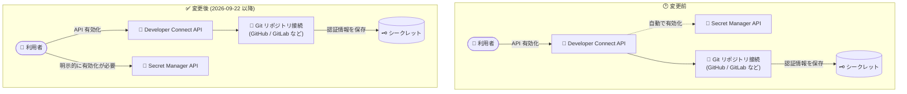

# Developer Connect: Secret Manager API のデフォルト有効化の廃止

**リリース日**: 2026-09-22

**サービス**: Developer Connect

**機能**: Secret Manager API の有効化動作の変更 (Git リポジトリ接続時の明示的な有効化が必要に)

**ステータス**: Announcement

📊 [このアップデートのインフォグラフィックを見る](https://takech9203.github.io/google-cloud-news-summary/20260922-developer-connect-secret-manager-api-change.html)

## 概要

Developer Connect API を有効化した際に、Secret Manager API が自動的に (デフォルトで) 有効化されなくなりました。今後、Git リポジトリ接続 (GitHub、GitHub Enterprise、GitLab、Bitbucket などとの接続) を作成する場合は、Secret Manager API をプロジェクトで明示的に有効化する必要があります。

Developer Connect は、Git プロバイダーへの認証情報 (GitHub アプリの秘密鍵、OAuth トークン、GitLab のアクセストークン、Webhook シークレットなど) を Secret Manager のシークレットとして保存・参照する仕組みになっています。これまでは Developer Connect API を有効化すると Secret Manager API も同時に有効化されていたため、利用者が Secret Manager の存在を意識せずに接続を作成できていました。今回の変更により、API の有効化が利用者の明示的な操作に委ねられ、プロジェクトで有効化される API を利用者が完全に管理できるようになります。

対象ユーザーは、Developer Connect を新規プロジェクトで利用する開発者・プラットフォーム管理者、および Terraform などの IaC やセットアップスクリプトで Developer Connect の環境構築を自動化しているチームです。既存の接続が動作しているプロジェクトでは Secret Manager API がすでに有効化されているため、直接の影響はありません。

**アップデート前の課題**

以前の動作では、以下のような特性がありました。

- Developer Connect API を有効化すると、Secret Manager API が暗黙的に自動で有効化されていた
- 利用者が意図していなくても依存 API が有効化されるため、プロジェクトで有効な API を厳密に管理したい組織 (最小権限・最小サービスのポリシーを持つ組織) にとっては、意図しない API 有効化となる可能性があった
- どの API が何のために有効化されたのかが把握しにくかった

**アップデート後の改善**

- Developer Connect API を有効化しても、Secret Manager API は自動的に有効化されなくなった
- プロジェクトで有効化する API を利用者が明示的にコントロールできるようになり、API 有効化の透明性が向上した
- 一方で、Git リポジトリ接続を利用する場合は、Secret Manager API (`secretmanager.googleapis.com`) を明示的に有効化する手順が必要になった

## アーキテクチャ図



変更前は Developer Connect API の有効化に伴い Secret Manager API が自動で有効化されていましたが、変更後は利用者が Secret Manager API を明示的に有効化しない限り、Git リポジトリ接続に必要なシークレットの保存・参照ができません。

## サービスアップデートの詳細

### 主要機能

1. **Secret Manager API の自動有効化の廃止**
   - Developer Connect API (`developerconnect.googleapis.com`) を有効化しても、Secret Manager API (`secretmanager.googleapis.com`) はデフォルトで有効化されなくなった
   - プロジェクトで有効化される API を利用者が明示的に管理できる

2. **Git リポジトリ接続における明示的な有効化の必須化**
   - GitHub、GitHub Enterprise、GitLab、Bitbucket などへの Git リポジトリ接続では、認証情報 (OAuth トークン、アクセストークン、Webhook シークレットなど) が Secret Manager に保存されるため、Secret Manager API の明示的な有効化が必須
   - HTTP 接続 (Basic 認証 / Bearer トークン認証) でも Secret Manager のシークレット参照が必要なため、同様に有効化が必要

## 技術仕様

### Developer Connect と Secret Manager の関係

| 項目 | 詳細 |
|------|------|
| 対象 API | `developerconnect.googleapis.com` / `secretmanager.googleapis.com` |
| 変更内容 | Developer Connect API 有効化時の Secret Manager API 自動有効化を廃止 |
| 影響を受ける操作 | Git リポジトリ接続 (GitHub、GitHub Enterprise、GitLab、Bitbucket など) の作成・更新 |
| Secret Manager の用途 | GitHub アプリの秘密鍵・OAuth トークン・アクセストークン・Webhook シークレットの保存と参照 |
| 既存接続への影響 | 既存プロジェクトでは Secret Manager API がすでに有効化されているため影響なし |

## 設定方法

### 前提条件

1. Google Cloud プロジェクトが存在し、課金が有効化されていること
2. API を有効化する権限 (例: `roles/serviceusage.serviceUsageAdmin`) を持っていること

### 手順

#### ステップ 1: Developer Connect API と Secret Manager API を有効化する

```bash
# Developer Connect API の有効化
gcloud services enable developerconnect.googleapis.com --project=PROJECT_ID

# Secret Manager API の明示的な有効化 (Git リポジトリ接続に必須)
gcloud services enable secretmanager.googleapis.com --project=PROJECT_ID
```

これまでは Developer Connect API の有効化のみで済んでいましたが、今後は Secret Manager API の有効化コマンドを明示的に実行する必要があります。

#### ステップ 2: 有効化された API を確認する

```bash
gcloud services list --enabled --project=PROJECT_ID \
  --filter="config.name:(developerconnect.googleapis.com OR secretmanager.googleapis.com)"
```

両方の API が一覧に表示されれば、Git リポジトリ接続を作成する準備が整っています。

#### ステップ 3: Git リポジトリ接続を作成する

```bash
# 例: GitLab Enterprise への接続作成 (シークレットは Secret Manager に保存済みであること)
gcloud developer-connect connections create CONNECTION_ID \
  --location=REGION \
  --project=PROJECT_ID \
  ...
```

接続作成時に参照するトークンや Webhook シークレットは Secret Manager のシークレットバージョンとして指定するため、Secret Manager API が有効化されていないと接続の作成に失敗します。

## メリット

### ビジネス面

- **ガバナンスの向上**: プロジェクトで有効化される API を利用者が明示的に管理でき、組織の API 有効化ポリシー (最小サービスの原則) に沿った運用がしやすくなる
- **透明性の向上**: どの API がなぜ有効化されているかが明確になり、監査・コンプライアンス対応が容易になる

### 技術面

- **意図しない API 有効化の防止**: 依存 API が暗黙的に有効化されなくなり、プロジェクト構成の予測可能性が高まる
- **IaC との整合性**: Terraform などで API 有効化を宣言的に管理している場合、暗黙的な有効化による状態のドリフトが発生しなくなる

## デメリット・制約事項

### 制限事項

- Git リポジトリ接続を利用する場合、Secret Manager API の有効化が必須 (有効化しないと接続の作成・認証情報の保存ができない)

### 考慮すべき点

- **新規プロジェクトのセットアップ手順の更新**: Developer Connect を新規プロジェクトで構築する際の手順書・スクリプト・IaC テンプレートに、Secret Manager API の有効化ステップを追加する必要がある
- **自動化パイプラインの確認**: プロジェクトのプロビジョニングを自動化している場合、Developer Connect API の有効化のみを行っている箇所がないか確認が必要
- **既存プロジェクト**: すでに Git リポジトリ接続を利用しているプロジェクトでは Secret Manager API が有効化済みのため、追加対応は不要

## ユースケース

### ユースケース 1: 新規プロジェクトでの CI/CD 環境構築

**シナリオ**: 新しい Google Cloud プロジェクトで、Developer Connect 経由で GitHub リポジトリを Cloud Build に接続して CI/CD パイプラインを構築する。

**実装例**:
```bash
# 必要な API をまとめて明示的に有効化
gcloud services enable \
  developerconnect.googleapis.com \
  secretmanager.googleapis.com \
  cloudbuild.googleapis.com \
  --project=PROJECT_ID
```

**効果**: Secret Manager API の有効化漏れによる接続作成エラーを防ぎ、スムーズにパイプラインを構築できる。

### ユースケース 2: Terraform による環境プロビジョニングの更新

**シナリオ**: Terraform の `google_project_service` リソースで Developer Connect API のみを有効化しているモジュールを利用しており、今回の変更後に新規プロジェクトで Git 接続の作成が失敗するようになった。

**実装例**:
```hcl
resource "google_project_service" "developer_connect" {
  project = var.project_id
  service = "developerconnect.googleapis.com"
}

resource "google_project_service" "secret_manager" {
  project = var.project_id
  service = "secretmanager.googleapis.com"
}
```

**効果**: API の依存関係がコード上で明示され、プロビジョニングの再現性と可読性が向上する。

## 料金

今回の変更自体による追加料金はありません。なお、Developer Connect が Git 接続の認証情報を保存する際には Secret Manager のシークレットが作成されるため、Secret Manager の料金 (シークレットバージョンの保存やアクセス操作に対する課金) が従来どおり適用されます。詳細は料金ページを参照してください。

- [Secret Manager の料金](https://cloud.google.com/secret-manager/pricing)

## 関連サービス・機能

- **Secret Manager**: Developer Connect が Git プロバイダーの認証情報 (トークン、秘密鍵、Webhook シークレット) を保存するために使用する。今回の変更で明示的な API 有効化が必要になった
- **Cloud Build**: Developer Connect の Git リポジトリ接続を利用してビルドトリガーを構成するサービス
- **Gemini Code Assist**: コードカスタマイズ機能で Developer Connect の Git リポジトリ接続を利用する
- **Cloud KMS (CMEK)**: Developer Connect が作成する Secret Manager シークレットの暗号化に顧客管理の暗号鍵を利用できる

## 参考リンク

- 📊 [インフォグラフィック](https://takech9203.github.io/google-cloud-news-summary/20260922-developer-connect-secret-manager-api-change.html)
- [公式リリースノート](https://docs.cloud.google.com/release-notes#September_22_2026)
- [Developer Connect ドキュメント](https://docs.cloud.google.com/developer-connect/docs/overview)
- [Secret Manager API の有効化手順](https://docs.cloud.google.com/secret-manager/docs/configuring-secret-manager)
- [Secret Manager の料金](https://cloud.google.com/secret-manager/pricing)

## まとめ

Developer Connect API の有効化時に Secret Manager API が自動有効化されなくなり、Git リポジトリ接続には Secret Manager API の明示的な有効化が必須になりました。既存プロジェクトへの影響はありませんが、新規プロジェクトのセットアップ手順・スクリプト・IaC テンプレートに `gcloud services enable secretmanager.googleapis.com` 相当のステップを追加することを推奨します。

---

**タグ**: #DeveloperConnect #SecretManager #API #Announcement #CI/CD #Git
