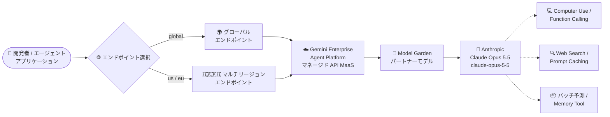

# Gemini Enterprise Agent Platform: Anthropic Claude Opus 5.5 が Model Garden で利用可能に

**リリース日**: 2026-09-22

**サービス**: Gemini Enterprise Agent Platform

**機能**: Anthropic Claude Opus 5.5 (パートナーモデル) の提供開始

**ステータス**: GA (一般提供)

📊 [このアップデートのインフォグラフィックを見る](https://takech9203.github.io/google-cloud-news-summary/20260922-gemini-enterprise-agent-platform-claude-opus-5-5.html)

## 概要

Anthropic の最新フラッグシップモデル **Claude Opus 5.5** が、Gemini Enterprise Agent Platform の Model Garden で一般提供 (GA) として利用可能になりました。Claude Opus 5.5 は Anthropic の最も先進的な Opus モデルであり、長時間稼働するエージェントの実行基盤として設計され、コーディングやプロフェッショナルワークにおける性能向上を実現しています。

Claude Opus 5.5 はパートナーモデルとして Model as a Service (MaaS) 形式のマネージド API で提供されます。リクエストは Gemini Enterprise Agent Platform のエンドポイントに送信され、サーバーレスで動作するためインフラのプロビジョニングや管理は不要です。最大入力 1,000,000 トークン、最大出力 128,000 トークンに対応し、テキスト・画像・PDF の入力をサポートします。

公式ドキュメントの料金表によると、入力 $4.00 / 100 万トークン、出力 $20.00 / 100 万トークンで、前世代の Claude Opus 5 (入力 $5.00 / 出力 $25.00) よりも低価格で提供されます。エージェント構築や大規模コーディングタスクに Claude を利用したい Google Cloud ユーザーにとって、性能とコスト効率の両面で有力な選択肢となります。

**アップデート前の課題**

このアップデート以前に存在していた課題や制限を以下に示します。

- Model Garden で利用できる Anthropic の最上位 Opus モデルは Claude Opus 5 (入力 $5.00 / 出力 $20.00 ではなく $25.00 / 100 万トークン) までで、Anthropic の最新世代 Opus モデルを Google Cloud 上のマネージド API として利用できなかった
- 既存の Claude Opus 5 にはリタイアメント日 (2027 年 1 月 24 日以降) が設定されており、より長期のサポート期間を持つ後継 Opus モデルへの移行パスが Google Cloud 上で必要だった
- コンテキストキャッシュのヒット料金は Claude Opus 5 で $0.50 / 100 万トークンであり、キャッシュを多用するエージェントワークロードのコスト最適化には限界があった

**アップデート後の改善**

今回のアップデートにより可能になったことを以下に示します。

- Anthropic の最新 Opus モデル Claude Opus 5.5 を Model Garden から GA として即座に利用可能になった (リタイアメント日は 2027 年 9 月 22 日以降)
- 入力 $4.00 / 出力 $20.00 / 100 万トークンと、Claude Opus 5 比で約 20% の価格引き下げが実現された
- キャッシュヒット $0.20 / 100 万トークン (Opus 5 は $0.50) となり、プロンプトキャッシュを活用するエージェント・長文コンテキストワークロードのコスト効率が大幅に向上した
- グローバルエンドポイントに加え、米国・欧州のマルチリージョンで利用でき、Provisioned Throughput やバッチ予測にも対応した

## アーキテクチャ図



開発者は Gemini Enterprise Agent Platform のエンドポイント (グローバルまたはマルチリージョン) にリクエストを送信し、Model Garden 経由で提供される Claude Opus 5.5 をサーバーレスのマネージド API として利用します。

## サービスアップデートの詳細

### 主要機能

1. **長時間稼働エージェントの実行基盤**
   - マルチステージのプロジェクトや複雑なタスクを最小限の監督で処理する、長時間稼働エージェント・自律ワークフロー向けに設計
   - Memory tool をサポートし、エージェントの長期的なコンテキスト管理に対応

2. **コーディング性能の強化**
   - 大規模なマイグレーション、複雑な実装、複数日にわたる自律セッションなど、野心的なコーディングプロジェクトに対応
   - Function calling (ツール呼び出し) と Computer use をサポートし、エージェント型開発ワークフローを構築可能

3. **マルチモーダル入力と大規模コンテキスト**
   - テキスト・画像・PDF の入力に対応 (出力はテキスト)
   - 最大入力 1,000,000 トークン、最大出力 128,000 トークンをサポート

4. **エンタープライズ向け提供形態**
   - GA (一般提供) として提供され、リタイアメント日は 2027 年 9 月 22 日以降
   - Shared Model Lineage Quota と Provisioned Throughput の両方の利用形態をサポート
   - バッチ予測とプロンプトキャッシュに対応し、コスト最適化が可能

## 技術仕様

### モデル仕様

| 項目 | 詳細 |
|------|------|
| モデル ID | `claude-opus-5-5` |
| ローンチステージ | GA (一般提供)、リリース日: 2026 年 9 月 22 日 |
| リタイアメント日 | 2027 年 9 月 22 日以降 |
| 入力 | テキスト、画像、PDF |
| 出力 | テキスト |
| 最大入力トークン | 1,000,000 |
| 最大出力トークン | 128,000 |
| サポートされる機能 | Computer use、Web search、バッチ予測、プロンプトキャッシュ、Function calling、Count tokens、Memory tool |
| 利用形態 | Shared Model Lineage Quota、Provisioned Throughput |

### クォータ上限

| エンドポイント | QPM | 入力 TPM (非キャッシュ + キャッシュ書き込み) | 出力 TPM |
|----------------|-----|---------------------------------------------|----------|
| 米国マルチリージョン | 1,000 | 10,000,000 | 1,000,000 |
| 欧州マルチリージョン | 1,000 | 10,000,000 | 1,000,000 |
| グローバルエンドポイント | 2,000 | 20,000,000 | 2,000,000 |

## 設定方法

### 前提条件

1. Google Cloud プロジェクトで課金が有効になっていること
2. Model Garden の Claude Opus 5.5 モデルカードから Anthropic の利用規約に同意し、モデルを有効化していること (プロビジョニング作業は不要)

### 手順

#### ステップ 1: Model Garden でモデルを有効化

Model Garden の Claude Opus 5.5 モデルカードにアクセスし、利用規約に同意してモデルを有効化します。Agent Studio から動作を試すこともできます。

#### ステップ 2: Anthropic SDK (Vertex 向けクライアント) から呼び出し

```python
# pip install "anthropic[vertex]"
from anthropic import AnthropicVertex

client = AnthropicVertex(project_id="YOUR_PROJECT_ID", region="global")

response = client.messages.create(
    model="claude-opus-5-5",
    max_tokens=16000,
    messages=[{"role": "user", "content": "エージェントワークフローの設計方針を提案してください"}],
)
for block in response.content:
    if block.type == "text":
        print(block.text)
```

認証は Google Cloud の Application Default Credentials (`gcloud auth application-default login`) を使用します。Anthropic の API キーは不要です。

## メリット

### ビジネス面

- **コスト削減**: Claude Opus 5 比で入力・出力ともに約 20% の価格引き下げ。キャッシュヒットは $0.50 → $0.20 と 60% の削減で、エージェントワークロードの運用コストを大幅に圧縮できる
- **長期サポート**: リタイアメント日が 2027 年 9 月 22 日以降に設定されており、既存 Opus モデルからの移行先として長期的な計画が立てやすい
- **コンプライアンス**: Agent Platform 経由の Claude モデル利用は FedRAMP High の要件を満たし、Google Cloud の FedRAMP High 認可境界内で動作する

### 技術面

- **サーバーレスのマネージド API**: インフラのプロビジョニング・管理が不要で、Gemini Enterprise Agent Platform のエンドポイントに送信するだけで利用可能
- **大規模コンテキスト**: 最大 1,000,000 入力トークンにより、大規模コードベースや長大なドキュメント群を一度に処理できる
- **豊富なエージェント機能**: Computer use、Function calling、Web search、Memory tool、プロンプトキャッシュをフルサポート

## デメリット・制約事項

### 制限事項

- 出力モダリティはテキストのみ (画像生成などには非対応)
- ML 処理リージョンは米国・欧州のマルチリージョンおよび asia-southeast1 に限定される
- リセラー経由の Google Cloud 課金アカウントの場合、Anthropic のポリシーにより利用規約への同意やモデルの有効化ができないことがある

### 考慮すべき点

- クォータ (QPM / TPM) はエンドポイントごとに異なるため、高スループットが必要な場合はグローバルエンドポイントまたは Provisioned Throughput の利用を検討する
- Anthropic の Claude モデルは Agent Platform のリクエスト / レスポンスロギング (30 日間) に対応しており、モデルの不正利用の追跡のために有効化が推奨される

## ユースケース

### ユースケース 1: 大規模コードベースの自律的マイグレーション

**シナリオ**: レガシーコードベースの大規模マイグレーションを、長時間稼働するコーディングエージェントに委任する。

**実装例**:
```python
from anthropic import AnthropicVertex

client = AnthropicVertex(project_id="YOUR_PROJECT_ID", region="global")

response = client.messages.create(
    model="claude-opus-5-5",
    max_tokens=64000,
    messages=[{
        "role": "user",
        "content": "このリポジトリの Python 2 コードを Python 3 に移行する計画を立て、"
                   "モジュールごとの変更点を列挙してください。\n\n" + repo_context,
    }],
)
```

**効果**: 最大 1,000,000 トークンの入力により大規模コードベース全体をコンテキストに収めたまま、複数日にわたる自律セッションでマイグレーションを推進できる。

### ユースケース 2: プロンプトキャッシュを活用した低コストなエージェント運用

**シナリオ**: 共通の長大なシステムプロンプトやナレッジベースを毎回のリクエストで参照するエンタープライズエージェントを運用する。

**効果**: キャッシュヒット $0.20 / 100 万トークン (Opus 5 の 40%) により、繰り返し参照されるコンテキストのコストを大幅に削減できる。バッチ予測 (入力 $2.50 / 出力 $12.50) と組み合わせれば、非リアルタイム処理のコストをさらに圧縮できる。

## 料金

Claude Opus 5.5 の料金は以下のとおりです (100 万トークンあたり、200K 入力トークン以下 / 超過とも同額)。前世代の Claude Opus 5 (入力 $5.00 / 出力 $25.00 / キャッシュヒット $0.50) より低価格です。

### 料金例

| 項目 | 料金 (/1M トークン) |
|--------|-----------------|
| 入力 | $4.00 |
| 出力 | $20.00 |
| バッチ入力 | $2.50 |
| バッチ出力 | $12.50 |
| キャッシュ書き込み (5 分) | $5.00 |
| キャッシュ書き込み (1 時間) | $8.00 |
| キャッシュヒット | $0.20 |
| バッチキャッシュヒット | $0.10 |

最新の料金は [Vertex AI 生成 AI 料金ページ](https://cloud.google.com/vertex-ai/generative-ai/pricing) を参照してください。

## 利用可能リージョン

| 区分 | リージョン |
|------|-----------|
| モデル提供 (固定クォータ / Provisioned Throughput) | 米国マルチリージョン、欧州マルチリージョン、グローバルエンドポイント |
| ML 処理 | 米国マルチリージョン、欧州マルチリージョン、asia-southeast1 |

## 関連サービス・機能

- **Model Garden**: パートナーモデルを含む AI モデルの検索・有効化・デプロイを行うカタログ。Claude Opus 5.5 のモデルカードもここから利用開始できる
- **Agent Studio**: Claude Opus 5.5 をブラウザ上で試せるインタラクティブ環境
- **Provisioned Throughput**: 安定したスループットが必要な本番ワークロード向けの専用スループット購入オプション
- **リクエスト / レスポンスロギング**: プロンプトと補完のアクティビティを 30 日間記録し、モデルの不正利用を追跡する機能

## 参考リンク

- 📊 [インフォグラフィック](https://takech9203.github.io/google-cloud-news-summary/20260922-gemini-enterprise-agent-platform-claude-opus-5-5.html)
- [公式リリースノート](https://docs.cloud.google.com/release-notes#September_22_2026)
- [Claude Opus 5.5 on Google Cloud ドキュメント](https://docs.cloud.google.com/gemini-enterprise-agent-platform/models/partner-models/claude/opus-5-5)
- [パートナーモデルの概要](https://docs.cloud.google.com/gemini-enterprise-agent-platform/models/partner-models/use-partner-models)
- [料金ページ](https://cloud.google.com/vertex-ai/generative-ai/pricing)

## まとめ

Anthropic の最新フラッグシップ Opus モデルである Claude Opus 5.5 が、Model Garden から GA として即座に利用可能になり、しかも前世代より約 20% 低価格・キャッシュヒットは 60% 減という価格設定で提供されます。長時間稼働エージェントや大規模コーディングワークロードを Google Cloud 上で構築しているチームは、Claude Opus 5 からの移行によるコスト削減と性能向上の評価を早期に開始することを推奨します。

---

**タグ**: #GeminiEnterpriseAgentPlatform #ModelGarden #Anthropic #Claude #ClaudeOpus55 #生成AI #パートナーモデル #GA
