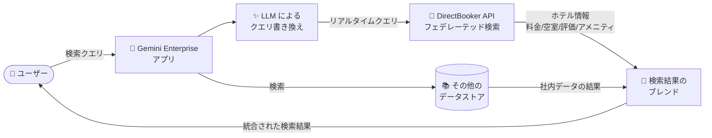

# Gemini Enterprise: DirectBooker データストア (Public Preview)

**リリース日**: 2026-09-22

**サービス**: Gemini Enterprise

**機能**: DirectBooker データストア (フェデレーテッド検索コネクタ)

**ステータス**: Public Preview

📊 [このアップデートのインフォグラフィックを見る](https://takech9203.github.io/google-cloud-news-summary/20260922-gemini-enterprise-directbooker-data-store-preview.html)

## 概要

Gemini Enterprise に新しいサードパーティデータストアとして **DirectBooker** が Public Preview で追加されました。DirectBooker データストアを利用すると、Gemini Enterprise から直接予約可能なホテルインベントリを検索し、特定のホテルの料金、空室状況、評価、アメニティを DirectBooker から取得できます。

このコネクタはフェデレーテッド検索 (Federated Search) 型のデータストアで、データを Gemini Enterprise 側にインデックスするのではなく、検索クエリを DirectBooker API にリアルタイムで送信し、その結果を他の接続済みデータソースの検索結果とブレンドして統合的に表示します。DirectBooker はパブリック API を利用するため、ユーザー認証や OAuth 設定は不要です。

出張手配や旅行関連業務を行う企業ユーザーが、社内ナレッジと外部のホテル情報を単一の Gemini Enterprise インターフェースから横断検索できるようになる点が主な価値提案です。

**アップデート前の課題**

- Gemini Enterprise からホテルの料金・空室状況・評価などのリアルタイム情報を直接検索する手段がなく、DirectBooker などの外部予約サイトを個別に参照する必要があった
- 出張・旅行手配のワークフローにおいて、社内データの検索とホテル情報の検索が別々のツールに分断されていた
- ホテルインベントリのような頻繁に変動する外部データを Gemini Enterprise の検索体験に組み込むには、独自のインテグレーション開発が必要だった

**アップデート後の改善**

- DirectBooker データストアを作成するだけで、直接予約可能なホテルインベントリ (料金、空室状況、評価、アメニティ) を Gemini Enterprise から検索できるようになった
- フェデレーテッド検索により、DirectBooker の検索結果が他の接続済みデータソースの結果とブレンドされ、統合された検索結果として表示されるようになった
- パブリック API を利用するため認証設定が不要で、コンソールからの数ステップの操作でセットアップが完了するようになった

## アーキテクチャ図



DirectBooker データストアはフェデレーテッド検索型のため、検索クエリが LLM による書き換えを経て DirectBooker API にリアルタイムで送信され、その結果が他のデータソースの検索結果とブレンドされてユーザーに返されます。

## サービスアップデートの詳細

### 主要機能

1. **直接予約可能なホテルインベントリの検索**
   - DirectBooker が保有する直接予約可能なホテルの検索が Gemini Enterprise から可能
   - 特定のホテルの料金 (rates)、空室状況 (availability)、評価 (ratings)、アメニティ (amenities) を照会できる
   - 検索対象エンティティは「Hotels」

2. **フェデレーテッド検索によるリアルタイム結果**
   - データをインデックスせず、検索クエリを DirectBooker API に直接送信するフェデレーテッド検索方式
   - 検索結果は他の接続済みデータソースの結果とブレンドされ、統合された検索結果として表示される
   - 検索精度向上のため、LLM がクエリを書き換えてから DirectBooker に送信する場合がある

3. **認証不要のシンプルなセットアップ**
   - DirectBooker はパブリックデータを利用するため、ユーザー認証・認可が不要
   - コンソールからデータストアを作成し、アプリに接続するだけで利用開始できる
   - 静的 IP エグレス (Enable Static IP Addresses) の設定にも対応

## 技術仕様

### DirectBooker データストアの仕様

| 項目 | 詳細 |
|------|------|
| ステータス | Public Preview (Pre-GA Offerings Terms が適用) |
| コネクタ方式 | フェデレーテッド検索 (インデックスなし、リアルタイムクエリ) |
| 検索可能エンティティ | Hotels (ホテル) |
| 認証 | 不要 (パブリック API) |
| 対応ロケーション | `global`、`us`、`eu` のみ |
| 組織ポリシー値 | `discoveryengine.managed.allowedDataSources` に `directbooker` を指定 |
| 暗号化 | Google 管理の暗号鍵または Cloud KMS 鍵 (CMEK、us/eu 選択時) |
| 静的 IP エグレス | 対応 (Advanced options で有効化) |

### データハンドリングとプライバシー

フェデレーテッド検索の利用時は以下のデータ取り扱いルールが適用されます。

- 検索クエリ文字列は DirectBooker API (サードパーティの検索バックエンド) に送信される
- サードパーティはクエリをユーザーの ID と関連付ける可能性がある
- 複数のフェデレーテッド検索データソースが有効な場合、クエリはすべてのソースに送信される可能性がある
- サードパーティシステムに到達したデータは、そのシステムの利用規約とプライバシーポリシーに準拠する (Google Cloud の利用規約の対象外)
- LLM によるクエリ書き換えの際、セッションのクエリ履歴の一部が DirectBooker に送信されるクエリに含まれる可能性がある

## 設定方法

### 前提条件

1. Google Cloud プロジェクトと Gemini Enterprise のライセンスが有効であること
2. データストアを作成するユーザーに **Discovery Engine 編集者ロール** (`roles/discoveryengine.editor`) が付与されていること

### 手順

#### ステップ 1: IAM ロールの付与

```bash
# Discovery Engine 編集者ロールを付与
gcloud projects add-iam-policy-binding PROJECT_ID \
  --member="user:USER_EMAIL" \
  --role="roles/discoveryengine.editor"
```

データストアの作成には Discovery Engine 編集者ロールが必要です。

#### ステップ 2: DirectBooker データストアの作成

1. Google Cloud コンソールで **Gemini Enterprise** ページに移動
2. ナビゲーションメニューで **Data stores** をクリックし、**Create data store** を選択
3. **Source** セクションで「DirectBooker」を検索して **Select** をクリック
4. **Data** セクションの **Entities to search** で「Hotels」を選択し、**Continue** をクリック
5. (任意) **Advanced options** で **Enable Static IP Addresses** を選択 (アウトバウンド通信を固定 IP にする場合)
6. **Configuration** セクションでマルチリージョン (`global` / `us` / `eu`) とコネクタ名を設定し、`us` / `eu` の場合は暗号化設定 (Google 管理鍵または Cloud KMS 鍵) を選択
7. **Billing** セクションで General pricing または Configurable pricing を選択し、**Create** をクリック

#### ステップ 3: アプリへの接続

データストアのステータスが **Creating** から **Active** に変わったら、既存のアプリに接続するか新規アプリを作成して接続します。パブリックデータを利用するコネクタのため、ユーザー認可の手続きは不要です。

## メリット

### ビジネス面

- **出張・旅行手配の効率化**: 社内ナレッジ検索と同じ Gemini Enterprise インターフェースからホテルの料金・空室状況を検索でき、複数ツールを行き来する手間が削減される
- **導入コストの低さ**: 認証設定が不要で、コンソール操作のみで数分でセットアップが完了する

### 技術面

- **リアルタイム性**: フェデレーテッド検索方式のため、料金や空室状況といった変動の激しいデータを常に最新の状態で取得できる (インデックスの同期・更新が不要)
- **統合検索体験**: DirectBooker の結果が他のデータソースの検索結果と自動的にブレンドされ、単一の検索結果として提示される
- **セキュリティオプション**: 静的 IP エグレスや CMEK (us/eu ロケーション) に対応

## デメリット・制約事項

### 制限事項

- Public Preview のため、Pre-GA Offerings Terms が適用され、サポートが限定的な場合がある
- 対応ロケーションは `global`、`us`、`eu` のみ
- 既存の DirectBooker データストアへの VPC Service Controls 境界の適用はサポートされない (適用するにはデータストアの削除・再作成が必要)
- アプリの作成時または既存アプリへのデータストア追加時は、アクションを持つデータストアは単一のコネクタタイプに限定することが推奨される

### 考慮すべき点

- 検索クエリ文字列 (LLM による書き換え後のクエリ履歴の一部を含む可能性あり) が DirectBooker API に送信されるため、機密情報を含むクエリの取り扱いに関する社内ポリシーを確認する必要がある
- サードパーティに送信されたデータは DirectBooker の利用規約・プライバシーポリシーに準拠するため、コンプライアンス要件を事前に確認すること
- 複数のフェデレーテッド検索データソースを有効にしている場合、クエリがすべてのソースに送信される可能性がある

## ユースケース

### ユースケース 1: 出張手配アシスタント

**シナリオ**: 従業員が出張の計画時に、社内の出張規程と出張先のホテル情報を同時に調べたい。

**実装例**:
```
1. DirectBooker データストアを作成 (Entities: Hotels)
2. 社内規程を格納した既存データストアと同じ Gemini Enterprise アプリに接続
3. 従業員が「来週の大阪出張で、規程内の予算で泊まれる駅近のホテルは?」と質問
4. 社内規程 (出張費上限) と DirectBooker のホテル情報 (料金・空室) がブレンドされて回答
```

**効果**: 出張規程の確認とホテル探しが 1 回の対話で完結し、手配時間を短縮できる。

### ユースケース 2: 旅行・ホスピタリティ業界の顧客対応

**シナリオ**: 旅行代理店のオペレーターが、顧客の要望 (評価、アメニティ、価格帯) に合うホテルを迅速に提案したい。

**効果**: Gemini Enterprise の自然言語検索で DirectBooker の直接予約可能なインベントリから条件に合うホテルをリアルタイムに絞り込め、提案スピードと精度が向上する。

## 料金

データストア作成時の Billing セクションで **General pricing** または **Configurable pricing** を選択します。Gemini Enterprise のライセンス体系の詳細は公式ドキュメントを参照してください。

- [Gemini Enterprise ライセンス](https://docs.cloud.google.com/gemini/enterprise/docs/licenses)

## 利用可能リージョン

DirectBooker データストアは以下のマルチリージョンのみサポートされます。

- `global`
- `us`
- `eu`

## 関連サービス・機能

- **Gemini Enterprise (旧 Agentspace / Vertex AI Search)**: 本データストアの基盤。サードパーティコネクタ経由で多数の外部データソースと連携可能
- **Cloud KMS**: `us` / `eu` ロケーション選択時に CMEK (顧客管理の暗号鍵) を利用可能
- **VPC Service Controls**: セキュリティ境界の適用が可能 (ただし既存データストアへの適用は不可、再作成が必要)
- **同種の旅行系フェデレーテッドコネクタ**: Viator (体験・アクティビティ)、Kiwi.com、Lastminute など、旅行関連のサードパーティデータストアが順次追加されている

## 参考リンク

- 📊 [インフォグラフィック](https://takech9203.github.io/google-cloud-news-summary/20260922-gemini-enterprise-directbooker-data-store-preview.html)
- [公式リリースノート](https://docs.cloud.google.com/release-notes#September_22_2026)
- [DirectBooker コネクタ概要](https://docs.cloud.google.com/gemini/enterprise/docs/connectors/directbooker)
- [DirectBooker データストアのセットアップ](https://docs.cloud.google.com/gemini/enterprise/docs/connectors/directbooker/set-up-data-store)
- [サードパーティデータソースの接続](https://docs.cloud.google.com/gemini/enterprise/docs/connectors/connect-third-party-data-source)
- [Gemini Enterprise ライセンス](https://docs.cloud.google.com/gemini/enterprise/docs/licenses)

## まとめ

Gemini Enterprise に DirectBooker データストアが Public Preview で追加され、直接予約可能なホテルの料金・空室状況・評価・アメニティを社内検索と同じインターフェースから横断検索できるようになりました。認証不要でセットアップが容易な一方、フェデレーテッド検索特有のデータハンドリング (クエリのサードパーティ送信) には注意が必要です。出張手配や旅行関連業務のワークフロー改善を検討している場合は、Preview 段階で検証を始めることを推奨します。

---

**タグ**: Gemini Enterprise, DirectBooker, データストア, フェデレーテッド検索, サードパーティコネクタ, Public Preview, ホテル検索
