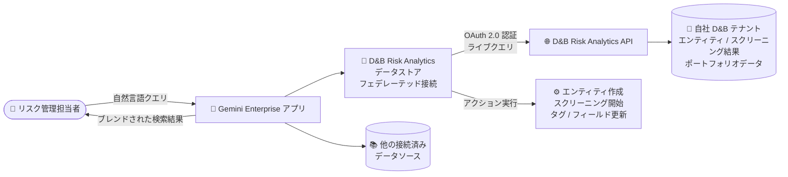

# Gemini Enterprise: D&B Risk Analytics データストアが GA

**リリース日**: 2026-09-22

**サービス**: Gemini Enterprise

**機能**: D&B Risk Analytics データストア (サードパーティ / カウンターパーティのリスク管理ワークフロー)

**ステータス**: GA (一般提供)

📊 [このアップデートのインフォグラフィックを見る](https://takech9203.github.io/google-cloud-news-summary/20260922-gemini-enterprise-dnb-risk-analytics-ga.html)

## 概要

Gemini Enterprise において、**D&B Risk Analytics データストア**が一般提供 (GA) になりました。D&B (Dun & Bradstreet) Risk Analytics は、取引先・サプライヤーのコンプライアンスおよびリスク管理を行うためのプラットフォームです。今回の GA により、自社の D&B Risk Analytics テナントに対して、Gemini Enterprise から**自然言語**でサードパーティ / カウンターパーティのリスク管理ワークフローを実行できるようになりました。

サポートされるワークフローには、KYB (Know Your Business) オンボーディング、カウンターパーティのデューデリジェンス、制裁リスト・PEP (重要な公的地位を有する者)・ネガティブニュース (adverse media) スクリーニング、サプライヤー / 財務リスク評価、UBO (実質的支配者) と所有関係のマッピングなどが含まれます。さらにこのデータストアは検索だけでなく**アクション**にも対応しており、エンティティの作成、スクリーニングの開始、タグやカスタムフィールドの更新といった書き込み操作も自然言語から実行できます。

このコネクタはフェデレーテッド (連合) 型で動作し、Gemini Enterprise は D&B Risk Analytics のデータを取り込み・インデックス化しません。クエリは実行時にテナントへ直接送信されるため、検索結果には常にクエリ時点の D&B Risk Analytics 側の権限が反映されます。コンプライアンス部門、調達部門、金融機関のリスク管理チームなど、取引先リスク評価を日常業務とするユーザーが主な対象です。

**アップデート前の課題**

- D&B Risk Analytics データストアは GA ではなく、本番ワークロードでの利用には Pre-GA 提供条件 (限定サポート、"as is" 提供) が適用されていた
- 取引先リスクの調査 (スクリーニング結果の確認、エンティティ詳細の参照など) には D&B Risk Analytics の専用 UI を直接操作する必要があり、社内の他のデータソースを横断した検索と統合されていなかった
- スクリーニングの開始やエンティティ登録などの操作を、チャットベースの業務フローから直接実行する手段がなかった

**アップデート後の改善**

- D&B Risk Analytics データストアが GA となり、SLA を含む本番運用を前提とした利用が可能になった
- KYB オンボーディング、デューデリジェンス、制裁 / ネガティブニュース スクリーニング、サプライヤー / 財務リスク評価などのワークフローを、Gemini Enterprise から自然言語で実行できるようになった
- エンティティ作成・スクリーニング開始・タグ / カスタムフィールド更新などの**アクション** (書き込み操作) にも対応し、調査から対応までを一つの会話型インターフェースで完結できるようになった
- フェデレーテッド検索により、他の接続済みデータソースの結果とブレンドした横断的な回答が得られるようになった

## アーキテクチャ図



ユーザーの自然言語クエリは Gemini Enterprise から D&B Risk Analytics API へライブで送信され (データの取り込み・インデックス化なし)、結果は他のデータソースとブレンドされて返されます。読み取りだけでなく、認可された書き込みアクションも実行できます。

## サービスアップデートの詳細

### 主要機能

1. **自然言語によるリスク管理ワークフロー**
   - KYB オンボーディング、カウンターパーティのデューデリジェンス、制裁・PEP・ネガティブニュース スクリーニング、サプライヤー / 財務リスク評価、UBO / 所有関係マッピングに対応
   - エンティティ詳細、スクリーニング結果、ポートフォリオデータを自社テナントのレコードから読み取り、質問に回答

2. **アクション (書き込み操作) のサポート**
   - エンティティの作成、スクリーニングの開始、タグやカスタムフィールドの更新といった認可済みの書き込み操作を自然言語から実行可能
   - 調査 (読み取り) から対応 (書き込み) までを会話型インターフェースで完結

3. **フェデレーテッド (連合) 検索**
   - Gemini Enterprise は D&B Risk Analytics のデータを取り込み・インデックス化せず、クエリを実行時に D&B Risk Analytics API へ直接送信
   - 結果はクロールされたコピーではなく、**クエリ時点の D&B Risk Analytics 側の権限**を反映
   - 他の接続済みデータソースの結果とブレンドして表示

4. **エンタープライズ向けセキュリティオプション**
   - us / eu ロケーションでは CMEK (顧客管理の暗号鍵、Cloud KMS) を選択可能
   - 静的 IP エグレスを有効化でき、接続元 IP を D&B 側でアローリスト登録可能

## 技術仕様

### コネクタの特性

| 項目 | 詳細 |
|------|------|
| 接続方式 | フェデレーテッド検索 (データの取り込み・インデックス化なし) |
| 認証 | D&B Risk Analytics から取得した OAuth 2.0 クライアント ID / シークレット (MCP エンドポイントとホストアドレスはプリセット、リフレッシュトークンは認可時に自動生成) |
| 検索対象エンティティ | D&B Risk Analytics Entity |
| 対応アクション | エンティティ作成、スクリーニング開始、タグ / カスタムフィールド更新 |
| 対応ロケーション | global、us、eu のみ |
| 暗号化 | Google 管理鍵、または Cloud KMS 鍵 (CMEK、us / eu 選択時) |
| ネットワーク | 静的 IP エグレスの有効化が可能 (ソース側でのアローリスト用) |
| 権限反映 | クエリ時点の D&B Risk Analytics テナント側権限を反映 |

### クエリ実行とデータの取り扱い

- クエリ文字列はサードパーティの検索バックエンド (D&B Risk Analytics API) に送信され、サードパーティがクエリをユーザーの ID と関連付ける可能性がある
- 複数のフェデレーテッド検索データソースが有効な場合、クエリはそれらすべてに送信されることがある
- 精度向上のため、LLM がクエリを書き換えてから送信することがあり、その際にセッションのクエリ履歴の一部が含まれる可能性がある
- サードパーティ側に届いたデータは、そのシステムの利用規約とプライバシーポリシーに従って扱われる

## 設定方法

### 前提条件

1. データストアを作成するユーザーに **Discovery Engine 編集者ロール** (`roles/discoveryengine.editor`) を付与する
2. D&B Risk Analytics から **OAuth 2.0 クライアント ID とクライアントシークレット**を取得する

### 手順

#### ステップ 1: データストアの作成

1. Google Cloud コンソールで **Gemini Enterprise** ページに移動し、プロジェクトを選択
2. ナビゲーションメニューで **Data stores** > **Create data store** をクリック
3. ソースで **D&B Risk Analytics** を検索して選択
4. 検索対象エンティティとして **D&B Risk Analytics Entity** を選択
5. (任意) Advanced options で **Enable Static IP Addresses** を選択し、送信元 IP を固定
6. マルチリージョン (global / us / eu)、コネクタ名、暗号化設定 (us / eu の場合は CMEK 選択可) を構成
7. 課金設定 (General pricing または Configurable pricing) を選択して **Create** をクリック

#### ステップ 2: アプリへの接続と認可

1. データストアのステータスが **Creating** から **Active** に変わったことを確認
2. 既存アプリに接続するか、新規アプリを作成して接続
3. クエリを実行する前に、Gemini Enterprise が D&B Risk Analytics にアクセスすることをユーザーが**認可** (OAuth) する

## メリット

### ビジネス面

- **リスク管理業務の効率化**: KYB オンボーディングやデューデリジェンスなどの定型調査を自然言語で実行でき、専用 UI の操作習熟が不要になる
- **調査から対応までの一気通貫**: スクリーニング結果の確認 (読み取り) と、スクリーニング開始やエンティティ登録 (書き込み) を同じ会話フローで完結できる
- **本番利用の安心感**: GA によりエンタープライズの本番コンプライアンスワークフローへの組み込みが現実的になった

### 技術面

- **データ複製が不要**: フェデレーテッド方式のためデータの取り込み・同期パイプラインが不要で、常に最新のテナントデータに基づいて回答される
- **権限の一貫性**: 結果にはクエリ時点の D&B Risk Analytics 側の権限がそのまま反映され、インデックスの権限同期ずれが発生しない
- **セキュリティオプション**: CMEK (us / eu)、静的 IP エグレスに対応し、エンタープライズのセキュリティ要件に適合しやすい

## デメリット・制約事項

### 制限事項

- 対応ロケーションは **global、us、eu のみ**
- 回答は自社テナントのレコードに基づくもので、公開 Web や D&B のグローバルデータベース全体からは回答されない
- 既存の D&B Risk Analytics データストアへの **VPC Service Controls 境界の適用は非対応**。VPC-SC を適用するには、データストアを削除して再作成する必要がある
- アプリの作成やデータストア追加の際は、アクションを持つデータストアは**単一のコネクタタイプにつき 1 つ**のみ関連付けることが推奨される

### 考慮すべき点

- クエリ文字列 (LLM による書き換えでセッション履歴の一部が含まれる可能性あり) がサードパーティに送信されるため、データガバナンス上の取り扱いを事前に確認する
- フェデレーテッド方式のため、応答は D&B Risk Analytics API の可用性・レイテンシに依存する
- 利用には D&B Risk Analytics のテナント契約と OAuth クライアントの発行が別途必要

## ユースケース

### ユースケース 1: 新規取引先の KYB オンボーディング

**シナリオ**: 調達部門が新しいサプライヤーとの契約前に、KYB チェックと制裁 / ネガティブニュース スクリーニングを実施する。

**実装例**:
```text
「サプライヤー『Example Trading GmbH』を新規エンティティとして登録し、
 制裁リストとネガティブニュースのスクリーニングを開始して。
 完了したらリスクスコアと所有構造 (UBO) を要約して」
```

**効果**: 専用 UI を往復せずに、エンティティ登録 → スクリーニング開始 → 結果要約までを 1 つの会話で完了でき、オンボーディングのリードタイムを短縮できる。

### ユースケース 2: 既存取引先ポートフォリオの定期デューデリジェンス

**シナリオ**: 金融機関のコンプライアンスチームが、カウンターパーティのポートフォリオに対して定期的なデューデリジェンスレビューを実施し、リスクの高い先にタグを付けて管理する。

**効果**: ポートフォリオデータやスクリーニング結果を自然言語で横断的に照会し、該当エンティティへのタグやカスタムフィールドの更新まで実行できるため、レビューサイクルの運用負荷を軽減できる。

## 料金

D&B Risk Analytics データストア自体の追加料金は公表されていません。利用には Gemini Enterprise のライセンス (エディション) が必要です。フルの データコネクタ エコシステムへのアクセスは Standard / Plus / Pay-as-you-go / Frontline エディションで提供されます (Business エディションは一部コネクタのみ)。データストア作成時には General pricing または Configurable pricing を選択します。

また、D&B Risk Analytics 側のテナント契約 (Dun & Bradstreet との契約) が別途必要です。

詳細は以下を参照してください。

- [Gemini Enterprise のエディション比較](https://docs.cloud.google.com/gemini/enterprise/docs/editions)
- [Gemini Enterprise のライセンス](https://docs.cloud.google.com/gemini/enterprise/docs/licenses)

## 利用可能リージョン

D&B Risk Analytics データストアは **global、us、eu** のマルチリージョンでのみサポートされます。

## 関連サービス・機能

- **Gemini Enterprise データコネクタ**: Jira、Salesforce、ServiceNow など多数のサードパーティコネクタと同じ枠組みで D&B Risk Analytics を接続でき、複数データソースの結果をブレンドして検索可能
- **Cloud KMS / CMEK**: us / eu ロケーションのデータストアで顧客管理の暗号鍵を利用可能
- **VPC Service Controls**: セキュリティ境界による保護に対応 (ただし既存データストアへの後付け適用は不可、再作成が必要)
- **IAM (Discovery Engine ロール)**: データストア作成には `roles/discoveryengine.editor` が必要
- **静的 IP エグレス**: 送信元 IP を固定し、D&B 側でのアローリスト運用に対応

## 参考リンク

- 📊 [インフォグラフィック](https://takech9203.github.io/google-cloud-news-summary/20260922-gemini-enterprise-dnb-risk-analytics-ga.html)
- [公式リリースノート](https://docs.cloud.google.com/release-notes#September_22_2026)
- [Connect D&B Risk Analytics (ドキュメント)](https://docs.cloud.google.com/gemini/enterprise/docs/connectors/d_b_risk_analytics)
- [Set up a D&B Risk Analytics data store](https://docs.cloud.google.com/gemini/enterprise/docs/connectors/d_b_risk_analytics/set-up-data-store)
- [Gemini Enterprise エディション比較](https://docs.cloud.google.com/gemini/enterprise/docs/editions)

## まとめ

D&B Risk Analytics データストアの GA により、取引先・サプライヤーのリスク管理ワークフロー (KYB、デューデリジェンス、スクリーニング、リスク評価) を Gemini Enterprise の自然言語インターフェースから本番運用で実行できるようになりました。フェデレーテッド方式のためデータ複製が不要で、権限もクエリ時点のテナント設定が反映されます。D&B Risk Analytics を利用中の組織は、OAuth クライアントを準備してデータストアを作成し、コンプライアンス業務の会話型ワークフロー化を検討することをおすすめします。VPC-SC が必要な場合はデータストア作成時からの適用が必要な点に注意してください。

---

**タグ**: Gemini Enterprise, D&B Risk Analytics, データコネクタ, フェデレーテッド検索, リスク管理, KYB, コンプライアンス, GA
