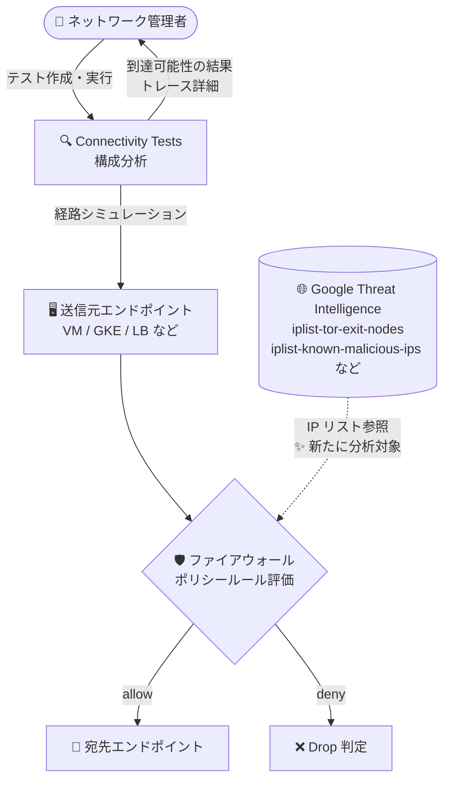

# Network Intelligence Center: Connectivity Tests が Google Threat Intelligence を使用するファイアウォールポリシールールの分析に対応

**リリース日**: 2026-09-22

**サービス**: Network Intelligence Center

**機能**: Connectivity Tests による Google Threat Intelligence ベースのファイアウォールポリシールール分析

**ステータス**: 一般提供 (GA)

📊 [このアップデートのインフォグラフィックを見る](https://takech9203.github.io/google-cloud-news-summary/20260922-network-intelligence-center-connectivity-tests-threat-intelligence.html)

## 概要

Network Intelligence Center の Connectivity Tests が、Google Threat Intelligence データを使用するファイアウォールポリシールールの分析に対応しました。Connectivity Tests はネットワークエンドポイント間の接続性を診断するツールで、VPC ネットワーク内のパケット転送経路をシミュレートして構成上の問題を検出します。今回のアップデートにより、この構成分析 (configuration analysis) が Google Threat Intelligence リストを参照するファイアウォールポリシールールを評価対象に含められるようになりました。

Google Threat Intelligence は、Tor 出口ノード、既知の悪意ある IP アドレス、検索エンジンクローラー、パブリッククラウドの IP アドレス範囲などのカテゴリ別 IP アドレスリストを提供する Cloud NGFW (Cloud Next Generation Firewall) の機能です。リストは Google により継続的に更新され、階層型ファイアウォールポリシー、グローバル / リージョナルネットワークファイアウォールポリシーのルールで送信元 (ingress) や宛先 (egress) のフィルタとして指定できます。

このアップデートは、Threat Intelligence リストを活用してセキュリティ境界を構築しているネットワーク管理者やセキュリティチームにとって、接続性トラブルシューティングの精度を高める重要な改善です。

**アップデート前の課題**

- Connectivity Tests の構成分析は Google Threat Intelligence リストを使用するファイアウォールポリシールールの評価に対応しておらず、これらのルールがトラフィックに与える影響をテスト結果から正確に把握できなかった
- Threat Intelligence ベースのルールで通信が許可 / 拒否されるかどうかを確認するには、ルールの内容を手動で確認したり、ファイアウォールルールロギングで実トラフィックを観測したりする必要があった
- Threat Intelligence リストを多用する環境では、Connectivity Tests の到達可能性判定 (Reachable / Drop) が実際のファイアウォール挙動と一致しない可能性があった

**アップデート後の改善**

- Connectivity Tests が Google Threat Intelligence リストを参照するファイアウォールポリシールールをシミュレーションに組み込み、該当ルールによる許可 / 拒否を分析結果に反映できるようになった
- Threat Intelligence ベースのルールが原因の接続問題を、テスト結果のトレースから特定できるようになり、トラブルシューティングが効率化された
- デプロイ前の構成検証において、Threat Intelligence ルールを含むファイアウォールポリシー全体の整合性を確認できるようになった

## アーキテクチャ図



Connectivity Tests がパケット経路をシミュレートする際に、Google Threat Intelligence リストを使用するファイアウォールポリシールールも評価対象となり、許可 / 拒否の判定がテスト結果に反映されます。

## サービスアップデートの詳細

### 主要機能

1. **Threat Intelligence ルールの構成分析対応**
   - Connectivity Tests の構成分析が、Google Threat Intelligence リストを送信元 / 宛先フィルタに使用するファイアウォールポリシールールを評価
   - シミュレートされたテストパケットが該当ルールで許可されるか拒否されるかをトレース結果で確認可能

2. **対応するファイアウォールポリシー**
   - Google Threat Intelligence リストは階層型ファイアウォールポリシー、グローバルネットワークファイアウォールポリシー、リージョナルネットワークファイアウォールポリシーで構成可能
   - ingress ルールでは送信元、egress ルールでは宛先として Threat Intelligence リストを指定

3. **継続更新されるリストに基づく分析**
   - Threat Intelligence リストは Google により継続的に更新されるため、追加の設定なしで最新の脅威情報に基づくルール評価が可能

## 技術仕様

### Google Threat Intelligence の主なリスト

| リスト名 | 内容 |
|------|------|
| `iplist-known-malicious-ips` | Web アプリケーション攻撃の発信元として既知の IP アドレス |
| `iplist-tor-exit-nodes` | Tor 出口ノードの IP アドレス |
| `iplist-search-engines-crawlers` | 検索エンジンクローラーの IP アドレス |
| `iplist-public-clouds` (aws / azure / gcp / google-services) | パブリッククラウドの IP アドレス範囲 (サブカテゴリあり) |
| `iplist-vpn-providers` | 低評価の VPN プロバイダの IP アドレス |
| `iplist-anon-proxies` | オープンな匿名プロキシの IP アドレス |
| `iplist-crypto-miners` | 暗号通貨マイニングサイトの IP アドレス |

### Connectivity Tests の分析概要

| 項目 | 詳細 |
|------|------|
| 分析方式 | 構成分析 (パケット経路のシミュレーション) と、一部シナリオでのライブデータプレーン分析 |
| API | Network Management API |
| 評価対象 | VPC ルート、VPC ファイアウォールルール、階層型 / グローバル / リージョナルネットワークファイアウォールポリシーなど |
| 判定 | 各リソースの構成を検証し、最終状態 (Deliver / Drop など) と全体の到達可能性を出力 |

## 設定方法

### 前提条件

1. Network Management API が有効化されていること
2. Connectivity Tests を実行する IAM 権限 (例: `networkmanagement.connectivitytests.*`) を持つこと
3. 分析対象のファイアウォールポリシールールで Google Threat Intelligence リストが構成されていること

### 手順

#### ステップ 1: Threat Intelligence リストを使用するルールの確認

```bash
# ファイアウォールポリシーのルールを確認
gcloud compute network-firewall-policies rules describe RULE_PRIORITY \
    --firewall-policy=POLICY_NAME \
    --global-firewall-policy
```

送信元 / 宛先に `iplist-*` 形式の Threat Intelligence リストが指定されているルールを確認します。

#### ステップ 2: Connectivity Test の作成と実行

```bash
# 接続テストを作成 (例: VM から外部 IP への egress)
gcloud network-management connectivity-tests create my-test \
    --source-instance=projects/PROJECT_ID/zones/ZONE/instances/SOURCE_VM \
    --destination-ip-address=DEST_IP \
    --destination-port=443 \
    --protocol=TCP

# テスト結果を確認
gcloud network-management connectivity-tests describe my-test
```

トレース結果に Threat Intelligence リストを使用するルールの評価が含まれ、許可 / 拒否の判定を確認できます。

## メリット

### ビジネス面

- **トラブルシューティング時間の短縮**: Threat Intelligence ルールが原因の接続問題を迅速に特定でき、障害対応や問い合わせ対応の工数を削減
- **セキュリティ運用の信頼性向上**: 脅威インテリジェンスに基づくルールが意図どおりに動作するかをデプロイ前に検証でき、設定ミスによるリスクを低減

### 技術面

- **分析カバレッジの拡大**: Connectivity Tests のシミュレーションが Threat Intelligence ルールを含むようになり、到達可能性判定の精度が向上
- **一貫した診断ワークフロー**: 通常のファイアウォールルールと Threat Intelligence ルールを同一のテストで評価でき、診断手順を統一可能

## デメリット・制約事項

### 制限事項

- Connectivity Tests の構成分析は Google Cloud リソースの構成情報に基づくシミュレーションであり、データプレーンの実際の状態を保証するものではない
- FQDN オブジェクトを使用するファイアウォールポリシールールは引き続き構成分析でサポートされない (該当ルールが影響し得る場合は警告が返される)
- Connectivity Tests は Google Cloud 外部のネットワーク (オンプレミス、他クラウド、インターネット上のホスト) の構成情報は持たない

### 考慮すべき点

- Threat Intelligence リストの内容は Google により継続的に更新されるため、テスト実行時点のリスト内容に基づく分析結果は時間の経過とともに変わる可能性がある
- ファイアウォールポリシールールのデバッグを容易にするため、1 つのルールに複数の Threat Intelligence リストを含めないことが推奨されている

## ユースケース

### ユースケース 1: Threat Intelligence ルールによる意図しない通信遮断の診断

**シナリオ**: パートナー企業のシステムから VPC 内のアプリケーションへの接続が失敗する。ファイアウォールポリシーには `iplist-public-clouds` を拒否する ingress ルールが構成されており、パートナーのシステムが他社クラウド上で稼働しているため遮断されている可能性がある。

**実装例**:
```bash
gcloud network-management connectivity-tests create partner-access-test \
    --source-ip-address=PARTNER_IP \
    --destination-instance=projects/PROJECT_ID/zones/ZONE/instances/APP_VM \
    --destination-port=443 \
    --protocol=TCP
```

**効果**: トレース結果から Threat Intelligence リストを使用するルールでの Drop 判定を確認でき、より高優先度の許可ルール (選択的許可) を追加する判断を迅速に行える。

### ユースケース 2: セキュリティポリシー変更前の影響確認

**シナリオ**: `iplist-tor-exit-nodes` と `iplist-known-malicious-ips` を拒否するルールを階層型ファイアウォールポリシーに追加する前に、正規のトラフィックへの影響がないかを確認したい。

**効果**: 主要な通信経路について Connectivity Tests を実行し、Threat Intelligence ルールを含むポリシー全体の評価結果を確認することで、本番適用前に設定の妥当性を検証できる。

## 料金

Connectivity Tests を含む Network Intelligence Center の料金の詳細は、公式の料金ページを参照してください。

- [Network Intelligence Center の料金](https://cloud.google.com/network-intelligence-center/pricing)

## 関連サービス・機能

- **Cloud NGFW (ファイアウォールポリシー)**: Google Threat Intelligence リストを構成するファイアウォールポリシー本体。階層型 / グローバル / リージョナルの各ポリシーで利用可能
- **ファイアウォールルールロギング**: ルール単位でのロギングにより、実トラフィックに対するルールの適用状況を確認可能。Connectivity Tests のシミュレーション結果と組み合わせて診断に活用
- **Network Management API**: Connectivity Tests のプログラマティックな実行に使用する API
- **Flow Analyzer / Performance Dashboard**: Network Intelligence Center の他モジュール。トラフィック分析や継続的なパフォーマンス監視を担い、Connectivity Tests の一時的な診断を補完

## 参考リンク

- 📊 [インフォグラフィック](https://takech9203.github.io/google-cloud-news-summary/20260922-network-intelligence-center-connectivity-tests-threat-intelligence.html)
- [公式リリースノート](https://docs.cloud.google.com/release-notes#September_22_2026)
- [Connectivity Tests の概要](https://docs.cloud.google.com/network-intelligence-center/docs/connectivity-tests/concepts/overview)
- [Google Threat Intelligence for firewall policy rules](https://docs.cloud.google.com/firewall/docs/threat-intelligence-overview)
- [ファイアウォールポリシールールのコンポーネント](https://docs.cloud.google.com/firewall/docs/firewall-policies-rule-details)
- [料金ページ](https://cloud.google.com/network-intelligence-center/pricing)

## まとめ

Connectivity Tests が Google Threat Intelligence を使用するファイアウォールポリシールールの分析に対応したことで、脅威インテリジェンスベースのセキュリティ制御を含むネットワーク構成の診断精度が向上しました。Threat Intelligence リストを活用している環境では、接続性トラブルシューティングや構成変更前の検証に Connectivity Tests を積極的に組み込むことを推奨します。

---

**タグ**: Network Intelligence Center, Connectivity Tests, Google Threat Intelligence, Cloud NGFW, ファイアウォール, ネットワーク診断, セキュリティ
