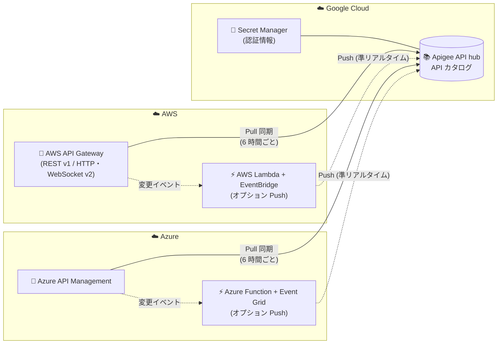

# Apigee API hub: AWS API Gateway / Azure API Management プラグイン (Preview)

**リリース日**: 2026-09-23

**サービス**: Apigee API hub

**機能**: AWS API Gateway および Azure API Management プラグインの Preview 提供開始

**ステータス**: Public Preview

📊 [このアップデートのインフォグラフィックを見る](https://takech9203.github.io/google-cloud-news-summary/20260923-apigee-api-hub-aws-azure-gateway-plugins.html)

## 概要

Apigee API hub に、サードパーティ API ゲートウェイから API メタデータを取り込むための 2 つの組み込みプラグイン、**AWS API Gateway プラグイン**と **Azure API Management (APIM) プラグイン**が Public Preview として追加されました。これにより、API hub のマルチクラウドガバナンス機能が拡張され、Google Cloud、AWS、Azure にまたがる API を「単一のガラス面 (single pane of glass)」で一元管理できるようになります。

両プラグインは、AWS アカウントや APIM サービスを接続するだけで既存のデプロイ済み API と関連メタデータを自動検出する「自動ディスカバリとオンボーディング」に対応しています。デフォルトでは 6 時間ごとのスケジュールされた Pull 同期 (upsert と孤立リソース削除によるリコンサイル付き) でカタログをソースゲートウェイと同期し、オプションで顧客管理の AWS Lambda 関数や Azure Function をデプロイすることで、コントロールプレーンの変更イベントをほぼリアルタイムで API hub に中継する Push 同期も利用できます。

複数のクラウドプロバイダーで API を運用している組織にとって、API カタログの統合、ガバナンスの一元化、API ポートフォリオの可視化を実現する重要なアップデートです。

**アップデート前の課題**

- API hub の組み込みサードパーティプラグインは Apigee Edge Public Cloud / Apigee Edge Private Cloud (OPDK) に限られており、AWS API Gateway や Azure API Management の API メタデータを取り込むには、カスタムプラグインを自作するか手動で API を登録する必要があった
- AWS / Azure 上の API 資産は Google Cloud 側のカタログから見えず、マルチクラウド環境での API ガバナンスやポートフォリオの可視化が分断されていた
- サードパーティゲートウェイ側の変更 (API の追加・削除・更新) をカタログへ反映する仕組みを独自に構築・運用する必要があった

**アップデート後の改善**

- AWS アカウントまたは APIM サービスを接続するだけで、デプロイ済み API とメタデータが自動検出・オンボーディングされるようになった
- 6 時間ごとの Pull 同期がデフォルトで実行され、upsert と孤立リソースの削除 (orphan deletes) によりカタログがソースゲートウェイと自動的に整合するようになった
- 顧客管理の AWS Lambda (Amazon EventBridge 連携) や Azure Function (Azure Event Grid 連携) をデプロイすることで、ほぼリアルタイムの Push 同期が可能になった (サンプルコードは apigee-samples リポジトリで提供)

## アーキテクチャ図



AWS API Gateway と Azure API Management の API メタデータは、デフォルトで 6 時間ごとの Pull 同期により API hub に取り込まれます。オプションで顧客管理の AWS Lambda / Azure Function を経由した準リアルタイムの Push 同期も構成でき、接続に必要な認証情報 (AWS Secret Access Key / Azure クライアントシークレット) は Google Cloud Secret Manager に保管されます。

## サービスアップデートの詳細

### 主要機能

1. **自動ディスカバリとオンボーディング**
   - AWS アカウントまたは Azure API Management (APIM) サービスを接続すると、API hub が既存のデプロイ済み API と関連メタデータを自動的に検出
   - プラグインインスタンスは API hub の [設定] > [プラグイン] ページから手動で作成・管理する

2. **スケジュールされた Pull 同期**
   - デフォルトで 6 時間ごとにフルメタデータ同期を実行
   - リコンサイル機能 (upsert と孤立リソースの削除) により、カタログをソースゲートウェイと常に整合させる

3. **オプションの準リアルタイム Push 同期**
   - AWS API Gateway: 顧客管理の AWS Lambda 関数を Amazon EventBridge と組み合わせてデプロイし、コントロールプレーンの変更イベントを API hub へ中継
   - Azure API Management: 顧客管理の Azure Function を Azure Event Grid と組み合わせてデプロイ
   - サンプルデプロイコードは [apigee-samples リポジトリ](https://github.com/GoogleCloudPlatform/apigee-samples/tree/main/apihub-plugins) で提供

### 取り込まれる API メタデータ

| プラグイン | 取り込まれるデータ |
|-----------|------------------|
| AWS API Gateway (Preview) | REST v1 および HTTP/WebSocket v2 API (バージョン、ステージ、デプロイメント、タグ、OpenAPI 仕様を含む) |
| Azure API Management (Preview) | APIM サービスの API (バージョン、オペレーション、仕様 (OpenAPI / WSDL / GraphQL / gRPC / OData)、ゲートウェイデプロイメント、プロダクト、タグを含む) |

## 技術仕様

### プラグインタイプとデータ取り込み方式

| 項目 | 詳細 |
|------|------|
| プラグイン種別 | サードパーティプラグイン (API hub 組み込み、[設定] > [プラグイン] ページから利用) |
| Pull 同期 | デフォルトの取り込み方式。6 時間ごとにフル同期し、upsert / 孤立リソース削除でリコンサイル |
| Push 同期 | オプション。顧客管理の AWS Lambda (EventBridge 経由) / Azure Function (Event Grid 経由) で変更イベントを準リアルタイム中継 |
| GatewayType | API hub API の `GatewayType` enum に `AWS_API_GATEWAY` と `AZURE_API_MANAGEMENT` が追加 |
| リリースステージ | Public Preview |

### 必要な IAM 権限 (プラグインインスタンス管理)

| 権限 | 用途 |
|------|------|
| `apihub.plugininstances.create` | プラグインインスタンスの作成 |
| `apihub.plugininstances.delete` | プラグインインスタンスの削除 |
| `apihub.plugininstances.get` | プラグインインスタンスの取得 |
| `apihub.plugininstances.list` | プラグインインスタンスの一覧表示 |

## 設定方法

### 前提条件

**AWS API Gateway プラグインの場合:**

1. API Gateway への読み取り専用アクセス権を持つ専用の AWS IAM ユーザーを作成し、そのユーザーのアクセスキーを生成する
2. AWS Secret Access Key を Google Cloud Secret Manager に保管し、API hub サービスエージェント (P4SA) にそのシークレットへの `roles/secretmanager.secretAccessor` ロールを付与する

**Azure API Management プラグインの場合:**

1. 専用の Microsoft Entra サービスプリンシパルを作成し、対象の APIM サービスにスコープを限定した組み込みロール「API Management Service Reader」のみを割り当てる
2. Azure クライアントシークレットを Google Cloud Secret Manager に保管し、API hub サービスエージェント (P4SA) に `roles/secretmanager.secretAccessor` ロールを付与する

### 手順

#### ステップ 1: プラグインインスタンスの作成

API hub の [設定] > [プラグイン] ページから、AWS API Gateway または Azure API Management プラグインのインスタンスを作成し、接続情報 (AWS アカウント / APIM サービス、Secret Manager のシークレット参照) を構成します。詳細は [Create a plugin instance](https://docs.cloud.google.com/apigee/docs/apihub/create-plugin-instances) を参照してください。

#### ステップ 2: (オプション) 準リアルタイム Push 同期の構成

```bash
# サンプルコードの取得
git clone https://github.com/GoogleCloudPlatform/apigee-samples.git
# AWS API Gateway 用: apihub-plugins/aws/apigateway
# Azure APIM 用:      apihub-plugins/azure/apim
```

サンプルに含まれる手順に従い、AWS Lambda 関数 (Amazon EventBridge 連携) または Azure Function (Azure Event Grid 連携) をデプロイして、コントロールプレーンの変更イベントを API hub へ中継します。

## メリット

### ビジネス面

- **マルチクラウド API ガバナンスの一元化**: Google Cloud、AWS、Azure にまたがる API 資産を単一のカタログで可視化・管理でき、ガバナンスポリシーやライフサイクル管理を統一できる
- **運用負荷の削減**: 自動ディスカバリと定期同期により、手動登録やカスタム連携基盤の構築・保守が不要になる

### 技術面

- **カタログ整合性の自動維持**: 6 時間ごとの Pull 同期がリコンサイル (upsert / 孤立リソース削除) を行うため、ソースゲートウェイ側の変更や削除がカタログに正しく反映される
- **柔軟な同期方式の選択**: 標準の Pull 同期に加え、必要に応じて Push 同期を追加して準リアルタイムの鮮度を確保できる
- **最小権限での接続**: AWS 側は読み取り専用 IAM ユーザー、Azure 側はスコープ限定の API Management Service Reader ロールのみで接続でき、シークレットは Secret Manager で安全に管理される

## デメリット・制約事項

### 制限事項

- 両プラグインとも Public Preview 段階であり、GA 前の機能は SLA の対象外で、後方互換性のない変更が行われる可能性がある
- Pull 同期のデフォルト間隔は 6 時間であり、それより高い鮮度が必要な場合は Push 同期用の Lambda / Function を顧客側でデプロイ・運用する必要がある

### 考慮すべき点

- Push 同期に使用する AWS Lambda / Azure Function は顧客管理コンポーネントであり、そのデプロイ・監視・コスト (AWS / Azure 側の課金) は利用者側の責任となる
- AWS IAM ユーザーのアクセスキーや Azure クライアントシークレットのローテーションなど、クレデンシャル管理の運用設計が必要
- Secret Manager のシークレットに対して API hub サービスエージェント (P4SA) への適切なロール付与が前提となる

## ユースケース

### ユースケース 1: マルチクラウド環境の API カタログ統合

**シナリオ**: 買収や部門ごとのクラウド選定により、API が Apigee、AWS API Gateway、Azure API Management に分散している企業が、全社の API ポートフォリオを一元的に把握したい。

**実装例**:
```
1. API hub をプロビジョニングし、Apigee ランタイムプロジェクトをアタッチ (Google Cloud API の自動登録)
2. AWS API Gateway プラグインインスタンスを作成 (読み取り専用 IAM ユーザー + Secret Manager)
3. Azure API Management プラグインインスタンスを作成 (Entra サービスプリンシパル + Secret Manager)
4. 6 時間ごとの Pull 同期で 3 クラウドの API カタログを自動維持
```

**効果**: 全クラウドの API を単一のカタログで検索・分類・ガバナンスでき、重複 API の発見や標準化の推進が容易になる。

### ユースケース 2: 変更の多いゲートウェイの準リアルタイム同期

**シナリオ**: CI/CD で AWS API Gateway のステージやデプロイメントが頻繁に更新される環境で、API カタログの鮮度を最大限保ちたい。

**効果**: apigee-samples のサンプルコードをもとに AWS Lambda + Amazon EventBridge の Push 連携をデプロイすることで、コントロールプレーンの変更がほぼリアルタイムで API hub に反映され、6 時間の同期間隔を待つ必要がなくなる。

## 料金

API hub 自体は無料のサービスとして提供されています (2025 年 7 月のリリースノートで「API hub remains a free service」と明記)。ただし、以下のコストが別途発生し得る点に注意してください。

- Push 同期用の AWS Lambda / Azure Function の実行コスト (AWS / Azure 側の課金)
- Google Cloud Secret Manager の利用料金

詳細は [Apigee 料金ページ](https://cloud.google.com/apigee/pricing) を参照してください。

## 利用可能リージョン

API hub がサポートされるリージョンで利用できます。詳細は [API hub のロケーション](https://docs.cloud.google.com/apigee/docs/apihub/locations) を参照してください。

## 関連サービス・機能

- **Apigee / Apigee hybrid**: Google Cloud プラグインとして自動的に API メタデータが API hub に登録される。今回のプラグインにより AWS / Azure の API と併せて一元管理が可能
- **Secret Manager**: AWS Secret Access Key や Azure クライアントシークレットの保管先。API hub サービスエージェントへの `roles/secretmanager.secretAccessor` 付与が必要
- **Apigee Edge Public Cloud / Private Cloud (OPDK) プラグイン**: 既存のサードパーティプラグイン。今回のアップデートでサードパーティプラグインのラインナップが AWS / Azure に拡大
- **カスタムプラグイン**: 今回のプラグインでカバーされないオンプレミスや他のゲートウェイと接続する場合の選択肢

## 参考リンク

- 📊 [インフォグラフィック](https://takech9203.github.io/google-cloud-news-summary/20260923-apigee-api-hub-aws-azure-gateway-plugins.html)
- [公式リリースノート](https://docs.cloud.google.com/release-notes#September_23_2026)
- [About plugins (プラグインについて)](https://docs.cloud.google.com/apigee/docs/apihub/plugins)
- [Manage third-party plugins (サードパーティプラグインの管理)](https://docs.cloud.google.com/apigee/docs/apihub/manage-third-party-plugins)
- [Create a plugin instance (プラグインインスタンスの作成)](https://docs.cloud.google.com/apigee/docs/apihub/create-plugin-instances)
- [apigee-samples: apihub-plugins (Push 同期サンプルコード)](https://github.com/GoogleCloudPlatform/apigee-samples/tree/main/apihub-plugins)
- [プロダクトのリリースステージ](https://cloud.google.com/products#product-launch-stages)
- [Apigee 料金ページ](https://cloud.google.com/apigee/pricing)

## まとめ

AWS API Gateway と Azure API Management のプラグインが Preview で提供されたことで、Apigee API hub はマルチクラウド API ガバナンスの「単一のガラス面」としての価値が大きく高まりました。複数クラウドで API を運用している組織は、読み取り専用の認証情報と Secret Manager の設定だけで既存 API 資産の自動カタログ化を試せるため、まずは Preview 環境での検証を推奨します。鮮度要件が高い場合は、apigee-samples の Push 同期サンプルの活用も検討してください。

---

**タグ**: Apigee API hub, AWS API Gateway, Azure API Management, マルチクラウド, API ガバナンス, プラグイン, Preview
