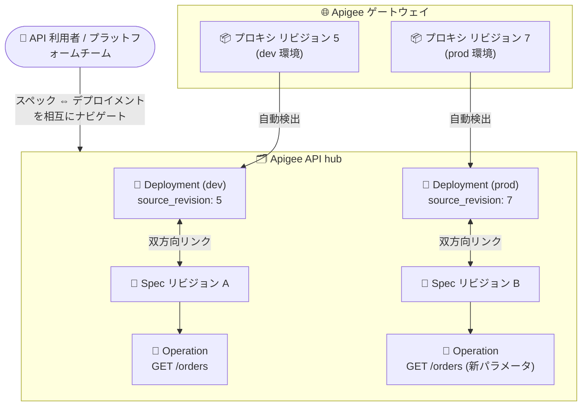

# Apigee API hub: スペックとデプロイメントの双方向リンクおよびゲートウェイリビジョン追跡 (GA)

**リリース日**: 2026-09-23

**サービス**: Apigee API hub

**機能**: Spec-to-deployment linkage and gateway revision tracking (スペックとデプロイメントの双方向リンク・ゲートウェイリビジョン追跡)

**ステータス**: GA (一般提供)

📊 [このアップデートのインフォグラフィックを見る](https://takech9203.github.io/google-cloud-news-summary/20260923-apigee-api-hub-spec-deployment-linkage-ga.html)

## 概要

Apigee API hub において、API 仕様 (スペック)・API オペレーション・デプロイメントの間をファーストクラスの双方向リンクで結び付ける機能と、基盤となるゲートウェイリビジョンをネイティブに追跡する機能が GA (一般提供) になりました。特定のデプロイメントがどの API 仕様・オペレーションを提供しているかを直接確認でき、逆にスペックからそれを提供するデプロイメントへナビゲートすることも可能になります。

あわせて、Deployment リソースに新しい `source_revision` フィールドが追加され、デプロイメントの基盤となるゲートウェイ構成のリビジョン (例: Apigee プロキシリビジョン番号) が自動的に取得・表示されるようになりました。API ポートフォリオのガバナンスを担うプラットフォームチームや、API の検索・評価を行う開発者にとって、「どの環境で、どのリビジョンの、どの仕様が動いているか」を API hub 上で正確に把握できるようになる重要なアップデートです。

**アップデート前の課題**

このアップデート以前は、スペックとデプロイメントの関連付けに次のような制限がありました。

- スペックとデプロイメントの間に直接的なリンクがなく、特定のデプロイメントがどの API 仕様・オペレーションを提供しているかを直接確認できなかった
- デプロイメントの基盤となるゲートウェイリビジョン (Apigee プロキシリビジョンなど) を API hub 上でネイティブに追跡する手段がなかった
- 複数のリビジョンが同一のオペレーション (同じメソッドとパス) を公開している場合、重複としてドロップされ、オペレーションを個別のスペックに正確に対応付けられなかった
- 異なる環境にデプロイされた同一 API について、同じスペックの複数リビジョンを保持できなかった

**アップデート後の改善**

今回の GA により、以下が可能になりました。

- **スペックとデプロイメントの直接的な可視性**: 特定のデプロイメントが提供する API 仕様とオペレーションを正確に確認でき、スペックからそれを提供するデプロイメントへ双方向にナビゲートできるようになった
- **ネイティブなゲートウェイリビジョン追跡**: Deployment リソースの新フィールド `source_revision` により、基盤となるゲートウェイリビジョン (例: Apigee プロキシリビジョン) が取得・表示されるようになった
- **より正確なオペレーション解決**: 複数リビジョンが重複するオペレーションを公開する場合でも、重複を破棄せず、各オペレーションを対応する個別のスペックに関連付けるようになった
- **API あたり複数のスペックリビジョン**: 異なる環境にまたがってデプロイされた API について、同じスペックの複数リビジョンを API hub に保存できるようになった

## アーキテクチャ図



Apigee プロキシの各リビジョンが API hub のデプロイメントとして自動検出され、`source_revision` にリビジョン番号が記録されます。デプロイメントとスペック (リビジョン単位) が双方向にリンクされ、重複するオペレーションもそれぞれのスペックに正確に関連付けられます。

## サービスアップデートの詳細

### 主要機能

1. **スペックとデプロイメント間の直接的な可視性**
   - 特定のデプロイメントがどの API 仕様・オペレーションを提供しているかを直接確認できる
   - スペック側からも、それを提供しているデプロイメントの一覧へナビゲートできる (双方向リンク)
   - Deployment リソースに出力専用フィールド `specs[]` (デプロイメントに直接リンクされたスペック) と `apiOperations[]` (直接リンクされた API オペレーション) が提供される

2. **ネイティブなゲートウェイリビジョン追跡 (`source_revision`)**
   - Deployment リソースに新フィールド `source_revision` が追加され、そのデプロイメントが提供する基盤ゲートウェイ構成のリビジョン識別子を保持する
   - Apigee 系ゲートウェイの場合、デプロイメントの検出時にプロキシリビジョン番号が自動的に設定される

3. **より正確なオペレーション解決**
   - 複数のリビジョンが同じメソッドとパスのオペレーションを公開する場合、従来のように重複を破棄せず、各オペレーションをそれぞれの固有のスペックに関連付ける
   - リビジョン間の API 差分 (パラメータ追加など) を正確に追跡できる

4. **API あたり複数のスペックリビジョンの保持**
   - 異なる環境 (dev / staging / prod など) にデプロイされた同一 API について、同じスペックの複数リビジョンを API hub に保存できる
   - 1 つのデプロイメントが複数のスペックを提供するケース (基盤ゲートウェイ構成の異なるリビジョンにまたがる場合など) にも対応

## 技術仕様

### Deployment リソースの関連フィールド

| フィールド | 種別 | 説明 |
|------|------|------|
| `sourceRevision` | Optional (Apigee 系は自動設定) | デプロイメントが提供する基盤ゲートウェイ構成のリビジョン識別子。Apigee 系ゲートウェイでは検出時にプロキシリビジョン番号が自動的に設定される |
| `specs[]` | Output only | このデプロイメントに直接リンクされたスペック。1 つのデプロイメントが複数のスペックを提供する場合がある |
| `apiOperations[]` | Output only | このデプロイメントに直接リンクされた API オペレーション |
| `sourceProject` | Optional | デプロイメントが属するプロジェクト (Google Cloud ゲートウェイの場合はプロジェクト ID、Edge/OPDK の場合は組織 ID) |
| `sourceEnvironment` | Optional | デプロイメント元の環境 (例: prod、dev、staging) |

### Deployment リソースの JSON 表現 (抜粋)

```json
{
  "name": "projects/HUB_PROJECT/locations/HUB_LOCATION/deployments/DEPLOYMENT_ID",
  "displayName": "orders-api (prod)",
  "sourceProject": "my-apigee-project",
  "sourceEnvironment": "prod",
  "specs": [
    "projects/HUB_PROJECT/locations/HUB_LOCATION/apis/orders/versions/v1/specs/openapi"
  ],
  "apiOperations": [
    "projects/HUB_PROJECT/locations/HUB_LOCATION/apis/orders/versions/v1/operations/get-orders"
  ],
  "sourceRevision": "7"
}
```

## 設定方法

### 前提条件

1. API hub がプロビジョニング済みであること (Apigee 組織では対応リージョンで自動的に有効化される)
2. Apigee プロキシの自動登録を利用する場合は、Apigee / Apigee hybrid ランタイムプロジェクトが API hub にアタッチされていること

### 手順

#### ステップ 1: デプロイメントの詳細を取得してリンク情報を確認

```bash
curl "https://apihub.googleapis.com/v1/projects/HUB_PROJECT/locations/HUB_LOCATION/deployments/DEPLOYMENT_ID" \
  -H "Authorization: Bearer $(gcloud auth print-access-token)" \
  -X GET -H "Content-Type: application/json"
```

レスポンスの `specs[]`、`apiOperations[]`、`sourceRevision` フィールドで、デプロイメントが提供するスペック・オペレーションと基盤ゲートウェイリビジョンを確認できます。Apigee プロキシとして自動検出されたデプロイメントでは、`sourceRevision` にプロキシリビジョン番号が自動的に設定されます。

#### ステップ 2: コンソールでスペックとデプロイメントを相互にナビゲート

Google Cloud コンソールの **API hub** ページで **APIs** を選択し、対象 API の **Deployments** タブからデプロイメントの詳細を表示すると、そのデプロイメントが提供するスペックとオペレーションを確認できます。逆に、スペックの詳細ページからそのスペックを提供するデプロイメントへ移動することもできます。

## メリット

### ビジネス面

- **ガバナンスの強化**: 「どの環境で、どのリビジョンの、どの API 仕様が実際に動いているか」を単一の場所で正確に把握でき、API ポートフォリオの監査やコンプライアンス確認が容易になる
- **トラブルシューティングの迅速化**: 障害発生時に、影響を受けるデプロイメントから該当スペック・オペレーションを即座に特定でき、原因調査の時間を短縮できる

### 技術面

- **双方向のトレーサビリティ**: スペック → デプロイメント、デプロイメント → スペックの両方向のナビゲーションにより、API の実態と設計ドキュメントの対応関係を機械的に追跡できる
- **リビジョン単位の正確なカタログ**: `source_revision` と複数スペックリビジョンの保持により、環境ごとに異なるリビジョンが稼働する現実的な運用形態を正確にモデル化できる
- **重複オペレーションの正確な解決**: 同一メソッド・パスのオペレーションが複数リビジョンに存在してもドロップされなくなり、カタログの網羅性と正確性が向上する

## デメリット・制約事項

### 考慮すべき点

- `sourceRevision` の自動設定は Apigee 系ゲートウェイのデプロイメント検出時に行われる。その他のゲートウェイや手動登録のデプロイメントでは、必要に応じて任意 (Optional) フィールドとして自分で設定する必要がある
- `specs[]` と `apiOperations[]` は出力専用 (Output only) フィールドであり、直接編集はできない。リンクはスペックの登録・パースやデプロイメントの検出を通じて構成される
- Apigee プロキシの自動登録スケジューラは約 6 時間ごとに実行されるため、ゲートウェイ側の変更が API hub に反映されるまでにタイムラグが生じる場合がある

## ユースケース

### ユースケース 1: 環境ごとに異なるリビジョンが稼働する API の可視化

**シナリオ**: 注文管理 API が dev 環境ではプロキシリビジョン 5 (新パラメータ追加済みのスペック)、prod 環境ではリビジョン 7 (安定版スペック) で稼働している。プラットフォームチームは各環境で実際に提供されている API 仕様を正確に把握したい。

**実装例**:
```bash
# 全デプロイメントを一覧し、環境とリビジョンを確認
curl "https://apihub.googleapis.com/v1/projects/HUB_PROJECT/locations/HUB_LOCATION/deployments" \
  -H "Authorization: Bearer $(gcloud auth print-access-token)" \
  -X GET -H "Content-Type: application/json"
```

**効果**: 各デプロイメントの `sourceEnvironment` と `sourceRevision`、リンクされた `specs[]` を突き合わせることで、環境ごとの稼働リビジョンとスペックの対応を一目で把握できる。

### ユースケース 2: API 変更の影響範囲調査

**シナリオ**: あるオペレーション (`GET /orders`) の仕様変更を検討しており、そのオペレーションを含むスペックがどのデプロイメント (どの環境・リビジョン) で提供されているかを調べたい。

**効果**: スペックからデプロイメントへの双方向リンクをたどることで、変更の影響を受ける環境とゲートウェイリビジョンを漏れなく特定でき、リリース計画の精度が向上する。

## 料金

Apigee API hub は、対応リージョンを Apigee Analytics リージョンとして選択した Apigee 組織 (hybrid 含む) で追加費用なしで有効化されます。詳細は料金ページを参照してください。

- [Apigee 料金ページ](https://cloud.google.com/apigee/pricing)

## 利用可能リージョン

API hub は米州 (us-central1、us-east4 など)、欧州 (europe-west1、europe-west3 など)、アジア太平洋 (asia-northeast1 (東京)、asia-northeast2 (大阪) など)、中東、アフリカの多数のリージョンでプロビジョニング可能です。最新のリスト は [API hub locations](https://docs.cloud.google.com/apigee/docs/apihub/locations) を参照してください。

## 関連サービス・機能

- **Apigee / Apigee hybrid**: ランタイムプロジェクトを API hub にアタッチすると、API プロキシが自動登録され、今回の機能によりプロキシリビジョンが `source_revision` として自動追跡される
- **API hub 自動登録 (Auto-register Apigee proxies)**: 約 6 時間ごとのスケジューラで Apigee プロジェクトから最新のプロキシ定義を取得し、デプロイメントとしてカタログに反映する
- **API hub セマンティック検索**: Vertex AI ベースの検索機能により、リンクされたスペック・オペレーション・デプロイメントを自由形式のテキストで横断的に検索できる
- **AWS API Gateway / Azure API Management プラグイン (Preview)**: 同日に発表されたサードパーティゲートウェイ取り込みプラグインと組み合わせることで、マルチクラウドの API を単一のカタログでガバナンスできる

## 参考リンク

- 📊 [インフォグラフィック](https://takech9203.github.io/google-cloud-news-summary/20260923-apigee-api-hub-spec-deployment-linkage-ga.html)
- [公式リリースノート](https://docs.cloud.google.com/release-notes#September_23_2026)
- [Apigee API hub リリースノート](https://docs.cloud.google.com/apigee/docs/apihub/release-notes)
- [What is Apigee API hub?](https://docs.cloud.google.com/apigee/docs/apihub/what-is-api-hub)
- [Manage deployments (デプロイメントの管理)](https://docs.cloud.google.com/apigee/docs/apihub/manage-api-deployments)
- [Deployment リソースリファレンス (REST API)](https://docs.cloud.google.com/apigee/docs/reference/apis/apihub/rest/v1/projects.locations.deployments)
- [API hub locations](https://docs.cloud.google.com/apigee/docs/apihub/locations)
- [料金ページ](https://cloud.google.com/apigee/pricing)

## まとめ

このアップデートにより、API hub は「設計ドキュメント (スペック) と実際の稼働状態 (デプロイメント・ゲートウェイリビジョン) の対応」をネイティブかつ双方向に追跡できる、より実運用に即した API カタログへと進化しました。Apigee を利用中の組織は、自動登録されたデプロイメントの `source_revision` とスペックリンクを確認し、環境ごとの API ガバナンスやリリース影響調査のワークフローに組み込むことを推奨します。

---

**タグ**: Apigee, API hub, API ガバナンス, API カタログ, GA, デプロイメント, API 仕様
