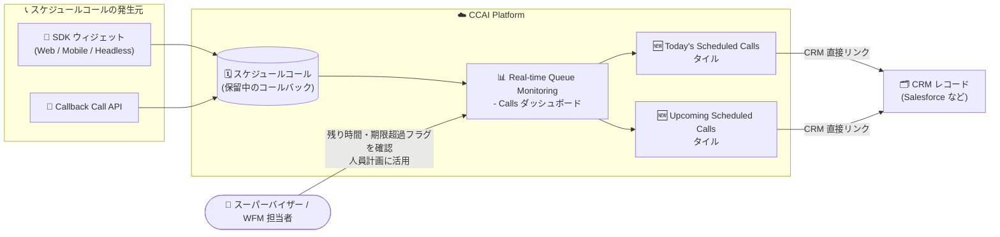

# Google Cloud Contact Center as a Service (CCaaS): アドバンストレポートダッシュボード 6.14 プレリリースノート

**リリース日**: 2026-09-23

**サービス**: Google Cloud Contact Center as a Service (CCaaS) / CCAI Platform

**機能**: アドバンストレポートダッシュボード 6.14 (プレリリース) - スケジュールコール可視化タイルの追加とレポーティング修正

**ステータス**: プレリリース (Announcement / Feature / Fixed)

📊 [このアップデートのインフォグラフィックを見る](https://takech9203.github.io/google-cloud-news-summary/20260923-ccaas-advanced-reporting-dashboards-6-14.html)

## 概要

Google Cloud CCaaS (CCAI Platform) のアドバンストレポートダッシュボードについて、バージョン 6.14 のプレリリースノートが公開されました。プレリリースノートは、今後リリース予定のレポーティング機能を事前に告知するもので、実際にリリースされるバージョン番号は 6.14 より大きくなる可能性があると案内されています。

今回の目玉は、**Real-time Queue Monitoring - Calls ダッシュボードへの 2 つの新タイル「Today's Scheduled Calls」と「Upcoming Scheduled Calls」の追加**です。これらのタイルは、許可されたスケジューリングウィンドウ全体にわたる保留中のスケジュールコール (予約済みコールバック) を、作成時期にかかわらず表示します。各スケジュールコールについて、コール実施までの残り時間、期限超過フラグ、スケジュールコールへの直接の CRM リンクといった実用的な詳細情報が提供され、スーパーバイザーは保留中のコールバックの全スケジュールを見渡して人員計画に活用できます。

また、リアルタイムエージェントダッシュボードの読み込み・更新遅延の解消や、Queue Group / Queue Name フィルタが過去のキュー割り当てを含めてエージェント数を過大にカウントしていた問題の修正など、レポーティングの精度とパフォーマンスに関わる多数の修正が含まれています。コンタクトセンターの運用管理者やワークフォースマネジメント (WFM) 担当者にとって重要なアップデートです。

**アップデート前の課題**

- Real-time Queue Monitoring - Calls ダッシュボードには保留中のスケジュールコールを一覧できるタイルがなく、コールバックの全体像を踏まえた人員計画が立てにくかった
- スケジュールコールが作成から 12 時間経過するとリアルタイムダッシュボードから消えてしまい、今後のスケジュールコール総数が過小にカウントされていた
- リアルタイムエージェントダッシュボードの読み込み・更新に遅延が発生していた
- Queue Group / Queue Name フィルタが現在のキュー割り当てだけでなく過去の割り当ても含めてしまい、エージェント数が実際より多く表示されていた
- 必須の後処理 (After-Call Work) 中のエージェントが「Wrap-up」ではなく「In-Call」として誤分類されていた
- raw データエクスポートで非効率なデータベースクエリによる性能劣化があり、`call_recordings` エクスポートの `url` フィールドに録音 URL ではなくタイムスタンプが入っていた

**アップデート後の改善**

- 「Today's Scheduled Calls」「Upcoming Scheduled Calls」タイルにより、保留中のスケジュールコールを残り時間・期限超過フラグ・CRM リンク付きで一覧でき、人員計画に活用できるようになった
- スケジュールコールが 12 時間で消える問題が修正され、今後のスケジュールコール数が正確にカウントされるようになった
- リアルタイムエージェントダッシュボードの読み込み・更新遅延が解消された
- Queue Group / Queue Name フィルタが現在のキュー割り当てのみを対象とし、正確なエージェント数が表示されるようになった
- エージェントステータスの分類が正確になり、「In-Call」と「Wrap-up」がライブモニタリング上で正しく区別されるようになった
- raw データエクスポートの性能が改善され、`call_recordings` の `url` フィールドが正しい録音 URL を返すようになった (タイムスタンプは新設の `updated_at` フィールドへ移動)

## アーキテクチャ図



SDK ウィジェットや Callback Call API から作成されたスケジュールコールが、新しい 2 つのタイルを通じてリアルタイムダッシュボード上で可視化され、スーパーバイザーは CRM リンクから各スケジュールコールの詳細へ直接アクセスできます。

## サービスアップデートの詳細

### 主要機能

1. **Today's Scheduled Calls タイル (新規)**
   - Real-time Queue Monitoring - Calls ダッシュボードに追加された新タイル
   - 当日の保留中スケジュールコールを、作成時期にかかわらず表示
   - コール実施までの残り時間、期限超過 (Overdue) フラグ、スケジュールコールへの直接 CRM リンクを提供

2. **Upcoming Scheduled Calls タイル (新規)**
   - 許可されたスケジューリングウィンドウ全体にわたる、今後の保留中スケジュールコールを表示
   - 保留中コールバックの全スケジュールを見渡すことができ、先々の人員配置計画 (スタッフィング) に活用できる

3. **リアルタイムダッシュボードのパフォーマンス修正**
   - リアルタイムエージェントダッシュボードの読み込み・更新時に発生していた遅延を修正
   - 多数のエージェントを表示した際に Agents モニタリングページが応答しなくなり、他ページへの遷移が著しく遅くなる問題を修正

4. **フィルタとカウント精度の修正**
   - Queue Group / Queue Name フィルタが過去のキュー割り当てを含めてエージェント数を過大にカウントしていた問題を修正 (現在の割り当てのみを対象とするよう変更)
   - Queue Group フィルタの結果で、特定のキューが誤ってマッピングされたり完全に欠落したりする問題を修正

### その他の修正 (6.14 プレリリースに含まれる修正)

- Real-time Agent Monitoring ダッシュボードの Live Agent Data テーブルで、`Is Inbound Call` / `Is Inbound Chat` 列の値が反転していた (インバウンドに No、アウトバウンドに Yes と表示) 問題を修正。あわせて、インタラクション方向の定義を全レポートで標準化し、API 発信コール・スケジュールコールバック・直接着信の分類とフィルタリングを正確化。タイムゾーン表記、方向別 CSAT の集計、新しいコールタイプのキュー時間トラッキングも改善
- Queued Calls タイルの Queue Time 列で、応答・転送後にキューへ再投入されたコールの待ち時間が過大に表示される問題を修正
- 必須の後処理中のエージェントが「In-Call」と誤分類されていた問題を修正 (「In-Call」件数が減少し「Wrap-up」件数が増加する。ダッシュボード表示のみの変更で、ルーティングや過去データには影響なし)
- Real-time Channel Performance ダッシュボードで、最近アクティビティのないキューやフィルタに一致するキューがない場合に SLA Target が空欄になる問題を修正
- Missed Interactions ダッシュボードで、拒否されたコールの二重カウントと、エージェント応答時間アラートの誤包含による見逃しチャット数の過大計上を修正 (チャット数は減少、平均見逃しチャット時間は増加する見込み)
- Look のコールキューメトリクスで Subtotals オプションを選択するとエラーになる問題を修正
- ダウンロード可能なコール・チャット履歴レポートで、フランス語のコールが英語のキュー名で表示される問題を修正
- スケジュールコールが作成から 12 時間後にリアルタイムダッシュボードから消え、今後のスケジュールコール総数が過小カウントされる問題を修正
- アドバンストレポートダッシュボードのエージェント・チームデータのフィルタオプションが、ユーザーに割り当てられた権限で正しくスコープされていなかった問題を修正
- raw データエクスポートの問題を修正: 非効率なデータベースクエリによる性能劣化を解消。`call_recordings` エクスポートの `url` フィールドが録音 URL ではなくタイムスタンプを含んでいた問題を修正し、タイムスタンプは新設の `updated_at` フィールドへ移動

## 技術仕様

### 新タイルの表示情報

| 項目 | 詳細 |
|------|------|
| 対象ダッシュボード | Real-time Queue Monitoring - Calls |
| 新タイル | Today's Scheduled Calls / Upcoming Scheduled Calls |
| 表示対象 | 許可されたスケジューリングウィンドウ内の保留中スケジュールコール (作成時期を問わない) |
| コールごとの詳細 | コール実施までの残り時間、期限超過フラグ、スケジュールコールへの直接 CRM リンク |
| ダッシュボード更新間隔 | デフォルトで 60 秒ごとに自動更新 (Real-time Queue Monitoring ダッシュボード共通) |

### call_recordings エクスポートのスキーマ変更

| フィールド | 変更前 | 変更後 |
|-----------|--------|--------|
| `url` | タイムスタンプが誤って格納 | 正しい録音 URL を格納 |
| `updated_at` | (存在せず) | 新設。タイムスタンプを格納 |

## 設定方法

### 前提条件

1. CCAI Platform のインスタンスでアドバンストレポートダッシュボードが利用可能であること
2. スケジュールコール (コールバック) 機能を利用する場合、対象キューでスケジュールコールが構成されていること (営業時間・休日スケジュールの最新化を推奨)

### 手順

#### ステップ 1: ダッシュボードへアクセス

1. CCAI Platform ポータルで **Dashboard > Advanced Reporting** をクリック
2. **Queue Monitoring / Calls** をクリックして Real-time Queue Monitoring - Calls ダッシュボードを開く

#### ステップ 2: フィルタの適用

Queue Group、Queue Name、Child Queues、Language、Agent Teams、Location、Interaction Type、Direction の各フィールドで結果をフィルタし、**Update** をクリックします。6.14 では Queue Group / Queue Name フィルタが現在のキュー割り当てのみを対象とするようになる点に注意してください。

#### ステップ 3: アラート・しきい値と連携スキーマの見直し

- 過大カウントされていたエージェント数を基準にアラートやしきい値を設定している場合は、修正後の正確な値に合わせて更新する
- `call_recordings` の raw データを固定スキーマで取り込んでいる場合は、`url` / `updated_at` フィールドの変更に合わせてデータマッピングを更新する

## メリット

### ビジネス面

- **人員計画の精度向上**: 保留中コールバックの全スケジュールを残り時間・期限超過フラグ付きで可視化でき、スタッフィング計画をデータに基づいて立てられる
- **顧客体験の改善**: 期限超過のスケジュールコールを早期に発見し、コールバックの取りこぼしを防止できる
- **意思決定の信頼性向上**: エージェント数・見逃しインタラクション・キュー待ち時間などの指標が正確になり、KPI に基づく運用判断の信頼性が高まる

### 技術面

- **ダッシュボードの応答性改善**: リアルタイムエージェントダッシュボードの読み込み・更新遅延と、大規模エージェント表示時の応答停止が解消
- **CRM とのシームレスな連携**: タイルから各スケジュールコールの CRM レコードへ直接遷移できる
- **エクスポートの品質向上**: raw データエクスポートのクエリ効率が改善され、`call_recordings` の録音 URL が正しく取得可能に

## デメリット・制約事項

### 制限事項

- 本リリースノートはプレリリース (事前告知) であり、実際にリリースされるアドバンストレポートダッシュボードのバージョンは 6.14 より大きくなる可能性がある
- 新タイルは Real-time Queue Monitoring - Calls ダッシュボードが対象 (Chats ダッシュボードへの言及はない)

### 考慮すべき点

- **アラート・しきい値の更新が必要**: 過大カウントされていたエージェント数を基準にしたアラート・しきい値は、修正後の正確な値に合わせて更新する必要がある
- **メトリクスの見え方の変化**: 「In-Call」件数の減少と「Wrap-up」件数の増加、見逃しチャット数の減少と平均見逃しチャット時間の増加など、修正に伴い指標値が変化するため、レポート利用者への周知が望ましい
- **エクスポート取り込み側の対応**: `call_recordings` を固定スキーマで取り込んでいる場合、`url` / `updated_at` の変更に合わせたデータマッピングの更新が必要

## ユースケース

### ユースケース 1: コールバックを考慮したシフト・人員計画

**シナリオ**: 営業時間外や待ち時間超過時にコールバック予約を受け付けているコンタクトセンターで、WFM 担当者が翌日以降のスケジュールコール件数を把握してシフトを組みたい。

**実装例**:
```
1. Dashboard > Advanced Reporting > Queue Monitoring / Calls を開く
2. Upcoming Scheduled Calls タイルでスケジューリングウィンドウ全体の
   保留中コールバック件数と時間帯分布を確認
3. 件数が多い時間帯にエージェントを増員するようシフトを調整
```

**効果**: コールバック需要を事前に把握した人員配置により、スケジュールコールの期限超過や取りこぼしを削減できる。

### ユースケース 2: 期限超過コールバックの即時リカバリ

**シナリオ**: スーパーバイザーが日中の運用でスケジュールコールの遅延を監視し、期限超過が発生したら即座に対応したい。

**効果**: Today's Scheduled Calls タイルの期限超過フラグで遅延中のコールバックを即座に特定し、CRM 直接リンクから顧客コンテキストを確認して優先対応できる。

### ユースケース 3: エージェント数ベースのアラート運用の正常化

**シナリオ**: Queue Group フィルタで集計したエージェント数を基準に人員不足アラートを設定していたが、過去のキュー割り当てが含まれて実際より多く表示されており、アラートが機能していなかった。

**効果**: 修正後は現在の割り当てのみが集計されるため、しきい値を実態に合わせて再設定することで、人員不足の検知が正しく機能するようになる。

## 料金

アドバンストレポートダッシュボードの機能追加・修正自体に追加料金はありません。CCAI Platform のインスタンスは月次で課金され、次のいずれかの課金モデルが適用されます。

- **Concurrent agents**: 月間にサインインしたエージェントロールの同時利用ユーザーの最大数
- **Named agents**: 月間にエージェントロールを持つユーザーの最大数
- **Minutes used**: エージェントロールのユーザーがサインインしていた分数

テレフォニー料金は使用量に応じて別途課金されます。詳細は [CCAI Platform のドキュメント](https://docs.cloud.google.com/contact-center/ccai-platform/docs/get-started) を参照してください。

## 利用可能リージョン

CCAI Platform が利用可能な国と Google Cloud リージョンについては、[Localities ページ](https://docs.cloud.google.com/contact-center/ccai-platform/docs/localities) を参照してください。

## 関連サービス・機能

- **スケジュールコール / Callback Call API**: 新タイルが可視化するスケジュールコールは、SDK ウィジェット (Web / Mobile / Headless) からの予約や Callback Call API によるプログラマティックな予約で作成される
- **CRM 連携 (Salesforce / Zendesk / ServiceNow)**: 新タイルの CRM 直接リンクにより、スケジュールコールに紐づく CRM レコードへ即座にアクセスできる
- **Looker**: アドバンストレポートダッシュボードは Looker ベースであり、6.14 では Look の Subtotals オプションに関する修正も含まれる
- **Real-time Agent Monitoring / Channel Performance ダッシュボード**: 本リリースでインタラクション方向の定義標準化や SLA Target 表示の修正が行われた関連ダッシュボード

## 参考リンク

- 📊 [インフォグラフィック](https://takech9203.github.io/google-cloud-news-summary/20260923-ccaas-advanced-reporting-dashboards-6-14.html)
- [公式リリースノート](https://docs.cloud.google.com/release-notes#September_23_2026)
- [Queue monitoring dashboards ドキュメント](https://docs.cloud.google.com/contact-center/ccai-platform/docs/dashboards-real-time-queue-monitor)
- [Advanced Reporting ダッシュボード概要](https://docs.cloud.google.com/contact-center/ccai-platform/docs/dashboards-overview)
- [スケジュールコールの設定 (Call settings)](https://docs.cloud.google.com/contact-center/ccai-platform/docs/call-settings)
- [Callback Call API](https://docs.cloud.google.com/contact-center/ccai-platform/docs/callback-call-api)
- [CCAI Platform Release Notes](https://docs.cloud.google.com/contact-center/ccai-platform/docs/release-notes)

## まとめ

アドバンストレポートダッシュボード 6.14 プレリリースは、スケジュールコールの可視化という新機能に加え、エージェント数・待ち時間・見逃しインタラクションなどの指標精度を大きく改善する重要なアップデートです。エージェント数ベースのアラート・しきい値を設定している場合や `call_recordings` エクスポートを固定スキーマで取り込んでいる場合は、リリース適用に合わせて設定とデータマッピングの見直しを計画してください。

---

**タグ**: CCaaS, CCAI Platform, Contact Center, Advanced Reporting, Dashboard, Scheduled Calls, Callback, Real-time Monitoring, プレリリース
