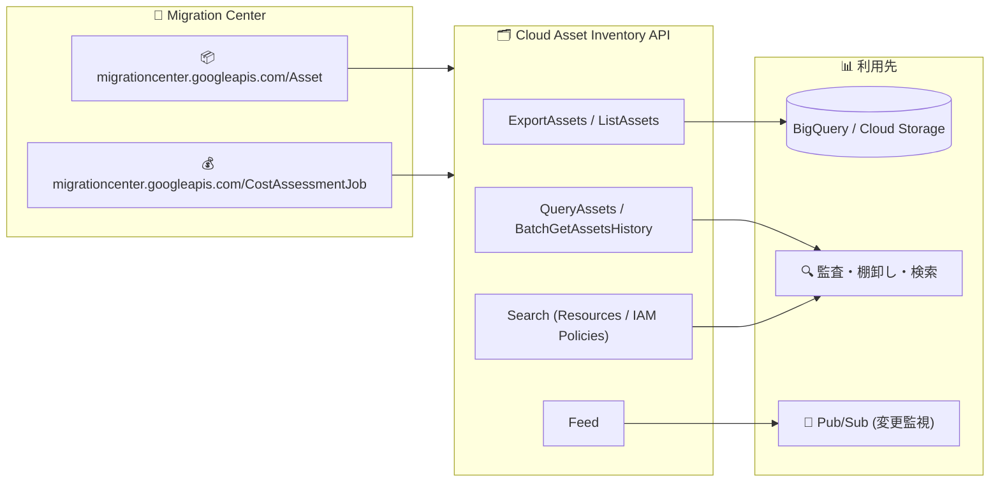

# Cloud Asset Inventory: Migration Center リソースタイプのサポート追加

**リリース日**: 2026-09-23

**サービス**: Cloud Asset Inventory

**機能**: Google Cloud Migration Center リソースタイプ (Asset / CostAssessmentJob) のサポート

**ステータス**: Feature (一般公開)

📊 [このアップデートのインフォグラフィックを見る](https://takech9203.github.io/google-cloud-news-summary/20260923-cloud-asset-inventory-migration-center-resources.html)

## 概要

Cloud Asset Inventory において、Google Cloud Migration Center の以下 2 つのリソースタイプが、ExportAssets、ListAssets、BatchGetAssetsHistory、QueryAssets、Feed、および Search (SearchAllResources、SearchAllIamPolicies) API を通じて一般公開されました。

- `migrationcenter.googleapis.com/Asset`
- `migrationcenter.googleapis.com/CostAssessmentJob`

Migration Center は、オンプレミスや他クラウドから Google Cloud への移行を支援する統合プラットフォームで、アセットディスカバリ、クラウドコスト見積もり、TCO レポートなどの機能を提供します。今回のアップデートにより、Migration Center が管理する Asset (発見されたサーバーやデータベースなどの資産) と CostAssessmentJob (コスト評価ジョブ) のメタデータを、Cloud Asset Inventory の標準的なエクスポート・一覧・履歴取得・検索の仕組みで扱えるようになります。

移行プロジェクトを進めるクラウド管理者や Solutions Architect にとって、組織全体のリソース棚卸しの中に Migration Center のリソースを含められるようになり、ガバナンス・監査・変更監視の対象範囲が広がるアップデートです。

**アップデート前の課題**

- Migration Center の Asset や CostAssessmentJob は Cloud Asset Inventory の対象外だったため、組織全体のアセット棚卸し (エクスポートや検索) にこれらのリソースを含められなかった
- Migration Center リソースの変更履歴を Cloud Asset Inventory の履歴機能 (BatchGetAssetsHistory) で追跡できなかった
- Migration Center リソースの変更を Feed (Pub/Sub 通知) で監視する仕組みがなかった

**アップデート後の改善**

- ExportAssets により、Migration Center リソースのメタデータを BigQuery や Cloud Storage へ組織・フォルダ・プロジェクト単位で一括エクスポートできるようになった
- ListAssets / QueryAssets / SearchAllResources により、他の Google Cloud リソースと同じインターフェースで Migration Center リソースの一覧取得・SQL クエリ・検索が可能になった
- BatchGetAssetsHistory により変更履歴 (最大 35 日間) を取得でき、Feed により変更をリアルタイムに Pub/Sub へ通知できるようになった
- SearchAllIamPolicies により、これらのリソースに関連する IAM ポリシーの検索が可能になった

## アーキテクチャ図



Migration Center の 2 つのリソースタイプのメタデータが Cloud Asset Inventory の各 API に取り込まれ、BigQuery / Cloud Storage へのエクスポート、検索・監査、Pub/Sub による変更監視に利用できるようになります。

## サービスアップデートの詳細

### 主要機能

1. **エクスポート・一覧・クエリ対応 (ExportAssets / ListAssets / QueryAssets)**
   - Migration Center リソースのメタデータを BigQuery や Cloud Storage にエクスポート可能
   - プロジェクト・フォルダ・組織スコープでの一覧取得や、BigQuery SQL によるクエリに対応

2. **変更履歴と変更監視 (BatchGetAssetsHistory / Feed)**
   - Cloud Asset Inventory は作成・更新・削除の履歴を最大 35 日間保持しており、Migration Center リソースもこの履歴取得の対象になる
   - Feed を設定することで、リソース変更を Pub/Sub 経由で監視できる

3. **検索対応 (SearchAllResources / SearchAllIamPolicies)**
   - カスタムクエリ言語を使ったリソース検索の対象に Migration Center リソースが追加
   - リソースに関連する IAM 許可ポリシーの検索にも対応

## 技術仕様

### 追加されたリソースタイプ

| 項目 | 詳細 |
|------|------|
| サービス | Google Cloud Migration Center |
| リソースタイプ 1 | `migrationcenter.googleapis.com/Asset` (発見されたサーバー・データベースなどの資産) |
| リソースタイプ 2 | `migrationcenter.googleapis.com/CostAssessmentJob` (コスト評価ジョブ) |
| 対応 API | ExportAssets、ListAssets、BatchGetAssetsHistory、QueryAssets、Feed、SearchAllResources、SearchAllIamPolicies |
| 非対応 API | 分析 (Analysis) API では利用不可 (公式ドキュメントの Asset types に明記) |
| 履歴保持期間 | 最大 35 日間 (Cloud Asset Inventory 共通仕様) |

## 設定方法

### 前提条件

1. 対象プロジェクトで Cloud Asset API (`cloudasset.googleapis.com`) が有効であること
2. 実行者に Cloud Asset Inventory の閲覧権限 (例: `roles/cloudasset.viewer`) が付与されていること

### 手順

#### ステップ 1: Migration Center リソースを一覧表示する

```bash
gcloud asset list \
  --project=PROJECT_ID \
  --asset-types="migrationcenter.googleapis.com/Asset,migrationcenter.googleapis.com/CostAssessmentJob" \
  --content-type=resource
```

指定したプロジェクト内の Migration Center リソースのメタデータを一覧表示します。

#### ステップ 2: リソースを検索する

```bash
gcloud asset search-all-resources \
  --scope=organizations/ORG_ID \
  --asset-types="migrationcenter.googleapis.com/Asset"
```

組織スコープで Migration Center の Asset リソースを検索します。

#### ステップ 3: 変更監視用の Feed を作成する (任意)

```bash
gcloud asset feeds create FEED_ID \
  --project=PROJECT_ID \
  --asset-types="migrationcenter.googleapis.com/Asset" \
  --content-type=resource \
  --pubsub-topic="projects/PROJECT_ID/topics/TOPIC_ID"
```

Migration Center Asset の変更を Pub/Sub トピックに通知する Feed を作成します。

## メリット

### ビジネス面

- **移行プロジェクトの可視性向上**: 移行対象資産やコスト評価ジョブの状態を、組織標準のアセット管理・監査の枠組みで把握できる
- **ガバナンス強化**: 組織全体のリソース棚卸しやコンプライアンス監査の対象に Migration Center リソースを含められる

### 技術面

- **統一されたインターフェース**: 他の Google Cloud リソースと同じ API・クエリ言語・エクスポート先 (BigQuery / Cloud Storage) で扱える
- **変更追跡の自動化**: BatchGetAssetsHistory による履歴取得と Feed による Pub/Sub 通知で、手動確認なしに変更を追跡できる

## デメリット・制約事項

### 制限事項

- 公式ドキュメント (Asset types) によると、`migrationcenter.googleapis.com/Asset` および `migrationcenter.googleapis.com/CostAssessmentJob` は分析 (Analysis) API では利用できない
- Cloud Asset Inventory の履歴保持期間は最大 35 日間 (共通仕様)

### 考慮すべき点

- Cloud Asset Inventory はリアルタイムクエリ向けには設計されていないため、最新状態が必要な場合は Migration Center API を直接呼び出す (公式ドキュメントの Consistency model 参照)

## ユースケース

### ユースケース 1: 移行対象資産の組織横断的な棚卸し

**シナリオ**: 複数プロジェクトで Migration Center によるアセットディスカバリを実施している企業が、移行対象資産の全体像を BigQuery で分析したい。

**実装例**:
```bash
gcloud asset export \
  --organization=ORG_ID \
  --asset-types="migrationcenter.googleapis.com/Asset" \
  --content-type=resource \
  --bigquery-table="projects/PROJECT_ID/datasets/DATASET/tables/mc_assets" \
  --output-bigquery-force
```

**効果**: 組織全体の移行対象資産のメタデータを BigQuery に集約し、SQL で横断的に分析できる。

### ユースケース 2: コスト評価ジョブの変更監視

**シナリオ**: 移行チームが CostAssessmentJob の作成・更新を検知して、後続の分析ワークフローを自動起動したい。

**効果**: Feed + Pub/Sub により、コスト評価ジョブの変更をイベントドリブンで検知し、通知や後続処理の自動化が可能になる。

## 料金

料金の詳細は公式の料金ページを参照してください。

- [Cloud Asset Inventory Pricing](https://docs.cloud.google.com/asset-inventory/pricing)

## 関連サービス・機能

- **Google Cloud Migration Center**: 今回サポートされたリソースタイプの提供元。アセットディスカバリ、コスト見積もり、TCO レポートなど移行支援機能を提供
- **BigQuery**: ExportAssets / QueryAssets によるアセットメタデータのエクスポート先・分析基盤
- **Cloud Storage**: アセットメタデータのエクスポート先
- **Pub/Sub**: Feed によるアセット変更通知の配信先

## 参考リンク

- 📊 [インフォグラフィック](https://takech9203.github.io/google-cloud-news-summary/20260923-cloud-asset-inventory-migration-center-resources.html)
- [公式リリースノート](https://docs.cloud.google.com/release-notes#September_23_2026)
- [Cloud Asset Inventory リリースノート](https://docs.cloud.google.com/asset-inventory/docs/release-notes)
- [ドキュメント: サポートされているアセットタイプ](https://docs.cloud.google.com/asset-inventory/docs/asset-types)
- [ドキュメント: Cloud Asset Inventory 概要](https://docs.cloud.google.com/asset-inventory/docs/asset-inventory-overview)
- [ドキュメント: Migration Center 概要](https://docs.cloud.google.com/migration-center/docs/migration-center-overview)
- [料金ページ](https://docs.cloud.google.com/asset-inventory/pricing)

## まとめ

Migration Center の Asset と CostAssessmentJob が Cloud Asset Inventory の主要 API (エクスポート・一覧・履歴・クエリ・Feed・検索) に対応し、移行プロジェクトの資産情報を組織標準のアセット管理・監査の枠組みに統合できるようになりました。Migration Center を利用中の組織は、既存のアセット棚卸しパイプラインや Feed 監視に今回のリソースタイプを追加することを推奨します。なお、分析 (Analysis) API は対象外である点に注意してください。

---

**タグ**: Cloud Asset Inventory, Migration Center, ExportAssets, ListAssets, QueryAssets, Feed, SearchAllResources, ガバナンス, 監査
