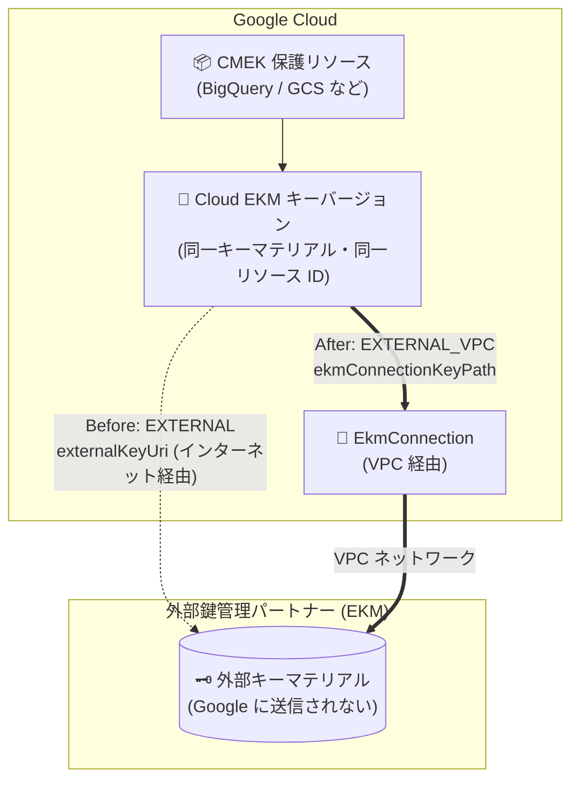

# Cloud Key Management Service: Cloud EKM 外部キー移行 (EXTERNAL / EXTERNAL_VPC 間の保護レベル変更) (Preview)

**リリース日**: 2026-09-23

**サービス**: Cloud Key Management Service (Cloud KMS / Cloud EKM)

**機能**: Cloud EKM 外部キー移行 — EXTERNAL / EXTERNAL_VPC 保護レベル間のキー移行

**ステータス**: Preview

📊 [このアップデートのインフォグラフィックを見る](https://takech9203.github.io/google-cloud-news-summary/20260923-cloud-kms-ekm-external-key-migration.html)

## 概要

Cloud External Key Manager (Cloud EKM) が外部キーの移行 (external key migration) を Preview サポートしました。`EXTERNAL` (インターネット経由) または `EXTERNAL_VPC` (VPC 経由) 保護レベルを持つ Cloud EKM キーに対して、いずれかの保護レベルで新しいキーバージョンを作成できるほか、既存のキーバージョンの保護レベルをそのまま変更できるようになりました。

この機能の最大の価値は、**同じキーマテリアル・同じリソース識別子を維持したまま**、外部キーへのアクセス経路 (インターネット経由 / VPC 経由) を変更できる点です。移行はゼロダウンタイムで行われ、アプリケーションの再構成やデータの再暗号化は不要です。また、`EXTERNAL_VPC` キーについては、別の `EkmConnection` への切り替え (例: Partner Interconnect 経由の VPC から Dedicated Interconnect 経由の VPC へのアップグレード) にも利用できます。

外部鍵管理パートナー (Fortanix、Thales など) の EKM を利用して鍵主権 (key sovereignty) 要件を満たしている組織にとって、可用性向上のためのネットワーク経路変更が既存キーを維持したまま実施可能になる、運用上重要なアップデートです。

**アップデート前の課題**

- Cloud EKM キーの保護レベル (`EXTERNAL` / `EXTERNAL_VPC`) はキーバージョン作成時に固定され、後からアクセス経路を変更する手段がなかった
- インターネット経由の EKM 接続から可用性の高い VPC 経由の接続に移行するには、新しいキーを作成し、CMEK で保護されたリソースの再暗号化やアプリケーション側の鍵参照の再構成が必要だった
- `EXTERNAL_VPC` キーが使用する `EkmConnection` を、より高信頼な接続構成 (例: Dedicated Interconnect) に切り替えることが既存キーのままではできなかった

**アップデート後の改善**

- 既存の Cloud EKM キーに対し、親キーと異なる保護レベル (`EXTERNAL` ⇔ `EXTERNAL_VPC`) の新しいキーバージョンをローテーションで作成できるようになった
- 既存のキーバージョン自体を更新して保護レベルを変更でき、同じキーマテリアル・同じリソースを維持したままアクセス経路をゼロダウンタイムで切り替え可能になった
- アプリケーションの再構成やデータの再暗号化なしで、EKM への接続方式の変更 (インターネット → VPC、VPC 構成間の変更) が可能になった

## アーキテクチャ図



既存の Cloud EKM キーバージョンを更新すると、アプリケーションから見えるキーリソースは変わらないまま、外部キーマテリアルへのアクセス経路のみがインターネット経由 (`EXTERNAL`) から VPC 経由 (`EXTERNAL_VPC`) に切り替わります (逆方向の移行も可能)。

## サービスアップデートの詳細

### 主要機能

1. **異なる保護レベルでの新規キーバージョン作成 (ローテーション)**
   - `EXTERNAL` キーをローテーションして `EXTERNAL_VPC` の新しいキーバージョンを作成可能 (逆も可能)
   - 対称暗号鍵の場合、`--primary` フラグで新バージョンをプライマリに設定可能
   - `EXTERNAL_VPC` キーのローテーション時に、親キーと異なる `EkmConnection` を指定することも可能

2. **既存キーバージョンの保護レベルのインプレース更新**
   - 同じキーマテリアル・同じキーバージョンリソースを維持したまま保護レベルを変更
   - `EXTERNAL` → `EXTERNAL_VPC`: `EkmConnection` と `ekmConnectionKeyPath` を関連付ける
   - `EXTERNAL_VPC` → `EXTERNAL`: `externalKeyUri` を設定して `EkmConnection` を置き換える
   - 新しい参照先は現在のキー URI / キーパスと**同一のキーマテリアル**を指している必要がある

3. **VPC 構成間の移行**
   - `EXTERNAL_VPC` キーバージョンを別の `EkmConnection` に切り替え可能
   - 例: Partner Interconnect 経由の VPC 接続から Dedicated Interconnect 経由の VPC 接続へのアップグレード
   - キーバージョンに `EkmConnection` が関連付けられている場合、親キーの接続設定と異なっていても、そのキーバージョンのすべての操作にバージョン側の接続が使用される

## 技術仕様

### 保護レベルの比較と移行

| 項目 | EXTERNAL | EXTERNAL_VPC |
|------|----------|--------------|
| アクセス経路 | インターネット経由 | VPC ネットワーク経由 |
| キー参照方法 | `externalKeyUri` | `EkmConnection` + `ekmConnectionKeyPath` |
| 可用性 | キーが利用不能になるリスクあり (公式ドキュメントに注意記載) | VPC の分離性・運用サポートにより信頼性が向上 |
| 利用可能ロケーション | `nam-eur-asia1` と `global` を除く Cloud KMS の全ロケーション | ほとんどのリージョンロケーション (マルチリージョン非対応) |
| 移行操作 | ローテーション (新バージョン作成) / 既存バージョンの更新 | ローテーション / 既存バージョンの更新 / `EkmConnection` の変更 |

### 前提条件・権限

| 項目 | 詳細 |
|------|------|
| ステータス | Preview (Pre-GA Offerings Terms が適用) |
| 操作インターフェース | gcloud CLI および Cloud KMS API のみ (Google Cloud コンソール非対応) |
| 必要な権限 | `cloudkms.cryptoKeys.update` (Cloud KMS 管理者ロール `roles/cloudkms.admin` に含まれる) |
| API メソッド | 新バージョン作成: `CryptoKeyVersions.create` / 既存バージョン更新: `CryptoKeyVersions.patch` (`updateMask=protectionLevel,externalProtectionLevelOptions`) |
| 制約 | 移行先の EKM 接続・キーパス / キー URI は、現在と同一のキーマテリアルを指す必要がある |

## 設定方法

### 前提条件

1. 課金と Cloud KMS API が有効な Google Cloud プロジェクト
2. `cloudkms.cryptoKeys.update` 権限 (例: `roles/cloudkms.admin`)
3. `EXTERNAL` に移行する場合: [Cloud EKM over the internet のセットアップ](https://docs.cloud.google.com/kms/docs/set-up-ekm-internet) が完了していること
4. `EXTERNAL_VPC` に移行する (または新しい VPC ネットワークに移行する) 場合: [EKM 接続の作成](https://docs.cloud.google.com/kms/docs/create-ekm-connection) が完了していること

### 手順

#### ステップ 1: 既存キーバージョンを EXTERNAL_VPC に更新する

```bash
gcloud kms keys versions update KEY_VERSION \
    --key KEY_NAME \
    --keyring KEY_RING \
    --location LOCATION \
    --protection-level "external-vpc" \
    --crypto-key-backend EKM_CONNECTION_PATH \
    --ekm-connection-key-path EXTERNAL_KEY_PATH
```

`EKM_CONNECTION_PATH` には `projects/PROJECT_ID/locations/LOCATION/ekmConnections/EKM_CONNECTION` 形式の EKM 接続リソース識別子を、`EXTERNAL_KEY_PATH` には既存の外部キーマテリアルへの新しいパス (例: `v0/path/to/my/key`) を指定します。現在のキー URI と同一のキーマテリアルを指す必要があります。

#### ステップ 2: (逆方向) 既存キーバージョンを EXTERNAL に更新する

```bash
gcloud kms keys versions update KEY_VERSION \
    --key KEY_NAME \
    --keyring KEY_RING \
    --location LOCATION \
    --protection-level "external" \
    --external-key-uri EXTERNAL_KEY_URI
```

`EXTERNAL_KEY_URI` には EKM 内の既存キーマテリアルへの新しい URI を指定します。

#### ステップ 3: (別方式) 異なる保護レベルの新しいキーバージョンを作成する

```bash
gcloud kms keys versions create \
    --key KEY_NAME \
    --keyring KEY_RING \
    --location LOCATION \
    --protection-level "external-vpc" \
    --crypto-key-backend EKM_CONNECTION_PATH \
    --ekm-connection-key-path EXTERNAL_KEY_PATH \
    --primary
```

既存の `EXTERNAL` キーに対して `EXTERNAL_VPC` の新バージョンをローテーションで作成します。対称暗号鍵で新バージョンをプライマリにする場合は `--primary` を付与します。

## メリット

### ビジネス面

- **ゼロダウンタイムでの移行**: 鍵アクセス経路の変更に伴うサービス停止やメンテナンスウィンドウの調整が不要
- **移行コスト・リスクの低減**: データの再暗号化や CMEK 設定の変更が不要なため、大規模環境でも移行プロジェクトの工数とリスクを大幅に削減できる
- **鍵主権の維持**: 移行中も外部キーマテリアルは EKM パートナー側に留まり、Google に送信されない

### 技術面

- **可用性の向上**: インターネット経由 (`EXTERNAL`) から VPC 経由 (`EXTERNAL_VPC`) への移行により、EKM 接続の分離性と信頼性が向上する
- **アプリケーション透過性**: キーバージョンのリソース識別子が変わらないため、CMEK 統合サービスやアプリケーションの鍵参照を変更する必要がない
- **ネットワーク構成の柔軟な進化**: VPC 接続構成の変更 (Partner Interconnect → Dedicated Interconnect など) も既存キーのまま実施可能

## デメリット・制約事項

### 制限事項

- Preview 機能であり、Pre-GA Offerings Terms が適用される ("as is" 提供、サポートが限定的な場合がある)
- 操作は gcloud CLI と Cloud KMS API のみでサポートされ、Google Cloud コンソールからは実行できない
- 移行先の EKM 接続・キーパス / 外部キー URI は、現在参照している**同一のキーマテリアル**を指していなければならない
- `EXTERNAL_VPC` はマルチリージョンロケーションで利用できず、`EXTERNAL` は `nam-eur-asia1` と `global` で利用できない

### 考慮すべき点

- キーバージョンに `EkmConnection` が関連付けられると、親キーが異なる `EkmConnection` を持っていても、そのバージョンの全操作にはバージョン側の接続が使用される (キーとバージョンで接続設定が乖離し得る点に注意)
- `EXTERNAL_VPC` へ移行する前に、EKM 接続の作成 (VPC ネットワーク、EKM 側での VPC アクセス許可) を事前に完了しておく必要がある
- Preview 段階のため、本番の重要な鍵に適用する前に検証環境での動作確認を推奨

## ユースケース

### ユースケース 1: インターネット経由 EKM キーの VPC 経由への移行による可用性向上

**シナリオ**: 金融機関が鍵主権要件のため Cloud EKM (`EXTERNAL`) で BigQuery や Cloud Storage の CMEK を保護しているが、インターネット経由の EKM アクセスの可用性リスクを解消するため、VPC 経由 (`EXTERNAL_VPC`) への移行を計画している。従来は新規キー作成とデータ再暗号化が必要で移行に踏み切れなかった。

**実装例**:
```bash
# 1. EKM 接続を作成 (VPC 経由、事前に EKM 側で VPC アクセスを許可)
# 2. 既存キーバージョンをインプレースで EXTERNAL_VPC に更新
gcloud kms keys versions update 1 \
    --key ekm-cmek-key --keyring prod-keyring --location asia-northeast1 \
    --protection-level "external-vpc" \
    --crypto-key-backend "projects/my-proj/locations/asia-northeast1/ekmConnections/my-ekm-conn" \
    --ekm-connection-key-path "v0/keys/prod-key"
```

**効果**: CMEK で保護された既存リソースに一切手を加えず、ゼロダウンタイムで EKM アクセスを高可用な VPC 経由に切り替えられる。

### ユースケース 2: VPC 接続構成のアップグレード

**シナリオ**: `EXTERNAL_VPC` キーを Partner Interconnect 経由の VPC で運用してきた企業が、帯域と SLA の向上のため Dedicated Interconnect ベースの新しい EKM 接続に切り替えたい。

**効果**: 新しい `EkmConnection` を作成し、既存キーバージョンの参照先を更新するだけで、同じキーマテリアルのままネットワーク基盤をアップグレードできる。

## 料金

外部キー移行機能自体に追加料金の記載はありません。Cloud EKM の標準料金が適用されます。

### 料金例

| 項目 | 料金 (US$) |
|--------|-----------------|
| Cloud EKM: アクティブなキーバージョン | $3.00 / 月 |
| Cloud EKM: 鍵の使用オペレーション | $0.03 / 10,000 オペレーション |

詳細は [Cloud KMS 料金ページ](https://cloud.google.com/kms/pricing) を参照してください。

## 利用可能リージョン

- `EXTERNAL` (インターネット経由): `nam-eur-asia1` と `global` を除く Cloud KMS がサポートする全ロケーション
- `EXTERNAL_VPC` (VPC 経由): Cloud KMS がサポートするほとんどのリージョンロケーション (マルチリージョンロケーションは非対応)

## 関連サービス・機能

- **Cloud External Key Manager (Cloud EKM)**: 本アップデートの対象。外部鍵管理パートナー (Fortanix、Thales など) に保管された鍵で Google Cloud 上のデータを保護する
- **Virtual Private Cloud (VPC)**: `EXTERNAL_VPC` 保護レベルのアクセス経路。Cloud Interconnect (Partner / Dedicated) と組み合わせてオンプレミス EKM への閉域接続を構成
- **CMEK (顧客管理の暗号鍵) 統合サービス**: BigQuery、Cloud Storage、Compute Engine など 30 以上のサービスが Cloud EKM キーによる CMEK に対応。移行後もキー参照の変更は不要
- **Key Access Justifications**: 鍵アクセスの理由を可視化・制御する機能。Cloud EKM と組み合わせて鍵主権を強化
- **Cloud Audit Logs**: 鍵バージョンの作成・更新を含む Cloud KMS 操作の監査ログを記録

## 参考リンク

- 📊 [インフォグラフィック](https://takech9203.github.io/google-cloud-news-summary/20260923-cloud-kms-ekm-external-key-migration.html)
- [公式リリースノート](https://docs.cloud.google.com/release-notes#September_23_2026)
- [ドキュメント: Migrate external keys](https://docs.cloud.google.com/kms/docs/migrate-external-keys)
- [ドキュメント: Cloud External Key Manager](https://docs.cloud.google.com/kms/docs/ekm)
- [ドキュメント: Protection levels](https://docs.cloud.google.com/kms/docs/protection-levels)
- [料金ページ](https://cloud.google.com/kms/pricing)

## まとめ

Cloud EKM の外部キー移行 (Preview) により、`EXTERNAL` / `EXTERNAL_VPC` 間の保護レベル変更が、同一キーマテリアル・同一リソースのままゼロダウンタイムで可能になりました。インターネット経由の EKM アクセスの可用性リスクが課題だった組織は、まず検証環境で gcloud CLI による既存キーバージョンの更新を試し、VPC 経由への移行計画を検討することを推奨します。

---

**タグ**: #CloudKMS #CloudEKM #セキュリティ #暗号鍵管理 #CMEK #VPC #Preview
