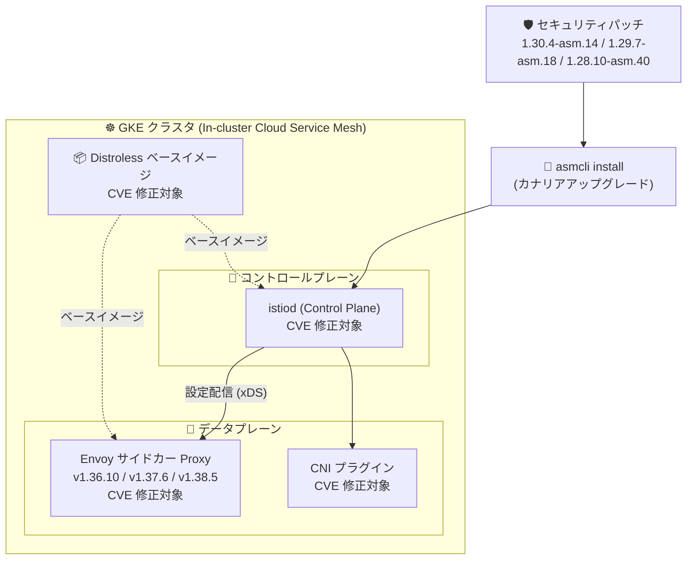

# Cloud Service Mesh: セキュリティパッチリリース 1.30.4-asm.14 / 1.29.7-asm.18 / 1.28.10-asm.40

**リリース日**: 2026-09-23

**サービス**: Cloud Service Mesh

**機能**: In-cluster Cloud Service Mesh 向けパッチリリース (プラットフォーム CVE 修正)

**ステータス**: GA (パッチリリース)

📊 [このアップデートのインフォグラフィックを見る](https://takech9203.github.io/google-cloud-news-summary/20260923-cloud-service-mesh-security-patch-releases.html)

## 概要

2026 年 9 月 23 日、in-cluster (クラスタ内コントロールプレーン) 構成の Cloud Service Mesh 向けに、3 つのマイナーバージョン系列に対応するセキュリティパッチリリースが同時に公開されました。対象は **1.30.4-asm.14** (Envoy v1.38.5-dev)、**1.29.7-asm.18** (Envoy v1.37.6)、**1.28.10-asm.40** (Envoy v1.36.10-dev) の 3 バージョンです。

今回のパッチは新機能の追加ではなく、メッシュを構成するプラットフォームコンポーネント (Proxy、Control Plane、Distroless イメージ、CNI) に含まれる多数の CVE (共通脆弱性識別子) への修正を目的としています。修正対象には CVSS スコア 9.8 (Critical 相当) の CVE-2022-31045 や、Google の評価で High とされた CVE-2026-84304 / CVE-2026-84445 (8.7)、Istio/Envoy 関連の CVE-2019-14993、CVE-2021-39155/39156、CVE-2022-23635 (いずれも 7.5) などが含まれます。修正数は 1.30.4-asm.14 で 39 件、1.29.7-asm.18 で 59 件、1.28.10-asm.40 で 60 件 (GHSA アドバイザリ 1 件を含む) です。

In-cluster Cloud Service Mesh を運用しているすべてのユーザー (特に GKE 上で自己管理の istiod コントロールプレーンを使用している組織) は、利用中のマイナーバージョン系列に対応する本パッチへの早期アップグレードが推奨されます。

**アップデート前の課題**

- 旧パッチバージョンの Proxy (Envoy サイドカー)、Control Plane (istiod)、Distroless ベースイメージ、CNI の各コンポーネントに、CVSS 9.8〜0.0 まで多数の未修正 CVE が存在していた
- In-cluster 構成では Managed Cloud Service Mesh と異なり自動アップグレードが行われないため、脆弱性修正を取り込むにはユーザー自身がパッチを適用する必要があった
- 古いマイナーバージョン (1.28 / 1.29) を利用中のユーザーは、メジャーアップグレードなしにセキュリティ修正だけを取り込む手段が必要だった

**アップデート後の改善**

- 3 つのサポート対象マイナーバージョン系列 (1.28 / 1.29 / 1.30) すべてにパッチが同時提供され、メジャーバージョンを維持したままセキュリティ修正のみを適用できるようになった
- 各パッチで Envoy が更新され (1.30.4-asm.14: v1.38.5-dev、1.29.7-asm.18: v1.37.6、1.28.10-asm.40: v1.36.10-dev)、データプレーンの既知の脆弱性が解消された
- CVE ごとに影響コンポーネント (Proxy / Control Plane / Distroless / CNI) と深刻度が明示され、自組織への影響評価とパッチ適用の優先度判断がしやすくなった

## アーキテクチャ図



今回のパッチが修正する 4 つのコンポーネント (Proxy、Control Plane、Distroless、CNI) と、asmcli によるカナリアアップグレードでパッチが適用される流れを示しています。

## サービスアップデートの詳細

### 主要機能

1. **1.30.4-asm.14 (Envoy v1.38.5-dev)**
   - 最新の 1.30 系列向けパッチ。39 件のプラットフォーム CVE を修正
   - Proxy / Control Plane / Distroless / CNI の 4 コンポーネントすべてに修正が含まれる (例: CVE-2022-31045、CVE-2026-84304、CVE-2026-84445)

2. **1.29.7-asm.18 (Envoy v1.37.6)**
   - 1.29 系列向けパッチ。59 件のプラットフォーム CVE を修正
   - 本パッチの修正は主に Control Plane / Distroless / CNI が対象 (Proxy 列はすべて No)。ネットワークプロキシ層以外のコンポーネント更新が中心

3. **1.28.10-asm.40 (Envoy v1.36.10-dev)**
   - 1.28 系列向けパッチ。59 件の CVE と 1 件の GitHub Security Advisory (GHSA-gcjh-h69q-9w9g) の計 60 件を修正
   - 古い系列ほど累積修正数が多く、Proxy を含む広範なコンポーネントが更新される

### CVE 修正一覧: 1.30.4-asm.14 (39 件)

| CVE | Proxy | Control Plane | Distroless | CNI | 深刻度 (CVSS) |
|-----|-------|---------------|------------|-----|----------------|
| [CVE-2022-31045](https://nvd.nist.gov/vuln/detail/CVE-2022-31045) | Yes | Yes | Yes | Yes | Medium (9.8) |
| [CVE-2026-5450](https://nvd.nist.gov/vuln/detail/CVE-2026-5450) | No | No | Yes | No | Low (9.8) |
| [CVE-2026-84304](https://nvd.nist.gov/vuln/detail/CVE-2026-84304) | Yes | Yes | Yes | Yes | High (8.7) |
| [CVE-2026-84445](https://nvd.nist.gov/vuln/detail/CVE-2026-84445) | Yes | Yes | Yes | Yes | High (8.7) |
| [CVE-2026-54371](https://nvd.nist.gov/vuln/detail/CVE-2026-54371) | Yes | Yes | No | Yes | Medium (8.4) |
| [CVE-2019-14993](https://nvd.nist.gov/vuln/detail/CVE-2019-14993) | Yes | Yes | Yes | Yes | High (7.5) |
| [CVE-2021-39155](https://nvd.nist.gov/vuln/detail/CVE-2021-39155) | Yes | Yes | Yes | Yes | High (7.5) |
| [CVE-2021-39156](https://nvd.nist.gov/vuln/detail/CVE-2021-39156) | Yes | Yes | Yes | Yes | High (7.5) |
| [CVE-2022-23635](https://nvd.nist.gov/vuln/detail/CVE-2022-23635) | Yes | Yes | Yes | Yes | High (7.5) |
| [CVE-2026-5928](https://nvd.nist.gov/vuln/detail/CVE-2026-5928) | No | No | Yes | No | Low (7.5) |
| [CVE-2026-59847](https://nvd.nist.gov/vuln/detail/CVE-2026-59847) | Yes | Yes | No | Yes | Medium (7.5) |
| [CVE-2026-59850](https://nvd.nist.gov/vuln/detail/CVE-2026-59850) | Yes | Yes | No | Yes | Medium (7.5) |
| [CVE-2026-59843](https://nvd.nist.gov/vuln/detail/CVE-2026-59843) | Yes | Yes | No | Yes | Medium (6.5) |
| [CVE-2026-84303](https://nvd.nist.gov/vuln/detail/CVE-2026-84303) | Yes | Yes | Yes | Yes | Medium (6.3) |
| [CVE-2026-13757](https://nvd.nist.gov/vuln/detail/CVE-2026-13757) | Yes | Yes | No | Yes | Medium (6.2) |
| [CVE-2026-18938](https://nvd.nist.gov/vuln/detail/CVE-2026-18938) | Yes | Yes | No | Yes | Medium (6.2) |
| [CVE-2024-2236](https://nvd.nist.gov/vuln/detail/CVE-2024-2236) | Yes | Yes | No | Yes | Low (5.9) |
| [CVE-2026-59845](https://nvd.nist.gov/vuln/detail/CVE-2026-59845) | Yes | Yes | No | Yes | Medium (5.9) |
| [CVE-2026-27171](https://nvd.nist.gov/vuln/detail/CVE-2026-27171) | Yes | Yes | No | Yes | Low (5.5) |
| [CVE-2026-13595](https://nvd.nist.gov/vuln/detail/CVE-2026-13595) | Yes | Yes | No | Yes | Medium (5.3) |
| [CVE-2026-59848](https://nvd.nist.gov/vuln/detail/CVE-2026-59848) | Yes | Yes | No | Yes | Medium (5.3) |
| [CVE-2025-6141](https://nvd.nist.gov/vuln/detail/CVE-2025-6141) | Yes | Yes | No | Yes | Low (4.8) |
| [CVE-2026-27456](https://nvd.nist.gov/vuln/detail/CVE-2026-27456) | Yes | Yes | No | Yes | Medium (4.7) |
| [CVE-2025-5278](https://nvd.nist.gov/vuln/detail/CVE-2025-5278) | Yes | Yes | No | Yes | Low (4.4) |
| [CVE-2026-59846](https://nvd.nist.gov/vuln/detail/CVE-2026-59846) | Yes | Yes | No | Yes | Medium (3.9) |
| [CVE-2026-19499](https://nvd.nist.gov/vuln/detail/CVE-2026-19499) | Yes | Yes | No | Yes | Medium (0.0) |
| [CVE-2026-19542](https://nvd.nist.gov/vuln/detail/CVE-2026-19542) | Yes | Yes | No | Yes | Medium (0.0) |
| [CVE-2026-41990](https://nvd.nist.gov/vuln/detail/CVE-2026-41990) | Yes | Yes | No | Yes | Medium (0.0) |
| [CVE-2026-42250](https://nvd.nist.gov/vuln/detail/CVE-2026-42250) | Yes | Yes | No | Yes | Low (0.0) |
| [CVE-2026-53612](https://nvd.nist.gov/vuln/detail/CVE-2026-53612) | Yes | Yes | No | Yes | Medium (0.0) |
| [CVE-2026-53613](https://nvd.nist.gov/vuln/detail/CVE-2026-53613) | Yes | Yes | No | Yes | Medium (0.0) |
| [CVE-2026-53614](https://nvd.nist.gov/vuln/detail/CVE-2026-53614) | Yes | Yes | No | Yes | Medium (0.0) |
| [CVE-2026-53615](https://nvd.nist.gov/vuln/detail/CVE-2026-53615) | Yes | Yes | No | Yes | Medium (0.0) |
| [CVE-2026-53910](https://nvd.nist.gov/vuln/detail/CVE-2026-53910) | Yes | Yes | No | Yes | Medium (0.0) |
| [CVE-2026-57062](https://nvd.nist.gov/vuln/detail/CVE-2026-57062) | Yes | Yes | No | Yes | Low (0.0) |
| [CVE-2026-6368](https://nvd.nist.gov/vuln/detail/CVE-2026-6368) | Yes | Yes | No | Yes | Medium (0.0) |
| [CVE-2026-6791](https://nvd.nist.gov/vuln/detail/CVE-2026-6791) | Yes | Yes | No | Yes | Medium (0.0) |
| [CVE-2026-77117](https://nvd.nist.gov/vuln/detail/CVE-2026-77117) | Yes | Yes | No | Yes | Medium (0.0) |
| [CVE-2026-80489](https://nvd.nist.gov/vuln/detail/CVE-2026-80489) | Yes | Yes | No | Yes | Medium (0.0) |

### CVE 修正一覧: 1.29.7-asm.18 (59 件)

| CVE | Proxy | Control Plane | Distroless | CNI | 深刻度 (CVSS) |
|-----|-------|---------------|------------|-----|----------------|
| [CVE-2022-31045](https://nvd.nist.gov/vuln/detail/CVE-2022-31045) | No | Yes | Yes | Yes | Medium (9.8) |
| [CVE-2026-11856](https://nvd.nist.gov/vuln/detail/CVE-2026-11856) | No | Yes | No | Yes | Medium (9.8) |
| [CVE-2026-5450](https://nvd.nist.gov/vuln/detail/CVE-2026-5450) | No | No | Yes | No | Low (9.8) |
| [CVE-2026-57433](https://nvd.nist.gov/vuln/detail/CVE-2026-57433) | No | Yes | No | Yes | Medium (9.8) |
| [CVE-2026-12087](https://nvd.nist.gov/vuln/detail/CVE-2026-12087) | No | Yes | No | Yes | Medium (9.1) |
| [CVE-2026-13221](https://nvd.nist.gov/vuln/detail/CVE-2026-13221) | No | Yes | No | Yes | Medium (9.1) |
| [CVE-2026-75803](https://nvd.nist.gov/vuln/detail/CVE-2026-75803) | No | Yes | No | Yes | Low (9.1) |
| [CVE-2026-84304](https://nvd.nist.gov/vuln/detail/CVE-2026-84304) | No | Yes | Yes | Yes | High (8.7) |
| [CVE-2026-84445](https://nvd.nist.gov/vuln/detail/CVE-2026-84445) | No | Yes | Yes | Yes | High (8.7) |
| [CVE-2026-54371](https://nvd.nist.gov/vuln/detail/CVE-2026-54371) | No | Yes | No | Yes | Medium (8.4) |
| [CVE-2026-57432](https://nvd.nist.gov/vuln/detail/CVE-2026-57432) | No | Yes | No | Yes | Medium (8.4) |
| [CVE-2019-14993](https://nvd.nist.gov/vuln/detail/CVE-2019-14993) | No | Yes | Yes | Yes | High (7.5) |
| [CVE-2021-39155](https://nvd.nist.gov/vuln/detail/CVE-2021-39155) | No | Yes | Yes | Yes | High (7.5) |
| [CVE-2021-39156](https://nvd.nist.gov/vuln/detail/CVE-2021-39156) | No | Yes | Yes | Yes | High (7.5) |
| [CVE-2022-23635](https://nvd.nist.gov/vuln/detail/CVE-2022-23635) | No | Yes | Yes | Yes | High (7.5) |
| [CVE-2026-42151](https://nvd.nist.gov/vuln/detail/CVE-2026-42151) | No | Yes | No | No | High (7.5) |
| [CVE-2026-42154](https://nvd.nist.gov/vuln/detail/CVE-2026-42154) | No | Yes | No | No | High (7.5) |
| [CVE-2026-48959](https://nvd.nist.gov/vuln/detail/CVE-2026-48959) | No | Yes | No | Yes | Medium (7.5) |
| [CVE-2026-54874](https://nvd.nist.gov/vuln/detail/CVE-2026-54874) | No | Yes | No | Yes | Low (7.5) |
| [CVE-2026-5928](https://nvd.nist.gov/vuln/detail/CVE-2026-5928) | No | No | Yes | No | Low (7.5) |
| [CVE-2026-59847](https://nvd.nist.gov/vuln/detail/CVE-2026-59847) | No | Yes | No | Yes | Medium (7.5) |
| [CVE-2026-59850](https://nvd.nist.gov/vuln/detail/CVE-2026-59850) | No | Yes | No | Yes | Medium (7.5) |
| [CVE-2026-63072](https://nvd.nist.gov/vuln/detail/CVE-2026-63072) | No | Yes | No | Yes | Medium (7.5) |
| [CVE-2026-63076](https://nvd.nist.gov/vuln/detail/CVE-2026-63076) | No | Yes | No | Yes | Medium (7.5) |
| [CVE-2026-8932](https://nvd.nist.gov/vuln/detail/CVE-2026-8932) | No | Yes | No | Yes | Low (7.5) |
| [CVE-2026-9538](https://nvd.nist.gov/vuln/detail/CVE-2026-9538) | No | Yes | No | Yes | Medium (7.5) |
| [CVE-2026-48962](https://nvd.nist.gov/vuln/detail/CVE-2026-48962) | No | Yes | No | Yes | Medium (7.3) |
| [CVE-2026-7017](https://nvd.nist.gov/vuln/detail/CVE-2026-7017) | No | Yes | No | Yes | Medium (7.1) |
| [CVE-2026-59843](https://nvd.nist.gov/vuln/detail/CVE-2026-59843) | No | Yes | No | Yes | Medium (6.5) |
| [CVE-2026-84303](https://nvd.nist.gov/vuln/detail/CVE-2026-84303) | No | Yes | Yes | Yes | Medium (6.3) |
| [CVE-2026-13757](https://nvd.nist.gov/vuln/detail/CVE-2026-13757) | No | Yes | No | Yes | Medium (6.2) |
| [CVE-2026-18938](https://nvd.nist.gov/vuln/detail/CVE-2026-18938) | No | Yes | No | Yes | Medium (6.2) |
| [CVE-2026-40179](https://nvd.nist.gov/vuln/detail/CVE-2026-40179) | No | Yes | No | No | Medium (6.1) |
| [CVE-2026-44903](https://nvd.nist.gov/vuln/detail/CVE-2026-44903) | No | Yes | No | No | Medium (6.1) |
| [CVE-2024-2236](https://nvd.nist.gov/vuln/detail/CVE-2024-2236) | No | Yes | No | Yes | Low (5.9) |
| [CVE-2026-59845](https://nvd.nist.gov/vuln/detail/CVE-2026-59845) | No | Yes | No | Yes | Medium (5.9) |
| [CVE-2026-63074](https://nvd.nist.gov/vuln/detail/CVE-2026-63074) | No | Yes | No | Yes | Low (5.9) |
| [CVE-2025-15649](https://nvd.nist.gov/vuln/detail/CVE-2025-15649) | No | Yes | No | Yes | Medium (5.5) |
| [CVE-2026-27171](https://nvd.nist.gov/vuln/detail/CVE-2026-27171) | No | Yes | No | Yes | Low (5.5) |
| [CVE-2026-13595](https://nvd.nist.gov/vuln/detail/CVE-2026-13595) | No | Yes | No | Yes | Medium (5.3) |
| [CVE-2026-59848](https://nvd.nist.gov/vuln/detail/CVE-2026-59848) | No | Yes | No | Yes | Medium (5.3) |
| [CVE-2025-6141](https://nvd.nist.gov/vuln/detail/CVE-2025-6141) | No | Yes | No | Yes | Low (4.8) |
| [CVE-2026-27456](https://nvd.nist.gov/vuln/detail/CVE-2026-27456) | No | Yes | No | Yes | Medium (4.7) |
| [CVE-2025-5278](https://nvd.nist.gov/vuln/detail/CVE-2025-5278) | No | Yes | No | Yes | Low (4.4) |
| [CVE-2026-59846](https://nvd.nist.gov/vuln/detail/CVE-2026-59846) | No | Yes | No | Yes | Medium (3.9) |
| [CVE-2026-19499](https://nvd.nist.gov/vuln/detail/CVE-2026-19499) | No | Yes | No | Yes | Medium (0.0) |
| [CVE-2026-19542](https://nvd.nist.gov/vuln/detail/CVE-2026-19542) | No | Yes | No | Yes | Medium (0.0) |
| [CVE-2026-41990](https://nvd.nist.gov/vuln/detail/CVE-2026-41990) | No | Yes | No | Yes | Medium (0.0) |
| [CVE-2026-42250](https://nvd.nist.gov/vuln/detail/CVE-2026-42250) | No | Yes | No | Yes | Low (0.0) |
| [CVE-2026-53612](https://nvd.nist.gov/vuln/detail/CVE-2026-53612) | No | Yes | No | Yes | Medium (0.0) |
| [CVE-2026-53613](https://nvd.nist.gov/vuln/detail/CVE-2026-53613) | No | Yes | No | Yes | Medium (0.0) |
| [CVE-2026-53614](https://nvd.nist.gov/vuln/detail/CVE-2026-53614) | No | Yes | No | Yes | Medium (0.0) |
| [CVE-2026-53615](https://nvd.nist.gov/vuln/detail/CVE-2026-53615) | No | Yes | No | Yes | Medium (0.0) |
| [CVE-2026-53910](https://nvd.nist.gov/vuln/detail/CVE-2026-53910) | No | Yes | No | Yes | Medium (0.0) |
| [CVE-2026-57062](https://nvd.nist.gov/vuln/detail/CVE-2026-57062) | No | Yes | No | Yes | Low (0.0) |
| [CVE-2026-6368](https://nvd.nist.gov/vuln/detail/CVE-2026-6368) | No | Yes | No | Yes | Medium (0.0) |
| [CVE-2026-6791](https://nvd.nist.gov/vuln/detail/CVE-2026-6791) | No | Yes | No | Yes | Medium (0.0) |
| [CVE-2026-77117](https://nvd.nist.gov/vuln/detail/CVE-2026-77117) | No | Yes | No | Yes | Medium (0.0) |
| [CVE-2026-80489](https://nvd.nist.gov/vuln/detail/CVE-2026-80489) | No | Yes | No | Yes | Medium (0.0) |

### CVE 修正一覧: 1.28.10-asm.40 (60 件)

| CVE / Advisory | Proxy | Control Plane | Distroless | CNI | 深刻度 (CVSS) |
|-----|-------|---------------|------------|-----|----------------|
| [CVE-2022-31045](https://nvd.nist.gov/vuln/detail/CVE-2022-31045) | Yes | Yes | Yes | Yes | Medium (9.8) |
| [CVE-2026-11856](https://nvd.nist.gov/vuln/detail/CVE-2026-11856) | Yes | Yes | No | Yes | Medium (9.8) |
| [CVE-2026-5450](https://nvd.nist.gov/vuln/detail/CVE-2026-5450) | No | No | Yes | No | Low (9.8) |
| [CVE-2026-57433](https://nvd.nist.gov/vuln/detail/CVE-2026-57433) | Yes | Yes | No | Yes | Medium (9.8) |
| [CVE-2026-12087](https://nvd.nist.gov/vuln/detail/CVE-2026-12087) | Yes | Yes | No | Yes | Medium (9.1) |
| [CVE-2026-13221](https://nvd.nist.gov/vuln/detail/CVE-2026-13221) | Yes | Yes | No | Yes | Medium (9.1) |
| [CVE-2026-75803](https://nvd.nist.gov/vuln/detail/CVE-2026-75803) | Yes | Yes | No | Yes | Low (9.1) |
| [CVE-2026-84304](https://nvd.nist.gov/vuln/detail/CVE-2026-84304) | Yes | Yes | Yes | Yes | High (8.7) |
| [CVE-2026-84445](https://nvd.nist.gov/vuln/detail/CVE-2026-84445) | Yes | Yes | Yes | Yes | High (8.7) |
| [CVE-2026-54371](https://nvd.nist.gov/vuln/detail/CVE-2026-54371) | Yes | Yes | No | Yes | Medium (8.4) |
| [CVE-2026-57432](https://nvd.nist.gov/vuln/detail/CVE-2026-57432) | Yes | Yes | No | Yes | Medium (8.4) |
| [CVE-2019-14993](https://nvd.nist.gov/vuln/detail/CVE-2019-14993) | Yes | Yes | Yes | Yes | High (7.5) |
| [CVE-2021-39155](https://nvd.nist.gov/vuln/detail/CVE-2021-39155) | Yes | Yes | Yes | Yes | High (7.5) |
| [CVE-2021-39156](https://nvd.nist.gov/vuln/detail/CVE-2021-39156) | Yes | Yes | Yes | Yes | High (7.5) |
| [CVE-2022-23635](https://nvd.nist.gov/vuln/detail/CVE-2022-23635) | Yes | Yes | Yes | Yes | High (7.5) |
| [CVE-2026-42151](https://nvd.nist.gov/vuln/detail/CVE-2026-42151) | No | Yes | No | No | High (7.5) |
| [CVE-2026-42154](https://nvd.nist.gov/vuln/detail/CVE-2026-42154) | No | Yes | No | No | High (7.5) |
| [CVE-2026-48959](https://nvd.nist.gov/vuln/detail/CVE-2026-48959) | Yes | Yes | No | Yes | Medium (7.5) |
| [CVE-2026-54874](https://nvd.nist.gov/vuln/detail/CVE-2026-54874) | Yes | Yes | No | Yes | Low (7.5) |
| [CVE-2026-5928](https://nvd.nist.gov/vuln/detail/CVE-2026-5928) | No | No | Yes | No | Low (7.5) |
| [CVE-2026-59847](https://nvd.nist.gov/vuln/detail/CVE-2026-59847) | Yes | Yes | No | Yes | Medium (7.5) |
| [CVE-2026-59850](https://nvd.nist.gov/vuln/detail/CVE-2026-59850) | Yes | Yes | No | Yes | Medium (7.5) |
| [CVE-2026-63072](https://nvd.nist.gov/vuln/detail/CVE-2026-63072) | Yes | Yes | No | Yes | Medium (7.5) |
| [CVE-2026-63076](https://nvd.nist.gov/vuln/detail/CVE-2026-63076) | Yes | Yes | No | Yes | Medium (7.5) |
| [CVE-2026-8932](https://nvd.nist.gov/vuln/detail/CVE-2026-8932) | Yes | Yes | No | Yes | Low (7.5) |
| [CVE-2026-9538](https://nvd.nist.gov/vuln/detail/CVE-2026-9538) | Yes | Yes | No | Yes | Medium (7.5) |
| [CVE-2026-48962](https://nvd.nist.gov/vuln/detail/CVE-2026-48962) | Yes | Yes | No | Yes | Medium (7.3) |
| [CVE-2026-7017](https://nvd.nist.gov/vuln/detail/CVE-2026-7017) | Yes | Yes | No | Yes | Medium (7.1) |
| [CVE-2026-59843](https://nvd.nist.gov/vuln/detail/CVE-2026-59843) | Yes | Yes | No | Yes | Medium (6.5) |
| [CVE-2026-84303](https://nvd.nist.gov/vuln/detail/CVE-2026-84303) | Yes | Yes | Yes | Yes | Medium (6.3) |
| [CVE-2026-13757](https://nvd.nist.gov/vuln/detail/CVE-2026-13757) | Yes | Yes | No | Yes | Medium (6.2) |
| [CVE-2026-18938](https://nvd.nist.gov/vuln/detail/CVE-2026-18938) | Yes | Yes | No | Yes | Medium (6.2) |
| [CVE-2026-40179](https://nvd.nist.gov/vuln/detail/CVE-2026-40179) | No | Yes | No | No | Medium (6.1) |
| [CVE-2026-44903](https://nvd.nist.gov/vuln/detail/CVE-2026-44903) | No | Yes | No | No | Medium (6.1) |
| [CVE-2024-2236](https://nvd.nist.gov/vuln/detail/CVE-2024-2236) | Yes | Yes | No | Yes | Low (5.9) |
| [CVE-2026-59845](https://nvd.nist.gov/vuln/detail/CVE-2026-59845) | Yes | Yes | No | Yes | Medium (5.9) |
| [CVE-2026-63074](https://nvd.nist.gov/vuln/detail/CVE-2026-63074) | Yes | Yes | No | Yes | Low (5.9) |
| [CVE-2025-15649](https://nvd.nist.gov/vuln/detail/CVE-2025-15649) | Yes | Yes | No | Yes | Medium (5.5) |
| [CVE-2026-27171](https://nvd.nist.gov/vuln/detail/CVE-2026-27171) | Yes | Yes | No | Yes | Low (5.5) |
| [CVE-2026-13595](https://nvd.nist.gov/vuln/detail/CVE-2026-13595) | Yes | Yes | No | Yes | Medium (5.3) |
| [CVE-2026-59848](https://nvd.nist.gov/vuln/detail/CVE-2026-59848) | Yes | Yes | No | Yes | Medium (5.3) |
| [CVE-2025-6141](https://nvd.nist.gov/vuln/detail/CVE-2025-6141) | Yes | Yes | No | Yes | Low (4.8) |
| [CVE-2026-27456](https://nvd.nist.gov/vuln/detail/CVE-2026-27456) | Yes | Yes | No | Yes | Medium (4.7) |
| [CVE-2025-5278](https://nvd.nist.gov/vuln/detail/CVE-2025-5278) | Yes | Yes | No | Yes | Low (4.4) |
| [CVE-2026-59846](https://nvd.nist.gov/vuln/detail/CVE-2026-59846) | Yes | Yes | No | Yes | Medium (3.9) |
| [CVE-2026-19499](https://nvd.nist.gov/vuln/detail/CVE-2026-19499) | Yes | Yes | No | Yes | Medium (0.0) |
| [CVE-2026-19542](https://nvd.nist.gov/vuln/detail/CVE-2026-19542) | Yes | Yes | No | Yes | Medium (0.0) |
| [CVE-2026-41990](https://nvd.nist.gov/vuln/detail/CVE-2026-41990) | Yes | Yes | No | Yes | Medium (0.0) |
| [CVE-2026-42250](https://nvd.nist.gov/vuln/detail/CVE-2026-42250) | Yes | Yes | No | Yes | Low (0.0) |
| [CVE-2026-53612](https://nvd.nist.gov/vuln/detail/CVE-2026-53612) | Yes | Yes | No | Yes | Medium (0.0) |
| [CVE-2026-53613](https://nvd.nist.gov/vuln/detail/CVE-2026-53613) | Yes | Yes | No | Yes | Medium (0.0) |
| [CVE-2026-53614](https://nvd.nist.gov/vuln/detail/CVE-2026-53614) | Yes | Yes | No | Yes | Medium (0.0) |
| [CVE-2026-53615](https://nvd.nist.gov/vuln/detail/CVE-2026-53615) | Yes | Yes | No | Yes | Medium (0.0) |
| [CVE-2026-53910](https://nvd.nist.gov/vuln/detail/CVE-2026-53910) | Yes | Yes | No | Yes | Medium (0.0) |
| [CVE-2026-57062](https://nvd.nist.gov/vuln/detail/CVE-2026-57062) | Yes | Yes | No | Yes | Low (0.0) |
| [CVE-2026-6368](https://nvd.nist.gov/vuln/detail/CVE-2026-6368) | Yes | Yes | No | Yes | Medium (0.0) |
| [CVE-2026-6791](https://nvd.nist.gov/vuln/detail/CVE-2026-6791) | Yes | Yes | No | Yes | Medium (0.0) |
| [CVE-2026-77117](https://nvd.nist.gov/vuln/detail/CVE-2026-77117) | Yes | Yes | No | Yes | Medium (0.0) |
| [CVE-2026-80489](https://nvd.nist.gov/vuln/detail/CVE-2026-80489) | Yes | Yes | No | Yes | Medium (0.0) |
| [GHSA-gcjh-h69q-9w9g](https://github.com/advisories/GHSA-gcjh-h69q-9w9g) | No | Yes | No | No | Medium (0.0) |

## 技術仕様

### パッチバージョンと Envoy バージョン

| パッチバージョン | 対象系列 | Envoy バージョン | CVE 修正数 |
|------------------|----------|------------------|-------------|
| 1.30.4-asm.14 | 1.30 | v1.38.5-dev | 39 件 |
| 1.29.7-asm.18 | 1.29 | v1.37.6 | 59 件 |
| 1.28.10-asm.40 | 1.28 | v1.36.10-dev | 60 件 (GHSA 1 件を含む) |

### 修正対象コンポーネント

| コンポーネント | 役割 |
|----------------|------|
| Proxy | Envoy ベースのサイドカープロキシ (データプレーン) |
| Control Plane | istiod (設定配信、証明書発行、サービスディスカバリ) |
| Distroless | プロキシ / コントロールプレーンの Distroless ベースイメージ |
| CNI | サイドカーへのトラフィックリダイレクトを行う CNI プラグイン |

深刻度の表記は Google による評価 (High / Medium / Low) で、括弧内は CVSS ベーススコアです。CVSS スコアが高くても、Cloud Service Mesh での実際の悪用可能性を踏まえて Medium / Low と評価されているものがあります (例: CVE-2022-31045 は CVSS 9.8 だが評価は Medium)。

### サポートポリシー

自己インストール型 (in-cluster) Cloud Service Mesh のサポートは、GKE Enterprise のバージョンサポートポリシーに従い、**現行および過去 2 つ (n-2) のマイナーバージョン**が対象です。今回パッチが提供された 1.28 / 1.29 / 1.30 がこのサポート範囲に該当します。

## 設定方法

### 前提条件

1. In-cluster Cloud Service Mesh (自己管理の istiod) を GKE などのクラスタで運用していること
2. 利用中のマイナーバージョン系列 (1.28 / 1.29 / 1.30) を確認済みであること
3. `asmcli` の最新版を取得していること

### 手順

#### ステップ 1: 現在のバージョンを確認

```bash
kubectl -n istio-system get pods -l app=istiod \
  -o jsonpath='{.items[*].spec.containers[*].image}'
```

istiod の Pod イメージタグから現在のパッチバージョンを確認します。

#### ステップ 2: (マルチクラスタの場合) フリート Workload Identity の信頼を構成

```bash
./asmcli create-mesh \
  FLEET_PROJECT_ID \
  PROJECT_ID_1/CLUSTER_LOCATION_1/CLUSTER_NAME_1 \
  PROJECT_ID_2/CLUSTER_LOCATION_2/CLUSTER_NAME_2
```

Cloud Service Mesh 認証局 (Mesh CA) を使用するマルチクラスタメッシュでは、各クラスタのアップグレード前に `asmcli create-mesh` を実行し、アップグレード中のクラスタ間ロードバランシングを無停止に保ちます。

#### ステップ 3: asmcli で新リビジョンをインストール (カナリアアップグレード)

```bash
./asmcli install \
  --project_id PROJECT_ID \
  --cluster_name CLUSTER_NAME \
  --cluster_location CLUSTER_LOCATION \
  --fleet_id FLEET_PROJECT_ID \
  --output_dir DIR_PATH \
  --enable_all
```

新しいコントロールプレーンはリビジョンラベル付きで既存バージョンと並行してインストールされます。

#### ステップ 4: ワークロードを新リビジョンへ移行

```bash
# 名前空間のリビジョンラベルを新しいリビジョンに付け替え
kubectl label namespace NAMESPACE istio.io/rev=NEW_REVISION --overwrite

# Pod を再起動してサイドカーを新バージョンに入れ替え
kubectl rollout restart deployment -n NAMESPACE
```

動作確認後に問題があれば、ラベルを元のリビジョンに戻すことで容易にロールバックできます。確認が完了したら旧コントロールプレーンを削除します。

## メリット

### ビジネス面

- **セキュリティリスクの低減**: CVSS 9.8 を含む多数の既知脆弱性が解消され、コンプライアンス要件 (脆弱性管理基準) への対応が容易になる
- **アップグレードコストの抑制**: 3 系列同時のパッチ提供により、メジャーバージョンアップを伴わずに脆弱性対応が完了し、検証コストを最小化できる

### 技術面

- **コンポーネント別の影響把握**: CVE ごとに Proxy / Control Plane / Distroless / CNI への該当有無が明示され、脆弱性スキャナの検出結果との突き合わせが容易
- **安全な適用手段**: リビジョンラベルによるカナリアアップグレードで、段階的な移行と迅速なロールバックが可能

## デメリット・制約事項

### 制限事項

- 対象は in-cluster (自己管理型) Cloud Service Mesh のみ。Managed Cloud Service Mesh は Google が自動的に更新するため本パッチの手動適用は不要
- サイドカープロキシの更新にはワークロード Pod の再起動が必要
- 1.29.7-asm.18 では Proxy コンポーネント向けの修正は含まれない (Control Plane / Distroless / CNI が中心) など、パッチごとに修正範囲が異なる

### 考慮すべき点

- 深刻度の Google 評価と CVSS スコアが乖離している CVE があるため、自組織のリスク基準に照らして優先度を判断する必要がある
- サポートポリシー (n-2) の観点から、1.28 系列を利用中の場合はパッチ適用と併せて新しいマイナーバージョンへの移行計画も検討すべき
- マルチクラスタメッシュでは、アップグレード前の `asmcli create-mesh` 実行を忘れるとクラスタ間通信に影響が出る可能性がある

## ユースケース

### ユースケース 1: 脆弱性スキャナ検出への対応

**シナリオ**: コンテナイメージスキャナが istio-proxy イメージから CVE-2026-84304 (High, 8.7) を検出し、セキュリティチームから期限付きの是正要求を受けた。

**実装例**:
```bash
# 利用系列に対応するパッチへカナリアアップグレード
./asmcli install --project_id PROJECT_ID \
  --cluster_name CLUSTER_NAME --cluster_location LOCATION \
  --fleet_id FLEET_PROJECT_ID --output_dir ./asm-output --enable_all

kubectl label namespace production istio.io/rev=NEW_REVISION --overwrite
kubectl rollout restart deployment -n production
```

**効果**: メジャーバージョンを変えずに High 深刻度の CVE を解消し、スキャナ検出をクローズできる。

### ユースケース 2: 定期メンテナンスウィンドウでの複数系列の一括更新

**シナリオ**: 開発 (1.30 系)、ステージング (1.29 系)、本番 (1.28 系) でバージョンが異なる複数クラスタを運用しており、月次メンテナンスで全環境の脆弱性を解消したい。

**効果**: 3 系列すべてに同日にパッチが提供されているため、環境ごとにメジャーアップグレードを挟むことなく、同一メンテナンスウィンドウ内で全クラスタのセキュリティレベルを揃えられる。

## 料金

本パッチ適用自体に追加料金は発生しません。Cloud Service Mesh の料金は GKE Enterprise へのサブスクリプション、またはスタンドアロンの Cloud Service Mesh 料金体系に従います。詳細は[料金ページ](https://cloud.google.com/service-mesh/pricing)を参照してください。

## 関連サービス・機能

- **GKE (Google Kubernetes Engine)**: In-cluster Cloud Service Mesh の主要な稼働基盤。GKE Enterprise のバージョンサポートポリシーがメッシュのサポート期間にも適用される
- **GKE Enterprise / フリート**: マルチクラスタメッシュではフリート Workload Identity を信頼ドメインとして使用し、アップグレード中の無停止クラスタ間通信を実現
- **Managed Cloud Service Mesh**: Google 管理のコントロールプレーンを使用する構成。パッチ適用が自動化されるため、手動アップグレードの運用負荷を避けたい場合の代替
- **Artifact Analysis / コンテナスキャン**: 修正対象 CVE の検出に利用でき、パッチ適用の効果検証に役立つ

## 参考リンク

- 📊 [インフォグラフィック](https://takech9203.github.io/google-cloud-news-summary/20260923-cloud-service-mesh-security-patch-releases.html)
- [公式リリースノート](https://docs.cloud.google.com/release-notes#September_23_2026)
- [Cloud Service Mesh のアップグレード (ドキュメント)](https://docs.cloud.google.com/service-mesh/docs/upgrade/upgrade)
- [Cloud Service Mesh 1.28 のアップグレード (ドキュメント)](https://docs.cloud.google.com/service-mesh/v1.28/docs/upgrade/upgrade)
- [料金ページ](https://cloud.google.com/service-mesh/pricing)

## まとめ

今回のパッチリリースは、in-cluster Cloud Service Mesh のサポート対象 3 系列 (1.28 / 1.29 / 1.30) すべてに対して、CVSS 9.8 を含む多数のプラットフォーム CVE を一括修正する重要なセキュリティアップデートです。自己管理型のメッシュを運用している場合は、利用中の系列に対応するパッチ (1.30.4-asm.14 / 1.29.7-asm.18 / 1.28.10-asm.40) へ、リビジョンラベルを使ったカナリアアップグレードで早期に更新することを推奨します。

---

**タグ**: Cloud Service Mesh, セキュリティ, CVE, パッチリリース, Istio, Envoy, GKE
