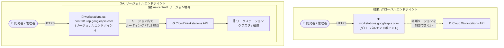

# Cloud Workstations: リージョナルエンドポイントが一般提供 (GA) に

**リリース日**: 2026-09-23

**サービス**: Cloud Workstations

**機能**: リージョナルエンドポイント (workstations.REGION.rep.googleapis.com)

**ステータス**: GA (一般提供)

📊 [このアップデートのインフォグラフィックを見る](https://takech9203.github.io/google-cloud-news-summary/20260923-cloud-workstations-regional-endpoints-ga.html)

## 概要

Cloud Workstations のリージョナルエンドポイント (`workstations.REGION.rep.googleapis.com`) が一般提供 (GA) になりました。リージョナルエンドポイントを使用すると、Cloud Workstations API への HTTPS 接続のルーティングと TLS 終端が指定したリージョン内で行われ、転送中のデータ (data in transit) が選択したリージョン境界内に留まります。

このアップデートは、データレジデンシー (データ所在地) 要件やデータ主権に関する規制への対応が求められる金融、公共、医療などの規制業界のユーザーにとって特に重要です。従来のグローバルエンドポイント (`workstations.googleapis.com`) では、API リクエストがどのリージョンの Google フロントエンドで終端されるかを制御できませんでしたが、リージョナルエンドポイントによりネットワーク経路レベルでの地理的制御が可能になります。

Google Cloud CLI の `gcloud workstations` コマンドグループでもリージョナルエンドポイントを構成して利用できます。

**アップデート前の課題**

このアップデート以前は、以下の課題がありました。

- Cloud Workstations API へのアクセスはグローバルエンドポイント経由のみで、リクエストの経路や TLS 終端の場所を特定リージョンに限定できなかった
- 転送中のデータが指定リージョン外を経由する可能性があり、厳格なデータレジデンシー要件を満たすことが難しかった
- データ主権に関する規制対応のため、API トラフィックの地理的境界を保証する手段が Cloud Workstations には用意されていなかった

**アップデート後の改善**

今回の GA により、以下が可能になりました。

- リージョン固有のエンドポイント (`workstations.REGION.rep.googleapis.com`) を使用して、HTTPS 接続のルーティングと終端を特定リージョン内に限定できるようになった
- 転送中のデータが選択したリージョン境界内に留まるため、データレジデンシー要件への対応が容易になった
- `gcloud workstations` コマンドグループでリージョナルエンドポイントを構成できるようになり、CLI ベースの運用でも地理的制御を適用できるようになった

## アーキテクチャ図



グローバルエンドポイントでは API リクエストの終端場所を制御できませんが、リージョナルエンドポイントを使用するとルーティングと HTTPS (TLS) 終端が指定リージョン内で完結し、転送中のデータがリージョン境界内に留まります。

## サービスアップデートの詳細

### 主要機能

1. **リージョン内でのルーティングと TLS 終端**
   - `workstations.REGION.rep.googleapis.com` 形式のエンドポイントに対するリクエストは、指定したリージョン内でルーティングおよび HTTPS 接続の終端が行われる
   - 転送中のデータが選択したリージョン境界内に留まり、データレジデンシー要件への対応を支援する

2. **8 リージョンでの提供**
   - GA 時点で APAC、ヨーロッパ、北米の計 8 リージョンで利用可能 (詳細は「利用可能リージョン」セクションを参照)

3. **gcloud CLI サポート**
   - `gcloud workstations` コマンドグループでリージョナルエンドポイントを構成可能
   - REST API でもリージョナルエンドポイントを直接指定して利用できる

## 技術仕様

### エンドポイント形式

| 項目 | 詳細 |
|------|------|
| グローバルエンドポイント | `workstations.googleapis.com` (従来どおり利用可能) |
| リージョナルエンドポイント | `workstations.REGION.rep.googleapis.com` |
| 例 (アイオワ) | `workstations.us-central1.rep.googleapis.com` |
| 例 (ムンバイ) | `workstations.asia-south1.rep.googleapis.com` |
| データ保護の範囲 | 転送中のデータ (ルーティングと TLS 終端がリージョン内で完結) |

## 設定方法

### 前提条件

1. Cloud Workstations API が有効化されたプロジェクトがあること
2. 利用したいリージョンがリージョナルエンドポイントの提供リージョンに含まれていること

### 手順

#### ステップ 1: gcloud CLI でエンドポイントを上書きする

```bash
# Cloud Workstations API のエンドポイントをリージョナルエンドポイントに設定
gcloud config set api_endpoint_overrides/workstations \
    https://workstations.us-central1.rep.googleapis.com/
```

以降の `gcloud workstations` コマンドは、指定したリージョナルエンドポイント経由で実行されます。

#### ステップ 2: REST API でリージョナルエンドポイントを直接呼び出す

```bash
# リージョナルエンドポイント経由でワークステーションクラスタを一覧表示
curl -H "Authorization: Bearer $(gcloud auth print-access-token)" \
    "https://workstations.us-central1.rep.googleapis.com/v1/projects/PROJECT_ID/locations/us-central1/workstationClusters"
```

エンドポイントのリージョンとリソースのロケーションを一致させて利用します。

## メリット

### ビジネス面

- **データレジデンシー要件への対応**: 転送中のデータが指定リージョン内に留まるため、業界規制や国・地域のデータ所在地要件を満たすアーキテクチャを構築しやすくなる
- **規制業界での採用促進**: 金融、公共、医療など、データ主権要件の厳しい業界でも Cloud Workstations を利用したクラウド開発環境の導入判断がしやすくなる

### 技術面

- **ネットワーク経路の地理的制御**: HTTPS 接続のルーティングと TLS 終端がリージョン内で完結し、API トラフィックの経路を明確に把握・統制できる
- **既存ワークフローとの互換性**: gcloud CLI と REST API の双方でサポートされ、エンドポイント指定の変更のみで既存の運用フローに組み込める

## デメリット・制約事項

### 制限事項

- GA 時点で利用可能なリージョンは 8 リージョンに限定される (東京・大阪など日本リージョンは現時点で対象外)
- リージョナルエンドポイントはエンドポイントのリージョンに対応するリソースへのアクセスに使用するため、複数リージョンを扱う場合はリージョンごとのエンドポイント指定が必要

### 考慮すべき点

- グローバルエンドポイントは引き続き利用可能なため、データレジデンシー要件の有無に応じてどちらを使用するか方針を定める必要がある
- 組織全体でデータ境界を強制したい場合は、Assured Workloads や組織ポリシーなど他の統制手段との併用を検討する

## ユースケース

### ユースケース 1: データレジデンシー要件のある金融機関の開発環境

**シナリオ**: 米国内でのデータ処理が義務付けられている金融機関が、Cloud Workstations でリモート開発環境を提供する。API 管理トラフィックを含め、転送中のデータを米国内に留める必要がある。

**実装例**:
```bash
gcloud config set api_endpoint_overrides/workstations \
    https://workstations.us-east4.rep.googleapis.com/

gcloud workstations clusters create secure-dev-cluster \
    --region=us-east4 \
    --project=PROJECT_ID
```

**効果**: ワークステーション管理 API への接続が us-east4 リージョン内でルーティング・終端され、転送中のデータがリージョン境界内に留まることで、コンプライアンス要件を満たした開発基盤を運用できる。

### ユースケース 2: インド国内のデータ境界を求められる開発チーム

**シナリオ**: インドのデータローカライゼーション要件に対応するため、開発環境の管理トラフィックを asia-south1 (ムンバイ) 内に限定したい。

**効果**: `workstations.asia-south1.rep.googleapis.com` を使用することで、Cloud Workstations API への接続がインド国内のリージョンで終端され、国内データ境界の維持を支援する。

## 料金

リージョナルエンドポイントの利用自体に関する追加料金はリリースノートに記載されていません。Cloud Workstations 自体の料金 (管理料金、コンピュート、ストレージ) は通常どおり適用されます。詳細は料金ページを参照してください。

- [Cloud Workstations 料金ページ](https://cloud.google.com/workstations/pricing)

## 利用可能リージョン

GA 時点でリージョナルエンドポイントが利用可能なリージョンは以下の 8 リージョンです。

| リージョン | ロケーション | 地域 |
|-----------|-------------|------|
| asia-south1 | ムンバイ (インド) | APAC |
| europe-west6 | チューリッヒ (スイス) | ヨーロッパ |
| us-central1 | カウンシルブラフス (アイオワ州) | 北米 |
| us-east1 | モンクスコーナー (サウスカロライナ州) | 北米 |
| us-east4 | アッシュバーン (バージニア州) | 北米 |
| us-east5 | コロンバス (オハイオ州) | 北米 |
| us-west1 | ザ・ダレス (オレゴン州) | 北米 |
| us-west4 | ラスベガス (ネバダ州) | 北米 |

## 関連サービス・機能

- **リージョナルサービスエンドポイント (REP)**: Cloud SQL、Compute Engine、Cloud Storage など他の Google Cloud サービスでも同形式 (`SERVICE.REGION.rep.googleapis.com`) のリージョナルエンドポイントが提供されており、データレジデンシー対応の共通パターンとして利用できる
- **Assured Workloads**: 国・地域ごとのデータ境界 (Data Boundary) をワークロード全体に適用する統制機能で、リージョナルエンドポイントと組み合わせてコンプライアンス対応を強化できる
- **Private Service Connect / Private Google Access**: VPC 内からリージョナル Google API エンドポイントにアクセスする際の接続手段として利用される
- **VPC Service Controls**: サービス境界による API アクセス統制と組み合わせることで、データ漏えい対策を多層的に構成できる

## 参考リンク

- 📊 [インフォグラフィック](https://takech9203.github.io/google-cloud-news-summary/20260923-cloud-workstations-regional-endpoints-ga.html)
- [公式リリースノート](https://docs.cloud.google.com/release-notes#September_23_2026)
- [リージョナルサービスエンドポイントのドキュメント](https://docs.cloud.google.com/vpc/docs/regional-service-endpoints)
- [Cloud Workstations ドキュメント](https://cloud.google.com/workstations/docs)
- [Cloud Workstations REST API リファレンス](https://cloud.google.com/workstations/docs/reference/rest)
- [料金ページ](https://cloud.google.com/workstations/pricing)

## まとめ

Cloud Workstations のリージョナルエンドポイント GA により、API への転送中データを指定リージョン境界内に留めることが可能になり、データレジデンシー要件の厳しい組織でも Cloud Workstations を採用しやすくなりました。規制業界で Cloud Workstations の導入を検討している場合は、対象リージョンが提供リストに含まれているかを確認し、gcloud CLI のエンドポイント設定から評価を始めることをおすすめします。

---

**タグ**: Cloud Workstations, リージョナルエンドポイント, データレジデンシー, GA, セキュリティ, コンプライアンス, ネットワーク
