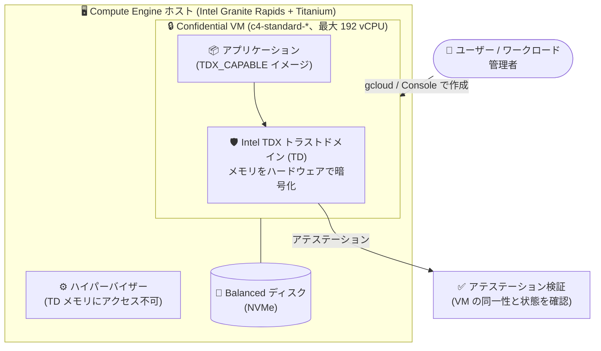

# Confidential VM: c4-standard-* マシンタイプでの Intel TDX サポートが GA

**リリース日**: 2026-09-23

**サービス**: Confidential VM (Compute Engine)

**機能**: c4-standard-* マシンタイプでの Intel TDX サポート

**ステータス**: GA (一般提供)

📊 [このアップデートのインフォグラフィックを見る](https://takech9203.github.io/google-cloud-news-summary/20260923-confidential-vm-intel-tdx-c4-standard-ga.html)

## 概要

Compute Engine の Confidential VM において、最新世代の汎用マシンシリーズである C4 (`c4-standard-*`) での Intel TDX (Trust Domain Extensions) サポートが一般提供 (GA) になりました。Confidential VM 対応の C4 インスタンスは第 6 世代 Intel Xeon Scalable プロセッサ (Granite Rapids) 上で動作し、最大 192 vCPU までの構成で、使用中データをハードウェアレベルで暗号化する TEE (Trusted Execution Environment) を利用できます。

Intel TDX は、VM 内部に隔離されたトラストドメイン (TD) を作成し、ハードウェア拡張機能によってメモリの管理と暗号化を行う Confidential Computing 技術です。暗号鍵は専用ハードウェアで生成・保持されハイパーバイザーからアクセスできず、DRAM のオフライン解析やメモリ内容のキャプチャ・改ざん・再配置といった物理アクセスを伴う攻撃への防御を強化します。アテステーションにより、VM の同一性と状態 (主要コンポーネントが改ざんされていないこと) も検証できます。

対象ユーザーは、機密データを扱うワークロードを最新世代 CPU の高い価格性能比で運用したいユーザーです。C4 シリーズは Titanium IPU、Intel AMX (深層学習の学習・推論を高速化する内蔵アクセラレータ)、全コア持続ターボ 3.9 GHz (Granite Rapids) などを特長とし、Web/アプリケーションサービング、データベース、分析、CPU ベースの ML 推論などに適しています。

**アップデート前の課題**

- Intel TDX の Confidential VM が GA で利用できる汎用マシンシリーズは C3 系 (第 4 世代 Intel Xeon / Sapphire Rapids) が中心で、`c3-standard-*` (2024-09 GA) と `c3-standard-*-lssd` (2026-09-02 GA) に限られていた
- 最新世代の C4 シリーズが持つ高いシングルコア性能や Titanium、Intel AMX などの利点を、TEE (Intel TDX) と組み合わせて本番ワークロードで利用する GA の選択肢がなかった
- C3 の TDX 構成では最大 176 vCPU (c3-standard-176) が上限で、それを超える大規模な機密ワークロードに対応しにくかった

**アップデート後の改善**

- `c4-standard-*` マシンタイプで Intel TDX を有効にした Confidential VM を GA として作成できるようになった
- 第 6 世代 Intel Xeon (Granite Rapids) ベースの Confidential VM により、最大 192 vCPU までの大規模構成で使用中データの暗号化が可能になった
- TDX 対応ゾーンが 7 リージョン 15 ゾーンに広がり、C3 系にはない europe-west1 などでも TDX の Confidential VM を選択できるようになった

## アーキテクチャ図



`c4-standard-*` マシンタイプ上で Intel TDX のトラストドメインがワークロードのメモリをハードウェア暗号化で保護し、ハイパーバイザーからの隔離を実現します。アテステーションで VM の完全性を検証した上で、機密データの処理を開始できます。

## サービスアップデートの詳細

### 主要機能

1. **c4-standard-* での Intel TDX が GA**
   - 最新世代の汎用マシンシリーズ C4 で、Intel TDX ベースの Confidential VM を一般提供として作成可能
   - Confidential VM (Intel TDX) は Granite Rapids プロセッサ上で最大 192 vCPU をサポート (Emerald Rapids では Intel TDX は利用不可)

2. **ハードウェアベースの隔離とアテステーション**
   - 暗号鍵は専用ハードウェアで生成・保持され、ハイパーバイザーからアクセス不可
   - アテステーションにより、VM の同一性と状態 (主要コンポーネントが改ざんされていないこと) を検証可能

3. **C4 シリーズの性能特性を TEE で利用可能**
   - Titanium IPU による高いネットワーク・ストレージ性能、Intel AMX による CPU ベース ML 推論の高速化
   - Granite Rapids は全コア持続ターボ 3.9 GHz / 最大ターボ 4.2 GHz を提供

## 技術仕様

### サポート構成

| 項目 | 詳細 |
|------|------|
| マシンタイプ | `c4-standard-*` |
| CPU プラットフォーム | Intel Granite Rapids (第 6 世代 Intel Xeon Scalable) |
| Confidential Computing 技術 | Intel TDX |
| 最大 vCPU 数 (Confidential VM) | 192 vCPU (Intel TDX の上限) |
| メモリ比 | 3.75 GB / vCPU (c4-standard) |
| ライブマイグレーション | 非サポート (メンテナンスポリシーは `TERMINATE` を指定) |
| GPU / ローカル SSD | 非サポート (TDX のローカル SSD は `c3-standard-*-lssd` のみ) |
| 永続ディスク | NVMe インターフェースの Balanced ボリュームのみサポート |
| サポート OS イメージ | `TDX_CAPABLE` タグ付きイメージ (gcloud で確認可能) |

## 設定方法

### 前提条件

1. Intel TDX + `c4-standard-*` をサポートするゾーンを選択する (「利用可能リージョン」参照)
2. `TDX_CAPABLE` の OS イメージを使用する
3. Confidential VM は新規作成が必要 (既存インスタンスを Confidential VM に変換することはできない)

### 手順

#### ステップ 1: サポートされる OS イメージの確認

```bash
gcloud compute images list \
    --filter="guestOsFeatures[].type:(TDX_CAPABLE)"
```

`TDX_CAPABLE` タグが付いたイメージが Intel TDX の隔離とアテステーションをサポートします。

#### ステップ 2: Intel TDX を有効にした c4-standard インスタンスを作成

```bash
gcloud compute instances create my-tdx-c4-instance \
    --machine-type=c4-standard-8 \
    --zone=us-central1-a \
    --confidential-compute-type=TDX \
    --maintenance-policy=TERMINATE \
    --image-family=ubuntu-2404-lts-amd64 \
    --image-project=ubuntu-os-cloud
```

`--confidential-compute-type=TDX` で Intel TDX を指定します。ライブマイグレーションがサポートされないため、`--maintenance-policy=TERMINATE` を指定します。

## メリット

### ビジネス面

- **コンプライアンス対応と最新世代性能の両立**: 使用中データの暗号化が求められる規制業界のワークロードを、最新世代 C4 の価格性能比の下で GA サポート付きで運用できる
- **本番運用の安心感**: GA となったことで、SLA を含めて本番ワークロードへの適用判断がしやすくなる

### 技術面

- **最新世代 CPU での TEE 実行**: Granite Rapids (第 6 世代 Xeon) の高いシングルコア性能・全コアターボと Intel TDX のハードウェアメモリ暗号化を同一インスタンスで利用できる
- **大規模構成への対応**: 最大 192 vCPU の Confidential VM を構成でき、C3 系 TDX の最大 176 vCPU を上回るスケールが可能
- **ハイパーバイザーからの隔離とアテステーション**: 暗号鍵は専用ハードウェア内にのみ存在し、VM の完全性を検証した上でワークロードを実行できる

## デメリット・制約事項

### 制限事項 (Intel TDX)

- Intel TDX がサポートする vCPU 数は最大 192 (c4-standard-288 などは対象外)
- ローカル SSD は `c3-standard-*-lssd` マシンタイプでのみサポート (C4 の TDX 構成では利用不可)
- ライブマイグレーションは非サポート
- 標準 VM と比較してシャットダウンに時間がかかる (メモリサイズが大きいほど遅延が増加)
- 永続ディスクは NVMe インターフェースの Balanced ボリュームのみサポート
- 単一テナントノードグループ (sole-tenant node groups) でのプロビジョニング不可
- セキュリティ上の制約により、CPUID 命令が返す CPU アーキテクチャ情報が制限される場合があり、CPUID 値に依存するワークロードの性能に影響する可能性がある
- kdump は非サポート (代わりにゲストコンソールログを使用)
- TDX halt 修正パッチが未適用のゲストイメージでは halt 時間が長くなり性能が劣化する可能性がある
- Intel TDX の Confidential VM は予約 (reservations) をサポートしない

### 考慮すべき点 (Confidential VM 共通)

- 既存インスタンスの Confidential VM への変換は不可 (新規作成が必要)
- ディスクは NVMe インターフェースが必須 (SCSI 非サポート)、アタッチ可能なディスクは最大 40 個
- メモリ量に比例してブート時間が長くなり、SSH 接続の確立にも通常の VM より時間がかかる
- 非 Confidential VM と比較してネットワーク帯域幅が低下し、レイテンシが増加する可能性がある
- 現時点で日本リージョン (asia-northeast1 など) はサポートゾーンに含まれていない

## ユースケース

### ユースケース 1: 規制業界の基幹アプリケーションの最新世代への移行

**シナリオ**: 金融・医療などの規制業界で、個人情報を含むデータを処理するアプリケーションサーバーやデータベースを運用している。使用中データの暗号化 (Confidential Computing) を維持したまま、旧世代マシンからの性能向上とコスト最適化を図りたい。

**実装例**:
```bash
gcloud compute instances create secure-app-server \
    --machine-type=c4-standard-16 \
    --zone=asia-southeast1-a \
    --confidential-compute-type=TDX \
    --maintenance-policy=TERMINATE \
    --image-family=ubuntu-2404-lts-amd64 \
    --image-project=ubuntu-os-cloud
```

**効果**: N2D/C3 世代の Confidential VM から、Granite Rapids ベースの C4 に移行することで、使用中データの保護を維持したままシングルコア性能とネットワーク性能の向上が期待できる。

### ユースケース 2: TEE 内での CPU ベース ML 推論

**シナリオ**: 機密データ (顧客情報、診療データなど) を入力とする ML 推論を、クラウド事業者の運用者やハイパーバイザーからも隔離された環境で実行したい。GPU を使うほどではない CPU 推論ワークロードが対象。

**効果**: C4 がサポートする Intel AMX (深層学習の学習・推論を高速化する内蔵アクセラレータ) を Intel TDX のトラストドメイン内で利用でき、機密データを暗号化されたメモリ上で処理しながら推論性能を確保できる。

## 料金

Confidential VM は、ベースとなるマシンタイプの料金に加えて Confidential Computing の利用料金が発生します。詳細な料金は公式料金ページを参照してください。

- [Confidential VM の料金](https://docs.cloud.google.com/confidential-computing/confidential-vm/pricing)
- [Compute Engine の料金 (VM インスタンス)](https://cloud.google.com/compute/vm-instance-pricing)

なお、Intel TDX の Confidential VM は予約 (reservations) をサポートしないため、確約利用割引 (CUD) や消費オプションの適用可否は事前に確認してください。

## 利用可能リージョン

`c4-standard-*` マシンタイプでの Intel TDX は、以下の 7 リージョン 15 ゾーンでサポートされています。

| リージョン | ゾーン |
|-----------|--------|
| asia-southeast1 | asia-southeast1-a、asia-southeast1-b、asia-southeast1-c |
| europe-west1 | europe-west1-b |
| europe-west3 | europe-west3-a、europe-west3-b |
| europe-west4 | europe-west4-a、europe-west4-b |
| us-central1 | us-central1-a、us-central1-b、us-central1-f |
| us-east4 | us-east4-a、us-east4-b、us-east4-c |
| us-west1 | us-west1-a |

## 関連サービス・機能

- **C3 系の Intel TDX Confidential VM**: `c3-standard-*` (2024-09 GA) および `c3-standard-*-lssd` (2026-09-02 GA)。ローカル SSD が必要な TDX ワークロードは引き続き `c3-standard-*-lssd` を選択する ([関連レポート](2026-09-02-confidential-vm-intel-tdx-c3-lssd-ga.md))
- **Titanium**: C4 シリーズが搭載する Google のオフロード基盤 (IPU)。ネットワーク・ストレージ処理をオフロードし高い性能を提供
- **Intel AMX**: C4 がサポートする深層学習向け内蔵アクセラレータ。CPU ベースの ML 推論を高速化
- **アテステーション**: Confidential VM の同一性と状態を検証する仕組み。TEE の信頼性確認に利用
- **NVIDIA Confidential Computing**: GPU ワークロード向けには A3 High (Intel TDX + NVIDIA H100) や G4 などの構成が別途提供されている

## 参考リンク

- 📊 [インフォグラフィック](https://takech9203.github.io/google-cloud-news-summary/20260923-confidential-vm-intel-tdx-c4-standard-ga.html)
- [公式リリースノート](https://docs.cloud.google.com/release-notes#September_23_2026)
- [Confidential VM の概要](https://docs.cloud.google.com/confidential-computing/confidential-vm/docs/confidential-vm-overview)
- [サポートされる構成 (マシンタイプ、CPU、ゾーン)](https://docs.cloud.google.com/confidential-computing/confidential-vm/docs/supported-configurations#machine-type-cpu-zone)
- [C4 マシンシリーズ (汎用マシンファミリー)](https://docs.cloud.google.com/compute/docs/general-purpose-machines#c4_series)
- [Confidential VM インスタンスの作成](https://docs.cloud.google.com/confidential-computing/confidential-vm/docs/create-a-confidential-vm-instance)
- [料金ページ](https://docs.cloud.google.com/confidential-computing/confidential-vm/pricing)

## まとめ

`c4-standard-*` での Intel TDX サポートの GA により、最新世代の Granite Rapids ベース C4 シリーズで、最大 192 vCPU までの Confidential VM を本番運用できるようになりました。C3 系の TDX を利用中のチームや、Confidential Computing の導入を検討しているチームは、サポートゾーン (7 リージョン 15 ゾーン)、ライブマイグレーション・予約の非対応、ローカル SSD 非対応 (C4 構成) などの制約を確認した上で、C4 への採用・移行を検討することを推奨します。

---

**タグ**: #ConfidentialVM #ComputeEngine #IntelTDX #ConfidentialComputing #C4 #GraniteRapids #Security #GA
