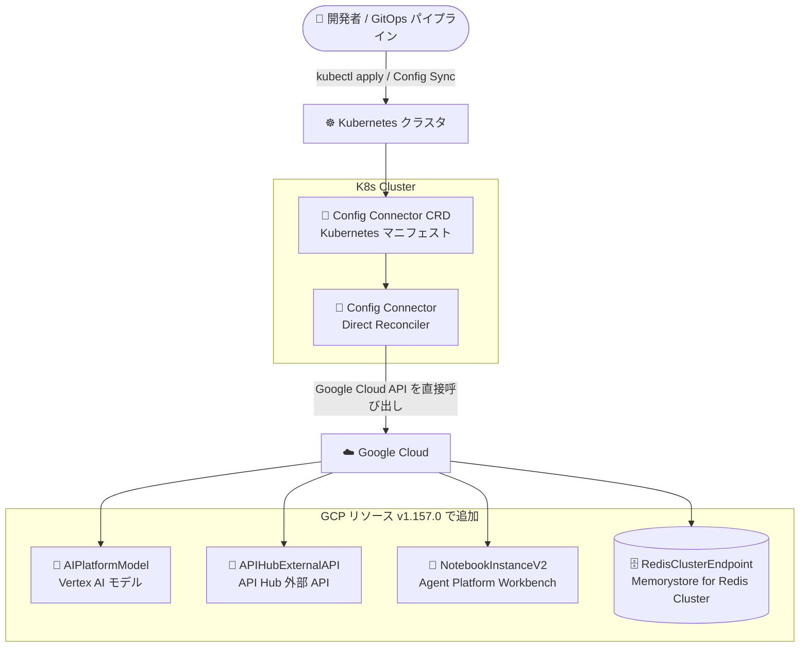

# Config Connector: バージョン 1.157.0 リリース

**リリース日**: 2026-09-23

**サービス**: Config Connector

**機能**: バージョン 1.157.0 (新規 Alpha リソース、新規フィールド、バグ修正)

**ステータス**: Announcement / Feature (Alpha リソースを含む)

📊 [このアップデートのインフォグラフィックを見る](https://takech9203.github.io/google-cloud-news-summary/20260923-config-connector-1-157-0.html)

## 概要

Config Connector バージョン 1.157.0 がリリースされた。Config Connector は Kubernetes のアドオン (オープンソース) であり、Kubernetes の CRD (Custom Resource Definition) とコントローラを通じて Google Cloud リソースを宣言的に管理できる。今回のリリースでは、Direct Reconciler を使用する 4 つの新しい Alpha リソースが追加され、Vertex AI モデル、API Hub の外部 API、Agent Platform Workbench インスタンス、Memorystore for Redis Cluster のエンドポイントを Kubernetes マニフェストで管理できるようになった。

また、`NetworkServicesEdgeCacheService` リソースに `routeMethods` と `compressionMode` のサポートが追加されたほか、`NetworkConnectivityInternalRange` の継続的な reconciliation ループと 400 エラーの修正、非推奨となった BeyondCorp Enterprise クライアントコネクタに対応する `BeyondCorpClientGateway` のサポート削除が含まれる。

新規リソースはいずれも Direct Reconciler で実装されている。Direct コントローラは Terraform ベースや DCL ベースのコントローラと異なり、Google Cloud Go SDK を使用して Google Cloud API と直接通信するため、リソース消費の削減、reconciliation レイテンシの改善、構造化された差分レポート、`status.observedState` によるネイティブな状態参照などの利点がある。GitOps で Google Cloud インフラを管理しているプラットフォームチームや、AI/ML 関連リソースを Kubernetes ネイティブに管理したいチームが対象となる。

**アップデート前の課題**

- Vertex AI モデル、API Hub 外部 API、Agent Platform Workbench インスタンス、Memorystore for Redis Cluster エンドポイントは Config Connector のリソースとして提供されておらず、gcloud CLI や Terraform など Kubernetes 外のツールで個別に管理する必要があった
- `NetworkServicesEdgeCacheService` ではルーティング対象の HTTP メソッド指定 (`routeMethods`) や圧縮モード (`compressionMode`) を Config Connector 経由で設定できなかった
- `NetworkConnectivityInternalRange` で自動割り当てフィールドを設定すると、reconciliation がループし続け 400 エラーが発生する問題があった

**アップデート後の改善**

- 4 つの新しい Alpha リソース (Direct Reconciler) により、Vertex AI / API Hub / Agent Platform / Memorystore for Redis Cluster のリソースを Kubernetes マニフェストで宣言的に管理できるようになった
- `NetworkServicesEdgeCacheService` で `routeMethods` と `compressionMode` が設定可能になった
- `NetworkConnectivityInternalRange` の継続的な reconciliation ループと 400 エラーが修正され、自動割り当てフィールドを安定して利用できるようになった

## アーキテクチャ図



開発者が Kubernetes マニフェストとして定義した Config Connector リソースを Direct Reconciler が読み取り、Google Cloud API を直接呼び出して 4 つの新しいリソースタイプを作成・管理するフローを示す。

## サービスアップデートの詳細

### 主要機能

1. **新規 Alpha リソース (Direct Reconciler)**
   - `AIPlatformModel`: Vertex AI のモデルを管理
   - `APIHubExternalAPI`: API Hub の外部 API を管理
   - `NotebookInstanceV2`: Agent Platform Workbench インスタンスを管理
   - `RedisClusterEndpoint`: Memorystore for Redis Cluster のエンドポイントを管理

2. **新規フィールド: NetworkServicesEdgeCacheService**
   - `routeMethods` のサポートを追加
   - `compressionMode` のサポートを追加

3. **バグ修正: NetworkConnectivityInternalRange**
   - 自動割り当てフィールドを設定した際に発生していた継続的な reconciliation ループを修正
   - 同条件で発生していた 400 エラーを修正

4. **サポート削除: BeyondCorpClientGateway**
   - 非推奨となった BeyondCorp Enterprise クライアントコネクタのサポートを削除

## 技術仕様

### Direct Reconciler (Direct コントローラ) の特徴

Config Connector には Direct、Terraform ベース、DCL ベース、IAM 専用の 4 種類のコントローラがあり、新規リソースはデフォルトで Direct コントローラを使用する。

| 項目 | 詳細 |
|------|------|
| 実装 | Kubernetes controller-runtime + Google Cloud Go SDK による直接 API 呼び出し |
| リソース消費 | Terraform / DCL の変換オーバーヘッドがなく CPU・メモリ消費を削減 |
| レイテンシ | Google Cloud エンドポイントへの直接操作により reconciliation の収束が高速 |
| 可観測性 | `cnrm-controller-manager` ログに構造化された差分 (structured diff) を出力 |
| 状態参照 | `status.observedState` に Google Cloud API が返すサーバー側の状態を反映 |
| ライフサイクル | graceful orphan deletion などの改善されたライフサイクル処理 |

### 今回追加されたリソースの位置づけ

| リソース | 対象サービス | ステータス |
|----------|-------------|-----------|
| `AIPlatformModel` | Vertex AI (モデル) | Alpha |
| `APIHubExternalAPI` | API Hub (外部 API) | Alpha |
| `NotebookInstanceV2` | Agent Platform Workbench インスタンス | Alpha |
| `RedisClusterEndpoint` | Memorystore for Redis Cluster (エンドポイント) | Alpha |

すべての Config Connector リソースは Kubernetes API グループ `cnrm.cloud.google.com` に属する。

## 設定方法

### 前提条件

1. Config Connector がクラスタにインストールされていること (バージョン 1.157.0 へのアップグレードが必要)
2. Config Connector の IAM サービスアカウントに、管理対象リソース (Vertex AI、API Hub、Memorystore など) を操作する権限が付与されていること
3. Alpha リソースを使用する場合は、Alpha ステータスであることを理解した上で検証環境から利用すること

### 手順

#### ステップ 1: 利用可能な CRD の確認

```bash
# Config Connector が管理する CRD の一覧を確認
kubectl get crds --selector cnrm.cloud.google.com/managed-by-kcc=true
```

アップグレード後、新しいリソースタイプが CRD として登録されていることを確認する。

#### ステップ 2: マニフェストの作成と適用

```bash
# 例: リソースのマニフェストを適用
kubectl apply -f <resource-manifest>.yaml

# リソースの reconciliation 状態を確認
kubectl describe <resource-kind> <resource-name>
```

リソースの `status.condition` が `Ready: True` になれば、Google Cloud 側のリソースが作成・同期されている。各リソースの具体的なフィールド定義は、対応する CRD (`kubectl describe crd`) または[リソースリファレンス](https://docs.cloud.google.com/config-connector/docs/reference/resources)で確認できる。

## メリット

### ビジネス面

- **AI/ML インフラの GitOps 管理**: Vertex AI モデルや Agent Platform Workbench インスタンスをコードとしてリポジトリで管理でき、変更のレビュー・監査・ロールバックが容易になる
- **ツールの一元化**: Kubernetes アプリケーションと Google Cloud インフラを同じツールチェーン (kubectl、Config Sync など) で管理でき、運用の認知負荷を軽減できる

### 技術面

- **Direct Reconciler による信頼性**: 新規リソースはすべて Direct コントローラで実装されており、構造化差分ログや `status.observedState` によりトラブルシューティングが容易
- **reconciliation の安定化**: `NetworkConnectivityInternalRange` のループ・400 エラー修正により、自動割り当てフィールドを使う構成の安定性が向上
- **Media CDN 構成の拡張**: `NetworkServicesEdgeCacheService` の `routeMethods` / `compressionMode` により、Kubernetes マニフェストで表現できる構成の幅が広がった

## デメリット・制約事項

### 制限事項

- 新規追加された 4 リソースはいずれも Alpha ステータスであり、API が変更される可能性があるため本番環境での利用は慎重に判断する必要がある
- `BeyondCorpClientGateway` は非推奨の BeyondCorp Enterprise クライアントコネクタのサポートが削除されたため、該当リソースを使用している場合は移行が必要

### 考慮すべき点

- Config Connector の reconciliation は Config Connector の IAM サービスアカウントの権限で実行されるため、新しいリソースタイプを利用する際は対応する権限の付与とアクセス制御 (RBAC) の設計が必要
- Alpha リソースの CRD 定義はバージョンごとに変わり得るため、アップグレード時はリリースノートの確認を推奨

## ユースケース

### ユースケース 1: Vertex AI モデルの宣言的管理

**シナリオ**: ML プラットフォームチームが、Vertex AI 上のモデルリソースを GitOps ワークフローで管理したい。従来は gcloud CLI や Terraform で個別管理していたため、Kubernetes 上のサービング基盤と管理方法が分断されていた。

**実装例**:
```yaml
# AIPlatformModel リソースを Kubernetes マニフェストとして定義し、
# Config Sync などで Git リポジトリから自動適用する
# (フィールド定義は kubectl describe crd で確認)
```

**効果**: モデルリソースの定義が Git で一元管理され、変更履歴の追跡と環境間の一貫性確保が容易になる。

### ユースケース 2: Memorystore for Redis Cluster エンドポイントの自動構成

**シナリオ**: アプリケーションチームが Redis Cluster とその接続エンドポイントを、アプリケーションのデプロイと同じ Kubernetes マニフェストで管理したい。

**効果**: `RedisClusterEndpoint` リソースにより、クラスタのエンドポイント構成も含めて宣言的に管理でき、環境構築の再現性が向上する。

## 料金

Config Connector 自体はオープンソースの Kubernetes アドオンとして提供される。Config Connector で作成・管理する Google Cloud リソース (Vertex AI、Memorystore、Media CDN など) には、各サービスの通常料金が適用される。詳細は各サービスの料金ページを参照。

- [Vertex AI の料金](https://cloud.google.com/vertex-ai/pricing)
- [Memorystore の料金](https://cloud.google.com/memorystore/pricing)

## 関連サービス・機能

- **GKE / Config Controller**: Config Connector の実行基盤。Config Controller はマネージドな Config Connector 環境を提供する
- **Config Sync**: Git リポジトリのマニフェストをクラスタに同期する GitOps ツール。Config Connector と組み合わせてインフラの GitOps 管理を実現する
- **Vertex AI**: `AIPlatformModel` で管理対象となる ML プラットフォーム
- **API Hub**: `APIHubExternalAPI` で管理対象となる API 管理サービス
- **Memorystore for Redis Cluster**: `RedisClusterEndpoint` で管理対象となるマネージド Redis サービス
- **Media CDN (Network Services)**: `NetworkServicesEdgeCacheService` の対象サービス

## 参考リンク

- 📊 [インフォグラフィック](https://takech9203.github.io/google-cloud-news-summary/20260923-config-connector-1-157-0.html)
- [公式リリースノート](https://docs.cloud.google.com/release-notes#September_23_2026)
- [Config Connector 概要](https://docs.cloud.google.com/config-connector/docs/overview)
- [Config Connector コントローラタイプ (Direct コントローラ)](https://docs.cloud.google.com/config-connector/docs/concepts/controller-types)
- [Config Connector リソースリファレンス](https://docs.cloud.google.com/config-connector/docs/reference/resources)
- [k8s-config-connector (GitHub)](https://github.com/GoogleCloudPlatform/k8s-config-connector)

## まとめ

Config Connector 1.157.0 では、Vertex AI モデルや Agent Platform Workbench インスタンスなど AI/ML 関連を含む 4 つの新しい Alpha リソースが Direct Reconciler で追加され、Kubernetes ネイティブに管理できる Google Cloud リソースの範囲がさらに広がった。GitOps で Google Cloud インフラを管理しているチームは、検証環境で新リソースを試しつつ、`NetworkConnectivityInternalRange` の修正や `BeyondCorpClientGateway` のサポート削除の影響を確認した上でアップグレードを計画することを推奨する。

---

**タグ**: Config Connector, Kubernetes, GitOps, Direct Reconciler, Vertex AI, API Hub, Memorystore for Redis Cluster, Media CDN, Alpha
