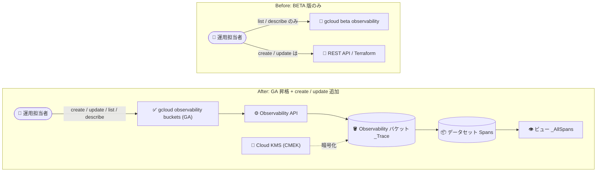

# Cloud Trace / Observability: gcloud observability コマンドが GA に昇格、buckets create / update メソッドを追加

**リリース日**: 2026-09-23

**サービス**: Cloud Trace (Google Cloud Observability)

**機能**: gcloud observability コマンドグループの GA 昇格と buckets create / update メソッドの追加

**ステータス**: GA (一般提供)

📊 [このアップデートのインフォグラフィックを見る](https://takech9203.github.io/google-cloud-news-summary/20260923-gcloud-observability-commands-ga.html)

## 概要

Google Cloud CLI バージョン 586.0.0 において、`gcloud observability` コマンドグループが BETA から GA (一般提供) に昇格しました。あわせて、`gcloud observability buckets` コマンドグループに `create` と `update` メソッドが追加され、observability バケットの作成・更新が gcloud CLI から直接実行できるようになりました。

Observability バケットは、Cloud Trace のトレースデータ (スパン) などのテレメトリーデータを格納するデータセットの管理エンティティです。バケットは特定のロケーションに配置され、データ保持ポリシーを持ちます。例えば Cloud Trace の場合、システムは `_Trace` という名前のバケット、`Spans` というデータセット、`_AllSpans` というビューを作成します。データレジデンシー (データの保存場所) や顧客管理暗号鍵 (CMEK) の要件を持つ組織にとって、バケットを事前に明示的なロケーション・暗号鍵で作成できることは、コンプライアンス対応の重要な手段となります。

このアップデートにより、Observability API のストレージ管理操作が安定版コマンドとして利用可能になり、本番環境の運用スクリプトや CI/CD パイプラインへの組み込みが安心して行えるようになりました。対象ユーザーは、Cloud Trace を利用するすべてのプロジェクトの運用担当者、特にデータレジデンシーや CMEK のコンプライアンス要件を持つ組織の管理者です。

**アップデート前の課題**

- `gcloud observability` コマンドは BETA 版 (`gcloud beta observability`) としてのみ提供されており、GA レベルの安定性保証がなかったため、本番運用の自動化スクリプトへの組み込みには注意が必要だった
- gcloud CLI から observability バケットを作成・更新する方法が提供されておらず、バケットの作成には REST API (`projects.locations.buckets.create`) や Terraform を使用する必要があった
- バケットのロケーションや CMEK を明示的に指定して事前作成するワークフローを CLI だけで完結できなかった

**アップデート後の改善**

- `gcloud observability` コマンドグループが GA となり、安定したインターフェースとして本番運用の自動化に利用できるようになった
- `gcloud observability buckets create` コマンドにより、トレースデータの受信前に `_Trace` バケットをロケーション・CMEK を指定して事前作成できるようになった
- `gcloud observability buckets update` コマンドにより、既存バケットの設定 (説明や Cloud KMS 鍵など) を CLI から更新できるようになった
- `list` / `describe` / `datasets` 系の操作と合わせて、observability バケットのライフサイクル管理が gcloud CLI で一貫して行えるようになった

## アーキテクチャ図



BETA 時代は gcloud で参照系操作しかできず作成・更新は REST API 等が必要でしたが、GA 昇格後は `gcloud observability buckets create` / `update` により、CMEK やロケーションを指定したバケットのライフサイクル管理が CLI で完結します。

## サービスアップデートの詳細

### 主要機能

1. **`gcloud observability` コマンドグループの GA 昇格**
   - BETA トラック (`gcloud beta observability`) で提供されていたコマンド群が GA トラックに昇格
   - 安定版としての後方互換性が期待でき、本番環境の自動化スクリプトや CI/CD パイプラインに組み込みやすくなった
   - BETA バリアント (`gcloud beta observability`) も引き続き利用可能

2. **`gcloud observability buckets create` の追加**
   - Observability バケット (Cloud Trace の場合は `_Trace`) を、トレースデータの受信前に明示的に作成可能
   - ロケーションを指定して作成するため、データレジデンシー要件に対応できる
   - Cloud KMS 鍵 (CMEK) を指定した暗号化に対応。鍵を指定しない場合は、親リソースに適用されるデフォルト設定の鍵、それもなければ Google デフォルト暗号化が使用される
   - 作成リクエストは組織ポリシー (ロケーション制限、CMEK 必須化、使用可能な KMS 鍵の制限) に照らして検証される

3. **`gcloud observability buckets update` の追加**
   - 既存の observability バケットの設定を CLI から更新可能
   - Cloud KMS 鍵の更新などの構成変更に対応

4. **`gcloud observability buckets` コマンドグループの全体像**
   - `create`: バケットの作成
   - `update`: バケットの更新
   - `list`: バケットの一覧表示
   - `describe`: バケットの詳細表示
   - `datasets` サブグループ: バケット内のデータセットの管理 (作成・読み取り・更新・削除)

## 技術仕様

### Observability ストレージモデル

| 要素 | 説明 |
|------|------|
| Observability バケット | データセットの管理エンティティ。特定のロケーションに配置され、データ保持ポリシーを持つ。Cloud Trace ではシステムが `_Trace` という名前で作成 |
| データセット | 実データを格納。`_Trace` バケット作成時に `Spans` データセットが自動作成される |
| ビュー | データセット内のエントリのサブセットへの読み取りアクセスを提供。`Spans` データセットには `_AllSpans` ビューが自動作成される |
| リンク | データセットごとに最大 1 つ。リンクを作成するとリンクされた BigQuery データセットが作成され、BigQuery からクエリ可能になる (自動作成はされない) |

### バケット作成時の制限事項

| 項目 | 制限 |
|------|------|
| ロケーション | サポートされているロケーションを指定する必要がある |
| バケット ID | `_Trace` である必要がある (Cloud Trace の場合) |
| 表示名 | 100 エンコードバイト以下 |
| 説明 | 1,000 エンコードバイト以下 |
| データ保持期間 | 30 日固定 (保持期間は省略するか 30 を指定) |
| CMEK | Cloud KMS 鍵のロケーションはバケットの親ロケーションと完全に一致する必要がある |
| バケット数 | 1 つの Google Cloud プロジェクトにつき `_Trace` バケットは最大 1 つ |
| 親リソース | Google Cloud プロジェクトのみ (組織・フォルダ直下には作成不可) |

### 組織ポリシー・デフォルト設定との相互作用

- 2026 年 6 月 1 日以降、バケット作成フローは「ロケーション制限」「CMEK 必須化」「使用可能な Cloud KMS 鍵の制限」の組織ポリシーを適用する
- システムが自動作成する場合は、親リソースに適用されるデフォルト設定 (デフォルトのストレージロケーションと Cloud KMS 鍵) が使用される
- 明示的に作成する場合はロケーションの指定が必須。CMEK を指定しない場合はデフォルト設定の鍵が適用される
- デフォルト設定で Cloud KMS 鍵が指定されている場合、Google デフォルト暗号化のバケットは作成できない

## 設定方法

### 前提条件

1. gcloud CLI バージョン 586.0.0 以降をインストールしていること (GA コマンドの場合)
2. Observability API が有効化されていること
3. CMEK を使用する場合: Cloud KMS API の有効化、鍵リングと鍵の作成 (バケットとロケーションを一致させる)、Observability サービスアカウントへの `roles/cloudkms.cryptoKeyEncrypterDecrypter` ロールの付与

### 手順

#### ステップ 1: gcloud CLI の更新

```bash
gcloud components update
gcloud version
```

gcloud CLI をバージョン 586.0.0 以降に更新し、GA の `gcloud observability` コマンドを利用可能にします。

#### ステップ 2: (CMEK 使用時) Observability サービスアカウントの確認と権限付与

```bash
# Observability サービスアカウントの確認 (存在しない場合は作成される)
gcloud beta observability settings describe \
    --location=global --project=PROJECT_ID

# Cloud KMS 鍵への権限付与
gcloud kms keys add-iam-policy-binding \
    --project=KMS_PROJECT_ID \
    --member=serviceAccount:service-PROJECT_NUMBER@gcp-sa-observability.iam.gserviceaccount.com \
    --role=roles/cloudkms.cryptoKeyEncrypterDecrypter \
    --location=KMS_KEY_LOCATION \
    --keyring=KMS_KEY_RING \
    KMS_KEY_NAME
```

CMEK でバケットを暗号化する場合は、Google Cloud Observability サービスアカウントに Cloud KMS 鍵の暗号化・復号権限を付与します。

#### ステップ 3: observability バケットの作成

```bash
gcloud observability buckets create _Trace \
    --location=LOCATION \
    --project=PROJECT_ID
```

トレースデータの受信前にバケットを明示的なロケーションで作成します。詳細な引数は `gcloud observability buckets create --help` および公式ドキュメントを参照してください。

#### ステップ 4: バケットの確認

```bash
# 一覧表示 (--location=- で全ロケーションを対象)
gcloud observability buckets list \
    --location=- --project=PROJECT_ID
```

作成したバケットの名前、説明、作成時刻などを確認できます。

## メリット

### ビジネス面

- **コンプライアンス対応の強化**: データレジデンシー要件のある組織が、トレースデータの保存先ロケーションと CMEK を事前に明示指定してバケットを作成でき、組織ポリシーによる強制と合わせてガバナンスを担保できる
- **本番利用への安心感**: GA 昇格により安定性・後方互換性が期待でき、規制業界を含む本番環境の運用手順に正式に組み込める

### 技術面

- **CLI でのライフサイクル管理の完結**: バケットの作成・更新・一覧・詳細表示・データセット管理が gcloud CLI で一貫して実行でき、REST API の直接呼び出しが不要になる
- **自動化との親和性**: プロジェクトのプロビジョニングスクリプトや CI/CD パイプラインに `gcloud observability buckets create` を組み込み、環境構築を再現可能にできる
- **Cloud Run / Cloud Run functions / App Engine 対応**: これらのサービスからのスパンはバケットが存在しないと保存されないため、事前作成コマンドの提供によりトレース欠損を防止できる

## デメリット・制約事項

### 制限事項

- observability バケットの削除はできない (変更は update で可能な範囲に限られる)
- ビューの作成・削除・変更はできない
- Google Cloud コンソールからバケット、データセット、ビュー、リンクの一覧表示はできない (CLI / API のみ)
- データ保持期間は 30 日固定で変更できない
- 1 プロジェクトあたり `_Trace` バケットは 1 つのみ

### 考慮すべき点

- CMEK を使用する場合、Cloud KMS 鍵のロケーションとバケットのロケーションを完全に一致させる必要がある
- 組織ポリシーで CMEK が必須化されている場合、observability バケットのデフォルト設定を構成しておかないと、システムによる自動作成が失敗する
- 一部ドキュメントの手順は BETA コマンド (`gcloud beta observability`) の表記のままの場合があるが、GA 昇格後は `gcloud observability` でも実行可能

## ユースケース

### ユースケース 1: データレジデンシー要件を満たすトレース基盤の事前構築

**シナリオ**: 金融機関が、トレースデータを特定のロケーションに CMEK で暗号化して保存することを社内規程で義務付けている。アプリケーションのデプロイ前に、コンプライアンス要件を満たすストレージを準備したい。

**実装例**:
```bash
# 組織ポリシーでロケーション制限と CMEK 必須化を設定した上で、
# バケットを明示的に事前作成
gcloud observability buckets create _Trace \
    --location=us \
    --project=my-fintech-project
```

**効果**: トレースデータ受信時のシステム自動作成に頼らず、規定のロケーション・暗号鍵で構成されたバケットを確実に用意でき、監査対応が容易になる。

### ユースケース 2: プロジェクトプロビジョニングの自動化

**シナリオ**: プラットフォームチームが数百のプロジェクトを管理しており、新規プロジェクト作成時に observability ストレージを標準構成でセットアップするスクリプトを整備したい。Cloud Run 主体のワークロードのため、バケットの事前作成が必須。

**効果**: GA コマンドをプロビジョニングスクリプトに組み込むことで、Cloud Run / Cloud Run functions / App Engine からのスパンの取りこぼしを防ぎつつ、全プロジェクトで一貫したストレージ構成を自動展開できる。

## 料金

gcloud CLI のコマンド利用自体に追加料金は発生しません。Cloud Trace のトレースデータの取り込みには Cloud Trace の料金体系が適用されます。また、CMEK を使用する場合は Cloud KMS の鍵利用料金が別途発生します。

詳細は以下の料金ページを参照してください。

- [Google Cloud Observability の料金](https://cloud.google.com/stackdriver/pricing)
- [Cloud KMS の料金](https://cloud.google.com/kms/pricing)

## 利用可能リージョン

Observability バケットはサポートされているロケーションに作成する必要があります。最新のサポート対象ロケーションは [Observability bucket locations](https://docs.cloud.google.com/stackdriver/docs/observability/observability-bucket-locations) を参照してください。

## 関連サービス・機能

- **Cloud Trace**: トレースデータ (スパン) を `_Trace` バケット内の `Spans` データセットに格納する。今回の GA コマンドの主要な利用対象
- **BigQuery**: データセットにリンクを作成することで、リンクされた BigQuery データセットとしてトレースデータを SQL で分析可能
- **Cloud KMS**: CMEK によるバケットの暗号化に使用。組織ポリシーと組み合わせて暗号鍵のガバナンスを実現
- **Organization Policy Service**: バケットのロケーション制限、CMEK 必須化、使用可能な KMS 鍵の制限を強制
- **Observability Analytics**: observability バケットに格納されたテレメトリーデータの分析に利用

## 参考リンク

- 📊 [インフォグラフィック](https://takech9203.github.io/google-cloud-news-summary/20260923-gcloud-observability-commands-ga.html)
- [公式リリースノート](https://docs.cloud.google.com/release-notes#September_23_2026)
- [gcloud observability リファレンス](https://docs.cloud.google.com/sdk/gcloud/reference/observability)
- [Observability バケットの作成](https://docs.cloud.google.com/stackdriver/docs/observability/create-observability-buckets)
- [Observability バケットの更新](https://docs.cloud.google.com/stackdriver/docs/observability/update-observability-buckets)
- [バケットの一覧表示とデータセットの管理](https://docs.cloud.google.com/stackdriver/docs/observability/storage-manage)
- [Cloud Trace ストレージの概要](https://docs.cloud.google.com/trace/docs/storage-overview)
- [料金ページ](https://cloud.google.com/stackdriver/pricing)

## まとめ

`gcloud observability` コマンドの GA 昇格と `buckets create` / `update` の追加により、Cloud Trace のストレージ基盤である observability バケットのライフサイクル管理が CLI で完結し、本番運用の自動化に正式に組み込めるようになりました。データレジデンシーや CMEK のコンプライアンス要件を持つ組織は、gcloud CLI を 586.0.0 以降に更新し、組織ポリシー・デフォルト設定と組み合わせたバケットの事前作成ワークフローの整備を検討することを推奨します。

---

**タグ**: #CloudTrace #Observability #gcloud #CLI #GA #CMEK #データレジデンシー #ObservabilityBuckets
