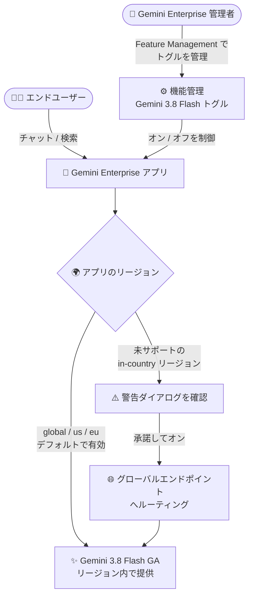

# Gemini Enterprise: Gemini 3.8 Flash がデフォルトで有効化 (GA)

**リリース日**: 2026-09-23

**サービス**: Gemini Enterprise

**機能**: Gemini 3.8 Flash のデフォルト有効化 (global / us / eu リージョン)

**ステータス**: GA (一般提供)

📊 [このアップデートのインフォグラフィックを見る](https://takech9203.github.io/google-cloud-news-summary/20260923-gemini-enterprise-gemini-3-8-flash-default-ga.html)

## 概要

Gemini 3.8 Flash が一般提供 (GA) となり、Gemini Enterprise アプリにおいて `global`、`us`、`eu` の各リージョンでデフォルトで有効化されました。エンドユーザーは追加設定なしで最新の Gemini 3.8 Flash モデルを Gemini Enterprise の Web アプリから利用できます。

Gemini Enterprise の管理者は、Google Cloud コンソールの Feature Management (機能管理) にある「Gemini 3.8 Flash」トグルを使用して、組織のユーザーに対してこのモデルを無効化できます。また、Gemini 3.8 Flash が未サポートの in-country リージョン (国内リージョン) では、警告ダイアログを確認・承諾することでトグルを有効化し、トラフィックをグローバルエンドポイントにルーティングして利用することも可能です。

このアップデートは、Gemini Enterprise を導入している組織の管理者と、日常業務で Gemini Enterprise アプリを利用するエンドユーザーの双方に影響します。特にデータレジデンシー要件を持つ組織では、in-country リージョンでの利用時にトラフィックがグローバルエンドポイントに送信される点を理解した上で有効化を判断する必要があります。

**アップデート前の課題**

- 最新の Gemini 3.8 Flash モデルは Gemini Enterprise アプリでデフォルトでは利用できず、ユーザーは従来の GA モデル (Gemini 3.5 Flash など) を中心に利用していた
- 新しいモデルを利用するには管理者が個別にトグルを有効化する必要があった (Gemini 3.7 Flash や 3.6 Flash は現在もオプトイン方式)
- in-country リージョンでは最新モデルの提供が遅れがちで、利用手段が明確でなかった

**アップデート後の改善**

- Gemini 3.8 Flash が GA となり、`global`、`us`、`eu` リージョンでデフォルトで有効化されたため、管理者の追加操作なしでユーザーが最新モデルを利用可能になった
- 管理者は Feature Management の「Gemini 3.8 Flash」トグルで組織単位のオフが可能になり、ガバナンスを維持できる
- 未サポートの in-country リージョンでも、警告ダイアログを承諾してグローバルエンドポイントへルーティングすることで Gemini 3.8 Flash を利用できるようになった

## アーキテクチャ図



管理者は Feature Management のトグルで Gemini 3.8 Flash の利用可否を制御します。`global` / `us` / `eu` リージョンではデフォルトで有効ですが、未サポートの in-country リージョンでは警告ダイアログを承諾するとトラフィックがグローバルエンドポイントにルーティングされます。

## サービスアップデートの詳細

### 主要機能

1. **Gemini 3.8 Flash の GA とデフォルト有効化**
   - Gemini 3.8 Flash が一般提供 (GA) となり、本番利用が可能に
   - Gemini Enterprise アプリの `global`、`us`、`eu` リージョンでデフォルトで有効化され、ユーザーは即座に利用可能

2. **管理者による機能管理 (Feature Management)**
   - Google Cloud コンソールの Gemini Enterprise ページ → 対象アプリ → [Configurations] → [Feature Management] タブでトグルを操作
   - 組織のポリシー上、Gemini 3.8 Flash を利用させたくない場合はトグルをオフに設定可能
   - モデルセレクタ (Enable model selector) を有効化すると、ユーザーが Web アプリ上で利用するモデルを選択可能

3. **in-country リージョンでのオプトイン利用**
   - Gemini 3.8 Flash が未サポートの in-country リージョンでは、トグルをオンにして警告ダイアログを確認・承諾することで利用可能
   - この場合、トラフィックはグローバルエンドポイントにルーティングされる (データレジデンシーへの影響に注意)

## 技術仕様

### モデルトグルの動作

| 項目 | 詳細 |
|------|------|
| 対象モデル | Gemini 3.8 Flash (GA) |
| デフォルト状態 | `global`、`us`、`eu` リージョンでオン |
| 管理者による無効化 | Feature Management の「Gemini 3.8 Flash」トグルをオフ |
| 未サポート in-country リージョン | トグルをオンにし警告ダイアログを承諾するとグローバルエンドポイントへルーティング |
| その他のモデル | Gemini 3.7 Flash / 3.6 Flash はオプトイン (トグルをオンにして利用)。GA 済みのモデル (Gemini 3.5 Flash、Gemini 2.5 Pro など) はオフ不可 |

### Gemini Enterprise のリージョン構成

| ロケーション種別 | 名称 | 備考 |
|------|------|------|
| グローバル | `global` | 最新モデル・最新機能が最速で提供。低レイテンシ |
| マルチリージョン | `us`、`eu` | 保存データのデータレジデンシー (at-rest DRZ) と ML 処理 (MLP) に対応 |
| in-country リージョン | `ca`、`in`、`asia-northeast1` (日本)、`sg`、`europe-west2` (英国) | 許可リスト付き GA。機能制限がある場合あり |

## 設定方法

### 前提条件

1. Gemini Enterprise Admin IAM ロール (`roles/discoveryengine.agentspaceAdmin`) を保有していること
2. 既存の Gemini Enterprise Web アプリが作成済みであること

### 手順

#### ステップ 1: Feature Management タブを開く

```text
Google Cloud コンソール → Gemini Enterprise ページ
→ 対象アプリ名をクリック → [Configurations] → [Feature Management] タブ
```

対象アプリの機能管理設定画面を開きます。

#### ステップ 2: Gemini 3.8 Flash トグルを設定する

```text
- 無効化する場合: 「Gemini 3.8 Flash」トグルをオフに切り替える
- 未サポートの in-country リージョンで有効化する場合:
  トグルをオンに切り替え、警告ダイアログを確認して承諾する
  (トラフィックはグローバルエンドポイントにルーティングされる)
```

`global`、`us`、`eu` リージョンではデフォルトでオンのため、利用を継続する場合は操作不要です。

## メリット

### ビジネス面

- **最新モデルの即時活用**: 管理者の追加設定なしで組織全体が最新の Gemini 3.8 Flash を利用でき、生産性向上の恩恵をすぐに受けられる
- **ガバナンスの維持**: デフォルト有効でありながら、管理者がトグルで組織単位のオフを選択できるため、社内ポリシーに応じた統制が可能

### 技術面

- **リージョン内提供**: `us` / `eu` マルチリージョンでも GA として提供されるため、データレジデンシー要件を持つ組織も最新モデルを利用しやすい
- **in-country リージョンへの選択肢**: 未サポートリージョンでもグローバルエンドポイント経由での利用パスが明確に用意された

## デメリット・制約事項

### 制限事項

- Gemini 3.8 Flash がリージョン内で提供されるのは `global`、`us`、`eu` のみ。in-country リージョン (ca、in、asia-northeast1、sg、europe-west2) では未サポート
- 未サポートの in-country リージョンで有効化した場合、トラフィックはグローバルエンドポイントにルーティングされるため、in-country のデータレジデンシー保証の対象外となる

### 考慮すべき点

- デフォルトで有効化されるため、モデル利用に関する社内ポリシーがある組織は、意図せずユーザーが新モデルを利用しないようトグル設定を早めに確認すべき
- 規制業種などで ML 処理のロケーションが問われる場合は、警告ダイアログ承諾によるグローバルルーティングの影響をコンプライアンス部門と確認する必要がある

## ユースケース

### ユースケース 1: 全社での最新モデル利用 (global / us / eu リージョン)

**シナリオ**: `global` リージョンで Gemini Enterprise を運用している企業。従業員が社内ナレッジ検索やドキュメント生成に Gemini Enterprise アプリを利用している。

**効果**: 管理者の操作なしで全ユーザーが Gemini 3.8 Flash を利用開始でき、応答品質と速度の向上を即座に享受できる。モデルセレクタを有効化していれば、ユーザーはタスクに応じてモデルを選択できる。

### ユースケース 2: 日本リージョン (asia-northeast1) でのオプトイン利用

**シナリオ**: データレジデンシー要件により `asia-northeast1` (日本) の in-country リージョンで Gemini Enterprise を運用している企業が、最新モデルの評価を行いたい。

**実装例**:
```text
Feature Management タブ → 「Gemini 3.8 Flash」トグルをオン
→ 警告ダイアログの内容 (グローバルエンドポイントへのルーティング) を確認して承諾
```

**効果**: in-country リージョンのままでも最新モデルを利用可能。ただしトラフィックがグローバルエンドポイントに送信されるため、コンプライアンス上の許容可否を事前に判断した上で有効化する。

### ユースケース 3: 社内ポリシーによるモデル統制

**シナリオ**: モデルの社内検証が完了するまで新モデルの利用を制限したい金融機関。

**効果**: 管理者が「Gemini 3.8 Flash」トグルをオフにすることで、検証完了までユーザーの利用を組織単位で停止できる。検証後にトグルをオンに戻すだけで展開が完了する。

## 料金

Gemini 3.8 Flash の利用は Gemini Enterprise のサブスクリプションに含まれ、モデル有効化自体に追加料金は発生しません。Gemini Enterprise はエディション別のシート課金です。

### 料金例

| エディション | 月額料金 (概算) |
|--------|-----------------|
| Gemini Enterprise Business | $21 USD / シート〜 |
| Gemini Enterprise Standard / Plus | $30 USD / シート〜 |
| Gemini Enterprise Pay-as-you-go | シート料金 $0、使用量ベース課金 |

最新の料金は [Gemini Enterprise の料金ページ](https://cloud.google.com/gemini-enterprise) を参照してください。

## 利用可能リージョン

- **デフォルト有効 (リージョン内提供)**: `global`、`us` (米国マルチリージョン)、`eu` (EU マルチリージョン)
- **オプトイン (グローバルエンドポイント経由)**: 未サポートの in-country リージョン (`ca`、`in`、`asia-northeast1`、`sg`、`europe-west2` など)

## 関連サービス・機能

- **Gemini Enterprise Agent Platform**: 同日に Gemini 3.8 Flash 自体が GA となり本番利用が可能に。Gemini Enterprise アプリでのデフォルト有効化はこの GA を受けたもの
- **Feature Management (機能管理)**: モデルトグルのほか、モデルセレクタ、Agent Gallery、Canvas、画像/動画生成など Web アプリの機能を組織単位で制御
- **Gemini Notebook Enterprise**: Gemini Enterprise と同様のデータレジデンシー (at-rest DRZ / MLP) の枠組みで提供されるノートブック機能

## 参考リンク

- 📊 [インフォグラフィック](https://takech9203.github.io/google-cloud-news-summary/20260923-gemini-enterprise-gemini-3-8-flash-default-ga.html)
- [公式リリースノート](https://docs.cloud.google.com/release-notes#September_23_2026)
- [Manage features on the web app (機能管理ドキュメント)](https://docs.cloud.google.com/gemini/enterprise/docs/manage-web-app-features)
- [Data residency for Gemini Enterprise (ロケーションとデータレジデンシー)](https://docs.cloud.google.com/gemini/enterprise/docs/locations)
- [Gemini Enterprise エディション比較](https://docs.cloud.google.com/gemini/enterprise/docs/editions)
- [料金ページ (Gemini Enterprise)](https://cloud.google.com/gemini-enterprise)

## まとめ

Gemini 3.8 Flash が GA となり、Gemini Enterprise アプリの `global` / `us` / `eu` リージョンでデフォルト有効化されたことで、多くの組織が追加設定なしで最新モデルを利用できるようになりました。管理者はまず Feature Management のトグル状態を確認し、社内ポリシーに沿った利用可否を判断することを推奨します。in-country リージョンで利用する場合は、グローバルエンドポイントへのルーティングがデータレジデンシーに与える影響を事前に評価してください。

---

**タグ**: #GeminiEnterprise #Gemini38Flash #GA #FeatureManagement #DataResidency #GoogleCloud
