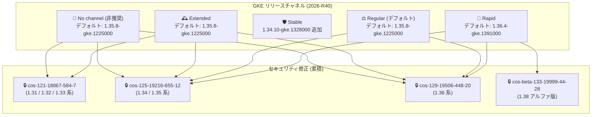

# Google Kubernetes Engine (GKE): 2026-R40 バージョンおよびセキュリティアップデート

**リリース日**: 2026-09-23

**サービス**: Google Kubernetes Engine (GKE)

**機能**: 2026-R40 バージョンアップデートおよび Container-Optimized OS セキュリティ修正

**ステータス**: GA

📊 [このアップデートのインフォグラフィックを見る](https://takech9203.github.io/google-cloud-news-summary/20260923-gke-version-updates-2026-r40.html)

## 概要

GKE 2026-R40 リリースとして、すべてのリリースチャネル (Rapid、Regular、Stable、Extended、No channel) に新しいクラスタバージョンが提供された。今回のアップデートでは、Rapid チャネルのデフォルトバージョンが 1.36.4-gke.1391000 に、Regular / Extended / No channel のデフォルトバージョンが 1.35.8-gke.1225000 に更新されている。また、Rapid チャネルには GKE アルファクラスタ向けに Kubernetes 1.38 系のアルファバージョン 1.38.0-gke.1002000+preview が新たに提供された。

セキュリティ面では、新しい GKE バージョンに対応する Container-Optimized OS (COS) イメージが更新され、1.31 〜 1.33 系には cos-121-18867-584-7、1.34 / 1.35 系には cos-125-19216-655-12、1.36 系には cos-129-19506-448-20、1.38 アルファ版には cos-beta-133-19999-44-28 が適用された。COS イメージのセキュリティ修正は累積的であり、前回の GKE リリース以降にリリースされたすべての COS バージョンのセキュリティ修正が含まれる。

本アップデートは、GKE を利用するすべてのユーザーに影響する定期的なバージョンアップデートであり、特にセキュリティパッチの適用はすべての本番環境クラスタで推奨される。なお、ロールアウトはリリースノート公開時点で既に進行中であり、すべての Google Cloud ゾーンで利用可能になるまで数日かかる場合がある。

**アップデート前の課題**

- 以前の COS イメージには、cos-121-18867-584-7 / cos-125-19216-655-12 / cos-129-19506-448-20 で修正された既知のセキュリティ脆弱性が存在していた
- Rapid チャネルでは Kubernetes 1.38 系のアルファバージョンが利用できず、次期マイナーバージョンの早期検証ができなかった
- 各チャネルの旧パッチバージョン (Regular / Extended の 1.36.4-gke.1082000 など) が非推奨となる前の状態で稼働していた

**アップデート後の改善**

- Container-Optimized OS イメージの累積セキュリティ修正により、1.31 系から 1.38 アルファ版まで幅広いバージョンで既知の脆弱性が解消された
- 各チャネルで最新のパッチバージョンが利用可能になり、新規クラスタ作成および既存クラスタのアップグレードの選択肢が拡大した
- Rapid チャネルにアルファバージョン 1.38.0-gke.1002000+preview が追加され、アルファクラスタで Kubernetes 1.38 系の機能を早期に検証可能になった
- 自動アップグレードのターゲットが更新され、1.33 → 1.34、1.34 → 1.35 などのマイナーバージョン自動アップグレードが新しいパッチバージョンに向けて実施される

## アーキテクチャ図



各リリースチャネルの新しいデフォルトバージョンと、更新された Container-Optimized OS イメージによるセキュリティ修正の対応関係を示す。Extended / No channel は 1.31 系からの幅広いバージョンに COS セキュリティ修正が提供される。

## サービスアップデートの詳細

### 主要機能

1. **Rapid チャネルのバージョン更新**
   - デフォルトバージョンが 1.36.4-gke.1391000 に更新
   - 1.34.11-gke.1209000、1.35.8-gke.1626000、1.36.4-gke.1495000 が新たに追加
   - アルファバージョン 1.38.0-gke.1002000+preview が GKE アルファクラスタ向けに提供開始
   - 1.34.11-gke.1056000、1.35.8-gke.1380000、1.36.4-gke.1247000、1.37.0-gke.3165000 は利用不可に
   - 自動アップグレードターゲット: 1.33 → 1.34.11-gke.1102000、1.34 → 1.35.8-gke.1439000、1.35 → 1.36.4-gke.1391000 (マイナーバージョンアップグレード)

2. **Regular チャネルのバージョン更新**
   - デフォルトバージョンが 1.35.8-gke.1225000 に更新
   - 1.34.11-gke.1056000、1.35.8-gke.1380000、1.36.4-gke.1247000 が新たに追加
   - 1.34.10-gke.1328000、1.35.8-gke.1036000 は利用不可に。1.36.4-gke.1082000 は非推奨となり、90 日以内またはサポート終了時に削除
   - 自動アップグレードターゲット: 1.33 → 1.34.11-gke.1044000、1.34 → 1.35.8-gke.1225000 (マイナーバージョンアップグレード)

3. **Stable チャネルのバージョン更新**
   - 1.34.10-gke.1328000 が新たに利用可能に
   - 1.34.10-gke.1236000 は非推奨となり、90 日以内またはサポート終了時に削除

4. **Extended チャネルのバージョン更新**
   - デフォルトバージョンが 1.35.8-gke.1225000 に更新
   - 1.31.14 系 (2 パッチ)、1.32.13 系 (2 パッチ)、1.33.13 系 (2 パッチ)、1.34.11-gke.1056000、1.35.8-gke.1380000、1.36.4-gke.1247000 が新たに追加
   - 1.31.14 / 1.32.13 / 1.33.13 系の旧パッチおよび 1.36.4-gke.1082000 が非推奨に。1.34.10-gke.1328000、1.35.8-gke.1036000 は利用不可に
   - 自動アップグレードターゲット: 1.30 → 1.31.14-gke.2667000、1.31 → 1.32.13-gke.2393000 (マイナーバージョンアップグレード)

5. **No channel (非推奨) のバージョン更新**
   - デフォルトバージョンが 1.35.8-gke.1225000 に更新
   - クラスタバージョン 1.34.11-gke.1209000、1.35.8-gke.1626000、1.36.4-gke.1495000 が新たに追加
   - ノードバージョンとして 1.31.14-gke.2759000 から 1.36.4-gke.1495000 まで 6 バージョンが新たに利用可能に
   - 1.34.10-gke.1236000、1.35.7-gke.1222000、1.36.4-gke.1082000 は非推奨に
   - 自動アップグレードターゲット: 1.33 → 1.34.11-gke.1044000 (マイナーバージョンアップグレード)

6. **Container-Optimized OS セキュリティ修正**
   - 新しい GKE バージョンに対応する COS イメージが更新され、累積的なセキュリティ修正が適用された
   - 前回の GKE リリース以降に公開されたすべての COS セキュリティ修正を含む
   - 解消された個別の脆弱性は各 COS イメージのセキュリティリリースノートで確認可能

## 技術仕様

### チャネル別バージョン一覧 (2026-R40)

| チャネル | デフォルトバージョン | 新規提供バージョン |
|------|------|------|
| Rapid | 1.36.4-gke.1391000 | 1.34.11-gke.1209000 / 1.35.8-gke.1626000 / 1.36.4-gke.1495000 / 1.38.0-gke.1002000+preview (アルファ) |
| Regular | 1.35.8-gke.1225000 | 1.34.11-gke.1056000 / 1.35.8-gke.1380000 / 1.36.4-gke.1247000 |
| Stable | - (変更なし) | 1.34.10-gke.1328000 |
| Extended | 1.35.8-gke.1225000 | 1.31.14 系 / 1.32.13 系 / 1.33.13 系 / 1.34.11-gke.1056000 / 1.35.8-gke.1380000 / 1.36.4-gke.1247000 |
| No channel (非推奨) | 1.35.8-gke.1225000 | 1.34.11-gke.1209000 / 1.35.8-gke.1626000 / 1.36.4-gke.1495000 (ノード: 1.31.14 ~ 1.36.4) |

### 自動アップグレードターゲット (マイナーバージョン)

| チャネル | 自動アップグレード対象 |
|------|------|
| Rapid | 1.33 → 1.34.11-gke.1102000、1.34 → 1.35.8-gke.1439000、1.35 → 1.36.4-gke.1391000 |
| Regular | 1.33 → 1.34.11-gke.1044000、1.34 → 1.35.8-gke.1225000 |
| Extended | 1.30 → 1.31.14-gke.2667000、1.31 → 1.32.13-gke.2393000 |
| No channel | 1.33 → 1.34.11-gke.1044000 |

### セキュリティ修正対象の COS イメージ

| GKE バージョン | Container-Optimized OS バージョン |
|------|------|
| 1.31.14-gke.2759000 | cos-121-18867-584-7 |
| 1.32.13-gke.2504000 | cos-121-18867-584-7 |
| 1.33.13-gke.1721000 | cos-121-18867-584-7 |
| 1.34.11-gke.1209000 | cos-125-19216-655-12 |
| 1.35.8-gke.1626000 | cos-125-19216-655-12 |
| 1.36.4-gke.1495000 | cos-129-19506-448-20 |
| 1.38.0-gke.1002000+preview | cos-beta-133-19999-44-28 |

### リリースチャネルの選択基準

| チャネル | 特徴 | 推奨用途 |
|------|------|------|
| Rapid | 最新バージョンを最も早く提供 (SLA 対象外) | 開発・検証環境、新機能の早期評価 |
| Regular (デフォルト) | Rapid の約 2 か月後に提供 | 一般的な本番環境 |
| Stable | Regular の 3-4 か月後に提供 | 安定性を最優先する本番環境 |
| Extended | 長期サポートを提供 | 長期サポートが必要な環境 |
| No channel | 非推奨 (2027 年 6 月 14 日に削除予定) | リリースチャネルへの移行を推奨 |

## 設定方法

### 前提条件

1. Google Cloud プロジェクトで GKE API が有効化されていること
2. `gcloud` CLI がインストールおよび認証済みであること
3. 対象クラスタに対する `container.clusters.update` 権限があること

### 手順

#### ステップ 1: 利用可能なバージョンを確認

```bash
# 特定チャネルで利用可能なバージョンを確認
gcloud container get-server-config \
  --zone=asia-northeast1-a \
  --format="yaml(channels)"
```

各チャネルで利用可能なバージョンとデフォルトバージョンを確認できる。ロールアウトは段階的に行われるため、使用するゾーンではまだ新バージョンが利用できない場合がある。

#### ステップ 2: クラスタのコントロールプレーンをアップグレード

```bash
# コントロールプレーンを指定バージョンにアップグレード (Regular チャネルの例)
gcloud container clusters upgrade my-cluster \
  --zone=asia-northeast1-a \
  --master \
  --cluster-version=1.35.8-gke.1225000
```

コントロールプレーンのアップグレードは数分から数十分かかる。アップグレード中もワークロードは引き続き実行される。

#### ステップ 3: ノードプールをアップグレード

```bash
# ノードプールをコントロールプレーンと同じバージョンにアップグレード
gcloud container clusters upgrade my-cluster \
  --zone=asia-northeast1-a \
  --node-pool=default-pool
```

ノードプールのアップグレードにより、更新された COS イメージのセキュリティ修正が適用される。

## メリット

### ビジネス面

- **セキュリティリスクの低減**: COS イメージの累積セキュリティ修正により、既知の脆弱性に対するリスクが軽減される。コンプライアンス要件を満たすためにも定期的なアップデート適用が重要
- **運用の安定性向上**: 各チャネルで検証済みのバージョンが提供されるため、安定した運用が可能

### 技術面

- **次期 Kubernetes バージョンの早期検証**: Rapid チャネルのアルファクラスタで 1.38.0-gke.1002000+preview が利用可能になり、Kubernetes 1.38 系のアルファ機能を数か月先行して検証できる
- **幅広いバージョンへのセキュリティ修正**: 今回は 1.31 系から 1.36 系までの COS イメージが更新されており、Extended チャネルなどで古いマイナーバージョンを運用している環境でもセキュリティ修正を受け取れる
- **自動アップグレードの更新**: 各チャネルの自動アップグレードターゲットが最新パッチに更新され、手動操作なしで新しいバージョンへ移行できる

## デメリット・制約事項

### 制限事項

- ロールアウトはリリースノート公開時点で既に進行中であり、すべての Google Cloud ゾーンで利用可能になるまで数日かかる場合がある
- 非推奨となったバージョン (Regular / Extended の 1.36.4-gke.1082000、Stable の 1.34.10-gke.1236000 など) は 90 日以内、またはサポート終了時のいずれか早い時点で削除される
- アルファバージョン 1.38.0-gke.1002000+preview はアルファクラスタ専用であり、本番環境では利用できない

### 考慮すべき点

- セキュリティ修正は COS イメージに含まれるため、ノードプールのアップグレードが必要。コントロールプレーンのアップグレードだけでは COS のセキュリティ修正は適用されない
- メンテナンス除外や非推奨 API の使用がある場合、マイナーバージョンの自動アップグレードが実施されず、パッチバージョンの自動アップグレードのみが行われる
- No channel は非推奨であり、2027 年 6 月 14 日に削除される予定のため、リリースチャネルへの移行を計画することが推奨される

## ユースケース

### ユースケース 1: 本番環境のセキュリティパッチ適用

**シナリオ**: Regular チャネルを使用している本番クラスタで、最新パッチバージョンへのアップグレードとセキュリティ修正の適用を計画的に実施したい。

**実装例**:
```bash
# 現在のクラスタバージョンを確認
gcloud container clusters describe my-prod-cluster \
  --zone=asia-northeast1-a \
  --format="value(currentMasterVersion,currentNodeVersion)"

# Regular チャネルの最新デフォルトバージョンにアップグレード
gcloud container clusters upgrade my-prod-cluster \
  --zone=asia-northeast1-a \
  --master \
  --cluster-version=1.35.8-gke.1225000

# ノードプールもアップグレード (COS セキュリティ修正を適用)
gcloud container clusters upgrade my-prod-cluster \
  --zone=asia-northeast1-a \
  --node-pool=default-pool
```

**効果**: 最新パッチと COS イメージ (cos-125-19216-655-12) の累積セキュリティ修正が適用され、既知の脆弱性に対するリスクが解消される。

### ユースケース 2: Kubernetes 1.38 アルファ機能の早期検証

**シナリオ**: 次期 Kubernetes 1.38 系のアルファ機能を検証し、将来の移行に向けた互換性評価を行いたい。

**実装例**:
```bash
# Rapid チャネルでアルファクラスタを新規作成 (1.38 アルファ版)
gcloud container clusters create alpha-cluster-138 \
  --zone=asia-northeast1-a \
  --enable-kubernetes-alpha \
  --release-channel=rapid \
  --cluster-version=1.38.0-gke.1002000 \
  --num-nodes=3
```

**効果**: Kubernetes 1.38 系のアルファ機能や API を、一般提供の数か月前に評価でき、将来のアップグレード計画に反映できる。

## 料金

GKE の料金はクラスタモード (Autopilot / Standard) によって異なる。バージョンアップデート自体に追加料金は発生しない。

- **Autopilot**: Pod のリソースリクエスト (vCPU、メモリ、エフェメラルストレージ) に基づく従量課金
- **Standard**: クラスタ管理手数料 + ノードの Compute Engine インスタンス料金
- **Extended チャネル**: 延長サポート期間に入ったマイナーバージョンを使用する場合、追加料金が発生

詳細は [GKE 料金ページ](https://cloud.google.com/kubernetes-engine/pricing) を参照。

## 利用可能リージョン

すべての GKE 提供リージョンが対象。ただし、ロールアウトは段階的に行われるため、すべてのゾーンで新バージョンが利用可能になるまで数日かかる場合がある。

## 関連サービス・機能

- **Container-Optimized OS**: GKE ノードで使用される OS イメージ。セキュリティ修正は COS イメージの更新として提供される
- **Cloud Monitoring / Cloud Logging**: クラスタのバージョン情報やアップグレード状況の監視に活用
- **GKE リリースチャネル**: バージョン提供のペースを制御する仕組み。環境の要件に応じて Rapid / Regular / Stable / Extended を選択
- **GKE Security Posture**: クラスタのセキュリティ構成を評価し、推奨事項を提示。バージョンアップデート後のセキュリティ状態確認に有用

## 参考リンク

- 📊 [インフォグラフィック](https://takech9203.github.io/google-cloud-news-summary/20260923-gke-version-updates-2026-r40.html)
- [公式リリースノート](https://docs.cloud.google.com/release-notes#September_23_2026)
- [GKE リリースノート](https://cloud.google.com/kubernetes-engine/docs/release-notes)
- [リリースチャネルの概要](https://cloud.google.com/kubernetes-engine/docs/concepts/release-channels)
- [GKE バージョニングとサポート](https://cloud.google.com/kubernetes-engine/versioning)
- [GKE クラスタアップグレードについて](https://cloud.google.com/kubernetes-engine/docs/concepts/cluster-upgrades)
- [GKE セキュリティ情報](https://cloud.google.com/kubernetes-engine/docs/security-bulletins)
- [料金ページ](https://cloud.google.com/kubernetes-engine/pricing)

## まとめ

GKE 2026-R40 は、すべてのリリースチャネルにおけるバージョン更新と、1.31 系から 1.38 アルファ版まで幅広い GKE バージョン向け COS イメージの累積セキュリティ修正を含む定期アップデートである。特にセキュリティ修正はノードプールのアップグレードによって適用されるため、本番環境クラスタでは計画的なノードアップグレードの実施が推奨される。また、Rapid チャネルに Kubernetes 1.38 系のアルファバージョンが追加されたため、次期バージョンの早期検証を始める良い機会となる。

---

**タグ**: #GKE #GoogleKubernetesEngine #Kubernetes #セキュリティ #バージョンアップデート #ContainerOptimizedOS #リリースチャネル #2026-R40
