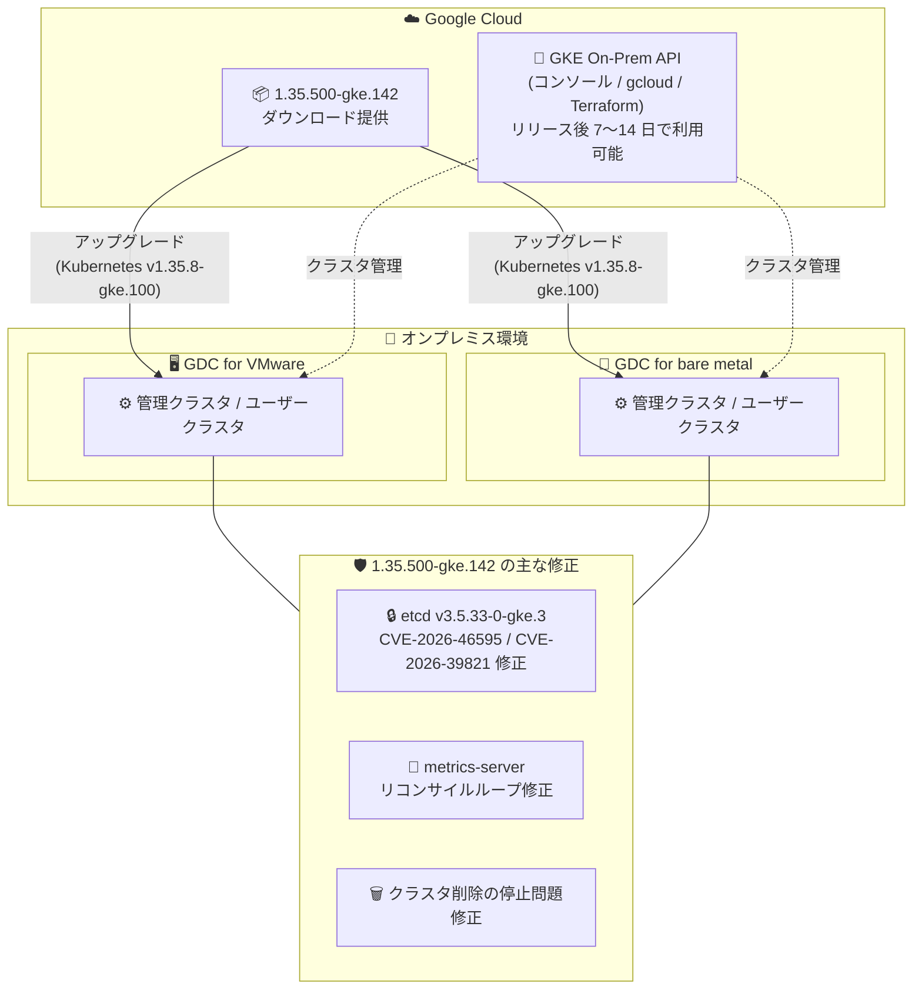

# Google Distributed Cloud (software only): 1.35.500-gke.142 リリース (VMware / ベアメタル)

**リリース日**: 2026-09-23

**サービス**: Google Distributed Cloud (software only) for VMware / for bare metal

**機能**: パッチリリース 1.35.500-gke.142 (脆弱性修正・バグ修正)

**ステータス**: GA (ダウンロード可能)

📊 [このアップデートのインフォグラフィックを見る](https://takech9203.github.io/google-cloud-news-summary/20260923-google-distributed-cloud-1-35-500.html)

## 概要

Google Distributed Cloud (software only) のパッチバージョン **1.35.500-gke.142** が、VMware 版とベアメタル版の両方で同時にリリースされた。本バージョンは Kubernetes **v1.35.8-gke.100** 上で動作し、セキュリティ脆弱性の修正と複数のバグ修正を含むメンテナンスリリースである。アップグレード手順は各プラットフォームの「Upgrade clusters」ドキュメントを参照する。

セキュリティ面では、etcd が **v3.5.33-0-gke.3** に更新され、**CVE-2026-46595** および **CVE-2026-39821** の 2 件のセキュリティ脆弱性に対処した。このほか、両プラットフォームに共通する Vulnerability fixes ページ記載の脆弱性修正が含まれる。オンプレミスで GKE クラスタを運用するプラットフォーム管理者は、セキュリティパッチを確実に適用するため、可能な限り最新パッチバージョンへのアップグレードが推奨されている。

なお、リリース後、GKE On-Prem API クライアント (Google Cloud コンソール、gcloud CLI、Terraform) でこのバージョンが利用可能になるまで約 7〜14 日かかる。サードパーティのストレージベンダーを使用している場合は、認定済みストレージパートナーの一覧を確認する必要がある。

**アップデート前の課題**

このパッチ以前のバージョンでは、以下の問題が存在していた。

- etcd に CVE-2026-46595 および CVE-2026-39821 のセキュリティ脆弱性が残存していた
- (共通) metrics-server がターゲットクラスタの ConfigMap を確認しないため、リコンサイルループが発生していた
- (共通) クラスタ削除中にノードプールコントローラーがマシンリソースを再作成するため、クラスタ削除が無期限に停止することがあった
- (VMware) データセンター分割 (split-datacenter) 環境で、ユーザーデータセンター側にある PersistentVolume のデータストアについて、クラスタ検証・診断が誤って「データストアが見つからない」と報告していた
- (ベアメタル) メンテナンスモードでのノードドレイン時に、アタッチされたストレージボリュームのデタッチ完了を待機しなかった
- (ベアメタル) コントロールプレーン構成の更新時に複数の API サーバーが同時に再起動し、コントロールプレーンが一時的に利用不能になることがあった
- (ベアメタル) ワーカーノードプール作成時に、プール内のノードマシンの準備完了待ちで処理が無期限に停止することがあった
- (ベアメタル) バンドル版 Ingress 使用時に Ingress リソースのステータスが更新されなかった

**アップデート後の改善**

- etcd v3.5.33-0-gke.3 への更新により CVE-2026-46595 / CVE-2026-39821 が解消された
- metrics-server がターゲットクラスタの ConfigMap を確認するようになり、リコンサイルループが解消された
- クラスタ削除がノードプールコントローラーのマシン再作成により停止する問題が解消された
- VMware のデータセンター分割環境で、クラスタ検証・診断が PersistentVolume のデータストアを正しく認識するようになった
- ベアメタルのメンテナンスモードで、ストレージボリュームのデタッチを待機してからノードをドレインするようになり、BareMetalMachine の状態遷移 (conditions) も修正された
- ベアメタルのコントロールプレーン構成更新時に API サーバーが同時再起動しなくなり、可用性が向上した
- ベアメタルのワーカーノードプール作成の停止問題、および Ingress ステータス未更新の問題が解消された

## アーキテクチャ図



VMware 版とベアメタル版の両プラットフォームに同一パッチバージョン 1.35.500-gke.142 が提供され、etcd の脆弱性修正をはじめとする共通修正と、各プラットフォーム固有のバグ修正が適用される。

## サービスアップデートの詳細

### 主要な修正内容

1. **セキュリティ脆弱性の修正 (両プラットフォーム共通)**
   - etcd を v3.5.33-0-gke.3 に更新し、CVE-2026-46595 および CVE-2026-39821 に対処
   - そのほか、各プラットフォームの Vulnerability fixes ページに記載された脆弱性を修正

2. **クラスタライフサイクルの安定性向上 (両プラットフォーム共通)**
   - metrics-server のリコンサイルループ問題を、ターゲットクラスタ上の ConfigMap を確認する方式で修正
   - クラスタ削除中にノードプールコントローラーがマシンリソースを再作成し、削除が無期限に停止する問題を修正

3. **VMware 版固有の修正**
   - データセンター分割環境において、ユーザーデータセンター側の PersistentVolume に対するクラスタ検証・診断の誤検出 (データストア欠落の誤報告) を修正

4. **ベアメタル版固有の修正**
   - メンテナンスモードのノードドレインで、アタッチ済みストレージボリュームのデタッチ完了を待機するように修正
   - メンテナンスモード遷移中の BareMetalMachine conditions を修正
   - バンドル版 Ingress 使用時に Ingress リソースのステータスが更新されない問題を修正
   - コントロールプレーン構成更新時に複数 API サーバーが同時再起動し、コントロールプレーンが一時的に利用不能になる問題を修正
   - ワーカーノードプール作成がノードマシンの準備完了待ちで無期限に停止する問題を修正

## 技術仕様

### リリース情報

| 項目 | 詳細 |
|------|------|
| バージョン | 1.35.500-gke.142 |
| 対象プラットフォーム | VMware / ベアメタル (software only) |
| Kubernetes バージョン | v1.35.8-gke.100 |
| etcd バージョン | v3.5.33-0-gke.3 |
| 修正 CVE | CVE-2026-46595、CVE-2026-39821 |
| GKE On-Prem API クライアント対応 | リリース後 約 7〜14 日 |

### パッチアップグレードのバージョンルール

| ルール | 内容 |
|------|------|
| パッチバージョン | 同一マイナーバージョン内であれば、任意の上位パッチへ直接アップグレード可能 (例: 1.35.400 → 1.35.500) |
| マイナーバージョン | 管理クラスタ / ユーザークラスタのコントロールプレーンは 1.n → 1.n+1 のみサポート (マイナーバージョンのスキップ不可) |
| ワーカーノードプール | 1.28 以降、コントロールプレーンより 2 マイナー古いノードプールを直接アップグレード可能 |
| 推奨事項 | 最新のセキュリティ修正を得るため、常に最新パッチバージョンへのアップグレードを推奨 |

## 設定方法

### 前提条件

1. 既存の Google Distributed Cloud クラスタ (1.35.x、または 1 つ前のマイナーバージョン 1.34.x) が稼働していること
2. サードパーティのストレージベンダーを使用している場合、該当バージョンで認定済みであることをストレージパートナー一覧で確認していること
3. アップグレード前にクラスタのヘルスチェック・診断を実行しておくこと

### 手順

#### ステップ 1: 対象バージョンの確認

```bash
# VMware 版: 利用可能なバージョンを確認
gkectl version

# ベアメタル版: クラスタの現在のバージョンを確認
kubectl get cluster CLUSTER_NAME -n CLUSTER_NAMESPACE \
  -o jsonpath='{.spec.anthosBareMetalVersion}'
```

現在のクラスタバージョンからアップグレード可能なパスであることを確認する。

#### ステップ 2: クラスタのアップグレード

```bash
# VMware 版 (例): ユーザークラスタのアップグレード
gkectl upgrade cluster \
  --kubeconfig ADMIN_CLUSTER_KUBECONFIG \
  --config USER_CLUSTER_CONFIG

# ベアメタル版 (例): クラスタ構成ファイルの anthosBareMetalVersion を
# 1.35.500-gke.142 に更新後
bmctl upgrade cluster -c CLUSTER_NAME \
  --kubeconfig ADMIN_KUBECONFIG
```

詳細な手順とベストプラクティスは各プラットフォームのアップグレードドキュメントを参照する。GKE On-Prem API クライアント (コンソール、gcloud、Terraform) からのアップグレードは、リリース後 7〜14 日で利用可能になる。

## メリット

### ビジネス面

- **セキュリティリスクの低減**: etcd の CVE 2 件を含む脆弱性修正により、オンプレミス環境のセキュリティコンプライアンスを維持できる
- **運用停止リスクの低減**: クラスタ削除やノードプール作成の無期限停止など、運用オペレーションを阻害する問題が解消され、計画的な運用が可能になる

### 技術面

- **コントロールプレーンの可用性向上 (ベアメタル)**: 構成更新時の API サーバー同時再起動が解消され、更新作業中の一時的なコントロールプレーン停止を回避できる
- **ストレージ整合性の向上 (ベアメタル)**: メンテナンスモード時にボリュームのデタッチを待機するため、ノードメンテナンスに伴うストレージ関連の不整合リスクが減少する
- **診断精度の向上 (VMware)**: データセンター分割環境での誤検出がなくなり、クラスタ検証・診断結果を信頼して運用判断ができる

## デメリット・制約事項

### 制限事項

- GKE On-Prem API クライアント (Google Cloud コンソール、gcloud CLI、Terraform) での利用は、リリースから約 7〜14 日後になる
- サードパーティストレージベンダー利用時は、当該バージョンでの認定状況を事前確認する必要がある
- マイナーバージョンをスキップしたコントロールプレーンのアップグレードはサポートされない

### 考慮すべき点

- パッチアップグレードでもノードのドレイン・再作成が発生するため、PodDisruptionBudget (PDB) の設定を確認し、メンテナンスウィンドウ内で計画的に実施する
- 1.35 系は cgroupsv2 が必須 (cgroupsv1 は非サポート) のため、1.34 以前からアップグレードする場合はノード OS の対応状況を確認する

## ユースケース

### ユースケース 1: セキュリティパッチの定期適用

**シナリオ**: 金融機関がオンプレミスの VMware 環境で GDC クラスタを運用しており、社内セキュリティポリシーで既知 CVE への迅速な対応が義務付けられている。

**効果**: 1.35.500-gke.142 へのパッチアップグレードにより、etcd の CVE-2026-46595 / CVE-2026-39821 を含む脆弱性を解消し、マイナーバージョン移行を伴わない低リスクな作業でコンプライアンス要件を満たせる。

### ユースケース 2: ベアメタル環境の定期ノードメンテナンス

**シナリオ**: 製造業のエッジデータセンターでベアメタル版 GDC を運用しており、ハードウェア保守のためにノードを定期的にメンテナンスモードへ移行している。ストレージボリュームのデタッチ待機がないため、まれにボリュームの不整合が発生していた。

**効果**: 本パッチ適用後は、ノードドレイン時にストレージボリュームのデタッチ完了を待機するため、ステートフルワークロードを安全に退避でき、メンテナンス作業の信頼性が向上する。

## 料金

Google Distributed Cloud (software only) は vCPU 単位の課金で、Google Cloud プロジェクトで課金を有効にして使用する。本パッチリリース自体による料金変更はない。詳細は GKE の料金ページを参照。

- [Google Kubernetes Engine の料金](https://cloud.google.com/kubernetes-engine/pricing)

## 利用可能リージョン

オンプレミス (自社の VMware 環境またはベアメタル環境) にダウンロードして利用するソフトウェアであり、リージョンの制約はない。GKE On-Prem API クライアント経由での利用はリリース後約 7〜14 日で可能になる。

## 関連サービス・機能

- **Google Kubernetes Engine (GKE)**: GDC software only は GKE をベースにオンプレミス向けに拡張した Kubernetes ディストリビューション
- **GKE On-Prem API**: Google Cloud コンソール、gcloud CLI、Terraform からオンプレミスクラスタのライフサイクル管理を行う API
- **フリート (Fleet) / Connect Agent**: オンプレミスクラスタを Google Cloud に接続し、複数クラスタを一元管理する仕組み。課金管理にも使用される
- **Cloud Monitoring / Cloud Logging**: クラスタとワークロードの監視・ログ収集 (今回 metrics-server の修正が関連)

## 参考リンク

- 📊 [インフォグラフィック](https://takech9203.github.io/google-cloud-news-summary/20260923-google-distributed-cloud-1-35-500.html)
- [公式リリースノート](https://docs.cloud.google.com/release-notes#September_23_2026)
- [クラスタのアップグレード (VMware)](https://docs.cloud.google.com/kubernetes-engine/distributed-cloud/vmware/docs/how-to/upgrading)
- [クラスタのアップグレード (ベアメタル)](https://docs.cloud.google.com/kubernetes-engine/distributed-cloud/bare-metal/docs/how-to/upgrade)
- [脆弱性修正一覧 (VMware)](https://docs.cloud.google.com/kubernetes-engine/distributed-cloud/vmware/docs/vulnerabilities)
- [脆弱性修正一覧 (ベアメタル)](https://docs.cloud.google.com/kubernetes-engine/distributed-cloud/bare-metal/docs/vulnerabilities)
- [認定済みストレージパートナー](https://docs.cloud.google.com/kubernetes-engine/enterprise/docs/resources/partner-storage)
- [料金ページ (GKE)](https://cloud.google.com/kubernetes-engine/pricing)

## まとめ

Google Distributed Cloud (software only) 1.35.500-gke.142 は、etcd の CVE 2 件の修正を含むセキュリティアップデートと、クラスタ削除・ノードプール作成・メンテナンスモードなど運用オペレーションの安定性を高めるバグ修正をまとめたパッチリリースである。1.35 系を運用中の環境では、セキュリティ修正を確実に取り込むため、メンテナンスウィンドウを確保して早期のアップグレードを推奨する。特にベアメタル環境では、コントロールプレーンの可用性やストレージ整合性に関わる修正が多く含まれるため、適用の優先度は高い。

---

**タグ**: Google Distributed Cloud, GDC, VMware, ベアメタル, Kubernetes, パッチリリース, セキュリティ, etcd, CVE, オンプレミス
