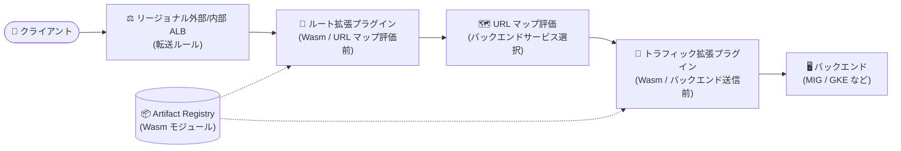

# Service Extensions: プラグインを使用するルート拡張・トラフィック拡張がリージョナル ALB で GA

**リリース日**: 2026-09-23

**サービス**: Service Extensions

**機能**: プラグインを使用するルート拡張・トラフィック拡張のリージョナル Application Load Balancer 対応

**ステータス**: GA (一般提供)

📊 [このアップデートのインフォグラフィックを見る](https://takech9203.github.io/google-cloud-news-summary/20260923-service-extensions-plugins-regional-alb-ga.html)

## 概要

Service Extensions において、プラグインを使用するルート拡張 (route extensions) およびトラフィック拡張 (traffic extensions) が、リージョナル外部 Application Load Balancer とリージョナル内部 Application Load Balancer で一般提供 (GA) となりました。

Service Extensions のプラグインは、WebAssembly (Wasm) 形式でビルドされ Proxy-Wasm API を使用するカスタムコードを、ロードバランサのデータパスにインラインで挿入する仕組みです。プラグインは Google が管理するサンドボックスインフラストラクチャ上でサーバーレスのように実行されるため、ユーザーは拡張処理用のコンピュートリソースを自前で運用する必要がありません。今回の GA により、リージョン単位で構成する外部・内部 Application Load Balancer でも、ヘッダー操作、カスタムロギング、独自のセキュリティロジック、バックエンド選択への介入などを、SLA が適用される本番環境向けの品質で利用できるようになりました。

対象ユーザーは、リージョナル ALB を利用してインターネット向けまたは内部向けアプリケーションを提供しており、ロードバランサのリクエスト/レスポンス処理パスにカスタムロジックを低レイテンシで組み込みたいネットワーク管理者やアプリケーション開発者です。

**アップデート前の課題**

- リージョナル外部/内部 Application Load Balancer でプラグインを使用するルート拡張・トラフィック拡張は GA ではなく、本番ワークロードへの適用には Pre-GA 提供条件が適用されていた
- カスタム処理をユーザー管理のコールアウトサービス (gRPC サーバー) で実装する場合、コールアウト先のコンピュート (VM や GKE Pod) のスケーラビリティと可用性をユーザー自身が確保する必要があった

**アップデート後の改善**

- リージョナル外部 ALB とリージョナル内部 ALB で、プラグインを使用するルート拡張・トラフィック拡張を GA として本番環境で利用できるようになった
- Google 管理のサンドボックス上で Wasm プラグインが実行されるため、拡張処理用のインフラ運用なしに、ヘッダー操作・カスタムロギング・独自セキュリティロジックなどをデータパスに追加できるようになった

## アーキテクチャ図



クライアントからのリクエストはリージョナル ALB に到達後、URL マップ評価前にルート拡張プラグインが実行され、バックエンドサービス選択に影響を与えられます。トラフィック拡張プラグインはリクエスト処理パスの最後 (レスポンス処理パスの最初) に実行され、ヘッダーやペイロードを変更できます。

## サービスアップデートの詳細

### 主要機能

1. **ルート拡張 (Route Extensions) のプラグイン対応 GA**
   - ロードバランサがリクエストヘッダーを受信した直後、URL マップを評価する前に実行される
   - リクエスト属性 (ヘッダーや URL) を書き換えることで、バックエンドサービスの選択に影響を与えられる
   - 転送ルールにアタッチして構成し、1 つの転送ルールにアタッチできるルート拡張は 1 つ

2. **トラフィック拡張 (Traffic Extensions) のプラグイン対応 GA**
   - リクエスト処理パスの最後 (バックエンド送信直前)、レスポンス処理パスの最初に実行される
   - バックエンドサービスの選択には影響を与えずに、ヘッダーやペイロードを変更できる
   - カスタムセキュリティロジックやトラフィック管理機能の追加に利用できる
   - 1 つの転送ルールにアタッチできるトラフィック拡張は 1 つ

3. **Wasm プラグインの実行モデル**
   - プラグインは WebAssembly (Wasm) 形式でビルドし、Proxy-Wasm API (Google が開始したオープンソースプロジェクト) を使用する
   - Rust / Go / C++ の Proxy-Wasm SDK でカスタムコードを作成し、コンパイル済み Wasm モジュールを Artifact Registry にアップロードして利用する
   - Google 管理のサンドボックスインフラストラクチャ上で実行され、レイテンシ最適化も Google が管理する
   - 同一の拡張チェーン内でプラグインとコールアウトを混在させることも可能

## 技術仕様

### 拡張の構成要素

| 項目 | 詳細 |
|------|------|
| 対象ロードバランサ (今回 GA) | リージョナル外部 Application Load Balancer、リージョナル内部 Application Load Balancer |
| アタッチ先 | ロードバランサの転送ルール (forwarding rule) |
| トラフィック選択 | Common Expression Language (CEL) のマッチ条件で拡張チェーンごとに指定。1 リクエストにマッチするチェーンは 1 つのみ |
| プラグイン形式 | WebAssembly (Wasm) モジュール + Proxy-Wasm ABI |
| 対応 SDK | Rust (推奨)、Go、C++ |
| プラグインコードの配置 | Artifact Registry リポジトリにアップロード |
| リソース管理 | プラグイン (Plugin) とプラグインバージョン (Plugin version) で管理し、メインバージョンを指定 |
| 注意 | 従来型 (classic) Application Load Balancer では拡張はサポートされない |

### プラグインのリソース制限

| 項目 | 制限 |
|------|------|
| CPU | 1 回の呼び出し (invocation) あたり正規化 vCPU で最大 1 ミリ秒 (約 4 GHz プロセッサ相当) |
| メモリ | VM インスタンスあたり最大 16 MiB (1,000 同時リクエストに対応するため、ストリームあたり約 16 KiB) |
| 変更サイズ | ヘッダー/ボディチャンクの変更 (mutation) は最大 128 KiB |
| 非対応 API | タイマー、カスタム指標、共有データ、共有キュー、外部へのネットワーク呼び出し、HTTP トレーラーイベント |
| ヘッダー制限 | `connection`、`x-forwarded-` / `x-goog-` プレフィックスなど一部ヘッダーの変更は不可 |

## 設定方法

### 前提条件

1. リージョナル外部またはリージョナル内部 Application Load Balancer と転送ルールが構成済みであること
2. Proxy-Wasm SDK (Rust / Go / C++) でプラグインコードを作成し、Wasm モジュールにコンパイルしてあること
3. Wasm モジュールをアップロードする Artifact Registry リポジトリがあること

### 手順

#### ステップ 1: プラグインコードの準備とアップロード

```bash
# 例: Rust ツールチェーンに Wasm ターゲットを追加してビルド
rustup target add wasm32-wasip1

# コンパイル済み Wasm モジュールを Artifact Registry にアップロード
```

Proxy-Wasm SDK でリクエスト/レスポンス処理のコールバック (例: `on_request_headers`) を実装し、Wasm モジュールにコンパイルして Artifact Registry にアップロードします。

#### ステップ 2: プラグインリソースの作成

アップロードした Wasm モジュールを参照する Service Extensions のプラグインリソースを作成し、使用するプラグインバージョン (メインバージョン) を指定します。

#### ステップ 3: ルート拡張またはトラフィック拡張の構成

拡張リソース (ルート拡張またはトラフィック拡張) を作成し、アタッチ先の転送ルールと、プラグインを含む拡張チェーン、CEL によるマッチ条件を指定します。構成が完了すると、ロードバランサはマッチしたリクエストを拡張サービスに送信し始めます。

詳細な手順は公式ドキュメント ([ルート拡張の構成](https://docs.cloud.google.com/service-extensions/docs/configure-route-extensions)、[トラフィック拡張の構成](https://docs.cloud.google.com/service-extensions/docs/configure-traffic-extensions)) を参照してください。

## メリット

### ビジネス面

- **本番利用の安心感**: GA となったことで、リージョナル ALB 上のプラグインベースの拡張を Pre-GA 提供条件なしで本番ワークロードに適用できる
- **運用コスト削減**: プラグインは Google 管理のコンピュート上で実行されるため、コールアウト方式のように拡張用サービスのスケーラビリティや可用性を自前で管理する必要がない

### 技術面

- **低レイテンシのインライン処理**: プラグインはデータプレーンの近くで実行され、レイテンシ最適化は Google が管理する
- **多言語対応と安全な実行**: Wasm のサンドボックスにより安全にカスタムコードを実行でき、Rust / Go / C++ の SDK が利用できる
- **柔軟なトラフィック選択**: CEL マッチ条件により、拡張を適用するトラフィックをチェーン単位で細かく制御できる

## デメリット・制約事項

### 制限事項

- 1 つの転送ルールにアタッチできるのはルート拡張 1 つ、トラフィック拡張 1 つまで
- プラグインは CPU (呼び出しあたり 1 ミリ秒)、メモリ (インスタンスあたり 16 MiB) の厳格なリソース制約下で実行される
- タイマー、カスタム指標、共有データ、外部へのネットワーク呼び出しなどはプラグインから利用できない
- 従来型 (classic) Application Load Balancer では拡張を利用できない

### 考慮すべき点

- ルート拡張・トラフィック拡張はリクエストヘッダー受信時などの決められたタイミングで実行されるため、処理を挿入したいステージに応じて適切な拡張タイプを選択する必要がある
- 外部サービスとの連携や状態の保持が必要な処理は、プラグインではなくコールアウトの利用を検討する
- `REQUEST_BODY` / `RESPONSE_BODY` を構成すると、マッチしたリクエストで `Content-Length` ヘッダーが削除されチャンク転送に切り替わる
- プラグインのクロックはコンテキスト作成時に固定されるため、時間計測やスリープに依存する実装はできない

## ユースケース

### ユースケース 1: リージョナル ALB でのカスタムルーティング

**シナリオ**: リージョナル内部 ALB の背後に複数のバックエンドサービスがあり、独自のヘッダーやアプリケーション固有のロジックに基づいてバックエンド選択を切り替えたい。

**実装例**:
```text
1. Proxy-Wasm SDK (Rust など) で on_request_headers コールバックを実装し、
   :authority や :path ヘッダーを書き換えるプラグインを作成
2. Wasm モジュールを Artifact Registry にアップロードしプラグインを作成
3. ルート拡張として転送ルールにアタッチし、CEL マッチ条件で対象トラフィックを指定
```

**効果**: URL マップ評価前にリクエスト属性を書き換えることで、URL マップだけでは表現できない高度なバックエンド選択ロジックを実現できる。

### ユースケース 2: レスポンスへのカスタムヘッダー付与とカスタムロギング

**シナリオ**: 内部向けアプリケーションで、アプリケーション固有のヘッダー付与や、ユーザー定義ヘッダー・カスタムデータの Cloud Logging への記録を、バックエンドを変更せずに実現したい。

**効果**: トラフィック拡張プラグインでリクエスト/レスポンスヘッダーの追加・書き換えやカスタムロギングをロードバランサ層で一元的に実施でき、バックエンドアプリケーションの改修が不要になる。

## 料金

Cloud Load Balancing 上の Service Extensions プラグインは、呼び出し (invocation) 数に基づいて課金されます。呼び出しは個々のコールバック (REQUEST_HEADERS、REQUEST_BODY、RESPONSE_HEADERS、RESPONSE_BODY はそれぞれ別のコールバック) として計上されるため、1 つの HTTP リクエストで構成に応じて複数の呼び出しが発生する場合があります。

### 料金例

| 使用量 (月間・アカウントあたり) | 料金 (USD) |
|--------|-----------------|
| 呼び出し 0 〜 200 万回 | 無料 |
| 呼び出し 200 万回以上 | $0.10 / 100 万回 |

参考: コールアウトは $0.10 / 100 万回 (無料枠なし)。詳細は [Service Extensions の料金ページ](https://cloud.google.com/service-extensions/pricing) を参照してください。

## 利用可能リージョン

リージョナル外部 Application Load Balancer およびリージョナル内部 Application Load Balancer が利用可能なリージョンで使用できます。詳細は [サポートされる Application Load Balancer](https://docs.cloud.google.com/service-extensions/docs/lb-extensions-overview#supported-lbs) を参照してください。

## 関連サービス・機能

- **Cloud Load Balancing (Application Load Balancer)**: 拡張のアタッチ先。グローバル外部 ALB やクロスリージョン内部 ALB でも拡張がサポートされる (対応する拡張タイプはロードバランサにより異なる)
- **Artifact Registry**: コンパイル済み Wasm プラグインモジュールの格納先
- **Cloud Logging / Cloud Monitoring**: プラグインからのカスタムロギング出力先、およびプラグイン実行時間などのモニタリング
- **Service Extensions コールアウト**: 外部サービス連携や状態保持が必要な場合の代替手段。ユーザー管理の gRPC サービスにデータパスから呼び出しを行う
- **Media CDN / Secure Web Proxy の拡張**: Service Extensions は Media CDN (プラグイン、Preview) や Secure Web Proxy (コールアウト、Preview) でも利用できる

## 参考リンク

- 📊 [インフォグラフィック](https://takech9203.github.io/google-cloud-news-summary/20260923-service-extensions-plugins-regional-alb-ga.html)
- [公式リリースノート](https://docs.cloud.google.com/release-notes#September_23_2026)
- [Cloud Load Balancing 拡張の概要 (サポートされる ALB)](https://docs.cloud.google.com/service-extensions/docs/lb-extensions-overview)
- [プラグインの概要](https://docs.cloud.google.com/service-extensions/docs/plugins-overview)
- [ルート拡張の構成](https://docs.cloud.google.com/service-extensions/docs/configure-route-extensions)
- [トラフィック拡張の構成](https://docs.cloud.google.com/service-extensions/docs/configure-traffic-extensions)
- [プラグインコードの準備](https://docs.cloud.google.com/service-extensions/docs/prepare-plugin-code)
- [料金ページ](https://cloud.google.com/service-extensions/pricing)

## まとめ

プラグインを使用するルート拡張・トラフィック拡張がリージョナル外部/内部 Application Load Balancer で GA となり、リージョン構成のロードバランサでも Wasm ベースのカスタム処理を本番環境で安心して利用できるようになりました。ヘッダー操作やカスタムルーティング、独自セキュリティロジックをロードバランサ層に組み込みたい場合は、公式のプラグインコードサンプルとローカルテスターを起点に、リソース制限を考慮した設計で導入を検討することを推奨します。

---

**タグ**: #ServiceExtensions #CloudLoadBalancing #ApplicationLoadBalancer #WebAssembly #Wasm #ProxyWasm #GA #Networking
