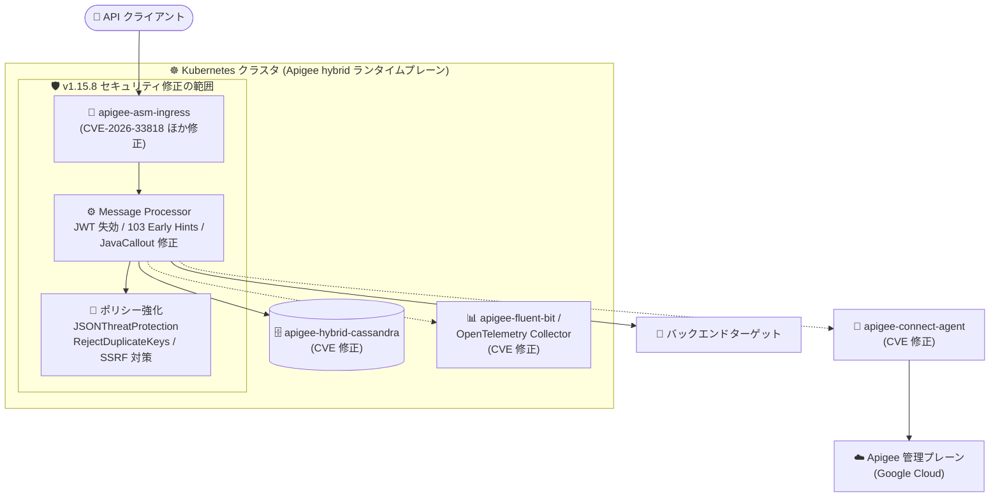

# Apigee hybrid: v1.15.8 パッチリリース (セキュリティ修正・バグ修正)

**リリース日**: 2026-09-24

**サービス**: Apigee hybrid

**機能**: v1.15.8 パッチリリース (Announcement / Fixed / Security)

**ステータス**: Announcement (パッチリリース)

📊 [このアップデートのインフォグラフィックを見る](https://takech9203.github.io/google-cloud-news-summary/20260924-apigee-hybrid-v1-15-8-security.html)

## 概要

2026 年 9 月 24 日、Apigee hybrid の更新版ソフトウェア v1.15.8 がリリースされました。本リリースはパッチリリースであり、ランタイム層における複数のセキュリティ問題の修正、ポリシー関連のバグ修正、そして Apigee hybrid を構成する多数のコンテナイメージ (apigee-asm-ingress、apigee-asm-istiod、apigee-connect-agent、apigee-fluent-bit、apigee-hybrid-cassandra、apigee-mart-server、apigee-open-telemetry-collector、apigee-operators など) に対する広範な CVE 対応が含まれています。

ランタイムの修正では、JWT リフレッシュトークンの失効 (revocation) 処理のセキュリティ問題 (Bug ID: 535928300)、HTTP ターゲットの中間レスポンス (103 Early Hints) 処理におけるレスポンス非同期化 (response desynchronization) を防ぐ修正 (535683286)、JavaCallout ポリシーのセキュリティ問題 (534852923) が修正されました。また、AI 保護ポリシーにおける SSRF (サーバーサイドリクエストフォージェリ) 防止のための入力検証強化 (469642464) も含まれます。

コンテナイメージのセキュリティ修正では、Ingress ゲートウェイ (apigee-asm-ingress) に対する CVE-2026-33818、CVE-2026-39821、CVE-2026-56853、CVE-2026-56858〜56865 系、GHSA-hrxh-6v49-42gf などが対処されています。Apigee hybrid をセルフマネージドの Kubernetes クラスタ (GKE、EKS、AKS、OpenShift など) で運用しているすべての組織にとって、早期の適用が推奨される重要なパッチです。

**アップデート前の課題**

- v1.15.7 以前のランタイムでは、JWT リフレッシュトークンの失効処理、103 Early Hints (中間レスポンス) の処理、JavaCallout ポリシーにセキュリティ上の問題が存在していた
- 特に 103 Early Hints の処理不備は、HTTP レスポンスの非同期化 (response desynchronization) につながる可能性があり、リクエストスマグリング類似の攻撃リスクがあった
- apigee-asm-ingress や apigee-fluent-bit をはじめとする各コンテナイメージに、多数の既知の脆弱性 (CVE) が残存していた
- JSONThreatProtection ポリシーは、同一オブジェクト内の重複キーを含む JSON ペイロードを拒否する手段を提供していなかった
- Apigee hybrid コンポーネントの PodDisruptionBudget (PDB) をカスタム値で構成できなかった

**アップデート後の改善**

- JWT リフレッシュトークン失効処理、103 Early Hints 処理、JavaCallout ポリシーのセキュリティ問題が修正され、API ゲートウェイのランタイムが堅牢化された
- AI 保護ポリシーの入力検証が強化され、SSRF 攻撃のリスクが低減された
- 各コンテナイメージの CVE (CVE-2026-33818、CVE-2026-39821、CVE-2026-56853 系ほか多数) が修正された
- JSONThreatProtection ポリシーに `<RejectDuplicateKeys>` 子要素が追加され、重複キーを含む JSON ペイロードを拒否できるようになった
- VerifyAPIKey ポリシーがデベロッパー属性の読み取り時に NullPointerException で失敗する問題が修正された
- overrides.yaml で Apigee hybrid コンポーネントのカスタム PodDisruptionBudget (`minAvailable` / `maxUnavailable`) を構成できるようになった

## アーキテクチャ図



v1.15.8 では、API トラフィックの入口となる Ingress ゲートウェイからランタイム (Message Processor)、データストア、テレメトリまで、ランタイムプレーン全体のコンテナイメージとポリシー処理にセキュリティ修正が適用されます。

## サービスアップデートの詳細

### 主要機能

1. **ランタイムのセキュリティ修正 (Fixed)**
   - **535928300**: JWT リフレッシュトークンの失効 (revocation) 処理におけるセキュリティ問題を修正
   - **535683286**: HTTP ターゲットの中間レスポンス (103 Early Hints) 処理を修正し、レスポンス非同期化 (response desynchronization) を防止
   - **534852923**: JavaCallout ポリシーのセキュリティ問題を修正
   - **469642464**: AI 保護ポリシーの入力検証を改善し、SSRF (サーバーサイドリクエストフォージェリ) を防止

2. **ポリシー・運用機能の改善 (Fixed)**
   - **534420582**: JSONThreatProtection ポリシーがオプションの `<RejectDuplicateKeys>` 子要素をサポート。同一オブジェクト内に重複キーを含む JSON ペイロードを拒否可能に
   - **531773665**: VerifyAPIKey ポリシーがデベロッパー属性の読み取り時に NullPointerException で失敗する問題を修正
   - **449228485**: overrides.yaml で Apigee hybrid コンポーネントのカスタム Kubernetes PodDisruptionBudget (`minAvailable` または `maxUnavailable`) の構成をサポート

3. **コンテナイメージのセキュリティ修正 (Security)**
   - **apigee-asm-ingress / apigee-asm-istiod**: CVE-2026-33818、CVE-2026-39821、CVE-2026-56853、CVE-2026-56858/56859/56860/56862/56864/56865、GHSA-hrxh-6v49-42gf に対処
   - **apigee-connect-agent**: 上記に加えて CVE-2026-46600、CVE-2026-84303/84304/84445 に対処
   - **apigee-fluent-bit**: CVE-2025-13151、CVE-2026-14456 系、CVE-2026-63072〜63076 など 50 件超の脆弱性に対処
   - **apigee-hybrid-cassandra / cassandra-client**: CVE-2026-54512〜54515、CVE-2026-59888、GHSA-72hv-8253-57qq などに対処
   - **apigee-mart-server / apigee-mint-task-scheduler**: CVE-2026-55831/55833、CVE-2026-56745/56746/56819、CVE-2026-59889〜59921 系、GHSA-mhm7-754m-9p8w に対処
   - **apigee-open-telemetry-collector / apigee-operators**: CVE-2026-43871、CVE-2026-81870/81871、CVE-2026-84303 系などに対処

## 技術仕様

### パッチリリースの適用方式

| 項目 | 詳細 |
|------|------|
| リリース種別 | パッチリリース (v1.15.8) |
| 配布方式 | コンテナイメージは Apigee hybrid Helm チャートに統合 |
| 適用方法 | Helm チャート経由でパッチにアップグレードすると、イメージが自動更新される (手動でのイメージ変更は通常不要) |
| チャートリポジトリ | `oci://us-docker.pkg.dev/apigee-release/apigee-hybrid-helm-charts` (Google Artifact Registry) |
| 対象プラットフォーム | GKE、Google Distributed Cloud (VMware / bare metal)、EKS、AKS、OpenShift、RKE など |

### JSONThreatProtection ポリシーの新要素

```xml
<JSONThreatProtection name="JSON-Threat-Protection-1">
  <Source>request</Source>
  <!-- v1.15.8 で追加: 同一オブジェクト内の重複キーを拒否 -->
  <RejectDuplicateKeys>true</RejectDuplicateKeys>
</JSONThreatProtection>
```

### PodDisruptionBudget のカスタム構成 (overrides.yaml)

```yaml
# v1.15.8 で追加: コンポーネントごとの PDB 設定
runtime:
  podDisruptionBudget:
    minAvailable: 1
    # または maxUnavailable: 1
```

## 設定方法

### 前提条件

1. Apigee hybrid v1.15.x を運用中であること (v1.14 からの場合は先に v1.15 系へのアップグレード手順に従う)
2. Helm チャートディレクトリ (`$APIGEE_HELM_CHARTS_HOME`) のバックアップと Cassandra データベースのバックアップを取得済みであること
3. Kubernetes プラットフォームが hybrid 1.15 のサポートバージョンであること
4. cert-manager がサポートバージョン (1.16.3+ または 1.17.2+ 推奨) であること

### 手順

#### ステップ 1: v1.15.8 の Helm チャートを取得

```bash
export CHART_REPO=oci://us-docker.pkg.dev/apigee-release/apigee-hybrid-helm-charts
export CHART_VERSION=1.15.8

helm pull $CHART_REPO/apigee-operator --version $CHART_VERSION --untar
helm pull $CHART_REPO/apigee-datastore --version $CHART_VERSION --untar
helm pull $CHART_REPO/apigee-env --version $CHART_VERSION --untar
helm pull $CHART_REPO/apigee-ingress-manager --version $CHART_VERSION --untar
helm pull $CHART_REPO/apigee-org --version $CHART_VERSION --untar
helm pull $CHART_REPO/apigee-redis --version $CHART_VERSION --untar
helm pull $CHART_REPO/apigee-telemetry --version $CHART_VERSION --untar
helm pull $CHART_REPO/apigee-virtualhost --version $CHART_VERSION --untar
```

Google Artifact Registry から v1.15.8 の各チャートをローカルに取得します。

#### ステップ 2: CRD を更新して各チャートをアップグレード

```bash
# CRD の更新 (dry-run で検証後に適用)
kubectl apply -k apigee-operator/etc/crds/default/ \
  --server-side --force-conflicts --validate=false --dry-run=server
kubectl apply -k apigee-operator/etc/crds/default/ \
  --server-side --force-conflicts --validate=false

# 例: operator チャートのアップグレード (他チャートも同様に順次実行)
helm upgrade operator apigee-operator/ \
  --install \
  --namespace apigee \
  --atomic \
  -f overrides.yaml
```

パッチリリースのコンテナイメージは Helm チャートに統合されているため、チャートのアップグレードでイメージが自動的に更新されます。詳細な順序は公式のアップグレード手順に従ってください。

## メリット

### ビジネス面

- **セキュリティリスクの低減**: API ゲートウェイという攻撃対象になりやすいコンポーネントの既知脆弱性 (多数の CVE) が一括修正され、コンプライアンス要件 (脆弱性管理) への対応が容易になる
- **運用負荷の軽減**: パッチはコンテナイメージが Helm チャートに統合されているため、手動でのイメージ差し替え作業が不要

### 技術面

- **レスポンス非同期化攻撃への対策**: 103 Early Hints 処理の修正により、HTTP レスポンス非同期化 (リクエストスマグリング類似) のリスクを排除
- **JSON ペイロードの防御強化**: `<RejectDuplicateKeys>` により、重複キーを悪用したパーサー間の解釈差異 (JSON interoperability 攻撃) を入口で遮断可能
- **可用性制御の柔軟化**: カスタム PDB 構成により、ノードメンテナンスやクラスタアップグレード時の Apigee コンポーネントの可用性を細かく制御可能

## デメリット・制約事項

### 制限事項

- 修正の適用には Apigee hybrid ランタイムのアップグレード作業 (Helm チャートの更新) が必要であり、マネージドサービスのように自動適用はされない
- `<RejectDuplicateKeys>` はオプトインの設定であり、既存プロキシで有効化するにはポリシー定義の変更と再デプロイが必要

### 考慮すべき点

- アップグレード前に Helm チャートディレクトリと Cassandra のバックアップ取得が推奨される (v1.14 以降は Guardrails によるバックアップチェックあり)
- 複数リージョン・複数クラスタ構成の場合は、クラスタごとに順次アップグレードを計画する必要がある
- アップグレード中は新しい環境 (environment) を作成しないこと
- 問題発生時は旧バージョン (v1.15.7 以前) のチャートでロールバックが可能だが、逆順 (apigee-virtualhost → apigee-operator → CRD) での作業が必要

## ユースケース

### ユースケース 1: 脆弱性管理ポリシーに基づく定期パッチ適用

**シナリオ**: 金融機関がオンプレミスの OpenShift クラスタで Apigee hybrid を運用しており、社内の脆弱性管理基準で「Critical/High の CVE は 30 日以内に修正」と定められている。

**実装例**:
```bash
# 現在のバージョン確認
kubectl get apigeeorganizations -n apigee -o jsonpath='{.items[0].status.state}'
helm list -n apigee

# v1.15.8 チャート取得後、dry-run で検証してから適用
helm upgrade operator apigee-operator/ --install --namespace apigee \
  --atomic -f overrides.yaml --dry-run
```

**効果**: apigee-asm-ingress や apigee-fluent-bit などに残存していた多数の CVE を一括で解消し、脆弱性スキャナの指摘事項をクローズできる。

### ユースケース 2: JSON 重複キー攻撃への防御強化

**シナリオ**: 決済 API を公開している企業が、JSON パーサー間の重複キー解釈差異を悪用した改ざん攻撃 (例: `{"amount": 100, "amount": 10000}`) への対策を強化したい。

**効果**: JSONThreatProtection ポリシーに `<RejectDuplicateKeys>true</RejectDuplicateKeys>` を追加することで、重複キーを含むリクエストをゲートウェイ層で拒否し、バックエンドのパーサー実装に依存しない防御を実現できる。

## 料金

Apigee hybrid のパッチ適用自体に追加料金は発生しません。Apigee の料金は、サブスクリプション (Standard / Enterprise / Enterprise Plus) または従量課金 (Pay-as-you-go) モデルに基づきます。

- [Apigee 料金ページ](https://cloud.google.com/apigee/pricing)

## 利用可能リージョン

Apigee hybrid のランタイムプレーンはユーザー管理の Kubernetes クラスタ (GKE、Google Distributed Cloud、EKS、AKS、OpenShift、RKE など) 上で動作するため、リージョンの制約は管理プレーンの利用可能リージョンに準じます。詳細は [Apigee のロケーション](https://cloud.google.com/apigee/docs/locations) を参照してください。

## 関連サービス・機能

- **Apigee X**: フルマネージド版の Apigee。hybrid と同様のポリシー体系を持ち、ランタイム管理は Google が実施
- **Google Kubernetes Engine (GKE)**: Apigee hybrid ランタイムプレーンの代表的なホスティング先。クラスタバージョンの互換性維持が必要
- **Cloud Service Mesh / Istio (apigee-asm-ingress / istiod)**: Apigee hybrid の Ingress ゲートウェイ基盤。本リリースで複数の CVE が修正された
- **Google Artifact Registry**: Apigee hybrid Helm チャートの配布元 (`us-docker.pkg.dev/apigee-release`)
- **Model Armor / AI 保護ポリシー**: AI 保護ポリシーの SSRF 対策が本リリースで強化された

## 参考リンク

- 📊 [インフォグラフィック](https://takech9203.github.io/google-cloud-news-summary/20260924-apigee-hybrid-v1-15-8-security.html)
- [公式リリースノート](https://docs.cloud.google.com/release-notes#September_24_2026)
- [Apigee hybrid v1.15 アップグレードガイド](https://docs.cloud.google.com/apigee/docs/hybrid/v1.15/upgrade)
- [Apigee リリースプロセス (コンテナイメージサポート)](https://docs.cloud.google.com/apigee/docs/release/apigee-release-process)
- [JSONThreatProtection ポリシー](https://docs.cloud.google.com/apigee/docs/api-platform/reference/policies/json-threat-protection-policy)
- [料金ページ](https://cloud.google.com/apigee/pricing)

## まとめ

Apigee hybrid v1.15.8 は、JWT リフレッシュトークン失効処理や 103 Early Hints 処理のレスポンス非同期化防止などランタイムのセキュリティ修正に加え、Ingress からテレメトリまで広範なコンテナイメージの CVE を解消する重要なパッチリリースです。Apigee hybrid v1.15 系を運用中の組織は、Cassandra とチャートディレクトリのバックアップを取得のうえ、Helm チャート経由での早期アップグレードを計画することを推奨します。あわせて、新たに追加された JSONThreatProtection の `<RejectDuplicateKeys>` とカスタム PodDisruptionBudget の活用も検討してください。

---

**タグ**: #ApigeeHybrid #Security #CVE #PatchRelease #APIManagement #Kubernetes #Helm
