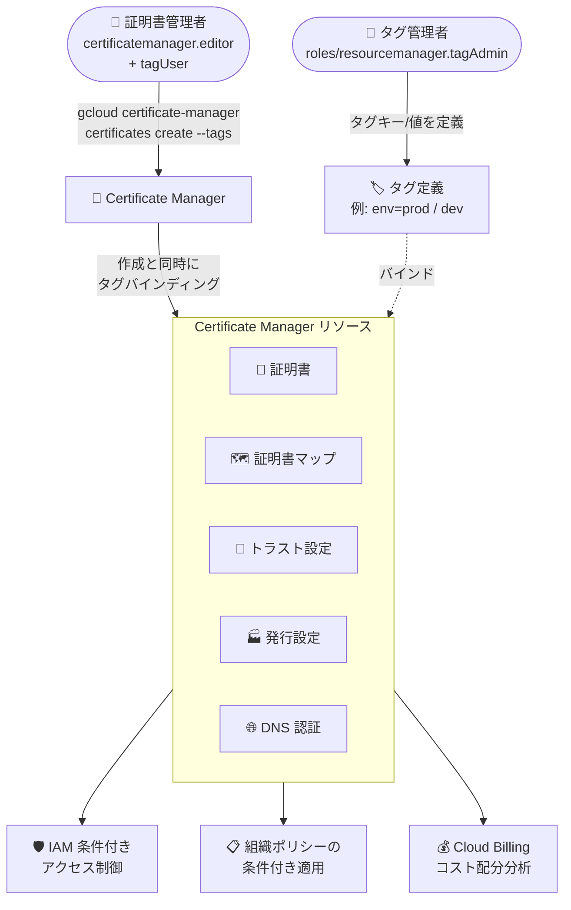

# Certificate Manager: リソース作成時のタグ付与 (Preview)

**リリース日**: 2026-09-24

**サービス**: Certificate Manager

**機能**: リソース作成時のタグ (Resource Manager タグ) 付与サポート

**ステータス**: Preview

📊 [このアップデートのインフォグラフィックを見る](https://takech9203.github.io/google-cloud-news-summary/20260924-certificate-manager-resource-tags-preview.html)

## 概要

Certificate Manager のリソース作成時に、Resource Manager タグを付与できるようになりました。本機能は Preview として提供されます。タグはキーと値のペアで構成される Google Cloud のリソースであり、リソースに紐付ける (タグバインディングを作成する) ことで、IAM 条件付きロール付与、組織ポリシーの条件付き適用、Cloud Billing でのコスト配分分析などに活用できます。

これまでもタグの仕組み自体は Resource Manager の機能として存在していましたが、今回のアップデートにより、Certificate Manager のリソース (証明書、証明書マップ、トラスト設定、発行設定、DNS 認証) を作成するタイミングでタグを直接付与できるようになりました。リソース作成と同時に必須のメタデータを付与できるため、ガバナンスポリシーの適用漏れを防ぎ、組織全体でのリソース管理・コスト追跡・自動的なポリシー適用が容易になります。

証明書のライフサイクルを組織的に管理するプラットフォームチーム、セキュリティチーム、および環境別 (本番/開発) のアクセス制御やコスト配分を必要とする企業ユーザーが主な対象です。

**アップデート前の課題**

- Certificate Manager リソースへのタグ付与は、リソース作成後に `gcloud resource-manager tags bindings create` で個別にタグバインディングを作成する必要があった
- リソース作成からタグ付与までの間に、タグを前提とした IAM 条件や組織ポリシーが適用されない期間が発生し、ガバナンスの隙間が生じる可能性があった
- 作成とタグ付けが別オペレーションのため、自動化スクリプトや IaC での手順が煩雑になりやすかった

**アップデート後の改善**

- リソース作成コマンド (例: `gcloud certificate-manager certificates create`) の `--tags` フラグで、作成と同時に複数のタグを付与できるようになった
- 作成直後からタグに基づく IAM 条件付きアクセス制御や組織ポリシー、コスト追跡が機能するようになった
- リソース作成時に必須メタデータを即座に付与でき、組織的な整理・コスト追跡・自動ポリシー適用が改善された

## アーキテクチャ図



タグ管理者が定義したタグを、Certificate Manager リソースの作成時に直接バインドできるようになり、作成直後から IAM 条件・組織ポリシー・コスト追跡に活用できます。

## サービスアップデートの詳細

### 主要機能

1. **リソース作成時のタグ付与**
   - `gcloud certificate-manager certificates create` コマンドの `--tags` フラグで、`TAGKEY1=TAGVALUE1,TAGKEY2=TAGVALUE2` の形式によりカンマ区切りで複数タグを指定可能
   - 作成と同時にタグバインディングが作成されるため、メタデータ付与のタイミングの遅延がない

2. **タグをサポートする Certificate Manager リソース**
   - 証明書 (Certificates)
   - 証明書マップ (Certificate maps)
   - トラスト設定 (Trust configs)
   - 発行設定 (Issuance configurations)
   - DNS 認証 (DNS authorizations)

3. **既存リソースへのタグ付与・管理**
   - 既存リソースには `gcloud resource-manager tags bindings create` でタグバインディングを作成して付与
   - `gcloud resource-manager tags bindings list` で直接付与されたタグと継承されたタグの一覧を確認
   - `gcloud resource-manager tags bindings delete` で直接付与されたタグをデタッチ (継承タグはデタッチ不可、同一キーの別の値で上書きは可能)

## 技術仕様

### タグとラベルの違い

Certificate Manager リソースには、タグとラベルの両方を独立して適用できます。Certificate Manager 内での自動化・課金目的のリソースグループ化にはラベルを使用します。

| 項目 | タグ (Tags) | ラベル (Labels) |
|------|------------|-----------------|
| リソース構造 | タグキー・タグ値・タグバインディングはそれぞれ独立したリソース | リソースのメタデータ (それ自体はリソースではない) |
| 定義場所 | 組織またはプロジェクトレベル | 各リソースで定義 |
| 継承 | 階層の子リソースに継承される | 継承されない |
| IAM 許可/拒否ポリシー | 条件として参照可能 | 非対応 |
| 組織ポリシー | 条件付き制約で参照可能 | 非対応 |
| キー・値の長さ | 最大 256 文字 | 最大 63 文字 |

### 必要な IAM ロール

| 操作 | 必要なロール |
|------|-------------|
| タグの表示 | `roles/resourcemanager.tagViewer` (タグが付与されたリソースに対して) |
| 組織レベルでのタグの表示・管理 | `roles/resourcemanager.organizationViewer` (組織に対して) |
| タグ定義の作成・更新・削除 | `roles/resourcemanager.tagAdmin` |
| タグのアタッチ・デタッチ | `roles/resourcemanager.tagUser` (タグ値と対象リソースに対して) |
| Certificate Manager リソースへのタグ付与 | `roles/certificatemanager.editor` |

## 設定方法

### 前提条件

1. タグキーとタグ値が組織またはプロジェクトレベルで事前に定義されていること (タグはアタッチ前に定義が必要)
2. 上記の必要な IAM ロール (特に `roles/resourcemanager.tagUser` と `roles/certificatemanager.editor`) が付与されていること

### 手順

#### ステップ 1: タグキーとタグ値の作成

```bash
# タグキーの作成 (組織レベルの例)
gcloud resource-manager tags keys create env \
    --parent=organizations/ORGANIZATION_ID

# タグ値の作成
gcloud resource-manager tags values create prod \
    --parent=ORGANIZATION_ID/env
```

タグをアタッチする前に、タグキーとタグ値を定義しておく必要があります。

#### ステップ 2: 証明書作成時にタグを付与

```bash
gcloud certificate-manager certificates create CERT_NAME \
    --domains=DOMAIN \
    --project=PROJECT_ID \
    --tags=TAGKEY1=TAGVALUE1,TAGKEY2=TAGVALUE2
```

`--tags` フラグにカンマ区切りでキーと値のペアを指定すると、証明書の作成と同時にタグがバインドされます。

#### ステップ 3: 既存リソースへのタグ付与 (参考)

```bash
gcloud resource-manager tags bindings create \
    --tag-value=tagValues/567890123456 \
    --parent=//certificatemanager.googleapis.com/projects/PROJECT_ID/locations/global/trustConfigs/TRUST_CONFIG_ID
```

既存の Certificate Manager リソースには、リソースのフル ID (`//certificatemanager.googleapis.com/...`) を指定してタグバインディングを作成します。リージョンリソースの場合は `--location` フラグを指定します。

## メリット

### ビジネス面

- **コスト追跡・配分の強化**: タグは Cloud Billing のコストデータ BigQuery エクスポートと統合されており、チャージバックや監査などのコスト配分分析に活用できる
- **ガバナンスの強化**: 作成時点からタグに基づく組織ポリシーの条件付き適用が可能になり、コンプライアンス管理の抜け漏れを削減できる

### 技術面

- **IAM 条件付きアクセス制御**: リソースに特定のタグが付与されているかどうかに基づいて、IAM ロールの条件付き付与や権限の条件付き拒否が可能
- **運用の簡素化**: リソース作成とタグ付与が 1 コマンドで完結し、自動化スクリプトや CI/CD パイプラインでの手順が簡潔になる
- **タグの継承**: タグバインディングは Google Cloud 階層の子リソースに継承されるため、組織・フォルダ・プロジェクトレベルでの一括統制と個別の上書きを組み合わせられる

## デメリット・制約事項

### 制限事項

- 本機能は Preview であり、GA 前の機能として提供される
- タグはアタッチ前にタグキー・タグ値の定義が必要 (ラベルと異なり、事前定義なしでの付与は不可)
- 継承されたタグはデタッチできない (同一キーの別のタグ値で上書きすることは可能)
- タグ定義を削除するには、先に既存のタグバインディングをすべて削除する必要がある

### 考慮すべき点

- IAM 条件付きロールバインディングを適用している場合、リソースのタグを変更・削除するとユーザーのアクセス権が失われる可能性がある
- タグの変更は通常 2 分以内に反映されるが、システム全体への完全な伝播には最大 7 分かかる場合がある
- タグとラベルは独立した仕組みであり、用途が異なる (アクセス制御・ポリシーにはタグ、サービス内でのグループ化にはラベル)。両方を併用できるが、使い分けの設計が必要

## ユースケース

### ユースケース 1: 環境別の証明書アクセス制御

**シナリオ**: 開発チームには開発環境の証明書のみ管理を許可し、本番環境の証明書はプラットフォームチームのみが管理できるようにしたい。

**実装例**:
```bash
# 開発用証明書を env=dev タグ付きで作成
gcloud certificate-manager certificates create dev-cert \
    --domains=dev.example.com \
    --project=my-project \
    --tags=env=dev

# IAM 条件で env=dev タグを持つリソースのみに
# certificatemanager.editor ロールを条件付き付与
```

**効果**: 証明書作成の時点からタグに基づく条件付きアクセス制御が機能し、本番証明書への誤操作リスクを低減できる。

### ユースケース 2: 部門別のコスト配分・監査

**シナリオ**: 複数部門が共有するプロジェクトで、証明書関連リソースのコストを部門別に配分・監査したい。

**効果**: 作成時に部門タグ (例: `cost-center=team-a`) を付与することで、Cloud Billing のコストデータ BigQuery エクスポートと組み合わせたチャージバックや監査などのコスト配分分析が可能になる。

## 料金

タグ付与機能自体に関する追加料金の情報はリリースノートには記載されていません。Certificate Manager 自体の料金は公式の料金ページを参照してください。

- [Certificate Manager の料金](https://cloud.google.com/certificate-manager/pricing)

## 関連サービス・機能

- **Resource Manager (タグ)**: タグキー・タグ値・タグバインディングを管理する基盤機能。タグの定義と階層継承を提供
- **IAM (条件付きアクセス)**: タグを IAM 条件として使用し、ロールの条件付き付与や権限の条件付き拒否を実現
- **組織ポリシー**: タグに基づいて組織ポリシーの制約を条件付きで適用 (スコープ設定) 可能
- **Cloud Billing / BigQuery**: タグを含むコストデータを BigQuery にエクスポートし、コスト配分分析に活用
- **ラベル**: タグとは独立した、サービス内での自動化・課金目的のリソースグループ化手段。併用可能

## 参考リンク

- 📊 [インフォグラフィック](https://takech9203.github.io/google-cloud-news-summary/20260924-certificate-manager-resource-tags-preview.html)
- [公式リリースノート](https://docs.cloud.google.com/release-notes#September_24_2026)
- [Certificate Manager リソースのタグの作成と管理](https://docs.cloud.google.com/certificate-manager/docs/create-manage-tags)
- [タグの概要 (Resource Manager)](https://docs.cloud.google.com/resource-manager/docs/tags/tags-overview)
- [タグの作成と管理 (Resource Manager)](https://docs.cloud.google.com/resource-manager/docs/tags/tags-creating-and-managing)
- [タグをサポートするサービス](https://docs.cloud.google.com/resource-manager/docs/tags/tags-supported-services)
- [Certificate Manager の料金](https://cloud.google.com/certificate-manager/pricing)

## まとめ

Certificate Manager リソースの作成時にタグを付与できるようになったことで、証明書関連リソースに対しても作成直後からタグベースのアクセス制御・組織ポリシー適用・コスト追跡が可能になりました。証明書のガバナンスを組織的に管理しているチームは、Preview 段階のうちにタグキーの設計 (環境・部門・コストセンターなど) と IAM 条件の適用方針を検討し、既存の証明書リソースへのタグ付与とあわせて導入を評価することを推奨します。

---

**タグ**: Certificate Manager, Resource Manager, タグ, IAM, 組織ポリシー, コスト管理, セキュリティ, Preview
