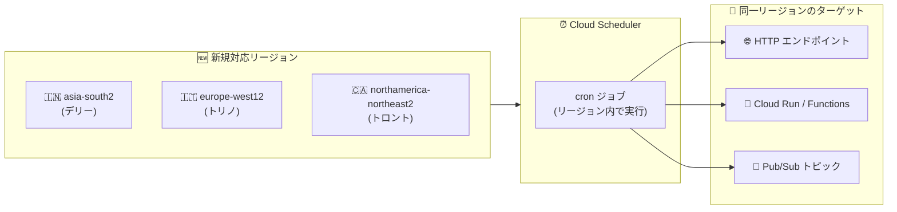

# Cloud Scheduler: 3 リージョン追加 (デリー、トリノ、トロント)

**リリース日**: 2026-09-24

**サービス**: Cloud Scheduler

**機能**: 利用可能リージョンの拡大 (asia-south2 / europe-west12 / northamerica-northeast2)

**ステータス**: Change (リージョン拡大)

📊 [このアップデートのインフォグラフィックを見る](https://takech9203.github.io/google-cloud-news-summary/20260924-cloud-scheduler-region-expansion.html)

## 概要

フルマネージドの cron ジョブサービスである Cloud Scheduler が、新たに 3 つのリージョンで利用可能になりました。追加されたのは asia-south2 (インド・デリー)、europe-west12 (イタリア・トリノ)、northamerica-northeast2 (カナダ・オンタリオ州トロント) です。

Cloud Scheduler はジョブを実行するリージョンを選択でき、ターゲットとなるコンピュートリソースと同じロケーションにジョブを配置することで、ネットワークパフォーマンスの最適化とデータレジデンシー (データ所在地) 要件への対応が可能です。今回の拡大により、インド北部、イタリア北西部、カナダ・オンタリオ州にワークロードを持つ組織が、スケジュールジョブをワークロードと同一リージョンで完結させられるようになります。

Cloud Scheduler のリージョン拡大は継続的に進んでおり、2026 年に入ってからも 4 月に中東 4 リージョン、7 月にミラノ・パリ・ダラス、9 月 18 日にバンコクが追加されています。今回の 3 リージョン追加はその流れに続くものです。

**アップデート前の課題**

- asia-south2 (デリー)、europe-west12 (トリノ)、northamerica-northeast2 (トロント) では Cloud Scheduler ジョブを作成できず、近隣リージョン (asia-south1 ムンバイ、europe-west8 ミラノ、northamerica-northeast1 モントリオールなど) にジョブを配置する必要があった
- スケジュールジョブとターゲットリソース (Cloud Run、Cloud Functions など) のリージョンが分かれることで、リージョン間のネットワーク経路が発生していた
- ジョブのメタデータやペイロードを特定リージョン内に留めたいデータレジデンシー要件 (インドやカナダの規制対応など) に対して、これらのリージョンでは Cloud Scheduler を構成に含められなかった

**アップデート後の改善**

- 3 リージョンでネイティブに Cloud Scheduler ジョブを作成・実行できるようになった
- デリー、トリノ、トロントにデプロイした Cloud Run / Cloud Functions / Pub/Sub などのターゲットと同一リージョンでジョブを完結でき、ネットワークパフォーマンスが最適化される
- 組織ポリシーのリソースロケーション制約でこれらのリージョンに限定している環境でも、Cloud Scheduler を利用可能になった

## アーキテクチャ図



新規対応の 3 リージョン内で Cloud Scheduler ジョブを作成し、同一リージョンの HTTP / Cloud Run / Pub/Sub ターゲットを呼び出せるようになった構成を示しています。

## サービスアップデートの詳細

### 主要機能

1. **asia-south2 (インド・デリー) での提供開始**
   - インド国内 2 番目のリージョンで Cloud Scheduler が利用可能に (既存: asia-south1 ムンバイ)
   - インド国内にデータを留める要件を持つワークロードで、スケジュールジョブをデリーに配置可能

2. **europe-west12 (イタリア・トリノ) での提供開始**
   - イタリア国内 2 番目のリージョンで利用可能に (既存: europe-west8 ミラノ)
   - イタリア国内でのマルチリージョン構成 (ミラノ + トリノ) にスケジュールジョブを組み込み可能

3. **northamerica-northeast2 (カナダ・トロント) での提供開始**
   - カナダ国内 2 番目のリージョンで利用可能に (既存: northamerica-northeast1 モントリオール)
   - トロントは低 CO2 リージョンであり、サステナビリティ要件のある構成にも適合

## 技術仕様

### Cloud Scheduler の主なクォータ・制限 (全リージョン共通)

| 項目 | 値 |
|------|------|
| ジョブ数 (リージョンあたり) | 5,000 (引き上げ申請可) |
| ジョブの最大サイズ (ペイロード) | 1 MB (約 1 KB のリクエストオーバーヘッド含む) |
| HTTP ターゲットのジョブ実行時間上限 | 30 分 (変更不可) |
| 読み取り API リクエスト | 1,250 回/分 |
| 書き込み API リクエスト | 500 回/分 |

### 対応ターゲット

- HTTP/S エンドポイント
- Pub/Sub トピック
- App Engine HTTP
- Cloud Run / Cloud Functions (内部呼び出し対応、VPC Service Controls 対応)

## 設定方法

### 前提条件

1. Google Cloud プロジェクトで Cloud Scheduler API が有効化されていること
2. `roles/cloudscheduler.admin` などの必要な IAM ロールが付与されていること

### 手順

#### ステップ 1: 新リージョンでジョブを作成

```bash
# デリーリージョンに HTTP ターゲットの cron ジョブを作成
gcloud scheduler jobs create http my-job \
  --location=asia-south2 \
  --schedule="0 9 * * 1" \
  --uri="https://example.com/task" \
  --http-method=POST
```

`--location` に `asia-south2`、`europe-west12`、`northamerica-northeast2` を指定できるようになりました。

#### ステップ 2: ジョブの動作確認

```bash
# ジョブを手動実行して確認
gcloud scheduler jobs run my-job --location=asia-south2

# ジョブの一覧を確認
gcloud scheduler jobs list --location=asia-south2
```

## メリット

### ビジネス面

- **データレジデンシー対応**: インド・イタリア・カナダの国内リージョンでスケジュールジョブを完結でき、データ所在地に関する規制・社内ポリシーへの対応が容易になる
- **国内マルチリージョン構成**: ムンバイ + デリー、ミラノ + トリノ、モントリオール + トロントといった国内 2 リージョン構成にスケジューリング層を組み込める

### 技術面

- **ネットワークパフォーマンスの最適化**: ジョブとターゲットリソースを同一リージョンに配置することでリージョン間通信を排除できる
- **組織ポリシーとの整合**: リソースロケーション制約でこれらのリージョンに限定している環境でも Cloud Scheduler を利用できる

## デメリット・制約事項

### 考慮すべき点

- 既存の他リージョンのジョブを移動する機能はないため、新リージョンへ移す場合はジョブの再作成が必要
- リージョン単位のジョブ数クォータ (デフォルト 5,000) は新リージョンにも個別に適用される
- Cloud Scheduler ジョブ自体はリージョナルリソースであり、リージョン障害に備える場合は複数リージョンへのジョブ配置を別途設計する必要がある

## ユースケース

### ユースケース 1: インド国内で完結する夜間バッチ

**シナリオ**: インドの規制要件によりデータと処理をインド国内に留める必要がある企業が、デリーリージョンの Cloud Run ジョブを夜間に起動したい。

**実装例**:
```bash
gcloud scheduler jobs create http nightly-batch \
  --location=asia-south2 \
  --schedule="0 2 * * *" \
  --time-zone="Asia/Kolkata" \
  --uri="https://batch-service-xxxx.asia-south2.run.app/run" \
  --http-method=POST \
  --oidc-service-account-email=scheduler-sa@PROJECT_ID.iam.gserviceaccount.com
```

**効果**: スケジューラーからバッチ実行までインド国内 (デリー) で完結し、データレジデンシー要件を満たしつつレイテンシーも最小化できる。

### ユースケース 2: トロントでの定期的な Pub/Sub トリガー

**シナリオ**: カナダ・オンタリオ州のワークロードで、トロントリージョンの Pub/Sub トピックへ定期的にメッセージを発行し、下流のデータパイプラインを起動したい。

**効果**: これまでモントリオールに配置していたスケジュールジョブをトロントに統合でき、リージョンをまたぐ構成要素を削減して運用をシンプルにできる。

## 料金

Cloud Scheduler の料金はジョブ単位の月額課金で、リージョンによる料金差はありません。

- ジョブあたり月額 $0.10 (USD)
- 請求先アカウントあたり月 3 ジョブまで無料

### 料金例

| 使用量 | 月額料金 (概算) |
|--------|-----------------|
| 3 ジョブ | $0 (無料枠内) |
| 10 ジョブ | $0.70 (課金対象は 7 ジョブ) |

詳細は [Cloud Scheduler の料金ページ](https://cloud.google.com/scheduler/pricing) を参照してください。

## 利用可能リージョン

今回追加されたリージョン:

| リージョン | ロケーション | 備考 |
|-----------|-------------|------|
| asia-south2 | デリー、インド | インド国内 2 番目 |
| europe-west12 | トリノ、イタリア | イタリア国内 2 番目 |
| northamerica-northeast2 | トロント、オンタリオ州、カナダ | 低 CO2 リージョン |

利用可能な全リージョンの一覧は [Cloud Scheduler locations](https://docs.cloud.google.com/scheduler/docs/locations) を参照してください。

## 関連サービス・機能

- **Cloud Run / Cloud Functions**: Cloud Scheduler の代表的なターゲット。内部呼び出しにも対応しており、同一リージョン配置でレイテンシーを最小化できる
- **Pub/Sub**: スケジュールジョブからメッセージを発行し、イベント駆動のパイプラインを定期起動できる
- **VPC Service Controls**: Cloud Scheduler ジョブをサービス境界内で保護でき、VPC Service Controls 準拠の Google Cloud API への呼び出しに対応
- **組織ポリシー (リソースロケーション制約)**: ジョブ作成・更新時にロケーション制約が適用されるため、新リージョンの追加により制約下での選択肢が広がる

## 参考リンク

- 📊 [インフォグラフィック](https://takech9203.github.io/google-cloud-news-summary/20260924-cloud-scheduler-region-expansion.html)
- [公式リリースノート](https://docs.cloud.google.com/release-notes#September_24_2026)
- [ドキュメント: Cloud Scheduler locations](https://docs.cloud.google.com/scheduler/docs/locations)
- [ドキュメント: Cloud Scheduler quotas and limits](https://docs.cloud.google.com/scheduler/quotas)
- [料金ページ](https://cloud.google.com/scheduler/pricing)

## まとめ

Cloud Scheduler がデリー、トリノ、トロントの 3 リージョンに対応し、これらの地域にワークロードを持つ組織はスケジュールジョブをワークロードと同一リージョンで完結できるようになりました。データレジデンシー要件や組織ポリシーのロケーション制約でこれらのリージョンを利用している場合は、近隣リージョンに配置していた既存ジョブの移行 (再作成) を検討することを推奨します。

---

**タグ**: Cloud Scheduler, リージョン拡大, asia-south2, europe-west12, northamerica-northeast2, cron, サーバーレス
