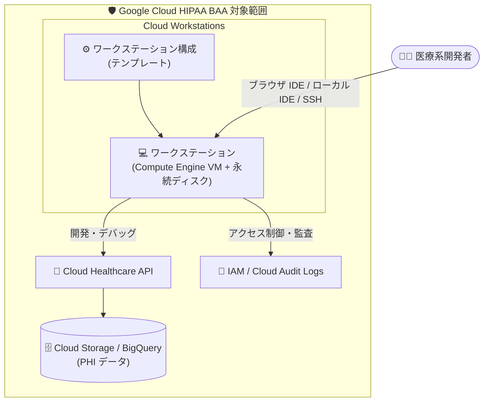

# Cloud Workstations: Google Cloud HIPAA BAA 対象プロダクト化

**リリース日**: 2026-09-24

**サービス**: Cloud Workstations

**機能**: Google Cloud HIPAA BAA の対象プロダクト (Covered Product) 化

**ステータス**: GA (コンプライアンス対応)

📊 [このアップデートのインフォグラフィックを見る](https://takech9203.github.io/google-cloud-news-summary/20260924-cloud-workstations-hipaa-baa.html)

## 概要

Cloud Workstations が Google Cloud HIPAA BAA (Business Associate Agreement / 事業提携契約) の対象プロダクト (Covered Product) になりました。これにより、米国の医療保険の相互運用性と説明責任に関する法律 (HIPAA) の適用を受ける Covered Entity (医療機関、保険者など) や Business Associate は、Google Cloud と BAA を締結したうえで、PHI (Protected Health Information: 保護対象保健情報) を扱うワークロードの開発環境として Cloud Workstations を利用できるようになります。

Cloud Workstations は、Google Cloud 上でマネージドかつセキュアな開発環境を提供するサービスです。管理者がワークステーション構成 (テンプレート) を定義し、開発者はブラウザベース IDE、ローカルの VS Code / JetBrains IDE、または SSH からアクセスします。医療・ヘルスケア業界では、PHI を含むデータベースや API (Cloud Healthcare API など) に接続して開発・デバッグを行う場面があり、開発環境自体が BAA の対象であるかどうかがサービス選定の重要な判断基準となっていました。

今回のアップデートは機能追加ではなくコンプライアンス範囲の拡大ですが、規制業界のエンタープライズにとっては「Cloud Workstations を正式に採用できるか」を左右する重要な変更です。追加料金は不要で、HIPAA 対応のために特別なリージョンや専用環境に制限されることもありません (Google Cloud の BAA はインフラストラクチャ全体をカバーします)。

**アップデート前の課題**

- Cloud Workstations は Google Cloud HIPAA BAA の対象プロダクトリストに含まれておらず、BAA を締結した顧客は PHI に関わるワークロードで Cloud Workstations を利用することができなかった (BAA の対象外プロダクトは PHI を扱う用途での使用を避ける必要がある)
- 医療・ヘルスケア業界の開発チームは、PHI を含むシステムの開発環境として Cloud Workstations を採用しづらく、開発環境を別途自前で構築・管理する必要があった

**アップデート後の改善**

- Cloud Workstations が HIPAA BAA の Covered Product となり、BAA を締結した顧客は PHI を扱うワークロードの開発環境として Cloud Workstations を利用可能になった
- Compute Engine、Cloud Storage、BigQuery、Cloud Healthcare API など既存の BAA 対象プロダクトと組み合わせ、開発から本番までを BAA 対象範囲内で一貫して構成できるようになった
- HIPAA 対応のための追加料金や専用リージョンへの制限はなく、通常と同じ料金・構成で利用できる

## アーキテクチャ図

BAA 締結後は、Cloud Workstations を含む対象プロダクト群がひとつのコンプライアンス境界内に収まり、PHI を扱うシステムの開発ワークフロー全体を Google Cloud 上で完結できます。

## サービスアップデートの詳細

### 主要ポイント

1. **HIPAA BAA の Covered Product に追加**
   - Cloud Workstations が [HIPAA compliance on Google Cloud](https://cloud.google.com/security/compliance/hipaa) の対象プロダクトリストに掲載された
   - BAA を締結した顧客は、PHI に関連するワークロードで Cloud Workstations を利用できる

2. **インフラストラクチャ全体をカバーする BAA**
   - Google Cloud の BAA は特定リージョンに限定された「HIPAA 専用クラウド」ではなく、全リージョン・ゾーン・ネットワーク経路を含むインフラストラクチャ全体をカバーする
   - HIPAA 対応のための追加料金はなく、他の顧客と同じプロダクトを同じ価格で利用できる

3. **セキュアな開発環境としての特性**
   - Cloud Workstations は事前構成済みベースイメージを毎週リビルド・再公開し、最新のセキュリティパッチを適用
   - IAM、Cloud Audit Logs、Cloud KMS (CMEK)、Security Command Center との統合を提供
   - VPC Service Controls とプライベートクラスタの構成にも対応しており、データ漏洩防止の境界を設定できる

## 技術仕様

### HIPAA BAA 利用時の前提と責任分担

| 項目 | 詳細 |
|------|------|
| BAA の締結 | Google Cloud と BAA を締結する必要がある (締結手順は [Privacy compliance and records for Google Cloud](https://support.google.com/cloud/answer/6329727) を参照) |
| 対象範囲 | BAA の Covered Products のみで PHI を扱う。対象外プロダクトは PHI 用途で使用しない |
| Pre-GA 機能 | Pre-GA (Preview など) の機能は、明示的に許可されない限り PHI に関連して使用しない |
| 責任分担 | HIPAA コンプライアンスは共有責任。Google はインフラ・プラットフォームの保護とイメージのパッチ適用を担い、顧客は環境・アプリケーションの適切な構成とアクセス管理を担う |
| 認証制度 | HHS が認定する「HIPAA 認証」は存在しない。顧客自身によるコンプライアンス評価が必要 |

### Cloud Workstations のセキュリティ関連機能

| 機能 | 内容 |
|------|------|
| ベースイメージ管理 | Google が週次でリビルド・パッチ適用。VM は Container-Optimized OS 上で稼働 |
| アクセス制御 | IAM により指定された開発者のみが自身のワークステーションにアクセス可能 |
| ネットワーク境界 | VPC Service Controls およびプライベートクラスタの構成に対応 |
| 監査 | Cloud Audit Logs との統合。Access Transparency / Access Approval により Google の管理アクセスを制限・記録 |
| 一時性 | ワークステーション VM はエフェメラル。停止時に VM とランタイムデータは削除され、永続ホームディレクトリのみ保持 |

## 設定方法

### 前提条件

1. 自組織が HIPAA の Covered Entity または Business Associate に該当するか、Google との BAA が必要かを判断する
2. Google Cloud の利用契約 (Agreement) が有効であること

### 手順

#### ステップ 1: Google Cloud BAA の確認・締結

[Privacy compliance and records for Google Cloud](https://support.google.com/cloud/answer/6329727) の手順に従い、Google Cloud コンソールから BAA を確認・同意します。

#### ステップ 2: PHI を扱う環境の構成

- PHI に関わるワークロードでは [Covered Products](https://cloud.google.com/security/compliance/hipaa#covered-products) のみを使用するように環境を構成します
- Cloud Workstations では、IAM によるアクセス制御、監査ログのエクスポート、必要に応じて [VPC Service Controls とプライベートクラスタ](https://docs.cloud.google.com/workstations/docs/configure-vpc-service-controls-private-clusters) を構成します
- PHI をリソース名、メタデータ、ログに表示されるフィールドなどに含めないよう運用ルールを整備します

## メリット

### ビジネス面

- **規制業界での正式採用が可能に**: 医療・ヘルスケア業界の組織が、コンプライアンス要件を満たしたうえで Cloud Workstations をマネージド開発環境として採用できる
- **追加コストなし**: HIPAA 対応のための追加料金や専用環境は不要。通常の料金体系のまま利用できる
- **監査対応の簡素化**: 開発環境が BAA 対象範囲に含まれることで、コンプライアンス監査時の説明・証跡管理が容易になる

### 技術面

- **開発から本番まで一貫した BAA 対象範囲**: Cloud Healthcare API、BigQuery、GKE、Cloud Run など既存の Covered Products と組み合わせ、PHI を扱うシステムのライフサイクル全体を BAA 対象内で構成できる
- **セキュリティが組み込まれた開発環境**: 週次パッチ適用済みイメージ、IAM 統合、監査ログ、VPC Service Controls 対応など、規制業界に求められる統制を標準機能で実現できる

## デメリット・制約事項

### 制限事項

- BAA を締結していない場合、PHI を Cloud Workstations 上で扱うことはできない
- Pre-GA (Preview) 機能は、明示的に許可されない限り PHI に関連して使用できない
- BAA の対象は Covered Products に限られるため、開発ワークフローで併用する他のツール・サービスが対象かどうかを個別に確認する必要がある

### 考慮すべき点

- HIPAA コンプライアンスは共有責任であり、BAA 締結だけでは完結しない。IAM 設計、監査ログのエクスポートと定期レビュー、暗号化要件の評価など、顧客側の適切な構成が必要
- ワークステーション上で PHI を扱う場合も、リソース名やログ可視フィールドに PHI を含めないなどの運用上の注意が引き続き必要
- 本アップデートは米国 HIPAA に関するものであり、他国・他地域の医療データ規制には別途の評価が必要

## ユースケース

### ユースケース 1: 医療データプラットフォームの開発環境の統合

**シナリオ**: Cloud Healthcare API と BigQuery で PHI を扱う医療データプラットフォームを運用する組織が、開発者ごとにバラバラだったローカル開発環境を統制したい。

**効果**: Cloud Workstations をワークステーション構成で標準化することで、パッチ適用済みの統一環境を配布でき、PHI に接続する開発・デバッグ作業も BAA 対象範囲内で実施できる。IAM と監査ログにより「誰がいつ開発環境から何にアクセスしたか」を追跡可能になる。

### ユースケース 2: セキュリティ境界内でのリモート開発

**シナリオ**: 医療系 SaaS ベンダーが、ソースコードと PHI テストデータの持ち出しを防ぎつつ、リモート開発者に開発環境を提供したい。

**効果**: VPC Service Controls とプライベートクラスタを併用した Cloud Workstations により、データがローカル端末に残らないブラウザベースの開発環境を提供できる。BAA 対象化により、この構成を HIPAA 準拠の枠組みの中で正式に採用できる。

## 料金

今回のアップデートによる料金変更はありません。HIPAA 対応のための追加料金は不要で、Cloud Workstations は通常の料金体系 (管理費用 + 基盤となる Compute Engine リソース費用) のまま利用できます。

詳細は [Cloud Workstations の料金ページ](https://docs.cloud.google.com/workstations/pricing) を参照してください。

## 利用可能リージョン

Google Cloud の BAA は特定リージョンに限定されず、インフラストラクチャ全体をカバーします。Cloud Workstations の利用可能リージョンは [Locations](https://docs.cloud.google.com/workstations/docs/locations) を参照してください。

## 関連サービス・機能

- **Cloud Healthcare API**: FHIR / HL7v2 / DICOM など医療データを扱う BAA 対象プロダクト。Cloud Workstations からの開発・デバッグ対象として組み合わせやすい
- **VPC Service Controls**: Cloud Workstations のプライベートクラスタと組み合わせ、PHI のデータ漏洩を防ぐセキュリティ境界を構成できる
- **IAM / Cloud Audit Logs**: ワークステーションへのアクセス制御と監査証跡の記録。HIPAA の技術的保護措置の実装に活用
- **Assured Workloads**: 規制要件 (医療データ境界を含む) に対応した環境を構成するためのサービス。より厳格な統制が必要な場合の選択肢

## 参考リンク

- 📊 [インフォグラフィック](https://takech9203.github.io/google-cloud-news-summary/20260924-cloud-workstations-hipaa-baa.html)
- [公式リリースノート](https://docs.cloud.google.com/release-notes#September_24_2026)
- [HIPAA compliance on Google Cloud (対象プロダクト一覧)](https://cloud.google.com/security/compliance/hipaa)
- [Google Cloud HIPAA Business Associate Addendum](https://cloud.google.com/terms/hipaa-baa)
- [Cloud Workstations ドキュメント](https://docs.cloud.google.com/workstations/docs)
- [Cloud Workstations のセキュリティベストプラクティス](https://docs.cloud.google.com/workstations/docs/set-up-security-best-practices)
- [Cloud Workstations の共有責任モデル](https://docs.cloud.google.com/workstations/docs/shared-responsibility)
- [料金ページ](https://docs.cloud.google.com/workstations/pricing)

## まとめ

Cloud Workstations が Google Cloud HIPAA BAA の対象プロダクトとなり、医療・ヘルスケア業界の組織が PHI を扱うワークロードの開発環境として正式に採用できるようになりました。BAA を締結済みの組織は、開発環境の統制強化やリモート開発のセキュリティ境界構築の選択肢として Cloud Workstations の評価を進めることを推奨します。あわせて、HIPAA は共有責任モデルであるため、IAM・監査ログ・VPC Service Controls などの顧客側統制の設計も忘れずに行ってください。

---

**タグ**: Cloud Workstations, HIPAA, BAA, コンプライアンス, セキュリティ, ヘルスケア, 開発環境
