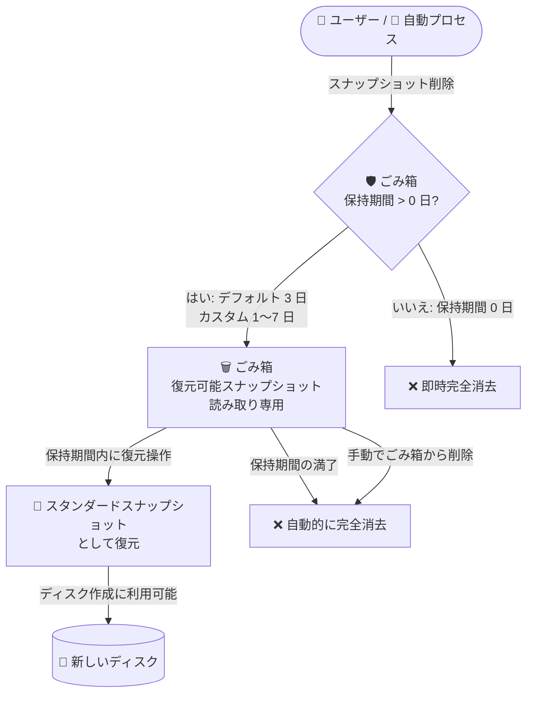

# Compute Engine: スナップショットのごみ箱 (Recycle Bin) による削除保護 (Preview)

**リリース日**: 2026-09-24

**サービス**: Compute Engine

**機能**: 削除されたスタンダードスナップショットのごみ箱 (Recycle Bin) 保持

**ステータス**: Preview

📊 [このアップデートのインフォグラフィックを見る](https://takech9203.github.io/google-cloud-news-summary/20260924-compute-engine-snapshot-recycle-bin-preview.html)

## 概要

Compute Engine に、削除されたスタンダードスナップショットを「ごみ箱 (Recycle Bin)」で一定期間保持する機能が Preview として追加されました。誤操作や悪意ある削除からスナップショットを保護するため、削除されたスタンダードスナップショットはデフォルトで 3 日間ごみ箱に保持され、その後に完全消去されます。保持期間内であれば、削除を取り消してスナップショットを復元できます。

ごみ箱はスタンダードスナップショットに対してデフォルトで有効になっており、手動削除・自動削除 (スナップショットスケジュールによる削除を含む) のいずれの場合でも適用されます。ごみ箱内のスナップショットは「復元可能スナップショット (recoverable snapshot)」と呼ばれ、読み取り専用の状態で保持されます。保持期間はプロジェクトまたは組織単位のポリシー、およびタグベースのルールで 0〜7 日の範囲でカスタマイズでき、0 を指定するとごみ箱を無効化 (即時完全削除) できます。

バックアップデータの最後の砦であるスナップショットが、オペレーションミスやランサムウェア等の悪意ある操作で失われるリスクを軽減する機能であり、Compute Engine 上でディスクバックアップを運用するすべてのユーザーにとって重要なアップデートです。

**アップデート前の課題**

- 以前はスタンダードスナップショットを削除すると即座に完全消去され、誤削除した場合にデータを復旧する手段がなかった
- スナップショットスケジュールや自動化スクリプトの設定ミスによる意図しない削除に対して、事後的な回復手段がなかった
- 悪意ある操作 (侵害されたアカウントによる削除など) からバックアップデータを守るには、IAM 権限の厳格化や別プロジェクトへのコピーなど追加の対策が必要だった

**アップデート後の改善**

- 削除されたスタンダードスナップショットがデフォルトで 3 日間ごみ箱に保持され、期間内であれば復元できるようになった
- 手動削除・スケジュールによる自動削除のどちらにも適用されるため、削除経路を問わず保護されるようになった
- 組織・プロジェクト単位のデフォルトルールとタグベースのルールにより、保持期間 (0〜7 日) をデータの重要度に応じて柔軟に制御できるようになった

## アーキテクチャ図



スタンダードスナップショットを削除すると、適用される保持期間が 1 日以上の場合はごみ箱に読み取り専用の「復元可能スナップショット」として保持されます。保持期間内に復元すればディスク作成に再利用でき、復元しなければ期間満了後に完全消去されます。

## サービスアップデートの詳細

### 主要機能

1. **削除されたスナップショットのごみ箱保持 (デフォルト有効)**
   - スタンダードスナップショットの削除時に、即時消去せずデフォルトで 3 日間ごみ箱に保持
   - 手動削除、自動プロセス (スナップショットスケジュール等) による削除のいずれにも適用
   - ごみ箱内のスナップショットは「復元可能スナップショット」として読み取り専用で保持

2. **保持期間のカスタマイズ (ごみ箱保持ポリシー)**
   - 組織またはプロジェクト単位でデフォルトの保持期間を 0〜7 日の範囲で設定可能
   - タグベースのルールにより、特定のタグが付いたスナップショットに個別の保持期間を設定可能
   - 保持期間に 0 を指定するとごみ箱を無効化 (削除時に即時完全消去)。Google はデータ損失防止の観点から無効化を非推奨としている

3. **スナップショットの復元と管理**
   - Google Cloud コンソール、gcloud CLI、REST API からごみ箱内のスナップショットを一覧表示・復元・完全削除が可能
   - 復元後のスナップショットは通常のスタンダードスナップショットとしてディスク作成に利用可能
   - ストレージコスト削減のため、保持期間の満了を待たずに手動で完全削除することも可能

## 技術仕様

### ごみ箱の仕様

| 項目 | 詳細 |
|------|------|
| 対象リソース | スタンダードスナップショットのみ (アーカイブスナップショット、インスタントスナップショット、ディスク、イメージは対象外) |
| デフォルト保持期間 | 3 日間 (システムデフォルトルール) |
| カスタム保持期間 | 0〜7 日 (0 はごみ箱の無効化 = 即時完全消去) |
| ごみ箱内スナップショットの状態 | 読み取り専用 (復元するまでディスク作成には使用不可) |
| ポリシー設定単位 | 組織 / プロジェクト (デフォルトルール + タグベースルール) |
| ルールの優先順位 | タグベースルールがデフォルトルールより優先。プロジェクトレベルのタグルールは、保持期間が組織レベルより長い場合のみ組織ルールを上書き |
| ポリシー変更の適用範囲 | 変更後に削除されたスナップショットのみ (ごみ箱内の既存の復元可能スナップショットには適用されない) |
| 復元時の作成時刻 | 復元した時刻が新しい作成時刻になる (元の作成時刻は引き継がれない) |

### 復元時の注意点

- **タグ**: 削除前に付与されていたタグは復元後に引き継がれないため、復元後に再度付与が必要
- **スケジュール由来のスナップショット**: スケジュールで作成されたスナップショットを復元すると、スケジュールの自動削除対象から外れ、手動で削除するまで無期限に保持される
- **名前の競合**: 同名のスタンダードスナップショットが既に存在する場合、gcloud CLI または REST で新しい名前を指定しないと復元に失敗する
- **CMEK**: 復元可能スナップショットを保護する CMEK を失効させた場合、復元してもキーを回復するまでディスク作成には使用できない
- **ごみ箱内の残存**: スナップショットを復元しても、復元可能スナップショットは保持期間が満了するまでごみ箱に残る

## 設定方法

### 前提条件

1. gcloud CLI の beta コンポーネントが利用可能であること
2. ごみ箱保持ポリシーの表示・変更には対応する IAM 権限が必要 (権限がない場合、組織レベルのルールが表示されないことがある)

### 手順

#### ステップ 1: 保持ポリシーの確認

```bash
# プロジェクトのごみ箱保持ポリシーを表示
gcloud beta compute snapshot-recycle-bin-policy describe \
    --project=PROJECT_ID

# 特定のスナップショットに適用される実効的な保持期間を確認
gcloud beta compute snapshots get-effective-recycle-bin-rule \
    SNAPSHOT_NAME \
    --project=PROJECT_ID
```

出力の `retentionDurationDays` が保持期間 (日数) を示します。システムデフォルトルール (3 日) も出力に含まれます。

#### ステップ 2: デフォルト保持期間のカスタマイズ (任意)

```bash
# プロジェクトのデフォルト保持期間を設定 (0〜7 日)
gcloud beta compute snapshot-recycle-bin-policy update \
    --set-rule=default \
    --standard-snapshots-retention-duration-days=RETENTION_PERIOD_DAYS \
    --project=PROJECT_ID

# タグベースのルールを設定 (例: 特定タグ付きスナップショットの保持期間)
gcloud beta compute snapshot-recycle-bin-policy update \
    --set-rule=TAG_NAMESPACED_NAME \
    --standard-snapshots-retention-duration-days=RETENTION_PERIOD_DAYS \
    --organization=ORGANIZATION_ID
```

`--organization` と `--project` はどちらか一方のみ指定します。`TAG_NAMESPACED_NAME` は `my-project-id/tag-key/tag-value` の形式で指定します。

#### ステップ 3: 削除されたスナップショットの復元

```bash
# 元の名前のまま復元
gcloud beta compute recoverable-snapshots recover \
    RECOVERABLE_SNAPSHOT_NAME \
    --project=PROJECT_ID

# 新しい名前を指定して復元 (同名スナップショットが存在する場合)
gcloud beta compute recoverable-snapshots recover \
    RECOVERABLE_SNAPSHOT_NAME \
    --project=PROJECT_ID \
    --snapshot-name=NEW_SNAPSHOT_NAME
```

Google Cloud コンソールでは、[スナップショット] ページの [ごみ箱] → [削除されたスナップショット] タブから復元できます。

## メリット

### ビジネス面

- **データ損失リスクの低減**: 誤削除や悪意ある削除が発生しても、保持期間内であればバックアップデータを復旧でき、事業継続性が向上する
- **追加設定不要の保護**: デフォルトで有効なため、既存環境に対して設定変更なしで削除保護の恩恵を受けられる
- **Preview 期間中のコスト優遇**: 復元可能スナップショットのストレージコストは Preview 期間中 100% 割引され、追加コストなしで試用できる

### 技術面

- **削除経路を問わない保護**: 手動削除だけでなく、スナップショットスケジュールや自動化スクリプトによる削除にも一律に適用される
- **タグベースの柔軟なポリシー制御**: データの重要度に応じて、タグ単位で保持期間を 0〜7 日の範囲で細かく制御できる
- **復元手数料なし**: ごみ箱からのスナップショット復元自体にコストは発生しない

## デメリット・制約事項

### 制限事項

- 対象はスタンダードスナップショットのみ。アーカイブスナップショット、インスタントスナップショット、ディスク、イメージは削除時に即時完全消去される
- スナップショットスケジュールで作成されたアーカイブスナップショットも、ごみ箱を経由せず即時完全削除される
- 保持期間の上限は 7 日間で、それ以上の長期保持はできない
- 保持ポリシーの変更は、ごみ箱内の既存の復元可能スナップショットには遡及適用されない
- 復元時にタグは引き継がれず、スケジュール由来のスナップショットは復元後にスケジュール管理から外れる

### 考慮すべき点

- GA 後は復元可能スナップショットにスタンダードスナップショットと同レートのストレージコストが発生する見込みのため、削除後の保持日数分のコスト増を考慮する (Preview 期間中は 100% 割引)
- ごみ箱内のスナップショットは読み取り専用のため、ディスク作成に使うには必ず先に復元操作が必要
- ごみ箱を無効化 (保持期間 0) するとデータは削除時に即時完全消去され、Google でも復旧できないため、重要データを含むプロジェクトでの無効化は避けるべき
- 削除前に、対象スナップショットの実効保持期間 (`get-effective-recycle-bin-rule`) を確認する運用を推奨

## ユースケース

### ユースケース 1: 誤削除されたバックアップの復旧

**シナリオ**: 運用担当者がクリーンアップ作業中に、本番データベースのディスクスナップショットを誤って削除してしまった。

**実装例**:
```bash
# ごみ箱内の復元可能スナップショットを確認し、復元する
gcloud beta compute recoverable-snapshots recover \
    prod-db-snapshot-20260920 \
    --project=prod-project

# 復元したスナップショットからディスクを作成
gcloud compute disks create prod-db-restored \
    --source-snapshot=prod-db-snapshot-20260920 \
    --zone=asia-northeast1-a
```

**効果**: 削除から 3 日以内であれば追加コストなしでスナップショットを復元でき、バックアップからの復旧体制を維持できる。

### ユースケース 2: タグベースのポリシーによる重要度別の削除保護

**シナリオ**: 本番環境の重要なスナップショットには最長の 7 日間の保持を適用し、CI/CD で大量に生成される一時的なビルド用スナップショットは即時削除してストレージコストを抑えたい。

**実装例**:
```bash
# 重要スナップショット (critical タグ) は 7 日間保持
gcloud beta compute snapshot-recycle-bin-policy update \
    --set-rule=my-org-id/env/critical \
    --standard-snapshots-retention-duration-days=7 \
    --organization=ORGANIZATION_ID

# ビルド用スナップショット (build タグ) は即時削除
gcloud beta compute snapshot-recycle-bin-policy update \
    --set-rule=my-org-id/env/build \
    --standard-snapshots-retention-duration-days=0 \
    --organization=ORGANIZATION_ID
```

**効果**: データの重要度に応じた削除保護とコスト最適化を組織全体で一元的に制御できる。

## 料金

復元可能スナップショット (ごみ箱内のスナップショット) のストレージコストは、スタンダードスナップショットと同じレートで課金されます。ただし、**Preview 期間中は復元可能スナップショットのストレージコストが 100% 割引**されます。

例: スナップショットを作成から 30 日後に削除し、ごみ箱に 5 日間保持された場合、合計保存期間は 35 日ですが、Preview 期間中はごみ箱内の 5 日分は割引されるため 30 日分のみ課金されます。

ごみ箱からのスナップショット復元操作自体には料金は発生しません。

詳細は [ディスクとイメージの料金ページ](https://docs.cloud.google.com/compute/disks-image-pricing#disk-snapshot-pricing) を参照してください。

## 利用可能リージョン

リージョンごとの提供状況は公式ドキュメントに明記されていません。詳細は [公式ドキュメント](https://docs.cloud.google.com/compute/docs/disks/retain-deleted-resources) を参照してください。

## 関連サービス・機能

- **スナップショットスケジュール**: スケジュールによる自動削除にもごみ箱保持ポリシーが適用される。ただし復元後はスケジュール管理の対象外となる
- **Resource Manager タグ**: タグベースのごみ箱保持ルールの設定に使用。組織・プロジェクト階層でのポリシー制御と組み合わせる
- **Cloud KMS (CMEK)**: CMEK で保護されたスナップショットの復元には、キーが有効であることが必要
- **Backup and DR Service**: より長期・包括的なバックアップ保護 (バックアップボールト等) が必要な場合の補完的なサービス

## 参考リンク

- 📊 [インフォグラフィック](https://takech9203.github.io/google-cloud-news-summary/20260924-compute-engine-snapshot-recycle-bin-preview.html)
- [公式リリースノート](https://docs.cloud.google.com/release-notes#September_24_2026)
- [ドキュメント: Retain deleted resources in the recycle bin](https://docs.cloud.google.com/compute/docs/disks/retain-deleted-resources)
- [ドキュメント: How to configure the snapshot recycle bin](https://docs.cloud.google.com/compute/docs/disks/configure-recycle-bin)
- [ドキュメント: Manage recoverable snapshots in the recycle bin](https://docs.cloud.google.com/compute/docs/disks/manage-recycle-bin)
- [料金ページ: ディスクとイメージの料金](https://docs.cloud.google.com/compute/disks-image-pricing#disk-snapshot-pricing)

## まとめ

スタンダードスナップショットの削除に対する「最後の安全網」がデフォルトで提供されるようになり、誤削除や悪意ある削除によるバックアップデータ損失のリスクが大きく低減されます。まずは自プロジェクトの実効保持期間を確認し、重要なスナップショットにはタグベースのルールで最長 7 日間の保持を設定することを推奨します。Preview 期間中はごみ箱内のストレージコストが 100% 割引されるため、コスト影響なしで運用への組み込みを検証できます。

---

**タグ**: Compute Engine, スナップショット, ごみ箱, Recycle Bin, データ保護, バックアップ, Preview
