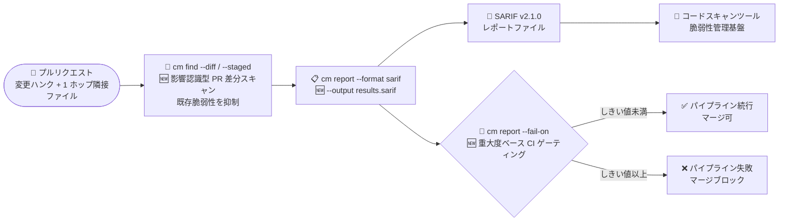

# Gemini Enterprise Agent Platform: CodeMender v0.10.0 (PR 差分スキャン・SARIF エクスポートと CI ゲーティング・適応型ハイブリッドディープスキャン)

**リリース日**: 2026-09-24

**サービス**: Gemini Enterprise Agent Platform

**機能**: CodeMender アップデート v0.10.0 (PR 差分スキャン、SARIF エクスポート、CI ゲーティング、ディープスキャン、CM_HOME 対応、バグ修正)

**ステータス**: Fixed / Update (CodeMender は Preview)

📊 [このアップデートのインフォグラフィックを見る](https://takech9203.github.io/google-cloud-news-summary/20260924-gemini-agent-platform-codemender-v0-10-0.html)

## 概要

Gemini Enterprise Agent Platform 上のコードセキュリティエージェント CodeMender の v0.10.0 がリリースされた。CodeMender はコードベースの脆弱性をスキャン (`cm find`)、PoC エクスプロイトの実行により悪用可能性を検証 (`cm verify`)、検証済みパッチを生成・適用 (`cm fix`) する自律型 AI エージェントで、推論・オーケストレーションはクラウド側 (Gemini Enterprise Agent Platform) でホストされ、コードの読み取り・ビルド・エクスプロイト検証はローカルの CLI/サンドボックスで実行される。

v0.10.0 は「CI/CD パイプラインへの本格統合」を軸としたアップデートである。`cm find` に `--diff` / `--staged` フラグが追加され、プルリクエストで変更されたハンク (hunk) とその 1 ホップ隣接ファイルのみを対象に、既存 (pre-existing) の脆弱性を抑制した影響認識型 (impact-aware) の差分スキャンが可能になった。`cm report` には SARIF v2.1.0 エクスポート (`--format sarif`, `--output`) と重大度ベースの CI ゲーティング (`--fail-on`) が追加され、スキャン結果を CI/CD パイプラインやコードスキャンツールに直接統合できるようになった。さらに `cm find` の `--deep` / `--deep-workers` フラグにより、決定論的なファイルプルーニング・パッケージ単位の並列バッチ分析・トリアージ後検証を組み合わせた適応型ハイブリッドディープスキャンが利用可能になり、脆弱性検出の再現率 (recall) と適合率 (precision) が向上した。`CM_HOME` 環境変数によるワークスペースディレクトリのカスタマイズにも対応した。

PR 単位のセキュリティチェックを CI に組み込みたい DevSecOps チーム、GitHub Code Scanning などの SARIF 対応ツールと連携したいセキュリティチーム、大規模コードベースを網羅的にスキャンしたい組織にとって価値の大きいアップデートである。

**アップデート前の課題**

- `cm find` はディレクトリ・ファイル単位のスキャンのみで、プルリクエストの変更差分だけを対象にする手段がなく、PR レビューで実行すると変更と無関係な既存の脆弱性も検出されてノイズになっていた
- SARIF 形式のエクスポートは標準出力ベース (`cm report --format sarif`) で、出力ファイル指定 (`--output`) や、重大度に基づいてパイプラインを失敗させる CI ゲーティングの仕組みがなく、CI/CD への組み込みには追加のスクリプトが必要だった
- `cm find` のスキャン深度は一律で、決定論的なプルーニングと並列分析・トリアージ後検証を組み合わせて再現率と適合率を高めるディープスキャンモードがなかった
- 設定・ローカル状態 (`state.db`)・バックアップ・アーティファクトの格納先は `~/.codemender` に固定されており、CI ランナーや共有マシンなどでディレクトリを変更できなかった
- `cm fix` はビルド・テスト検証 (`build.command`) の成功がパッチ適用済み (applied) / 修正済み (FIXED) のマークの必須条件になっていなかった
- 複数回のスキャンで脆弱性フィンガープリントが安定せず、`cm verify` が対象の finding ID に直接バインドされていなかったため、重複 findings が発生することがあった
- `cm session resume` でアクティブセッションに再接続した際、設定していたセッションモデルが自動復元されなかった
- `cm verify` が実行前に `.exploit` を `.gitignore` に追加していなかったため、検証セッションをキャンセルすると未追跡の PoC スクリプトが残ることがあった

**アップデート後の改善**

- `cm find --diff` / `--staged` により、PR で変更されたハンクと 1 ホップ隣接ファイルのみを監査し、既存の脆弱性を抑制した影響認識型の差分スキャンが可能になった
- `cm report` の SARIF v2.1.0 エクスポート (`--format sarif`, `--output`) と重大度ベースの CI ゲーティング (`--fail-on`) により、スキャン結果を CI/CD パイプラインやコードスキャンツールに統合できるようになった
- `cm find --deep` / `--deep-workers` により、決定論的ファイルプルーニング・パッケージ単位の並列バッチ分析・トリアージ後検証を組み合わせた適応型ハイブリッドディープスキャンが可能になり、再現率と適合率が向上した
- `CM_HOME` 環境変数で、設定・ローカル状態 (`state.db`)・バックアップ・アーティファクトのデフォルトディレクトリ `~/.codemender` を上書きできるようになった
- `cm fix` はビルド・テスト検証 (`build.command`) の成功を、パッチを適用済み・finding を修正済みとマークする前の必須条件とするようになった
- 複数スキャンをまたいだ脆弱性フィンガープリントが安定化され、`cm verify` が対象の finding ID に直接バインドされることで重複 findings が防止されるようになった
- `cm session resume` でアクティブセッションに再接続すると、設定済みのセッションモデルが自動的に復元されるようになった
- `cm verify` が実行前に `.exploit` を `.gitignore` に追加するようになり、キャンセルされた検証セッションが未追跡の PoC スクリプトを残さなくなった

## アーキテクチャ図



v0.10.0 では、PR の変更差分のみを `cm find --diff` でスキャンし、結果を SARIF v2.1.0 でエクスポートしてコードスキャンツールに連携、`--fail-on` の重大度しきい値で CI パイプラインをゲーティングする、というエンドツーエンドの CI/CD 統合フローが構築できるようになった。

## サービスアップデートの詳細

### 主要機能

1. **影響認識型 PR 差分スキャン (`cm find --diff` / `--staged`)**
   - `cm find` に `--diff` と `--staged` フラグを追加
   - プルリクエストで変更されたハンク (hunk) と、その 1 ホップ隣接 (1-hop neighbor) ファイルを監査対象にする
   - 既存 (pre-existing) の脆弱性を抑制 (suppress) し、今回の変更が新たに持ち込む・影響を与える脆弱性に集中できる
   - PR レビューのタイミングでフルスキャンを行う必要がなくなり、スキャン範囲とノイズを削減

2. **SARIF レポートエクスポートと CI ゲーティング (`cm report`)**
   - SARIF v2.1.0 形式のエクスポート: `cm report --format sarif --output <ファイルパス>` で結果をファイルに出力
   - 重大度ベースの CI ゲーティング: `--fail-on` フラグで重大度に基づきパイプラインを失敗させ、CI/CD でのマージゲートとして機能
   - GitHub Code Scanning をはじめとする SARIF 対応のコードスキャンツール・脆弱性管理基盤との統合が容易に

3. **適応型ハイブリッドディープスキャン (`cm find --deep` / `--deep-workers`)**
   - `cm find` に `--deep` と `--deep-workers` フラグを追加
   - 決定論的なファイルプルーニング (deterministic file pruning)、パッケージ単位にバッチ化した並列分析 (parallel package-batched analysis)、トリアージ後検証 (post-triage verification) を組み合わせたハイブリッド方式
   - 脆弱性検出の再現率 (recall) と適合率 (precision) の両方を向上
   - `--deep-workers` で並列ワーカー数を制御

4. **カスタムワークスペースディレクトリ (`CM_HOME`)**
   - `CM_HOME` 環境変数により、設定 (`config.yaml`)・ローカル状態 (`state.db`)・バックアップ・アーティファクトのデフォルトディレクトリ `~/.codemender` を上書き可能に
   - 例: `CM_HOME=/path/to/custom/dir` を設定すると `/path/to/custom/dir/config.yaml` が読み込まれる (公式ドキュメント Set up environment より)
   - CI ランナーやコンテナ、共有マシンなど、ホームディレクトリを使いにくい環境での運用が容易に

5. **バグ修正**
   - `cm fix` において、パッチを適用済み・finding を修正済みとマークする前に、ビルド・テスト検証 (`build.command`) の成功を必須化
   - 複数スキャンをまたいだ脆弱性フィンガープリントを安定化し、`cm verify` を対象の finding ID に直接バインドすることで重複 findings を防止
   - `cm session resume` でアクティブセッションに再接続した際に、設定済みのセッションモデルを自動復元
   - `cm verify` が実行前に `.exploit` を `.gitignore` に追加し、キャンセルされた検証セッションが未追跡の PoC スクリプトを残さないように修正

## 技術仕様

### v0.10.0 で追加された CLI フラグ・環境変数

| 対象 | フラグ / 変数 | 説明 |
|------|--------------|------|
| `cm find` | `--diff` 🆕 | PR で変更されたハンクと 1 ホップ隣接ファイルを監査。既存脆弱性を抑制 |
| `cm find` | `--staged` 🆕 | ステージング済み (staged) の変更を対象に差分スキャン |
| `cm find` | `--deep` 🆕 | 適応型ハイブリッドディープスキャンを有効化 (プルーニング + 並列バッチ分析 + トリアージ後検証) |
| `cm find` | `--deep-workers` 🆕 | ディープスキャンの並列ワーカー数を指定 |
| `cm report` | `--format sarif` | SARIF v2.1.0 形式でエクスポート |
| `cm report` | `--output` 🆕 | エクスポート先ファイルパスを指定 |
| `cm report` | `--fail-on` 🆕 | 重大度ベースの CI ゲーティング。指定した重大度に基づきパイプラインを失敗させる |
| 環境変数 | `CM_HOME` 🆕 | 設定・`state.db`・バックアップ・アーティファクトの格納先 (`~/.codemender`) を上書き |

### 重大度レベル (公式ドキュメントより)

CodeMender の findings は `CRITICAL` / `HIGH` / `MEDIUM` / `LOW` の 4 段階で分類される。`--fail-on` の CI ゲーティングはこの重大度に基づく。

| 重大度 | 概要 |
|--------|------|
| CRITICAL | RCE や root 権限書き込みなど、即時かつ深刻なリスク。信頼できない境界から直接到達可能で、高信頼のテイントフロー分析または検証済み PoC に裏付けられる |
| HIGH | 権限昇格・大規模なデータ漏えいにつながる深刻な欠陥だが、実行に特定の条件を要する |
| MEDIUM | 到達可能性や複雑さで悪用が大きく制限される中程度のリスク |
| LOW | 単体では直接の脅威にならない軽微なリスク・多層防御の不足 |

### `CM_HOME` の影響範囲

| 項目 | デフォルト | `CM_HOME` 設定時 |
|------|-----------|------------------|
| 設定ファイル | `~/.codemender/config.yaml` | `$CM_HOME/config.yaml` |
| ローカル状態 | `~/.codemender/state.db` | `$CM_HOME/state.db` |
| バックアップ・アーティファクト | `~/.codemender` 配下 | `$CM_HOME` 配下 |

なお、`config.yaml` の `project_paths` が空の場合、エージェントのアクセス範囲はスキャン対象ディレクトリ・`~/.codemender` (または `$CM_HOME`)・`/tmp` に制限される (公式ドキュメント Set up environment より)。

## 設定方法

### 前提条件

1. CodeMender CLI がインストール・構成済みであること ([Set up environment](https://docs.cloud.google.com/gemini-enterprise-agent-platform/codemender/set-up-environment))
2. CodeMender は限定顧客向けの Preview であるため、利用にはアクセス申請が必要
3. 新機能を利用するには CLI を v0.10.0 に更新すること

### 手順

#### ステップ 1: CLI の更新

```bash
# 最新バージョン (v0.10.0) へ更新
cm update
```

#### ステップ 2: PR 差分スキャンの実行

```bash
# PR の変更ハンク + 1 ホップ隣接ファイルを対象にスキャン (既存脆弱性は抑制)
cm find --diff

# ステージング済みの変更を対象にスキャン
cm find --staged
```

#### ステップ 3: SARIF エクスポートと CI ゲーティング

```bash
# SARIF v2.1.0 形式でファイルにエクスポート
cm report --format sarif --output results.sarif

# 重大度に基づいて CI パイプラインを失敗させる (マージゲート)
cm report --fail-on HIGH
```

CI/CD パイプライン (非対話実行) では、`cm find -y` などの自動承認フラグや `config.yaml` の設定と組み合わせる。

#### ステップ 4: ディープスキャンの実行

```bash
# 適応型ハイブリッドディープスキャン
cm find ./src/ --deep

# 並列ワーカー数を指定
cm find ./src/ --deep --deep-workers 4
```

#### ステップ 5: カスタムワークスペースディレクトリの利用

```bash
# CI ランナーなどでワークスペースディレクトリを変更
export CM_HOME=/workspace/.codemender
cm init
```

## メリット

### ビジネス面

- **シフトレフトの実現**: PR 差分スキャンと CI ゲーティングにより、脆弱性がメインブランチにマージされる前の PR 段階でブロックでき、リリース後の修正コストを削減できる
- **既存セキュリティ基盤への統合**: SARIF v2.1.0 という業界標準形式により、GitHub Code Scanning などの既存のコードスキャンツール・脆弱性管理プロセスに CodeMender の検出結果をそのまま組み込める

### 技術面

- **PR レビューのノイズ削減**: `--diff` は既存の脆弱性を抑制するため、PR 作成者は自分の変更が持ち込む問題だけに集中でき、アラート疲れを防げる
- **スキャン範囲の最適化によるコスト削減**: フルスキャンではなく変更ハンク + 1 ホップ隣接ファイルに限定することで、CI 実行ごとのトークン消費と実行時間を抑えられる
- **検出精度の向上**: ディープスキャンは決定論的プルーニングで対象を絞りつつ、パッケージ単位の並列分析とトリアージ後検証で再現率と適合率の両方を高める
- **修正品質の担保**: `cm fix` がビルド・テスト検証の成功を FIXED マークの必須条件とするようになり、「パッチは適用されたがビルドが壊れている」状態を防げる
- **CI 環境での運用性向上**: `CM_HOME` により、エフェメラルな CI ランナーやコンテナでワークスペースの配置を制御できる

## デメリット・制約事項

### 制限事項

- CodeMender は Preview 段階であり、Pre-GA Offerings Terms が適用される (サポートが限定される場合がある)
- CodeMender は限定顧客向けの Preview であり、利用にはアクセス申請が必要
- `--fail-on` で指定できる値の詳細や `--diff` の差分検出の前提 (VCS 設定など) は、リリースノート時点の公式ドキュメントでは詳細が公開されていないため、実際の挙動は CLI のヘルプ (`cm find --help` / `cm report --help`) で確認が必要

### 考慮すべき点

- `--diff` は 1 ホップ隣接ファイルまでしか監査しないため、変更の影響が広範囲に及ぶ場合 (共通ライブラリの変更など) は、定期的なフルスキャンやディープスキャンとの併用が望ましい
- ディープスキャン (`--deep`) は並列バッチ分析とトリアージ後検証を行うため、通常スキャンよりトークン消費・実行時間が増加する可能性がある。`--deep-workers` の値はローカルリソースと相談して調整する
- CI/CD で非対話実行する場合、`confirm_writes: false` や `-y` フラグの利用が必要になるが、公式ドキュメントはこれらの保護の無効化を「隔離された使い捨てのサンドボックス・CI/CD パイプライン内のみ」に限定することを推奨している
- SARIF レポートには脆弱性の詳細が含まれるため、CI アーティファクトとして保存する場合はアクセス制御など機密情報としての取り扱いが必要

## ユースケース

### ユースケース 1: GitHub Actions での PR セキュリティゲート

**シナリオ**: すべての PR に対して自動セキュリティチェックを実施し、HIGH 以上の新規脆弱性がある場合はマージをブロックしたい。従来はフルスキャンしかなく、既存の脆弱性までレポートされて PR 作成者の負担になっていた。

**実装例**:
```bash
# CI ジョブ内 (PR ブランチをチェックアウト済み)
export CM_HOME=/workspace/.codemender
cm find --diff -y                                  # PR 差分のみスキャン
cm report --format sarif --output results.sarif    # SARIF をアーティファクト化
cm report --fail-on HIGH                            # HIGH 以上で失敗 → マージブロック
```

**効果**: PR が持ち込む新規の脆弱性のみを対象にした高速なゲートが実現し、SARIF ファイルをコードスキャンツールにアップロードすることで PR 上でのインライン表示にもつなげられる。

### ユースケース 2: 大規模コードベースの定期ディープスキャン

**シナリオ**: 週次でリポジトリ全体の網羅的なスキャンを実施したいが、通常スキャンでは見逃し (再現率不足) と誤検出 (適合率不足) の両方が課題だった。

**実装例**:
```bash
cm find ./src/ --deep --deep-workers 4
cm report --format html --open
```

**効果**: 決定論的プルーニングで無駄な分析を省きつつ、パッケージ単位の並列分析で処理を高速化し、トリアージ後検証で誤検出を削減。PR 差分スキャン (日次・PR 単位) とディープスキャン (週次) の 2 層構成で網羅性と速度を両立できる。

### ユースケース 3: 脆弱性管理基盤への SARIF 連携

**シナリオ**: 組織で SARIF 対応の脆弱性管理基盤を運用しており、CodeMender の検証済み findings を他のスキャナの結果と一元管理したい。

**実装例**:
```bash
cm report --format sarif --output codemender-findings.sarif
# 生成した SARIF を管理基盤へアップロード
```

**効果**: PoC エクスプロイトで悪用可能性まで検証された高信頼の findings を標準形式で連携でき、逆方向にはサードパーティスキャナの findings を `cm report import` で取り込む双方向の統合が可能になる。

## 料金

今回のアップデート自体に追加料金はない。CodeMender の利用はトークン消費に基づいて課金され、プロジェクト全体の課金済みトークン使用量とコストトレンドは Cloud Billing のレポートで確認できる。なお、ディープスキャン (`--deep`) は分析範囲・検証工程が増えるためトークン消費が増加する可能性がある一方、PR 差分スキャン (`--diff`) はスキャン範囲を絞ることで CI 実行ごとの消費を抑えられる。

- [Gemini Enterprise Agent Platform 料金ページ](https://cloud.google.com/gemini-enterprise-agent-platform/generative-ai/pricing)
- [Cloud Billing レポートの確認方法](https://docs.cloud.google.com/billing/docs/how-to/reports)

## 利用可能リージョン

CodeMender はグローバルに利用可能 (限定顧客向け Preview)。

## 関連サービス・機能

- **Gemini Enterprise Agent Platform**: CodeMender のホスト基盤。エージェントの推論・オーケストレーションを Interactions API 経由で提供
- **GitHub Code Scanning などの SARIF 対応ツール**: `cm report --format sarif --output` で生成した SARIF v2.1.0 レポートの連携先。CI 上でのコードスキャン結果の一元管理に利用
- **CI/CD パイプライン (Cloud Build、GitHub Actions など)**: `--diff` / `--staged` / `--fail-on` / `CM_HOME` を組み合わせた PR セキュリティゲートの実行環境
- **サードパーティセキュリティスキャナ (Wiz など)**: 外部ツールの findings を `cm report import` で取り込み、検証・修復ワークフローに接続 ([Import third-party security findings](https://docs.cloud.google.com/gemini-enterprise-agent-platform/codemender/import-findings))
- **CodeMender VCS 連携 (`cm vcs`)**: `cm vcs status` / `diff` / `stage` / `reset` によるパッチのステージング管理。PR 差分スキャンと合わせて Git ワークフローとの統合が強化された
- **CodeMender セッション管理**: `cm session list` / `resume` / `cancel` によるステートフルなセッション運用。今回の resume 時モデル自動復元・フィンガープリント安定化はこのセッション基盤の強化 ([Manage sessions and reports](https://docs.cloud.google.com/gemini-enterprise-agent-platform/codemender/manage-sessions))

## 参考リンク

- 📊 [インフォグラフィック](https://takech9203.github.io/google-cloud-news-summary/20260924-gemini-agent-platform-codemender-v0-10-0.html)
- [公式リリースノート](https://docs.cloud.google.com/release-notes#September_24_2026)
- [CodeMender ドキュメント](https://docs.cloud.google.com/gemini-enterprise-agent-platform/codemender)
- [Scan and verify vulnerabilities (`cm find` / `cm verify`)](https://docs.cloud.google.com/gemini-enterprise-agent-platform/codemender/scan-and-verify)
- [Manage sessions and reports (レポート形式・重大度レベル)](https://docs.cloud.google.com/gemini-enterprise-agent-platform/codemender/manage-sessions)
- [Set up environment (config.yaml・CM_HOME)](https://docs.cloud.google.com/gemini-enterprise-agent-platform/codemender/set-up-environment)
- [Fix and patch vulnerabilities (`cm fix` / `cm vcs`)](https://docs.cloud.google.com/gemini-enterprise-agent-platform/codemender/fix-and-patch)
- [Google Cloud Blog: Find and fix software vulnerabilities with CodeMender](https://cloud.google.com/blog/products/identity-security/find-and-fix-software-vulnerabilities-with-codemender)
- [料金ページ](https://cloud.google.com/gemini-enterprise-agent-platform/generative-ai/pricing)
- [前回の CodeMender アップデートレポート (v0.9.0, 2026-09-21)](./2026-09-21-gemini-agent-platform-codemender-v0-9-0.md)

## まとめ

CodeMender v0.10.0 は、PR 差分スキャン (`--diff` / `--staged`)、SARIF エクスポートと CI ゲーティング (`--output` / `--fail-on`)、適応型ハイブリッドディープスキャン (`--deep`) により、CodeMender を「手元で実行するスキャナ」から「CI/CD パイプラインに組み込むセキュリティゲート」へと進化させるアップデートである。v0.9.0 のレポーティング・可観測性強化に続き、DevSecOps ワークフローへの統合が一気に現実的になった。まず `cm update` で CLI を v0.10.0 に更新し、PR 単位の `cm find --diff` + `cm report --fail-on` によるマージゲートと、定期実行のディープスキャンの 2 層構成の導入を検討することを推奨する。

---

**タグ**: Gemini Enterprise Agent Platform, CodeMender, セキュリティ, AI エージェント, 脆弱性管理, DevSecOps, CI/CD, SARIF, PR スキャン, シフトレフト
