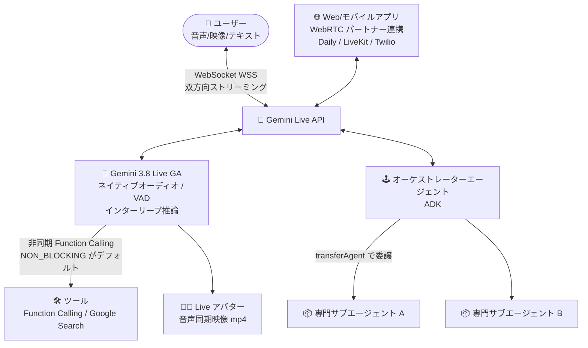

# Gemini Enterprise Agent Platform: Gemini 3.8 Live が一般提供 (GA) 開始

**リリース日**: 2026-09-24

**サービス**: Gemini Enterprise Agent Platform

**機能**: Gemini 3.8 Live (Gemini Live API 対応モデル)

**ステータス**: GA (一般提供)

📊 [このアップデートのインフォグラフィックを見る](https://takech9203.github.io/google-cloud-news-summary/20260924-gemini-agent-platform-gemini-3-8-live-ga.html)

## 概要

Gemini Enterprise Agent Platform において、リアルタイム音声対話モデル **Gemini 3.8 Live** が一般提供 (GA) となりました。今回のリリースでは、音声品質 (voice quality)、モデルの信頼性 (model reliability)、エージェントオーケストレーション (agent orchestration) の改善が含まれています。

Gemini 3.8 Live は、Gemini Live API 上で動作する低レイテンシ音声エージェント向けの推奨モデルです。推論による遅延を発生させずにリアルタイム対話を実現する設計で、インターリーブ推論 (interleaved reasoning)、非同期 Function Calling、セッション全体を通じたクライアントコンテンツ更新、組み込みの音声ストリーミングをサポートします。ネイティブオーディオ、音声文字起こし、音声区間検出 (VAD)、プロアクティブオーディオ、ツール利用、Live アバターといった機能を備え、多言語間のシームレスな切り替えにも対応します。

対象ユーザーは、コンタクトセンターの音声ボット、E コマースのショッピングアシスタント、教育・ヘルスケア分野の対話型コンパニオンなど、本番環境グレードのリアルタイム音声/映像エージェントを構築する開発者・企業です。GA 化により、Pre-GA 条項の制約なしに本番ワークロードで利用できるようになりました。

**アップデート前の課題**

- 従来の Gemini 3.1 Flash Live はプレビュー版 (`gemini-3.1-flash-live-preview`) であり、Pre-GA Offerings Terms の下での提供のためサポートが限定され、本番利用にはリスクがあった
- Function Calling は同期 (ブロッキング) 実行が前提で、ツール実行中に対話が停止し、リアルタイム音声体験を損なう場合があった
- 音声品質やモデルの応答信頼性、複数エージェント間のオーケストレーションに改善の余地があった

**アップデート後の改善**

- Gemini 3.8 Live が GA となり、安定版モデル ID `gemini-3.8-live` として本番ワークロードで利用可能になった
- 非同期 Function Calling (`behavior: NON_BLOCKING`) がデフォルトとなり、ツール実行中も対話を継続できるようになった (スケジューリング: `SILENT` / `WHEN_IDLE` / `INTERRUPTED` に対応)
- 音声品質・モデル信頼性・エージェントオーケストレーションが改善され、超低レイテンシの音声間 (audio-to-audio) 対話を実現
- `send_client_content` がセッションのライフサイクル全体で利用可能になり、対話途中でのコンテキスト注入が柔軟になった

## アーキテクチャ図



ユーザーの音声・映像は WebSocket 経由で Gemini Live API にストリーミングされ、GA となった Gemini 3.8 Live が低レイテンシで応答します。非同期 Function Calling と ADK によるオーケストレーションで、専門サブエージェントへの委譲を含む本番グレードの音声エージェントを構築できます。

## サービスアップデートの詳細

### 主要機能

1. **Gemini 3.8 Live の一般提供 (GA)**
   - 安定版モデル ID `gemini-3.8-live` として提供。低レイテンシ音声エージェント向けの推奨 (Recommended) モデル
   - 音声品質、モデル信頼性、エージェントオーケストレーションが改善
   - ネイティブオーディオ、音声文字起こし、音声区間検出 (VAD)、プロアクティブオーディオ、ツール利用、Live アバターに対応
   - 多言語間のシームレスな切り替え (Live API は 24 言語をサポート)

2. **インターリーブ推論と非同期ワークフロー**
   - 推論による遅延を抑えつつ思考 (Thinking) を挟むインターリーブ推論をサポート (`thinking_level` パラメータは非対応)
   - 非同期 Function Calling (`behavior: NON_BLOCKING`) がデフォルト。`SILENT` / `WHEN_IDLE` / `INTERRUPTED` の関数スケジューリングに対応
   - 後方互換のため `behavior: BLOCKING` による同期実行も引き続き利用可能

3. **セッション制御の強化**
   - `send_client_content` がセッションのライフサイクル全体で利用可能になり、`user` / `model` の明示的なロール指定に対応
   - `turn_complete=true` を送信すると進行中のモデル生成を無条件に中断可能
   - プロアクティブオーディオが常時有効化 (モデルが応答すべきタイミングを自律判断)
   - ターンカバレッジのデフォルトは `TURN_INCLUDES_AUDIO_ACTIVITY_AND_ALL_VIDEO` (映像フレームはデフォルトでモデルに送信)

## 技術仕様

### gemini-3.8-live モデル仕様

| 項目 | 詳細 |
|------|------|
| モデル ID | `gemini-3.8-live` (Stable) |
| 入力モダリティ | テキスト、画像、音声、映像 |
| 出力モダリティ | 音声 (テキスト書き起こしはトランスクリプション機能で取得) |
| 入力トークン上限 | 131,072 |
| 出力トークン上限 | 65,536 |
| Thinking | 対応 (インターリーブ推論、`thinking_level` は非対応) |
| Function Calling | 対応 (非同期 `NON_BLOCKING` がデフォルト) |
| Search グラウンディング | 対応 |
| 音声生成 | 対応 |
| コンテキストキャッシュ / Batch API / 構造化出力 | 非対応 |
| 最終更新 | 2026 年 9 月 |

### Gemini Live API の接続仕様

| 項目 | 詳細 |
|------|------|
| プロトコル | ステートフル WebSocket 接続 (WSS) |
| 音声入力 | Raw 16-bit PCM、16kHz、リトルエンディアン |
| 音声出力 | Raw 16-bit PCM、24kHz、リトルエンディアン |
| 映像入力 | JPEG 1FPS |
| Live アバター出力 | 映像 (mp4) |
| 対応言語 | 24 言語 (シームレスな言語切り替え対応) |

## 設定方法

### 前提条件

1. Google Cloud プロジェクトで Gemini Enterprise Agent Platform (Agent Platform API) が有効化されていること
2. Gen AI SDK、WebSocket クライアント、または Agent Development Kit (ADK) の利用環境

### 手順

#### ステップ 1: モデル文字列の更新 (プレビュー版からの移行)

```python
# 変更前 (プレビュー版)
model = "gemini-3.1-flash-live-preview"

# 変更後 (GA 版)
model = "gemini-3.8-live"
```

`gemini-3.1-flash-live-preview` から移行する場合、モデル文字列を `gemini-3.8-live` に更新します。あわせて `thinking_level` (または `thinking_config`) をセッション設定から削除します。

#### ステップ 2: 移行時の設定見直し

```python
# 非同期 Function Calling がデフォルト。同期実行が必要な場合のみ明示
tool_declaration = {
    "name": "get_order_status",
    "behavior": "BLOCKING",  # 後方互換用 (省略時は NON_BLOCKING)
}

# 以下の設定は削除が必要
# proactive_audio: False  -> エラーになる (常時有効)
# enable_affective_dialog -> API から削除済み
```

プロアクティブオーディオは常時有効となり、`proactive_audio: false` の指定はエラーになります。Affective dialog の設定 (`enable_affective_dialog`) は API から削除されたため、コードから除去します。映像フレームはデフォルトでモデルに送信されるため、コンテキストとコストの管理上、必要な場合のみフレームを送信することが推奨されます。

## メリット

### ビジネス面

- **本番利用の解禁**: GA 化により Pre-GA 条項の制約がなくなり、SLA を求められる顧客向け音声エージェントを安心して展開できる
- **顧客体験の向上**: 音声品質の改善と超低レイテンシの音声間対話により、コンタクトセンターや接客ボットで人間らしい自然な対話体験を提供できる
- **幅広いユースケース**: E コマース、ゲーム (NPC)、ヘルスケア、金融、教育、ロボティクスなど多様な業界のリアルタイム音声/映像エージェントに適用可能

### 技術面

- **非同期ツール実行**: Function Calling がノンブロッキングで実行されるため、外部 API 呼び出し中も対話が途切れない
- **柔軟なセッション制御**: セッション全期間での `send_client_content` により、対話中の動的なコンテキスト注入や RAG 連携が容易
- **エージェントオーケストレーション**: ADK と LiveKit (WebRTC) を組み合わせ、オーケストレーターから専門サブエージェントへ `transferAgent` で委譲するマルチエージェント構成を構築できる

## デメリット・制約事項

### 制限事項

- 応答モダリティは音声のみ。テキストが必要な場合は出力音声のトランスクリプションを有効化する必要がある
- `thinking_level` / `thinking_config`、コンテキストキャッシュ、Batch API、構造化出力、コード実行、画像生成には非対応
- プロアクティブオーディオは常時有効で無効化できない。Affective dialog 設定は API から削除された

### 考慮すべき点

- プレビュー版 (`gemini-3.1-flash-live-preview`) からの移行では、モデル文字列以外に Function Calling の挙動 (デフォルトが非同期に変更)、`turn_complete` の割り込み挙動など複数の破壊的変更の確認が必要
- ターンカバレッジのデフォルトで映像フレームが常時モデルに送信されるため、コンテキスト消費とコストの管理に注意が必要
- Live API はサーバー間通信向けの設計であり、Web/モバイルアプリからは Daily、LiveKit、Twilio、Voximplant などの WebRTC パートナー連携の利用が推奨される

## ユースケース

### ユースケース 1: コンタクトセンターの音声エージェント (マルチエージェント構成)

**シナリオ**: 航空会社のカスタマーサポートで、最初の応対を行うオーケストレーターエージェントが顧客の要件を判別し、フライト予約エージェントやホテル予約エージェントなど専門サブエージェントに動的にルーティングする。

**実装例**:
```text
LiveKit (WebRTC) + ADK + Gemini Live API (gemini-3.8-live)
- オーケストレーターエージェントが初期対応
- transferAgent オーケストレーションで専門サブエージェントへコンテキストを委譲
- 参考実装: GoogleCloudPlatform/generative-ai (livekit-adk)
```

**効果**: 低レイテンシの双方向音声対話を維持しながら、複雑な業務を専門エージェントに分担させる本番グレードの音声アシスタントを構築できる。

### ユースケース 2: E コマースのリアルタイムショッピングアシスタント

**シナリオ**: EC サイトに音声ショッピングアシスタントを組み込み、商品検索 API を非同期 Function Calling で呼び出しながら、検索中も会話を継続してパーソナライズされた提案を行う。Live アバターにより視覚的な接客体験も提供する。

**効果**: ツール実行待ちによる会話の停止がなくなり、離脱率の低減とコンバージョン向上が期待できる。バージイン (割り込み) 対応により、ユーザー主導の自然な対話が可能。

## 料金

Gemini Live API / Gemini 3.8 Live 固有の確定料金情報は今回確認できませんでした。Gemini Enterprise Agent Platform の生成 AI は入出力量に基づく従量課金です。最新の料金は公式料金ページを参照してください。

- [Gemini Enterprise Agent Platform 料金ページ](https://cloud.google.com/products/gemini-enterprise-agent-platform/pricing)

## 利用可能リージョン

リージョン別の提供状況は公式ドキュメントで確認してください。

- [Gemini Live API ドキュメント](https://docs.cloud.google.com/gemini-enterprise-agent-platform/models/live-api)

## 関連サービス・機能

- **Agent Development Kit (ADK)**: ADK Streaming により音声・映像対応エージェントを構築。マルチエージェントオーケストレーションの基盤
- **Gemini 3.5 Transcribe (Preview)**: 会話ではなく文字起こし自体が目的の場合の Speech-to-Text 専用 Live モデル
- **Gemini 2.5 Flash (Live API native audio)**: 同じく GA の低レイテンシ音声エージェント向けモデル。感情的なトーン対応が特徴
- **WebRTC パートナー連携**: Daily、LiveKit、Twilio、Voximplant が Gemini Live API を WebRTC プロトコルで統合済み
- **Google Search グラウンディング / Function Calling**: 対話中に外部データソース・サービスと連携するツール機能

## 参考リンク

- 📊 [インフォグラフィック](https://takech9203.github.io/google-cloud-news-summary/20260924-gemini-agent-platform-gemini-3-8-live-ga.html)
- [公式リリースノート](https://docs.cloud.google.com/release-notes#September_24_2026)
- [Gemini 3.8 Live モデルドキュメント](https://docs.cloud.google.com/gemini-enterprise-agent-platform/models/gemini/3-8-live)
- [Gemini Live API 概要](https://docs.cloud.google.com/gemini-enterprise-agent-platform/models/live-api)
- [料金ページ](https://cloud.google.com/products/gemini-enterprise-agent-platform/pricing)

## まとめ

Gemini 3.8 Live の GA により、低レイテンシのリアルタイム音声エージェントを本番環境で安心して展開できるようになりました。非同期 Function Calling のデフォルト化やセッション制御の強化は音声エージェントの体験を大きく向上させる一方、プレビュー版からの移行には複数の破壊的変更があるため、移行ガイドの確認を推奨します。音声 UI を検討中のチームは、まず ADK チュートリアルや LiveKit + ADK のリファレンスアーキテクチャから評価を始めるとよいでしょう。

---

**タグ**: Gemini Enterprise Agent Platform, Gemini 3.8 Live, Gemini Live API, GA, 音声エージェント, リアルタイム対話, ADK, マルチエージェント
