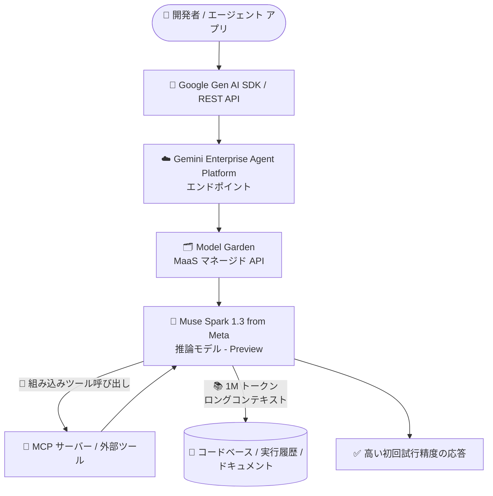

# Gemini Enterprise Agent Platform: Muse Spark 1.3 from Meta が Preview で利用可能に

**リリース日**: 2026-09-24

**サービス**: Gemini Enterprise Agent Platform

**機能**: Muse Spark 1.3 from Meta (Preview)

**ステータス**: Preview

📊 [このアップデートのインフォグラフィックを見る](https://takech9203.github.io/google-cloud-news-summary/20260924-gemini-agent-platform-muse-spark-1-3-preview.html)

## 概要

Gemini Enterprise Agent Platform において、Meta の推論モデル **Muse Spark 1.3** が Preview で利用可能になりました。Muse Spark 1.3 は、エージェント型ワークフロー (agentic workflows) と競技プログラミングレベルのコーディング向けにトレーニングされた推論 (reasoning) モデルです。

このモデルは、より高い初回試行精度 (first-attempt accuracy)、MCP (Model Context Protocol) をサポートする信頼性の高い組み込みツール呼び出し、そしてマルチステップタスク向けの 100 万トークンのロングコンテキストを提供します。エージェント構築において複数のステップにまたがる長大なコンテキストの保持と、外部ツールとの確実な連携が求められる開発者やエンタープライズ ユーザーが主な対象です。

Agent Platform では、パートナーモデル / オープンモデルを Model as a Service (MaaS) としてマネージド API 経由で利用できるため、インフラストラクチャのプロビジョニングや管理は不要です。Model Garden から本モデルを発見し、API を有効化して利用を開始できます。

**アップデート前の課題**

- Agent Platform 上でエージェント型ワークフローや競技コーディングに特化した Meta の推論モデルを選択できなかった
- 長時間・多段階のエージェントタスクでは、コンテキストウィンドウの制約により、大規模なコードベースや長い実行履歴を一度に扱うことが難しい場合があった
- 外部ツール連携 (ツール呼び出し) の信頼性がモデルによってばらつきがあり、MCP ベースのツール統合を前提としたエージェント設計の選択肢が限られていた

**アップデート後の改善**

- Muse Spark 1.3 を Agent Platform のマネージド API (MaaS) として、インフラ管理なしで利用できるようになった
- 100 万トークンのロングコンテキストにより、マルチステップタスクで大量のコンテキスト (コードベース、実行履歴、ドキュメント) を保持したまま推論できるようになった
- MCP サポートを含む信頼性の高い組み込みツール呼び出しにより、エージェントのツール統合をより確実に実装できるようになった
- 初回試行精度の向上により、リトライ回数の削減とタスク完了までの効率化が期待できるようになった

## アーキテクチャ図



開発者は Agent Platform のエンドポイント経由で Muse Spark 1.3 をサーバーレスに呼び出し、MCP 対応のツール呼び出しと 1M トークンのロングコンテキストを活用したマルチステップのエージェント処理を実行できます。

## サービスアップデートの詳細

### 主要機能

1. **エージェント型ワークフロー・競技コーディング向け推論モデル**
   - エージェント型ワークフローと競技プログラミング (competitive coding) に特化してトレーニングされた推論モデル
   - 多段階の計画・実行が必要なタスクで強みを発揮する設計

2. **高い初回試行精度 (First-Attempt Accuracy)**
   - 最初の試行でより正確な結果を返すようトレーニングされており、リトライや手戻りを削減
   - コーディングタスクやエージェント処理の効率向上に寄与

3. **MCP サポート付きの信頼性の高い組み込みツール呼び出し**
   - 組み込みのツール呼び出し (built-in tool calling) が MCP (Model Context Protocol) をサポート
   - 外部ツールやデータソースとの標準化された連携をモデルレベルで実現

4. **1M トークンのロングコンテキスト**
   - マルチステップタスク向けに 100 万トークンのコンテキストウィンドウを提供
   - 大規模コードベースの解析や、長時間にわたるエージェントの実行履歴の保持が可能

## 技術仕様

### モデル概要

| 項目 | 詳細 |
|------|------|
| モデル名 | Muse Spark 1.3 |
| 提供元 | Meta |
| モデルタイプ | 推論 (Reasoning) モデル |
| 得意領域 | エージェント型ワークフロー、競技コーディング |
| コンテキストウィンドウ | 1M (100 万) トークン |
| ツール呼び出し | 組み込みツール呼び出し (MCP サポート) |
| 提供形態 | Model as a Service (MaaS) / マネージド API |
| ステータス | Preview |

### MaaS (Model as a Service) としての提供

Agent Platform のパートナー / オープンモデルは MaaS として提供され、以下の特徴があります。

- リクエストは Gemini Enterprise Agent Platform のエンドポイントに送信する
- サーバーレスであり、インフラストラクチャのプロビジョニング・管理が不要
- Model Garden からモデルを発見・テスト・利用可能
- Gen AI evaluation service によるモデル評価が可能 (Model Garden でモデルの有効化が必要)

## 設定方法

### 前提条件

1. Google Cloud プロジェクトで Agent Platform API を有効化していること
2. Model Garden で対象モデル (MaaS 版モデルカード) の API を有効化していること

### 手順

#### ステップ 1: Agent Platform API の有効化

```bash
gcloud services enable aiplatform.googleapis.com
```

MaaS モデルを利用するには、プロジェクトで Agent Platform API を有効化します。

#### ステップ 2: Model Garden でモデルの API を有効化

Google Cloud コンソールの Model Garden で Muse Spark 1.3 のモデルカード (MaaS 版は名前に「API Service」を含む) を開き、API を有効化します。

#### ステップ 3: Google Gen AI SDK からモデルを呼び出す

```python
from google import genai
from google.genai import types

PROJECT_ID = "PROJECT_ID"
LOCATION = "LOCATION"
MODEL = "meta/<muse-spark-1.3-model-id>"  # Model Garden のモデルカードに記載の ID を使用

client = genai.Client(
    vertexai=True,
    project=PROJECT_ID,
    location=LOCATION,
)

chat = client.chats.create(model=MODEL)
response = chat.send_message("Refactor this function and add tests.")
print(response.text)
```

MaaS モデルは Gen AI SDK からマネージド API として呼び出せます。正確なモデル ID は Model Garden のモデルカードで確認してください。

## メリット

### ビジネス面

- **インフラ管理不要でのモデル採用**: MaaS 提供のため、GPU などのインフラを管理せずに Meta の最新推論モデルを試験導入できる
- **開発効率の向上**: 初回試行精度の向上により、コーディングタスクの手戻りやリトライコストを削減できる
- **モデル選択肢の拡大**: エージェント用途に特化したモデルの選択肢が増え、ユースケースに応じた最適なモデル選定が可能になる

### 技術面

- **MCP ベースのツール統合**: MCP をサポートする組み込みツール呼び出しにより、標準化されたプロトコルで外部ツール・データソースと連携するエージェントを構築できる
- **1M トークンのロングコンテキスト**: 大規模コードベースの一括解析や、長い実行履歴を保持したマルチステップ処理が可能
- **統一エンドポイント**: 既存の Agent Platform エンドポイント・SDK からそのまま呼び出せるため、他モデルとの切り替えや比較が容易

## デメリット・制約事項

### 制限事項

- Preview 段階のため、SLA の対象外であり、仕様が変更される可能性がある
- 利用可能なリージョンやクォータなどの詳細は Model Garden のモデルカードで確認が必要

### 考慮すべき点

- Preview 機能のため、本番ワークロードへの適用は GA を待つか、十分な検証を行った上で判断する
- パートナー / サードパーティモデルの利用にあたっては、データ処理・データレジデンシーのコミットメントがモデルごとに異なる場合があるため、コンプライアンス要件を確認する
- 1M トークンのロングコンテキストを多用する場合、入力トークン量に応じたコスト増に注意する

## ユースケース

### ユースケース 1: 大規模コードベースを対象とした自律型コーディングエージェント

**シナリオ**: 数十万行規模のモノレポに対して、リファクタリングやバグ修正を自律的に行うコーディングエージェントを構築したい。

**効果**: 1M トークンのロングコンテキストにより関連ソースコードやテスト結果を広範囲に保持したまま推論でき、高い初回試行精度により修正の手戻りを削減できる。

### ユースケース 2: MCP ツール群と連携するマルチステップ業務エージェント

**シナリオ**: 社内 API・データベース・チケット管理システムを MCP サーバー経由でツールとして公開し、複数ステップの業務プロセス (調査 → 起票 → 実行 → 報告) を自動化するエージェントを構築したい。

**効果**: MCP をサポートする信頼性の高い組み込みツール呼び出しにより、ツール連携の失敗が減り、長い実行履歴を保持しながら安定してマルチステップタスクを完遂できる。

## 料金

Muse Spark 1.3 (Preview) の個別の料金は、Model Garden のモデルカードおよび Agent Platform の料金ページで確認してください。パートナーモデルには従量課金 (pay-as-you-go) に加え、一部モデルでスループット容量を固定料金で予約できる Provisioned Throughput が提供されています。

- [Gemini Enterprise Agent Platform 料金ページ](https://cloud.google.com/vertex-ai/pricing)

## 利用可能リージョン

利用可能なリージョン・エンドポイント (リージョナル / グローバル / マルチリージョン) の詳細は、Model Garden のモデルカードおよび公式ドキュメントを参照してください。

## 関連サービス・機能

- **Model Garden**: 第一者・パートナー・オープンモデルを発見・テスト・デプロイできるカタログ。Muse Spark 1.3 もここから利用を開始する
- **Agent Development Kit (ADK)**: Agent Platform 上でエージェントを構築するためのフレームワーク。Muse Spark 1.3 のツール呼び出し機能と組み合わせてエージェントを実装できる
- **Gen AI Evaluation Service**: パートナー / オープンモデルの評価をサポートしており、Muse Spark 1.3 と他モデルの性能比較に活用できる
- **Agent Studio**: モデルの動作確認やプロンプト設計を行うための UI。推論モデルの思考プロセスの確認にも利用できる

## 参考リンク

- 📊 [インフォグラフィック](https://takech9203.github.io/google-cloud-news-summary/20260924-gemini-agent-platform-muse-spark-1-3-preview.html)
- [公式リリースノート](https://docs.cloud.google.com/release-notes#September_24_2026)
- [オープンモデルを MaaS で利用する](https://docs.cloud.google.com/gemini-enterprise-agent-platform/models/open-models/use-maas)
- [パートナーモデルの利用](https://docs.cloud.google.com/gemini-enterprise-agent-platform/models/partner-models/use-partner-models)
- [料金ページ](https://cloud.google.com/vertex-ai/pricing)

## まとめ

Muse Spark 1.3 from Meta の Preview 提供により、Gemini Enterprise Agent Platform 上でエージェント型ワークフローと高難度コーディングに特化した推論モデルの選択肢が広がりました。MCP 対応のツール呼び出しと 1M トークンのロングコンテキストは、マルチステップの自律エージェント構築において特に有用です。エージェント開発を進めているチームは、Model Garden でモデルを有効化し、既存モデルとの比較評価から始めることを推奨します。

---

**タグ**: Gemini Enterprise Agent Platform, Muse Spark, Meta, Reasoning Model, Agentic Workflows, MCP, Long Context, Model Garden, MaaS, Preview
