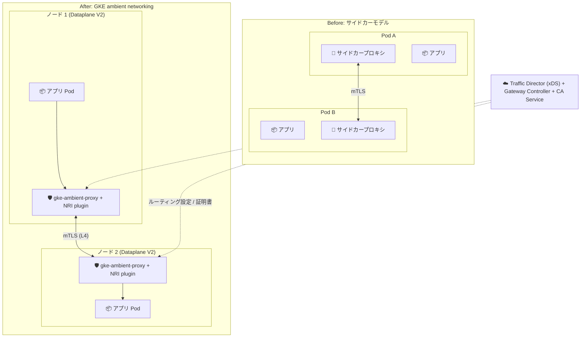

# Google Kubernetes Engine: GKE ambient networking (Preview, allowlist)

**リリース日**: 2026-09-24

**サービス**: Google Kubernetes Engine (GKE)

**機能**: GKE ambient networking — サイドカーレスな Layer 4 サービスメッシュ

**ステータス**: Preview (allowlist による限定提供)

📊 [このアップデートのインフォグラフィックを見る](https://takech9203.github.io/google-cloud-news-summary/20260924-gke-ambient-networking-preview.html)

## 概要

GKE ambient networking が Preview として発表された。利用にはサインアップフォームによる allowlist への登録が必要となる。ambient networking は、サービスメッシュのプロキシ機能を各 Pod のサイドカーコンテナからノードレベルのコンポーネントへ移動させる、シンプルでサイドカーレスなデプロイモデルを提供する。ノードレベルのプロキシは GKE Dataplane V2 に統合されており、サイドカーベースのメッシュと比較してリソースオーバーヘッドを削減し、プロキシ更新時のワークロード再起動を不要にし、メッシュのライフサイクル管理を簡素化する。

今回の Preview リリースでは、Gateway API を使用した単一クラスタでの Layer 4 メッシュ機能をサポートする。具体的には、mTLS (相互 TLS)、サービスディスカバリ、Layer 4 トラフィック管理、Layer 4 テレメトリが含まれる。コントロールプレーンには Traffic Director (xDS)、GKE Gateway Controller、Certificate Authority Service が使用され、ノード上では `gke-managed-ambient` 名前空間で稼働する 2 つの DaemonSet (`gke-ambient-nriplugin` と `gke-ambient-proxy`) がトラフィックのインターセプトとプロキシ処理を担う。

サイドカー方式の Istio / Cloud Service Mesh の運用負荷 (リソース消費、Pod 再起動、バージョン管理) に課題を感じているプラットフォームチームや、mTLS と L4 レベルの可視性・制御をまず導入したいセキュリティ重視の組織が主な対象ユーザーとなる。

**アップデート前の課題**

サイドカーベースのサービスメッシュには以下の課題があった。

- すべての Pod にサイドカープロキシを注入する必要があり、Pod ごとに CPU / メモリのオーバーヘッドが発生していた
- プロキシのアップグレードやパッチ適用のたびにワークロードの再起動が必要で、ダウンタイムや運用調整のコストが発生していた
- プロキシとアプリケーションが同一 Pod 内で運命を共にする (shared fate) ため、プロキシのバイパス脆弱性、スティッキーコネクションの中断、コネクション終了の伝播不良といったサイドカー特有の問題があった

**アップデート後の改善**

- プロキシ機能が GKE Dataplane V2 に統合されたノードレベルコンポーネントに移動し、公式ドキュメントによればサイドカーモデルと比較して CPU / メモリのオーバーヘッドを最大 90% 削減できる
- ノードコンポーネントは GKE コントロールプレーンと共に自動的にバージョン管理・パッチ適用・アップグレードされるため、プロキシ更新のためのワークロード再起動が不要になった
- 名前空間に `networking.gke.io/dataplane-mode=ambient` ラベルを付与するだけでワークロードをメッシュに登録でき、マニフェスト変更やサイドカー注入の設定が不要になった
- Managed Workload Identity と Certificate Authority Service による X.509 ワークロード証明書発行、Cloud Observability への L4 テレメトリ送信など、Google Cloud マネージドサービスとネイティブに統合された

## アーキテクチャ図



サイドカーモデルでは Pod ごとにプロキシを注入するのに対し、ambient networking では GKE Dataplane V2 に統合されたノードレベルのプロキシ (DaemonSet) がトラフィックのインターセプト・mTLS・L4 ルーティングを一括して処理し、Traffic Director が xDS 経由で設定を配布する。

## サービスアップデートの詳細

### 主要機能

1. **mTLS (相互 TLS)**
   - 転送中の暗号化とワークロード ID による相互認証を提供
   - Managed Workload Identity と Certificate Authority Service (CA Service) が SPIFFE 形式の X.509 ワークロード証明書を発行
   - `GCPServerTLSPolicy` (Permissive → Strict の段階的移行が可能) と `GCPClientTLSPolicy` で構成

2. **サービスディスカバリと L4 トラフィック管理**
   - メッシュに登録されたサービスの自動ディスカバリと接続ルーティング
   - TCP のロードバランシングとルーティング (Gateway API の `TCPRoute` などに対応)
   - `GCPAuthzPolicy` により SPIFFE プリンシパルに基づく L4 認可 (`enforcementLevel: L4`) を適用可能

3. **L4 テレメトリ**
   - トラフィック量、コネクション、エラーに関するメトリクスを Cloud Observability に送信
   - 名前空間に `networking.gke.io/ambient-network-metrics=enabled` ラベルを付与して有効化し、Network Services Monitoring で確認
   - アクセスログは Logs Explorer (`gke-ambient-node-proxy-accesslog`) で確認可能

4. **マネージドなノードコンポーネント**
   - `gke-managed-ambient` 名前空間に 2 つの DaemonSet (`gke-ambient-nriplugin`、`gke-ambient-proxy`) がデプロイされる
   - NRI (Node Resource Interface) プラグインが Pod トラフィックのインターセプトとリダイレクトを担当し、ambient proxy が xDS ルールの受信・証明書取得・L4 プロキシ処理を実行
   - GKE コントロールプレーンと共に自動的にバージョン管理・パッチ・アップグレードされる

## 技術仕様

### 要件

| 項目 | 詳細 |
|------|------|
| 提供形態 | Preview (Pre-GA Offerings Terms)、allowlist へのサインアップが必要 |
| GKE バージョン | 1.35.2-gke.1842000 以上 |
| クラスタタイプ | Autopilot / Standard の両方に対応 |
| データプレーン | GKE Dataplane V2 が必須 |
| API | Gateway API (standard) の有効化が必須。Istio API は非サポート |
| その他 | Workload Identity の有効化、フリートへの登録、Managed Workload Identity 認証の構成が必要 |
| マシンタイプ | e2-standard-4 以上 (既存クラスタの場合) |
| リージョン | Regional Cloud Service Mesh がサポートするリージョン |

### Preview 時のスケール上限 (通常の Dataplane V2 との比較)

| 項目 | ambient networking (Preview) | 通常の Dataplane V2 |
|------|------------------------------|---------------------|
| ノード数 | 500 | 7,500 |
| Service 数 | 300 | 10,000 |
| Pod 数 | 5,000 | 200,000 |
| ノードあたり Pod 数 | 256 | 256 |

### Gateway API リソースと Google Cloud リソースのマッピング

Kubernetes リソースはリージョナルなマネージドリソースに変換される: mTLS が有効な Service ごとに `TCPRoute` が 1 つ、クラスタごとに `BackendService` が 2 つ作成され、認証には `ClientTlsPolicy` / `ServerTlsPolicy`、認可には `EndpointPolicy` / `TcpFilter` が使用される。

## 設定方法

### 前提条件

1. allowlist へのアクセスをサインアップフォームから申請し、承認を受けること
2. 必要な API を有効化すること

```bash
gcloud services enable \
    privateca.googleapis.com \
    gkehub.googleapis.com \
    compute.googleapis.com \
    container.googleapis.com \
    trafficdirector.googleapis.com \
    networkservices.googleapis.com \
    networksecurity.googleapis.com \
    telemetry.googleapis.com \
    monitoring.googleapis.com \
    logging.googleapis.com
```

### 手順

#### ステップ 1: ambient networking を有効化したクラスタを作成

```bash
gcloud beta container clusters create CLUSTER_NAME \
    --machine-type=e2-standard-4 \
    --enable-ambient-networking \
    --enable-dataplane-v2 \
    --enable-fleet \
    --gateway-api=standard \
    --location=CLUSTER_LOCATION \
    --release-channel=rapid \
    --workload-pool=PROJECT_ID.svc.id.goog
```

既存クラスタの場合は `gcloud beta container clusters update CLUSTER_NAME --enable-ambient-networking --location=CLUSTER_LOCATION --enable-fleet` で有効化できる。

#### ステップ 2: ノードコンポーネントの確認

```bash
kubectl get daemonset -n gke-managed-ambient
```

`gke-ambient-nriplugin` と `gke-ambient-proxy` の 2 つの DaemonSet が表示されることを確認する。

#### ステップ 3: ワークロードをメッシュに登録

```bash
# 名前空間にラベルを付与して ambient モードを有効化
kubectl label namespace ambient-test networking.gke.io/dataplane-mode=ambient

# L4 メトリクスを有効化 (任意)
kubectl label namespace ambient-test networking.gke.io/ambient-network-metrics=enabled
```

登録された Pod には `ambient.networking.gke.io/redirection: enabled` アノテーションが付与される。その後、`GCPServerTLSPolicy` / `GCPClientTLSPolicy` で mTLS を、`GCPAuthzPolicy` で L4 認可を構成する。ポリシーの反映には 2〜3 分程度かかる。

## メリット

### ビジネス面

- **運用コストの削減**: プロキシ更新時のワークロード再起動が不要になり、メンテナンスウィンドウの調整やダウンタイムのリスクが減る。ノードコンポーネントは GKE が自動管理するため、メッシュのバージョン管理負荷も軽減される
- **インフラコストの削減**: 公式ドキュメントによればサイドカーモデルと比較してプロキシのリソースオーバーヘッドを最大 90% 削減でき、クラスタ全体の CPU / メモリ使用量を抑えられる
- **導入障壁の低下**: 名前空間へのラベル付与だけでメッシュに登録でき、アプリケーションのマニフェスト変更が不要なため、段階的な導入が容易

### 技術面

- **Dataplane V2 とのネイティブ統合**: eBPF ベースの GKE Dataplane V2 にプロキシ機能が統合され、GKE ネットワーキングスタックと一貫した動作をする
- **サイドカー特有の問題を回避**: プロキシバイパス脆弱性、スティッキーコネクションの中断、コネクション終了伝播の問題といったサイドカーモデルの構造的課題を回避できる
- **Google Cloud マネージドサービスとの連携**: Traffic Director (xDS)、Managed Workload Identity、CA Service、Cloud Observability と統合されており、証明書管理や可観測性を自前で構築する必要がない

## デメリット・制約事項

### 制限事項

- Preview であり、allowlist への登録が必要。Pre-GA Offerings Terms が適用され、サポートが限定される場合がある
- 現時点では単一クラスタの Layer 4 機能のみ。L7 (HTTP レベル) のトラフィック管理は対象外
- Istio API は非サポートで、Gateway API の使用が必須
- サイドカー注入されたワークロード (GKE、Compute Engine、Cloud Run) や proxyless gRPC との相互運用性はない
- Service の `trafficDistribution` フィールド、Headless Service、GKE Sandbox (gVisor) は非サポート
- スケール上限が通常の Dataplane V2 より大幅に低い (ノード 500、Service 300、Pod 5,000)

### 考慮すべき点

- `gke-ambient-nriplugin` がノード上で利用不可の場合、インバウンド認証の強制がバイパスされる可能性があるというセキュリティ上の注意点がある
- mTLS の Permissive モードはトラフィックスニッフィングを使用するため、アプリケーション自身が TLS を使用する場合や、MySQL のようなサーバーファースト (server-speaks-first) プロトコルでは問題が発生する
- 既存の Istio / Cloud Service Mesh (サイドカー方式) からの移行パスは Preview 時点では提供されていないため、新規ワークロードでの検証から始めるのが現実的

## ユースケース

### ユースケース 1: マイクロサービス間通信のゼロトラスト化 (mTLS + L4 認可)

**シナリオ**: 社内向けマイクロサービス群で、サービス間通信の暗号化と、ワークロード ID に基づいたアクセス制御を、アプリケーション改修なしで導入したい。

**実装例**:
```yaml
# SPIFFE プリンシパルに基づく L4 認可ポリシー
apiVersion: networking.gke.io/v1
kind: GCPAuthzPolicy
metadata:
  name: allow-client
  namespace: ambient-test
spec:
  action: ALLOW
  enforcementLevel: L4
  rules:
  - from:
      sources:
      - principals:
        - "spiffe://PROJECT_ID.svc.id.goog/ns/ambient-test/sa/client"
```

**効果**: サイドカー注入なしで、名前空間ラベルとポリシー適用のみで mTLS 暗号化と最小権限のサービス間アクセス制御を実現できる。

### ユースケース 2: サイドカーメッシュのリソースコスト削減

**シナリオ**: 数百 Pod 規模のクラスタでサイドカーメッシュを運用しており、プロキシのリソースオーバーヘッドとアップグレード時の全 Pod 再起動が運用負荷になっている。L4 機能 (mTLS、テレメトリ) で要件を満たせる。

**効果**: ノードレベルの共有プロキシによりプロキシのリソース消費を大幅に削減し、プロキシ更新は GKE が自動で行うためワークロード再起動が不要になる。

## 料金

ambient networking の対象となる Pod (`networking.gke.io/dataplane-mode=ambient` ラベルが付与された名前空間の Pod) には Pod あたり $0.004/時間 (約 $2.90/月) の料金が設定されているが、Preview 期間中は課金されない。このほか、Cloud Observability (Monitoring / Logging) および Certificate Authority Service の標準料金が適用される。

- [GKE 料金ページ](https://cloud.google.com/kubernetes-engine/pricing)

## 利用可能リージョン

Regional Cloud Service Mesh がサポートするリージョンでクラスタを作成する必要がある。詳細は公式ドキュメントを参照。

## 関連サービス・機能

- **GKE Dataplane V2**: ambient networking のノードレベルプロキシが統合される eBPF (Cilium) ベースのデータプレーン。ambient networking の必須要件
- **Cloud Service Mesh**: Istio ベースのマネージドサービスメッシュ。L7 機能やマルチクラスタが必要な場合の選択肢。ambient networking はそのサイドカーレスな代替アプローチ (現時点では相互運用不可)
- **Traffic Director / Gateway API**: ambient networking のコントロールプレーン。GKE Gateway Controller が Kubernetes リソースを Traffic Director の設定に変換する
- **Certificate Authority Service (CA Service)**: Managed Workload Identity 経由で X.509 ワークロード証明書を発行し、mTLS を支える
- **Cloud Observability (Network Services Monitoring)**: L4 テレメトリ (トラフィック、コネクション、エラー) の可視化先

## 参考リンク

- 📊 [インフォグラフィック](https://takech9203.github.io/google-cloud-news-summary/20260924-gke-ambient-networking-preview.html)
- [公式リリースノート](https://docs.cloud.google.com/release-notes#September_24_2026)
- [Ambient networking overview](https://docs.cloud.google.com/kubernetes-engine/docs/concepts/ambient-overview)
- [Prepare GKE ambient networking](https://docs.cloud.google.com/kubernetes-engine/docs/how-to/prepare-ambient-networking)
- [GKE Dataplane V2](https://docs.cloud.google.com/kubernetes-engine/docs/concepts/dataplane-v2)
- [GKE 料金ページ](https://cloud.google.com/kubernetes-engine/pricing)

## まとめ

GKE ambient networking は、サービスメッシュのプロキシをサイドカーからノードレベルへ移すことで、リソースオーバーヘッドの大幅削減とライフサイクル管理の簡素化を実現する重要なアップデートである。現時点では allowlist 制の Preview かつ単一クラスタの L4 機能に限定されるため、まずはサインアップフォームから申請し、非本番環境で mTLS・L4 認可・テレメトリを検証することを推奨する。サイドカーメッシュの運用負荷に課題を持つチームは、今後の L7 対応や GA に向けて早期に評価しておく価値がある。

---

**タグ**: #GKE #ServiceMesh #AmbientNetworking #DataplaneV2 #mTLS #GatewayAPI #Preview
