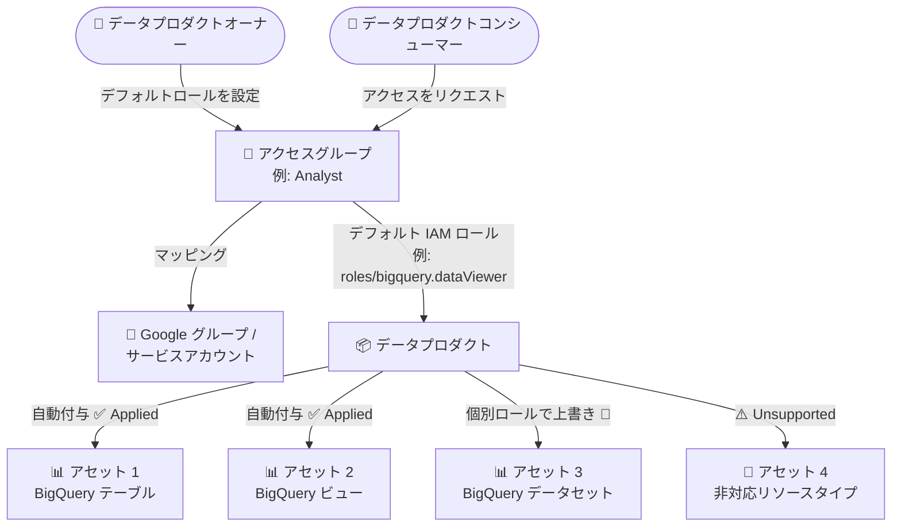

# Knowledge Catalog (Dataplex): データプロダクトのアクセスグループにデフォルト IAM ロールを設定可能に

**リリース日**: 2026-09-24

**サービス**: Knowledge Catalog (旧 Dataplex Universal Catalog)

**機能**: データプロダクトのアクセスグループにおけるデフォルト IAM ロール設定

**ステータス**: Feature

📊 [このアップデートのインフォグラフィックを見る](https://takech9203.github.io/google-cloud-news-summary/20260924-knowledge-catalog-data-products-default-iam-role.html)

## 概要

Knowledge Catalog (旧 Dataplex Universal Catalog) のデータプロダクト機能において、アクセスグループにデフォルト IAM ロールを設定できるようになりました。デフォルトロールを設定すると、データプロダクトにパッケージされたすべてのサポート対象アセットに対して、そのロールが自動的に付与されます。データプロダクトオーナーは、個別のアセットに対してデフォルトロールを上書き (オーバーライド) することも可能です。

あわせて、データプロダクト内のアセットテーブルが更新され、各アセットの権限適用状態 (Applied / Failed / Unsupported) が表示されるようになりました。これにより、権限付与が実際に基盤リソースへ反映されたかどうかを一目で確認できます。

このアップデートは、データメッシュやデータプロダクトの運用を担うデータプロダクトオーナー (データプロデューサー) にとって、大量のアセットへの権限付与を大幅に簡素化するものです。アクセスグループは Reader や Analyst といったユーザーフレンドリーなロールを Google グループやサービスアカウントにマッピングする仕組みであり、デフォルトロールの導入によって「グループ単位でまとめて権限を付与し、例外だけ個別設定する」という運用が可能になります。

**アップデート前の課題**

- 以前は、データプロダクト内の各アセットに対して、アクセスグループごとに IAM ロールを個別に割り当てる必要があった
- アセット数が多いデータプロダクトでは、権限設定の作業量が多く、設定漏れのリスクがあった
- 権限が基盤リソースに正しく適用されたかどうかをアセットテーブル上で確認する手段が限られていた

**アップデート後の改善**

- アクセスグループにデフォルト IAM ロールを 1 回設定するだけで、データプロダクト内のすべてのサポート対象アセットに自動的にロールが付与されるようになった
- 特定のアセットにのみ異なるロールを割り当てたい場合は、アセット単位でデフォルトロールを上書きできるようになった
- アセットテーブルの Permissions 列で、各アセットの権限適用状態 (Applied / Failed / Unsupported) を確認できるようになった。失敗時の詳細は Cloud Logging で確認できる

## アーキテクチャ図



アクセスグループに設定したデフォルト IAM ロールが、データプロダクト内のサポート対象アセットへ自動的に付与される流れを示しています。個別アセットへの上書き設定や、権限適用状態 (Applied / Unsupported など) の表示にも対応しています。

## サービスアップデートの詳細

### 主要機能

1. **アクセスグループのデフォルト IAM ロール設定**
   - アクセスグループごとにデフォルト IAM ロール (例: BigQuery Data Viewer) を設定可能
   - 設定すると、データプロダクトにパッケージされたすべてのサポート対象アセットに自動的にロールが付与される
   - コンソールのアクセスグループ設定画面の「Default role」フィールド、または REST API の `default_iam_role_config` で設定

2. **アセット単位でのロール上書き**
   - デフォルトロールを継承したアセットには「Default」ラベルが表示される
   - 特定のアセットに異なるロールを割り当てることで、デフォルトロールを上書き可能
   - すでにアセットへ直接 IAM ロールが割り当てられている場合、後からデフォルトロールを追加しても、既存のアセット固有の権限は上書きされない

3. **アセットテーブルの権限適用状態表示**
   - アセットテーブルの Permissions 列に、各アセットの権限設定状態が表示される
   - **Applied**: IAM ロール (デフォルトまたはアセット固有) が基盤リソースに適用済み
   - **Failed**: 基盤リソースへの IAM ロール適用に失敗。詳細な失敗理由は Cloud Logging で確認可能
   - **Unsupported**: アセットのリソースタイプが権限適用に非対応

## 技術仕様

### アクセスグループとデフォルトロールの仕様

| 項目 | 詳細 |
|------|------|
| アクセスグループ数の上限 | データプロダクトあたり最大 3 個 |
| アクセスグループのプリンシパル | Google グループ、サービスアカウント (両方指定も可) |
| デフォルトロールの適用範囲 | データプロダクト内のすべてのサポート対象アセット |
| 上書き動作 | アセット固有のロール設定がデフォルトロールより優先。既存の直接割り当てはデフォルトロール追加で上書きされない |
| デフォルトロール削除時の動作 | デフォルトロールに依存していたすべてのアセットから権限が取り消される |
| アクセスグループ削除時の動作 | デフォルトロールとアセット固有の権限の両方がすべてのアセットから取り消される |
| 一括設定 | アセット権限は一度に最大 10 アセットまで選択して設定可能 |
| BigQuery モデルのアクセス制御 | 親データセットの IAM ポリシーに適用される IAM Condition で管理 |

### REST API での設定例

`dataProducts.patch` メソッドで、アクセスグループの `default_iam_role_config` を設定します。

```json
{
  "analyst": {
    "id": "analyst",
    "display_name": "Analyst access group",
    "description": "Access group for analysts",
    "principal": {
      "google_group": "analyst-team@example.com",
      "service_account": "analyst-svc@gserviceaccount.com"
    },
    "default_iam_role_config": {
      "role": "roles/bigquery.dataViewer"
    }
  }
}
```

## 設定方法

### 前提条件

1. Dataplex API と BigQuery API が有効化されていること
2. データプロダクトの管理に必要なロール (Dataplex Data Products Admin: `roles/dataplex.dataProductsAdmin`、または Dataplex Data Products Editor: `roles/dataplex.dataProductsEditor`) が付与されていること
3. 管理対象のデータプロダクトが作成済みであること

### 手順

#### ステップ 1: アクセスグループにデフォルトロールを設定 (コンソール)

1. Google Cloud コンソールで **Knowledge Catalog** の **Data products** ページに移動
2. 対象のデータプロダクトをクリックし、**Access groups & permissions** タブを開く
3. アクセスグループの編集 (または **Add access group**) で、**Default role** フィールドにデフォルト IAM ロールを選択
4. 保存すると、サポート対象のすべてのアセットにデフォルトロールが自動付与される

#### ステップ 2: アクセスグループにデフォルトロールを設定 (REST API)

```bash
curl -X PATCH \
  -H "Authorization: Bearer $(gcloud auth print-access-token)" \
  -H "Content-Type: application/json" \
  -d '{"access_groups": {"analyst": {"id": "analyst", "display_name": "Analyst access group", "principal": {"google_group": "analyst-team@example.com"}, "default_iam_role_config": {"role": "roles/bigquery.dataViewer"}}}}' \
  "https://dataplex.googleapis.com/v1/projects/PROJECT_ID/locations/LOCATION/dataProducts/DATA_PRODUCT_ID?update_mask=access_groups"
```

`PROJECT_ID`、`LOCATION`、`DATA_PRODUCT_ID` を環境に合わせて置き換えます。

#### ステップ 3: 個別アセットの権限を上書き (必要な場合)

1. **Asset permissions** セクションで対象のアセットを選択 (一度に最大 10 アセット)
2. **Configure permissions** をクリックし、アクセスグループと割り当てる IAM ロールを選択
3. **Configure** をクリックすると、アセットテーブルの Permissions 列に権限と適用状態 (Applied / Failed / Unsupported) が表示される

## メリット

### ビジネス面

- **データプロダクト公開までの時間短縮**: アセットごとの権限設定作業が不要になり、データプロダクトのオンボーディングが迅速化する
- **ガバナンスの一貫性向上**: アクセスグループ単位で統一的なアクセスレベルを保証でき、権限の設定漏れや過剰付与のリスクを低減できる

### 技術面

- **権限管理の簡素化**: 「デフォルトロールで一括付与 + 例外のみ個別上書き」というシンプルな運用モデルを実現
- **適用状態の可視化**: Applied / Failed / Unsupported の状態表示により、権限伝播の失敗を早期に検知できる。失敗理由は Cloud Logging で追跡可能
- **API による自動化**: `dataProducts.patch` API でデフォルトロール設定を IaC やスクリプトに組み込める

## デメリット・制約事項

### 制限事項

- アクセスグループはデータプロダクトあたり最大 3 個まで
- アセット権限の一括設定は一度に最大 10 アセットまで
- リソースタイプによっては権限適用がサポートされない (Unsupported と表示される)

### 考慮すべき点

- アセットに IAM ロールを直接割り当てた後にデフォルトロールを追加しても、既存のアセット固有の権限は上書きされない (意図した権限体系になっているか確認が必要)
- デフォルトロールを削除・クリアすると、デフォルトロールに依存していたすべてのアセットから権限が取り消されるため、影響範囲を事前に確認すること
- アクセスグループ自体を削除すると、デフォルトロールとアセット固有の権限の両方が取り消される

## ユースケース

### ユースケース 1: 全社共通の分析用データプロダクトへの読み取り権限一括付与

**シナリオ**: 数十個の BigQuery テーブル・ビューをパッケージした売上分析データプロダクトを、アナリストチーム全員に読み取り専用で公開したい。

**実装例**:
```
アクセスグループ「Analyst」を作成し、
- プリンシパル: analyst-team@example.com (Google グループ)
- デフォルトロール: roles/bigquery.dataViewer
を設定。すべてのテーブル・ビューに自動で権限が付与される。
```

**効果**: アセットごとの個別設定が不要になり、アセット追加時も一貫した権限が自動適用される。

### ユースケース 2: 機密度の高いアセットのみ権限を制限

**シナリオ**: データプロダクト全体にはデフォルトで BigQuery Data Viewer を付与しつつ、個人情報を含む一部テーブルにはメタデータ閲覧のみを許可したい。

**効果**: デフォルトロールで大半のアセットをカバーし、機密テーブルのみアセット単位で BigQuery Metadata Viewer に上書きすることで、最小権限の原則を効率的に実現できる。

## 料金

このアップデートに固有の追加料金は発表されていません。Knowledge Catalog (Dataplex Universal Catalog) の料金体系については、公式料金ページを参照してください。

- [Dataplex Universal Catalog の料金](https://cloud.google.com/dataplex/pricing)

## 利用可能リージョン

リージョンごとの提供状況はリリースノートに明記されていません。詳細は公式ドキュメントを参照してください。

## 関連サービス・機能

- **BigQuery**: データプロダクトのアセット (データセット、テーブル、ビュー、モデル) の主要な基盤リソース。デフォルトロールとして BigQuery Data Viewer などを付与する
- **IAM (Identity and Access Management)**: デフォルトロール・アセット固有ロールの付与基盤。BigQuery モデルは親データセットへの IAM Condition で制御される
- **Cloud Logging**: 権限適用が Failed になった場合の詳細な失敗理由を確認できる
- **Google グループ / サービスアカウント**: アクセスグループのプリンシパルとしてマッピングされ、コンシューマーのアクセスリクエスト承認時にメンバー追加や偽装権限付与が行われる

## 参考リンク

- 📊 [インフォグラフィック](https://takech9203.github.io/google-cloud-news-summary/20260924-knowledge-catalog-data-products-default-iam-role.html)
- [公式リリースノート](https://docs.cloud.google.com/release-notes#September_24_2026)
- [データプロダクトの概要](https://docs.cloud.google.com/knowledge-catalog/docs/data-products-overview)
- [データプロダクトの作成](https://docs.cloud.google.com/knowledge-catalog/docs/create-data-products)
- [データプロダクトの管理](https://docs.cloud.google.com/knowledge-catalog/docs/manage-data-products)
- [料金ページ](https://cloud.google.com/dataplex/pricing)

## まとめ

アクセスグループへのデフォルト IAM ロール設定により、データプロダクトの権限管理は「一括付与 + 例外の個別上書き」というスケーラブルなモデルに進化しました。多数のアセットを含むデータプロダクトを運用しているチームは、既存のアセット固有権限との優先関係 (直接割り当てはデフォルトロールで上書きされない) を確認した上で、デフォルトロールの導入を検討することを推奨します。アセットテーブルの権限適用状態 (Applied / Failed / Unsupported) も定期的に確認し、Failed の場合は Cloud Logging で原因を調査してください。

---

**タグ**: Knowledge Catalog, Dataplex, データプロダクト, IAM, アクセスグループ, データガバナンス, BigQuery
