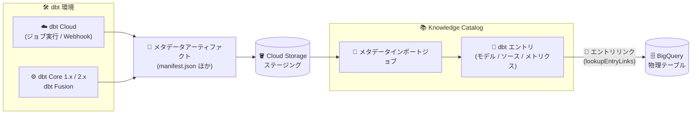

# Knowledge Catalog (Dataplex): dbt メタデータインポートが GA

**リリース日**: 2026-09-24

**サービス**: Knowledge Catalog (Dataplex)

**機能**: dbt メタデータインポートの一般提供 (GA)

**ステータス**: GA (一般提供)

📊 [このアップデートのインフォグラフィックを見る](https://takech9203.github.io/google-cloud-news-summary/20260924-knowledge-catalog-dbt-metadata-import-ga.html)

## 概要

Knowledge Catalog (旧 Dataplex Universal Catalog) における dbt メタデータのインポート機能が一般提供 (GA) となりました。dbt はデータ変換パイプラインのデファクトスタンダードとして広く使われているツールであり、本機能により dbt プロジェクトが持つ技術メタデータ (ソース、シード、モデル、カラム定義)、ビジネス・セマンティックメタデータ (MetricFlow のセマンティックモデル、メトリクス、保存済みクエリ)、運用・データ品質メタデータ (実行結果、テスト結果、鮮度)、リネージ・関係メタデータ (変換 DAG、依存関係) を Google Cloud のカタログに統合できます。

今回の GA では対応範囲が大きく拡張されました。dbt Cloud のジョブ実行からのメタデータインポート (dbt Cloud インターフェース、dbt platform CLI、dbt Administrative API と Webhook 経由) に対応したほか、dbt Core 1.x に加えて dbt Core 2.x および dbt Fusion からのメタデータアーティファクト生成・インポートもサポートされます。さらに、エントリリンク (`--include-entry-links`、`--skip-bigquery-link`) のインポートにより、dbt のリネージやセマンティックな関係を取り込み、マテリアライズされた dbt ノードを物理的な BigQuery テーブルに紐付けられるようになり、`lookupEntryLinks` メソッドで関連する BigQuery エントリを検索できます。

dbt メタデータインポートジョブの構成、およびインポートされた dbt エントリの検索・閲覧は、Google Cloud コンソール、Google Cloud CLI、Dataplex REST API のいずれからも実行できます。データエンジニアリングチームが dbt で管理する変換ロジックと、Google Cloud 上のデータガバナンス基盤を接続したい組織にとって重要なアップデートです。

**アップデート前の課題**

Preview 時点 (dbt Core と MetricFlow からのインポート) では、以下の制限がありました。

- dbt Cloud からのメタデータインポートに対応しておらず、dbt Core のアーティファクトファイル経由でのみインポート可能だった
- 対応バージョンが dbt Core 1.x に限られ、dbt Core 2.x や dbt Fusion は対象外だった
- エントリリンクがサポートされておらず、dbt ノードと物理的な BigQuery テーブルの関係をカタログ上でリンクとして表現できなかった

**アップデート後の改善**

- dbt Cloud のジョブ実行から、dbt Cloud インターフェース、dbt platform CLI、dbt Administrative API と Webhook を使用してメタデータをインポートできるようになった
- dbt Core 1.x に加えて、dbt Core 2.x と dbt Fusion からメタデータアーティファクトを生成・インポートできるようになった
- エントリリンクのインポート (`--include-entry-links`、`--skip-bigquery-link`) により、dbt のリネージとセマンティックな関係を取り込み、マテリアライズされた dbt ノード (モデル/シード/スナップショット) を物理 BigQuery テーブルにリンクし、`lookupEntryLinks` メソッドで関連 BigQuery エントリを検索できるようになった
- Google Cloud コンソール、gcloud CLI、Dataplex REST API のいずれからもインポートジョブの構成とエントリの検索・閲覧が可能になった

## アーキテクチャ図



dbt Cloud / dbt Core / dbt Fusion が生成したメタデータアーティファクトを Cloud Storage 経由で Knowledge Catalog に取り込み、エントリリンクによってマテリアライズされた dbt ノードを物理 BigQuery テーブルに紐付けるデータフローです。

## サービスアップデートの詳細

### 主要機能

1. **dbt Cloud からのメタデータインポート**
   - dbt Cloud のジョブ実行からメタデータをインポート可能
   - dbt Cloud インターフェース、dbt platform CLI、dbt Administrative API と Webhook の 3 つの経路に対応

2. **対応 dbt バージョンの拡張**
   - 従来の dbt Core 1.x に加え、dbt Core 2.x と dbt Fusion からのメタデータアーティファクト生成・インポートに対応

3. **エントリリンクによる BigQuery との紐付け**
   - `--include-entry-links` フラグで dbt の関係性 (テスト、セマンティックモデル、メトリクス、マクロの参照関係や、dbt relationships テストによる schema-join) を EntryLink レコードとして取り込む (デフォルトで有効、`--no-include-entry-links` で無効化)
   - マテリアライズされた dbt ノード (モデル/シード/スナップショット) ごとに、物理 BigQuery テーブルエントリへの参照リンクを生成。BigQuery テーブルが Dataplex にカタログ化されていない場合は `--skip-bigquery-link` でスキップ可能
   - `lookupEntryLinks` メソッドで関連する BigQuery エントリを検索可能

4. **コンソール / CLI / REST API のフルサポート**
   - dbt メタデータインポートジョブの構成と、インポート済み dbt エントリの検索・閲覧を Google Cloud コンソール、Google Cloud CLI、Dataplex REST API から実行可能

### インポートされるメタデータの種類

公式ドキュメントによると、dbt インテグレーションでは以下のメタデータが取り込まれます。

| メタデータ種別 | 内容 |
|------|------|
| 技術メタデータ | ソース、シード、モデルと、その技術属性 (カラム名、データ型、行数) |
| ビジネス・セマンティックメタデータ | MetricFlow によるセマンティックモデル、メトリクス、保存済みクエリ |
| 運用・データ品質メタデータ | 実行時間、成否ステータス、データ鮮度、テストとテスト結果 |
| リネージ・関係メタデータ | 変換グラフ (DAG)、dbt リソース間の依存関係、物理リネージ、結合キー、親子関係 |
| 消費メタデータ | dbt 外部でのデータ利用をマッピングする exposures |

## 技術仕様

### dbt アーティファクトファイル

完全なメタデータを取り込むには、以下の 4 つの dbt JSON アーティファクトの生成が推奨されます (必須は `manifest.json` のみで、他は段階的に情報を補完)。

| ファイル | 役割 | 必須 |
|------|------|------|
| `manifest.json` | プロジェクト構造と実行グラフ。MetricFlow のセマンティックモデル、メトリクス、保存済みクエリも含む | 必須 |
| `catalog.json` | カラム名とデータ型 (ない場合はスキーマが型なしカラムで取り込まれる) | 任意 |
| `run_results.json` | テスト結果と実行メタデータ | 任意 |
| `sources.json` | ソースの鮮度 | 任意 |

### 必要な IAM ロール

| 操作 | 必要なロール |
|------|------|
| エントリグループの作成・管理 | `roles/dataplex.catalogAdmin`、`roles/dataplex.catalogEditor`、または `roles/dataplex.entryGroupOwner` |
| メタデータインポートジョブの作成 | `roles/dataplex.metadataJobOwner` (プロジェクト) + `roles/dataplex.entryGroupImporter` (対象エントリグループまたはプロジェクト) |
| ステージングバケットへのアップロード | `roles/storage.objectCreator` または `roles/storage.objectAdmin` |
| dbt エントリの閲覧 | `roles/dataplex.catalogViewer` |

また、Knowledge Catalog サービスエージェント (`service-PROJECT_NUMBER@gcp-sa-dataplex.iam.gserviceaccount.com`) に、出力ステージングバケットに対する `roles/storage.objectViewer` の付与が必要です。

## 設定方法

### 前提条件

1. Knowledge Catalog API を有効化する
2. 必要な IAM ロールを付与する (上記「必要な IAM ロール」参照)
3. インポート先のエントリグループを作成する (存在しない場合)
4. dbt アーティファクトを生成する (例: `dbt source freshness` → `dbt build` → `dbt docs generate --no-compile` の順に実行)

### 手順

#### ステップ 1: dbt メタデータインポートジョブを作成 (gcloud)

```bash
gcloud alpha dataplex dbt metadata-jobs create my-dbt-import \
  --project=my-project \
  --location=us-central1 \
  --artifacts-path=./target \
  --entry-group=dbt-metadata-ingestion \
  --storage-uri=gs://my-bucket/dbt-imports/
```

`--artifacts-path` はローカルディレクトリまたは Cloud Storage URI を指定できます。エントリリンクはデフォルトで有効です。BigQuery テーブルが Dataplex にカタログ化されていない場合は `--skip-bigquery-link` を、エントリリンク自体を無効化する場合は `--no-include-entry-links` を指定します。ルーチンの再取り込みには `--aspects-only` を使用します。

#### ステップ 2: インポートした dbt エントリを検索

```bash
# dbt エントリを検索
gcloud dataplex entries search 'system=DBT' --project=my-project

# dbt モデルのみに絞り込み
gcloud dataplex entries search 'system=DBT AND type=dbt-model' --project=my-project
```

Google Cloud コンソールでは、Knowledge Catalog の検索ページで「System > Imported Context > dbt」フィルタを使用して dbt アセットを絞り込み、エントリ詳細ページでスキーマ、リネージ、技術アスペクトを確認できます。REST API では `projects.locations:searchEntries` メソッドで検索できます。

## メリット

### ビジネス面

- **データガバナンスの一元化**: dbt で管理する変換ロジックのメタデータ (定義、品質、リネージ) が Google Cloud のカタログに統合され、組織全体のデータ資産の可視性が向上する
- **GA による本番利用の安心感**: Preview から GA に昇格したことで、本番環境のガバナンスワークフローに組み込みやすくなった
- **影響分析の迅速化**: dbt ノードと物理 BigQuery テーブルがエントリリンクで接続されるため、変更の影響範囲やデータの利用状況を追跡しやすくなる

### 技術面

- **マルチチャネル対応**: dbt Cloud (UI / CLI / API / Webhook)、dbt Core 1.x / 2.x、dbt Fusion と幅広い dbt 環境からインポートでき、既存の CI/CD パイプラインに組み込みやすい
- **セマンティクスの取り込み**: MetricFlow のセマンティックモデルやメトリクスがカタログに取り込まれ、ビジネス定義とデータ資産を関連付けられる
- **柔軟な再取り込み**: `--aspects-only` によるルーチン更新と、フル実行によるエントリの作成・削除を使い分けられる

## デメリット・制約事項

### 考慮すべき点

- エントリリンクの物理参照リンクは、BigQuery データセットがインポートロケーション (`--location`) と同一リージョンにある場合のみ生成される (別リージョンのデータセットは自動的にスキップされる)
- BigQuery テーブルが Dataplex にカタログ化されていない環境では `--skip-bigquery-link` の指定が必要
- `--aspects-only` 実行ではメタデータの追加・更新のみ可能で削除はできず、エントリリンクも生成されない。dbt リソースの追加・削除・リネーム時はフル実行が必要
- フル実行は、そのエントリグループ内で自身のアーティファクトに記述されていない dbt エントリを削除するため、dbt プロジェクトごとに個別のエントリグループを使用することが推奨される
- 最新の制限事項は[公式ドキュメント](https://docs.cloud.google.com/knowledge-catalog/docs/dbt-transfer)を参照

## ユースケース

### ユースケース 1: dbt Cloud ジョブ完了時の自動メタデータ同期

**シナリオ**: dbt Cloud で日次の変換ジョブを運用しているデータチームが、ジョブ実行のたびに最新のモデル定義・テスト結果・リネージを Knowledge Catalog に反映したい。

**効果**: dbt Administrative API と Webhook を利用してジョブ実行からメタデータをインポートすることで、カタログが常に最新の dbt メタデータを保持し、手動同期の運用負荷がなくなる。

### ユースケース 2: dbt モデルと BigQuery テーブルの横断的な影響分析

**シナリオ**: BigQuery テーブルのスキーマ変更を計画しており、そのテーブルを生成・参照している dbt モデルやメトリクスを事前に把握したい。

**実装例**:
```bash
# dbt エントリに紐づく BigQuery エントリのリンクを検索 (lookupEntryLinks)
gcloud dataplex entries search 'system=DBT AND type=dbt-model' --project=my-project
```

**効果**: エントリリンクによってマテリアライズされた dbt ノードと物理 BigQuery テーブルが接続されているため、`lookupEntryLinks` メソッドで関連エントリを検索し、変更の影響範囲を迅速に特定できる。

## 料金

本アップデートに固有の料金情報はリリースノートに記載されていません。Dataplex / Knowledge Catalog の料金体系については公式の料金ページを参照してください。

- [Dataplex の料金](https://cloud.google.com/dataplex/pricing)

## 利用可能リージョン

リリースノートにはリージョン情報の記載がありません。エントリグループはリージョナルリソースであり、物理参照リンクは同一リージョン内の BigQuery エントリのみを対象とします。詳細は[公式ドキュメント](https://docs.cloud.google.com/knowledge-catalog/docs/dbt-transfer)を参照してください。

## 関連サービス・機能

- **BigQuery**: マテリアライズされた dbt ノード (モデル/シード/スナップショット) がエントリリンクで物理 BigQuery テーブルに接続される
- **Cloud Storage**: dbt アーティファクトの入力元および変換済みメタデータ (`dbt_metadata.jsonl`) のステージング先として使用
- **Data Lineage (Dataplex)**: dbt のリネージイベントを BigQuery リソース上のリネージグラフとして可視化。OpenLineage dbt インテグレーションとの併用も可能
- **Cloud Logging**: インポートジョブのログの確認に使用 (`roles/logging.viewer` が必要)

## 参考リンク

- 📊 [インフォグラフィック](https://takech9203.github.io/google-cloud-news-summary/20260924-knowledge-catalog-dbt-metadata-import-ga.html)
- [公式リリースノート](https://docs.cloud.google.com/release-notes#September_24_2026)
- [ドキュメント: Import metadata from dbt Core](https://docs.cloud.google.com/knowledge-catalog/docs/dbt-transfer)
- [gcloud リファレンス: dataplex dbt metadata-jobs create](https://docs.cloud.google.com/sdk/gcloud/reference/alpha/dataplex/dbt/metadata-jobs/create)
- [料金ページ (Dataplex)](https://cloud.google.com/dataplex/pricing)

## まとめ

dbt メタデータインポートの GA により、dbt Cloud / dbt Core 2.x / dbt Fusion を含む幅広い dbt 環境のメタデータを Knowledge Catalog に統合し、エントリリンクで物理 BigQuery テーブルと接続できるようになりました。dbt を利用している組織は、まず開発環境のエントリグループでインポートジョブを試行し、CI/CD パイプラインへの組み込みとエントリリンクによる影響分析の活用を検討することを推奨します。

---

**タグ**: #KnowledgeCatalog #Dataplex #dbt #BigQuery #DataGovernance #Metadata #DataLineage #GA
