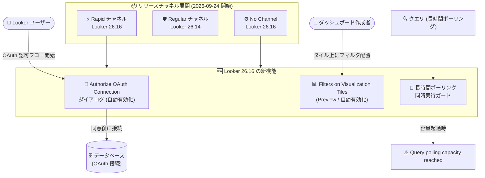

# Looker: Looker 26.16 アップデート (OAuth 認可ダイアログ、Filters on Visualization Tiles、長時間ポーリング同時実行ガード)

**リリース日**: 2026-09-24

**サービス**: Looker / Looker (Google Cloud core)

**機能**: Looker 26.16 の新機能群 (OAuth 認可ダイアログ、Filters on Visualization Tiles、リリースチャネル展開、長時間ポーリング同時実行ガード)

**ステータス**: 一般提供 (GA) / 一部 Preview

📊 [このアップデートのインフォグラフィックを見る](https://takech9203.github.io/google-cloud-news-summary/20260924-looker-26-16-updates.html)

## 概要

2026 年 9 月 24 日、Looker 26.16 に関連する複数のアップデートが発表された。2026 年 9 月 21 日以降、Looker (original) インスタンスのうち Looker 26.16 を実行しているものに対して、以下の機能が自動的に有効化される: (1) データベース接続の OAuth 認可フロー開始時に表示される「Authorize OAuth Connection」ダイアログ、(2) ダッシュボードの個別ビジュアライゼーションタイルにフィルタコントロールを直接配置できる「Filters on Visualization Tiles」Preview 機能。

あわせて、Looker (Google Cloud core) のリリースチャネルにおける最新バージョンの展開が開始された。Rapid チャネルと No Channel は Looker 26.16、Regular チャネルは Looker 26.14 が最新バージョンとなる。さらに、Looker 26.16 には長時間ポーリング (long polling) の同時実行ガードが追加され、長時間のポーリングリクエストが Looker を飽和させてフリーズを引き起こす問題が防止される。

本アップデートは、Looker 管理者、ダッシュボード作成者、および OAuth 認証を使用するデータベース接続 (Snowflake など) の利用者に影響する。特に OAuth ダイアログはデータアクセスの透明性を高めるガバナンス面の改善であり、同時実行ガードはインスタンスの安定性を高める運用面の改善である。

**アップデート前の課題**

- OAuth 認可フローの開始時に、Looker がユーザーの代理でデータにアクセスすること、および管理者や開発者などの特権ユーザーが (sudo セッション中に別ユーザーのアクティブな OAuth トークンでクエリを実行するなどして) ユーザーのデータを参照し得ることが、ユーザーに明示的に通知されていなかった
- ダッシュボードのフィルタコントロールは上部のフィルタバーにのみ配置可能で、特定のビジュアライゼーションタイルの隣にフィルタを配置したり、タイルに適用されているフィルタの一覧を確認したりすることができなかった
- クエリが長時間のポーリングリクエストを発生させた場合、ポーリングが Looker を飽和 (oversaturate) させ、インスタンス全体がフリーズすることがあった

**アップデート後の改善**

- OAuth 認可フロー開始時に「Authorize OAuth Connection」ダイアログが表示され、認可により Looker がユーザーの代理でデータにアクセスすること、特権ユーザーがデータを参照し得ることが明示されるようになった
- 「Filters on Visualization Tiles」(ドキュメント上の機能名: Filters as tiles) Preview により、ダッシュボード作成者はフィルタコントロールをフィルタバーだけでなく個別のビジュアライゼーションタイル上 (ダッシュボードキャンバス上) に直接配置できるようになった
- 長時間ポーリング同時実行ガードにより、ポーリング容量の上限に達した場合は「Query polling capacity reached. Please try again later.」というエラーメッセージが表示され、インスタンスのフリーズが防止されるようになった
- リリースチャネル (Preview) により、Rapid チャネルでは最新の Looker 26.16 をいち早く利用でき、Regular チャネルでは 1 か月遅れの Looker 26.14 で安定運用ができる

## アーキテクチャ図



Looker 26.16 は Rapid チャネルおよび No Channel に展開され、OAuth 認可ダイアログとタイル上フィルタが自動有効化されるほか、長時間ポーリングの同時実行ガードがインスタンスのフリーズを防止する。

## サービスアップデートの詳細

### 主要機能

1. **Authorize OAuth Connection ダイアログ (2026 年 9 月 21 日以降、Looker 26.16 で自動有効化)**
   - ユーザーがデータベース接続の OAuth 認可フローを開始した際に、認可ダイアログを表示する
   - 接続を認可すると Looker がユーザーの代理でデータにアクセスすること、および管理者や開発者などの特権 Looker ユーザーがユーザーのデータを参照し得ること (例: 管理者が sudo セッション中に別ユーザーのアクティブな OAuth トークンを使用してクエリを実行する場合) をユーザーに通知する
   - Snowflake など OAuth 認証を使用するデータベース接続では、各ユーザーが自身の OAuth アカウントでデータベースに認証する。管理者が sudo で別ユーザーとして操作する際はそのユーザーの OAuth アクセストークンが使用されるため、この挙動の明示はガバナンス上重要である

2. **Filters on Visualization Tiles (Preview、Looker 26.16 で自動有効化)**
   - ダッシュボード作成者が、フィルタコントロールをダッシュボード上部のフィルタバーだけでなく、個別のビジュアライゼーションタイル上 (ダッシュボードキャンバス上) に直接配置できる
   - 公式ドキュメントでは「Filters as tiles」として解説されており、フィルタをドラッグ可能なタイルとしてキャンバスに配置し、影響を受けるビジュアライゼーションの隣に置くことができる
   - 特定のビジュアライゼーションタイルに適用されているフィルタの一覧を表示することも可能
   - Looker (Google Cloud core) / Looker (original) では、管理者が Admin 設定の Preview ページで「Filters as tiles and tile-level filter context」Labs トグルを有効化することで利用できる (デフォルトは無効。Looker (original) 26.16 では 9 月 21 日以降自動有効化)

3. **リリースチャネルの最新バージョン展開 (Looker (Google Cloud core))**
   - Rapid チャネル: Looker 26.16 (新機能への最速アクセス。SLA 対象外、メンテナンスウィンドウ設定不可)
   - Regular チャネル: Looker 26.14 (Rapid の 1 か月後に同バージョンを受領。本番環境推奨、SLA 対象)
   - No Channel: Looker 26.16 (従来のリリースプロセス)

4. **長時間ポーリング同時実行ガード**
   - クエリが長時間のポーリングリクエストを発生させ、Looker を飽和させてフリーズを引き起こす問題を防止する
   - ポーリング容量の上限に達した場合、クエリは「Query polling capacity reached. Please try again later.」というエラーメッセージを返す
   - インスタンス全体の可用性を守るためのガードレールであり、個別クエリの失敗と引き換えにフリーズという広範な障害を回避する

## 技術仕様

### リリースチャネルと Looker バージョン

| チャネル | 最新バージョン | 特徴 |
|------|------|------|
| Rapid | Looker 26.16 | 毎月最速で新バージョンを受領。SLA 対象外。メンテナンスウィンドウ / 拒否期間の設定不可 |
| Regular | Looker 26.14 | Rapid の 1 か月後に受領。本番環境推奨。SLA 対象。ASP (Accelerated Security Patching) フラグ利用可 |
| No Channel | Looker 26.16 | チャネル未登録 (Preview 期間中のデフォルト)。従来のリリースプロセス |

### 自動有効化される機能 (Looker (original) 26.16、2026 年 9 月 21 日以降)

| 機能 | ステータス | 内容 |
|------|------|------|
| Authorize OAuth Connection ダイアログ | GA | OAuth 認可フロー開始時にデータアクセス範囲を通知 |
| Filters on Visualization Tiles | Preview | ビジュアライゼーションタイル上へのフィルタ配置 |

### 長時間ポーリング同時実行ガード

| 項目 | 詳細 |
|------|------|
| 目的 | 長時間ポーリングリクエストによる Looker の飽和・フリーズの防止 |
| 発動時の挙動 | エラーメッセージ「Query polling capacity reached. Please try again later.」を表示 |
| ユーザー対応 | 時間をおいてクエリを再実行 |

## 設定方法

### 前提条件

1. Looker (original) の場合: インスタンスが Looker 26.16 を実行していること (2026 年 9 月 21 日以降、対象機能は自動有効化)
2. Looker (Google Cloud core) の場合: インスタンスのリリースチャネルとバージョンを確認すること

### 手順

#### ステップ 1: インスタンスのリリースチャネルとバージョンを確認する (Looker (Google Cloud core))

```bash
gcloud looker instances describe INSTANCE_NAME \
  --region=REGION \
  --format=config
```

`RELEASE_CHANNEL` フィールドと `VERSION` フィールドで、チャネルと Looker バージョンを確認できる。Looker 26.16 を早期に利用したい場合は Rapid チャネルへの登録を検討する (Rapid チャネルは SLA 対象外である点に注意)。

#### ステップ 2: Filters as tiles を有効化する (Preview トグル)

1. Looker の **Admin** > **Preview** (Labs) ページに移動する
2. **Filters as tiles and tile-level filter context** トグルを有効にする (デフォルトは無効)
3. ダッシュボード編集画面で、フィルタバーのフィルタをキャンバスにドラッグするか、フィルタメニューから **Send to dashboard** を選択してタイルとして配置する

フィルタタイルは他のダッシュボードタイルと同様にドラッグして配置でき、**Send to filter bar** でフィルタバーに戻すこともできる。フィルタの配置位置は適用対象タイルには影響しない。

## メリット

### ビジネス面

- **データアクセスの透明性向上**: OAuth 認可ダイアログにより、ユーザーは Looker が自身の代理でデータにアクセスすること、特権ユーザーがデータを参照し得ることを認可前に把握でき、コンプライアンスとユーザー信頼の観点で改善される
- **ダッシュボードの利便性向上**: フィルタを関連するビジュアライゼーションの隣に配置できるため、ダッシュボード利用者がフィルタと対象データの関係を直感的に理解でき、セルフサービス分析が促進される

### 技術面

- **インスタンスの安定性向上**: 長時間ポーリングの同時実行ガードにより、少数の重いクエリがインスタンス全体をフリーズさせる事態を防止できる
- **アップデートサイクルの制御**: リリースチャネルにより、検証環境は Rapid で新機能をいち早く評価し、本番環境は Regular で安定したバージョン (26.14) を利用する運用が可能

## デメリット・制約事項

### 制限事項

- Filters on Visualization Tiles は Preview 機能であり、Pre-GA Offerings Terms が適用され、サポートは限定的
- Preview トグルを無効化すると、キャンバス上に配置したフィルタはフィルタバーに戻り、フィルタタイルは空白タイルとして表示される
- フィルタは 1 つのダッシュボード上でフィルタバーまたはキャンバスのどちらか一方にのみ配置できる (複製すると別のフィルタ ID を持つ新しいフィルタが作成される)
- Rapid チャネルの Looker バージョンは Looker (Google Cloud core) の SLA 対象外

### 考慮すべき点

- OAuth ダイアログは自動有効化されるため、Snowflake など OAuth 接続を使用している組織では、ユーザー向けに新しいダイアログの表示について事前に周知しておくとよい
- 長時間ポーリングガードの発動時はクエリがエラーになるため、ポーリング容量エラーが頻発する場合はクエリの最適化や実行タイミングの分散を検討する必要がある
- Regular チャネルのインスタンスに Looker 26.16 の新機能が届くのは Rapid チャネルの約 1 か月後となる

## ユースケース

### ユースケース 1: Snowflake OAuth 接続を利用する組織でのガバナンス強化

**シナリオ**: Snowflake への接続に OAuth 認証を使用しており、各ユーザーが自身の資格情報でデータベースに認証している。管理者はトラブルシューティング時に sudo で別ユーザーとして操作することがある。

**効果**: 認可ダイアログによって、ユーザーは認可時に「Looker が自身の代理でデータにアクセスすること」「管理者が sudo セッションで自身の OAuth トークンを使用し得ること」を明示的に確認できる。データアクセスに関する認識の齟齬を防ぎ、監査・コンプライアンス対応が容易になる。

### ユースケース 2: 複雑なダッシュボードでのタイル単位フィルタ配置

**シナリオ**: 営業ダッシュボードに地域別売上、製品別売上、担当者別実績など複数のビジュアライゼーションがあり、一部のタイルにのみ適用したいフィルタが多数存在する。フィルタバーが混雑し、どのフィルタがどのタイルに効いているか分かりにくい。

**実装例**:
```
1. Admin > Preview で「Filters as tiles and tile-level filter context」を有効化
2. ダッシュボード編集モードで、対象フィルタを「Send to dashboard」でキャンバスへ移動
3. フィルタタイルを関連するビジュアライゼーションタイルの隣にドラッグして配置
```

**効果**: フィルタと対象ビジュアライゼーションの関係が視覚的に明確になり、利用者の操作ミスが減少する。タイルに適用されているフィルタ一覧も確認できる。

### ユースケース 3: 重いクエリによるインスタンスフリーズの防止

**シナリオ**: 月初の締め処理時に大量の長時間クエリが同時実行され、過去に Looker インスタンスがフリーズして全ユーザーに影響が出たことがある。

**効果**: 長時間ポーリング同時実行ガードにより、ポーリング容量の上限到達時は該当クエリのみが「Query polling capacity reached」エラーとなり、インスタンス全体のフリーズが防止される。影響範囲が個別クエリに限定され、可用性が向上する。

## 料金

今回のアップデートによる追加料金は発表されていない。Looker のライセンス / エディション体系の範囲内で利用できる。詳細は料金ページを参照。

- [Looker 料金](https://cloud.google.com/looker/pricing)

## 利用可能リージョン

- Looker (original): Looker 26.16 を実行するインスタンスで 2026 年 9 月 21 日以降に自動有効化
- Looker (Google Cloud core): リリースチャネルに応じて順次展開 (Rapid / No Channel: 26.16、Regular: 26.14)

## 関連サービス・機能

- **Snowflake / OAuth 対応データベース**: OAuth 認可ダイアログは、Snowflake などユーザーごとの OAuth 認証を使用するデータベース接続で表示される。OAuth 接続では PDT (永続的派生テーブル) が非サポート、キャッシュがユーザー単位になるなどの特性がある
- **Looker (Google Cloud core) リリースチャネル (Preview)**: Rapid / Regular / No Channel から選択でき、`gcloud looker instances` コマンドや Google Cloud コンソールで登録・確認が可能
- **Looker ダッシュボードフィルタ**: Filters as tiles は既存のダッシュボードフィルタ機能を拡張するもので、フィルタの適用対象タイルの制御方法は従来と同じ

## 参考リンク

- 📊 [インフォグラフィック](https://takech9203.github.io/google-cloud-news-summary/20260924-looker-26-16-updates.html)
- [公式リリースノート](https://docs.cloud.google.com/release-notes#September_24_2026)
- [Looker リリースノート](https://docs.cloud.google.com/looker/docs/release-notes)
- [ダッシュボードフィルタのドキュメント (Filters as tiles)](https://docs.cloud.google.com/looker/docs/filters-user-defined-dashboards)
- [Snowflake 接続の OAuth 設定](https://docs.cloud.google.com/looker/docs/db-config-snowflake)
- [Looker (Google Cloud core) リリースプロセスとリリースチャネル](https://docs.cloud.google.com/looker/docs/looker-core-release-process)
- [料金ページ](https://cloud.google.com/looker/pricing)

## まとめ

Looker 26.16 は、OAuth 認可の透明性向上、タイル上フィルタ配置による UX 改善、長時間ポーリングガードによる安定性向上という、ガバナンス・利便性・運用の 3 側面をカバーするアップデートである。OAuth 接続を利用している組織はダイアログの自動有効化 (2026 年 9 月 21 日以降) についてユーザーへ周知し、Looker (Google Cloud core) 利用者は自インスタンスのリリースチャネルと到達バージョンを確認しておくことを推奨する。Filters on Visualization Tiles は Preview 機能のため、まず検証環境で評価するとよい。

---

**タグ**: Looker, Looker Google Cloud core, OAuth, ダッシュボード, フィルタ, リリースチャネル, Preview, BI, データ可視化
