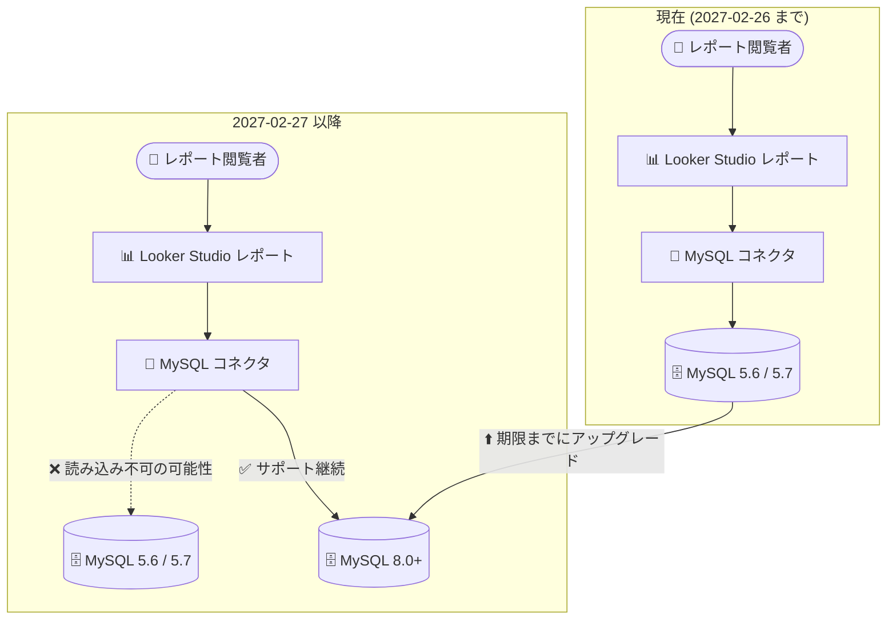

# Looker Studio (Data Studio): MySQL 5.6 / 5.7 サポート終了 (Deprecation)

**リリース日**: 2026-09-24

**サービス**: Looker Studio (Data Studio)

**機能**: MySQL コネクタにおける MySQL 5.6 / 5.7 サポートの廃止

**ステータス**: Deprecated (非推奨)

📊 [このアップデートのインフォグラフィックを見る](https://takech9203.github.io/google-cloud-news-summary/20260924-looker-studio-mysql-5-6-5-7-deprecation.html)

## 概要

Looker Studio (Data Studio) の MySQL コネクタにおいて、MySQL 5.6 および 5.7 のサポート終了が発表されました。**2027 年 2 月 26 日以降、MySQL 5.6 または 5.7 に接続する新規データソースの作成ができなくなります。** また、同日以降、MySQL 5.6 / 5.7 を使用している既存のデータソースやレポートは、データが正常に読み込めなくなる可能性があります。

Looker Studio の MySQL コネクタは Google Cloud SQL for MySQL の基盤上に構築されており、サポートされるバージョンや機能は Cloud SQL for MySQL の制約に準拠します。MySQL 5.6 / 5.7 は Oracle によるサポートがすでに終了している古いバージョンであり、Google Cloud 全体でレガシーバージョンからの移行が進められている流れに沿った変更です。

このアップデートの影響を受けるのは、オンプレミスやセルフマネージドの MySQL 5.6 / 5.7、または旧バージョンの Cloud SQL for MySQL インスタンスを Looker Studio のデータソースとして利用しているユーザーです。ダッシュボードやレポートが 2027 年 2 月 27 日以降に突然データを表示できなくなるリスクがあるため、期限までに MySQL 8.0 以降へのアップグレードを計画する必要があります。

**アップデート前の状況**

- Looker Studio の MySQL コネクタは MySQL 5.6、5.7、8.0 でテスト・サポートされていた
- MySQL 5.6 / 5.7 に接続するデータソースの新規作成と、既存レポートでの利用が可能だった

**アップデート後の変更 (2027 年 2 月 26 日以降)**

- MySQL 5.6 / 5.7 に接続する新規データソースの作成が不可能になる
- MySQL 5.6 / 5.7 を使用する既存のデータソースやレポートで、データが正常に読み込めなくなる可能性がある
- 継続利用には MySQL 8.0 以降へのデータベースアップグレードが必要になる

## アーキテクチャ図



2027 年 2 月 26 日を境に MySQL 5.6 / 5.7 への接続が機能しなくなる可能性があるため、期限までに MySQL 8.0 以降へアップグレードする移行パスを示しています。

## サービスアップデートの詳細

### 変更内容

1. **新規データソース作成の停止**
   - 2027 年 2 月 26 日以降、MySQL 5.6 または 5.7 に接続する新規データソースの作成が不可能になる
   - MySQL コネクタ、および同じ基盤を持つ Cloud SQL for MySQL コネクタの利用者は影響範囲の確認が必要

2. **既存データソース・レポートへの影響**
   - MySQL 5.6 / 5.7 を使用しているデータソースやレポートは、2027 年 2 月 26 日以降データが正常に読み込めなくなる可能性がある
   - ダッシュボードの表示エラーや空データとして顕在化するおそれがある

3. **推奨される対応**
   - 接続先データベースを MySQL 8.0 以降にアップグレードする
   - Cloud SQL for MySQL を利用している場合は、インスタンスのメジャーバージョンアップグレードを実施する

## 技術仕様

### MySQL コネクタのサポート状況

| 項目 | 詳細 |
|------|------|
| 影響を受けるコネクタ | Looker Studio MySQL コネクタ (Cloud SQL for MySQL ベース) |
| 廃止対象バージョン | MySQL 5.6、MySQL 5.7 |
| 継続サポートバージョン | MySQL 8.0 以降 |
| 新規データソース作成の停止 | 2027 年 2 月 26 日以降 |
| 既存レポートへの影響 | 2027 年 2 月 26 日以降、データ読み込みが失敗する可能性 |

### MySQL コネクタの主な制限 (参考)

| 項目 | 詳細 |
|------|------|
| 接続単位 | 1 データソースにつき 1 テーブル (またはカスタムクエリ) |
| クエリあたりの最大行数 | 150,000 行 (超過分は切り捨て) |
| 基盤 | Google Cloud SQL for MySQL と同じバージョン・機能制限に準拠 |
| 非対応機能 | MySQL Spatial Data Extensions、非 ASCII 文字の列名 |

## 対応方法

### 前提条件

1. Looker Studio で MySQL コネクタまたは Cloud SQL for MySQL コネクタを使用しているデータソースの棚卸し
2. 接続先データベースの MySQL バージョンの確認

### 手順

#### ステップ 1: 影響を受けるデータソースの特定

```sql
-- 接続先 MySQL のバージョンを確認
SELECT VERSION();
```

Looker Studio のデータソース一覧から MySQL / Cloud SQL for MySQL コネクタを使用しているものを洗い出し、接続先のバージョンが 5.6 / 5.7 でないか確認します。

#### ステップ 2: データベースのアップグレード

```bash
# Cloud SQL for MySQL の場合: インプレースメジャーバージョンアップグレード
gcloud sql instances patch INSTANCE_NAME \
  --database-version=MYSQL_8_0
```

Cloud SQL for MySQL を利用している場合は、インプレースアップグレードまたは Database Migration Service を使用して MySQL 8.0 以降へ移行します。セルフマネージド MySQL の場合は、公式のアップグレード手順に従って 8.0 以降へアップグレードします。

#### ステップ 3: レポートの動作確認

アップグレード後、Looker Studio のデータソースを再認証し、レポートが正常にデータを読み込めることを確認します。

## 影響とリスク

### ビジネス面

- **ダッシュボード停止リスク**: 対応しない場合、2027 年 2 月 27 日以降に経営レポートや KPI ダッシュボードが突然データを表示できなくなるおそれがある
- **移行準備期間の確保**: 発表から期限まで約 17 か月の猶予があり、計画的なアップグレードが可能

### 技術面

- **セキュリティ向上**: Oracle のサポートが終了した古い MySQL バージョンからの脱却により、脆弱性リスクを低減できる
- **MySQL 8.0 の新機能活用**: ウィンドウ関数、CTE (共通テーブル式) など、分析クエリに有用な機能が利用可能になる

## デメリット・制約事項

### 制限事項

- MySQL 5.6 / 5.7 のまま Looker Studio を継続利用する回避策は提供されない
- MySQL 5.7 から 8.0 へのアップグレードには非互換の変更 (予約語の追加、デフォルト認証プラグインの変更など) が含まれるため、アプリケーション側の検証が必要

### 考慮すべき点

- Looker Studio 以外にも同じデータベースに接続しているアプリケーションがある場合、アップグレードの影響範囲を横断的に評価する必要がある
- カスタムクエリを使用しているデータソースは、MySQL 8.0 での構文互換性 (予約語の衝突など) を個別に確認する

## ユースケース

### ユースケース 1: オンプレミス MySQL 5.7 を使ったダッシュボードの移行

**シナリオ**: オンプレミスの MySQL 5.7 を Looker Studio の MySQL コネクタで参照し、営業ダッシュボードを運用している。

**対応**: 2027 年 2 月 26 日までに MySQL 8.0 へアップグレードするか、Database Migration Service を使用して Cloud SQL for MySQL 8.0 へ移行し、データソースの接続情報を更新する。

**効果**: ダッシュボードの停止を回避し、あわせてマネージドサービスへの移行による運用負荷軽減も実現できる。

### ユースケース 2: 旧 Cloud SQL for MySQL インスタンスの棚卸し

**シナリオ**: 複数プロジェクトに散在する Cloud SQL for MySQL インスタンスのうち、どれが Looker Studio レポートに使われているか把握できていない。

**対応**: Cloud SQL インスタンスのバージョン一覧を確認し、5.6 / 5.7 のインスタンスを特定した上で、Looker Studio のデータソース管理画面と突き合わせて影響レポートを洗い出す。

**効果**: 期限前に影響範囲を可視化し、優先順位を付けたアップグレード計画を立案できる。

## 料金

このアップデート自体に伴う料金変更はありません。Looker Studio の MySQL コネクタは無料で利用できます。Cloud SQL for MySQL のアップグレードに伴う料金は、インスタンス構成によって異なります。

- [Cloud SQL 料金ページ](https://cloud.google.com/sql/pricing)

## 関連サービス・機能

- **Cloud SQL for MySQL**: Looker Studio の MySQL コネクタの基盤。Cloud SQL 側でも MySQL 5.6 / 5.7 は非推奨となっており、8.0 以降への移行が推奨されている
- **Database Migration Service**: オンプレミスやセルフマネージド MySQL から Cloud SQL for MySQL への移行を支援するマネージドサービス
- **Cloud SQL for MySQL コネクタ**: MySQL コネクタと同様に MySQL 5.6 / 5.7 / 8.0 でテストされている Looker Studio のコネクタ

## 参考リンク

- 📊 [インフォグラフィック](https://takech9203.github.io/google-cloud-news-summary/20260924-looker-studio-mysql-5-6-5-7-deprecation.html)
- [公式リリースノート](https://docs.cloud.google.com/release-notes#September_24_2026)
- [Connect to MySQL (公式ドキュメント)](https://docs.cloud.google.com/data-studio/connect-to-mysql)
- [Connect to Cloud SQL for MySQL (公式ドキュメント)](https://docs.cloud.google.com/data-studio/connect-to-google-cloud-sql-for-mysql)
- [Cloud SQL for MySQL の機能](https://docs.cloud.google.com/sql/docs/mysql/features)

## まとめ

Looker Studio の MySQL コネクタにおける MySQL 5.6 / 5.7 サポートは 2027 年 2 月 26 日に終了し、以降は新規データソース作成不可、既存レポートのデータ読み込み失敗の可能性があります。MySQL 5.6 / 5.7 に接続しているデータソースを早期に棚卸しし、期限までに MySQL 8.0 以降へのアップグレードを完了させることを強く推奨します。

---

**タグ**: #LookerStudio #DataStudio #MySQL #Deprecation #CloudSQL #BI #ダッシュボード
