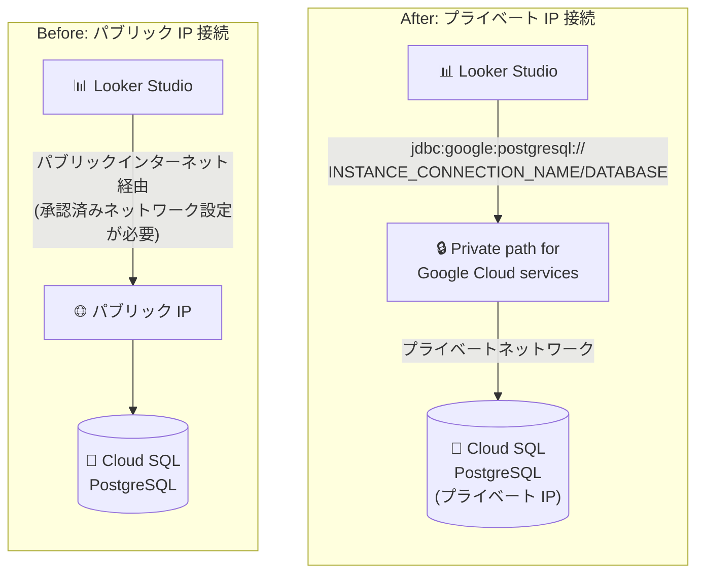

# Looker Studio (Data Studio): PostgreSQL へのプライベート IP 接続サポート

**リリース日**: 2026-09-24

**サービス**: Looker Studio (Data Studio)

**機能**: Cloud SQL for PostgreSQL へのプライベート IP 接続

**ステータス**: Feature (段階的ロールアウト中)

📊 [このアップデートのインフォグラフィックを見る](https://takech9203.github.io/google-cloud-news-summary/20260924-looker-studio-postgresql-private-ip.html)

## 概要

Looker Studio (Data Studio) の PostgreSQL コネクタが、Cloud SQL for PostgreSQL へのプライベート IP アドレスによる接続に対応しました。プライベート IP 接続を使用すると、Looker Studio とデータベース間のトラフィックがパブリックインターネットを経由せず、プライベートネットワーク内に保持されます。

これまで Looker Studio から Cloud SQL for PostgreSQL に接続するには、インスタンスにパブリック IP を割り当て、Looker Studio のグローバルインフラストラクチャ用 IP アドレス範囲を承認済みネットワークに追加する必要がありました。今回のアップデートにより、パブリック IP を持たない (またはパブリックアクセスを許可したくない) Cloud SQL インスタンスのデータも、セキュリティ要件を維持したまま Looker Studio で可視化できるようになります。

セキュリティポリシー上データベースへのパブリックアクセスを禁止している企業や、ネットワーク境界の最小化を求められる規制業界のユーザーにとって、BI 活用の障壁を取り除く重要なアップデートです。なお、この機能は段階的にロールアウトされており、すべてのユーザーがすぐに利用できるとは限りません。

**アップデート前の課題**

- Looker Studio の PostgreSQL コネクタは Cloud SQL Auth Proxy を使用しないため、Cloud SQL for PostgreSQL への接続にはパブリック IP が必須だった
- Looker Studio 用の IP アドレス範囲 (142.251.74.0/23 など) を Cloud SQL の承認済みネットワークに追加し、データベースをパブリックインターネットに公開する必要があった
- パブリック IP の割り当てを禁止するセキュリティポリシーを持つ組織では、Looker Studio から Cloud SQL PostgreSQL のデータを直接可視化できなかった

**アップデート後の改善**

- プライベート IP のみを持つ Cloud SQL for PostgreSQL インスタンスに Looker Studio から直接接続できるようになった
- データベーストラフィックがパブリックインターネットを経由せず、プライベートネットワーク内に閉じるようになった
- パブリック IP の付与や承認済みネットワークへの IP 範囲追加が不要になり、攻撃対象領域 (アタックサーフェス) を縮小できるようになった

## アーキテクチャ図



従来はパブリック IP 経由でインターネットを経由する接続のみでしたが、今回のアップデートにより、Cloud SQL の「Google Cloud サービスのプライベートパス」オプションを介してトラフィックをプライベートネットワーク内に保持したまま接続できます。

## サービスアップデートの詳細

### 主要機能

1. **プライベート IP 接続のサポート (メイン機能)**
   - Cloud SQL for PostgreSQL インスタンスにプライベート IP アドレスで接続可能
   - JDBC URL 接続オプションを使用し、`jdbc:google:postgresql://INSTANCE_CONNECTION_NAME/DATABASE` 形式で指定する
   - Cloud SQL インスタンス側で「Google Cloud サービスのプライベートパス (Private path for Google Cloud services)」オプションの有効化が必要
   - 段階的ロールアウト中のため、接続できない場合や早期利用を希望する場合は Cloud カスタマーケアへの連絡でプレビューグループに追加可能

2. **一括スタイル設定 (Bulk styling) (同日の関連アップデート)**
   - チャート内のすべての系列 (series)、ディメンション、指標のスタイルを一括でカスタマイズ可能
   - 個別アイテムを選択して個別にスタイル設定することも可能で、個別設定は一括設定より優先される
   - ラインチャート・コンボチャート、時系列チャート、テーブルで利用可能

3. **パートナーコネクタの追加 (同日の関連アップデート)**
   - Connector Gallery に以下のパートナーコネクタが追加された
   - Facebook Ads Analytics (Langquang)、Nextdoor / Attentive / Contractors Cloud / AppLovin (Windsor.ai)、SEOmonitor (SEOmonitor)

※ 同日に発表された MySQL 5.6 / 5.7 の非推奨化については、[別レポート](2026-09-24-looker-studio-mysql-5-6-5-7-deprecation.md)を参照してください。

## 技術仕様

### プライベート IP 接続の要件

| 項目 | 詳細 |
|------|------|
| 接続方式 | JDBC URL 接続オプション (BASIC 接続では不可) |
| JDBC URL 形式 | `jdbc:google:postgresql://INSTANCE_CONNECTION_NAME/DATABASE` |
| INSTANCE_CONNECTION_NAME | `projectID:region:instanceID` 形式の Cloud SQL 接続名 |
| Cloud SQL 側の設定 | 「Google Cloud サービスのプライベートパス」オプションの選択が必要 |
| 提供状況 | 段階的ロールアウト中 (未提供の場合は Cloud カスタマーケアで opt-in 可能) |

### PostgreSQL コネクタの主な制限事項

| 項目 | 詳細 |
|------|------|
| Cloud SQL Auth Proxy | 使用しない (パブリック IP 接続時は承認済みネットワークへの IP 追加が必要) |
| クエリあたりの最大行数 | 150,000 行 (超過分は切り捨て) |
| スキーマ | public スキーマ外のテーブル選択は不可 (カスタムクエリで回避可能) |
| 列ヘッダー | ASCII 文字のみサポート |
| 暗号化 | TLS 1.2 による SSL 接続をサポート |
| サポートするデータ型 | Numeric、Character、Boolean、Date/Time (Interval を除く) |

### パブリック IP 接続時に必要な IP アドレス範囲 (参考)

プライベート IP を使用しない場合、従来通り以下の Looker Studio 用 IP 範囲を承認済みネットワークに追加する必要があります。

| 構成 | IP アドレス範囲 |
|------|-----------------|
| 通常 | 142.251.74.0/23、2001:4860:4807::/48 (IPv6、任意) |
| データレジデンシー有効 (Pro) | 142.251.56.0/24、2001:4860:4815::/48 (IPv6、任意) |

## 設定方法

### 前提条件

1. Cloud SQL for PostgreSQL インスタンスにプライベート IP が構成されていること (VPC ネットワークでのプライベートサービスアクセスの設定が必要)
2. Cloud SQL インスタンスで「Google Cloud サービスのプライベートパス」オプションが有効になっていること
3. インスタンスの接続名 (`projectID:region:instanceID`) を確認済みであること

### 手順

#### ステップ 1: Cloud SQL 側でプライベートサービスアクセスとプライベートパスを構成

```bash
# Service Networking API と Compute Engine API を有効化
gcloud services enable servicenetworking.googleapis.com compute.googleapis.com \
  --project=PROJECT_ID

# プライベートサービスアクセス用の IP 範囲を割り当て
gcloud compute addresses create google-managed-services-VPC_NETWORK_NAME \
  --global \
  --purpose=VPC_PEERING \
  --prefix-length=16 \
  --network=projects/PROJECT_ID/global/networks/VPC_NETWORK_NAME \
  --project=PROJECT_ID

# VPC ネットワークと Cloud SQL 間のプライベート接続を作成
gcloud services vpc-peerings connect \
  --service=servicenetworking.googleapis.com \
  --ranges=google-managed-services-VPC_NETWORK_NAME \
  --network=VPC_NETWORK_NAME \
  --project=PROJECT_ID
```

Cloud SQL インスタンスの設定で、プライベート IP を有効にし、「Google Cloud サービスのプライベートパス」オプションを選択します。

#### ステップ 2: Looker Studio でデータソースを作成

1. Looker Studio にサインインし、「作成」→「データソース」を選択
2. PostgreSQL コネクタを選択
3. 接続パネルで「JDBC URL」を選択し、以下の形式で入力

```text
jdbc:google:postgresql://PROJECT_ID:REGION:INSTANCE_ID/DATABASE_NAME
```

4. ユーザー名とパスワードを入力して「AUTHENTICATE」をクリック
5. テーブルを選択するかカスタムクエリを入力し、「CONNECT」をクリック

## メリット

### ビジネス面

- **セキュリティポリシーへの準拠**: データベースをパブリックインターネットに公開せずに BI ダッシュボードを構築できるため、規制業界や厳格なセキュリティ要件を持つ組織でも Looker Studio を採用しやすくなる
- **BI 活用範囲の拡大**: これまでネットワーク要件のために可視化できなかったプライベート IP のみの Cloud SQL PostgreSQL データを、追加のデータ移動なしにレポート化できる

### 技術面

- **攻撃対象領域の縮小**: パブリック IP の割り当てと承認済みネットワークへの IP 範囲追加が不要になり、外部からの到達経路を排除できる
- **ネットワーク経路の閉域化**: データベーストラフィックがプライベートネットワーク内に保持され、パブリックインターネットを経由しない
- **中間コンポーネント不要**: プロキシ VM やデータの中間エクスポート (BigQuery への複製など) を介さず、Looker Studio から直接接続できる

## デメリット・制約事項

### 制限事項

- 段階的ロールアウト中のため、すべてのユーザーで利用できるとは限らない (利用できない場合は Cloud カスタマーケアへの連絡が必要)
- プライベート IP 接続には JDBC URL 接続オプションの使用が必須 (ホスト名/IP を指定する BASIC 接続では利用不可)
- Cloud SQL インスタンス側で「Google Cloud サービスのプライベートパス」オプションの有効化が必要
- コネクタ共通の制限として、クエリあたり最大 150,000 行、public スキーマ外のテーブル直接選択不可、列ヘッダーは ASCII 文字のみ

### 考慮すべき点

- プライベートサービスアクセスの構成には VPC ピアリングと専用の IP 範囲割り当て (リージョン・データベースタイプごとに最低 /24) が必要
- プライベート接続を削除すると、同じ接続を使用する他の Google サービス (Filestore、Memorystore など) のプライベート接続にも影響する
- カスタムクエリは 3〜5 分でタイムアウトする場合があるため、重いクエリは事前集計テーブルの利用を検討する

## ユースケース

### ユースケース 1: 閉域構成の基幹データベースの BI ダッシュボード化

**シナリオ**: 金融・医療などの規制業界で、セキュリティポリシーにより Cloud SQL インスタンスへのパブリック IP 割り当てが禁止されている環境で、業務データを Looker Studio でダッシュボード化したい。

**実装例**:
```text
1. Cloud SQL for PostgreSQL をプライベート IP のみで構成
2. 「Google Cloud サービスのプライベートパス」オプションを有効化
3. Looker Studio の PostgreSQL コネクタで JDBC URL を指定:
   jdbc:google:postgresql://my-project:asia-northeast1:prod-db/analytics
4. ダッシュボードを作成して関係者に共有
```

**効果**: データベースをインターネットに公開することなく BI ダッシュボードを提供でき、セキュリティ監査要件を満たしながらデータ活用を推進できる。

### ユースケース 2: 承認済みネットワーク運用からの移行

**シナリオ**: 現在パブリック IP + 承認済みネットワーク (Looker Studio の IP 範囲を許可) で Looker Studio に接続しているが、ネットワーク境界を最小化したい。

**効果**: プライベート IP 接続に切り替えることで、パブリック IP と承認済みネットワーク設定を廃止でき、外部からの到達経路を排除してセキュリティ体制を強化できる。

## 料金

Looker Studio の PostgreSQL コネクタ自体に追加料金はありません。接続先の Cloud SQL for PostgreSQL インスタンスには通常の Cloud SQL 料金が適用されます。詳細は料金ページを参照してください。

- [Cloud SQL の料金](https://cloud.google.com/sql/pricing)
- [Looker Studio の概要 (Pro を含むエディション)](https://cloud.google.com/looker-studio)

## 利用可能リージョン

この機能は段階的にロールアウトされており、すべてのユーザーがすぐに利用できるとは限りません。接続できない場合や、ロールアウト期間中に明示的に opt-in したい場合は、[Cloud カスタマーケア](https://docs.cloud.google.com/support)に連絡してプレビューグループへの追加を依頼できます。

## 関連サービス・機能

- **Cloud SQL for PostgreSQL**: 接続先のマネージド PostgreSQL データベース。プライベート IP 構成とプライベートパスオプションの有効化が必要
- **プライベートサービスアクセス (Private Services Access)**: VPC ネットワークと Cloud SQL 間のプライベート接続を実現する VPC ピアリングベースの仕組み
- **Service Networking API**: プライベートサービスアクセスの構成に必要な API
- **Looker Studio Pro**: データレジデンシーなどのエンタープライズ機能を提供する有償エディション (データレジデンシー有効時はパブリック接続用 IP 範囲が異なる)
- **AlloyDB for PostgreSQL**: 同じ PostgreSQL コネクタで接続可能 (ただし SSL 接続は非サポート)

## 参考リンク

- 📊 [インフォグラフィック](https://takech9203.github.io/google-cloud-news-summary/20260924-looker-studio-postgresql-private-ip.html)
- [公式リリースノート](https://docs.cloud.google.com/release-notes#September_24_2026)
- [Connect to PostgreSQL (公式ドキュメント)](https://docs.cloud.google.com/data-studio/connect-to-postgresql)
- [Cloud SQL for PostgreSQL: プライベートサービスアクセスの構成](https://docs.cloud.google.com/sql/docs/postgres/configure-private-services-access)
- [Cloud SQL for PostgreSQL: プライベート IP を使用した接続](https://docs.cloud.google.com/sql/docs/postgres/connect-instance-private-ip)
- [Cloud SQL の料金](https://cloud.google.com/sql/pricing)

## まとめ

Looker Studio から Cloud SQL for PostgreSQL へのプライベート IP 接続対応により、データベースをパブリックインターネットに公開せずに BI ダッシュボードを構築できるようになりました。セキュリティ要件によりこれまで Looker Studio を利用できなかった環境では、大きな導入機会となります。段階的ロールアウト中のため、まず自環境で JDBC URL 形式 (`jdbc:google:postgresql://INSTANCE_CONNECTION_NAME/DATABASE`) での接続を検証し、利用できない場合は Cloud カスタマーケア経由での opt-in を検討してください。

---

**タグ**: #LookerStudio #DataStudio #CloudSQL #PostgreSQL #PrivateIP #ネットワークセキュリティ #BI #データ可視化
