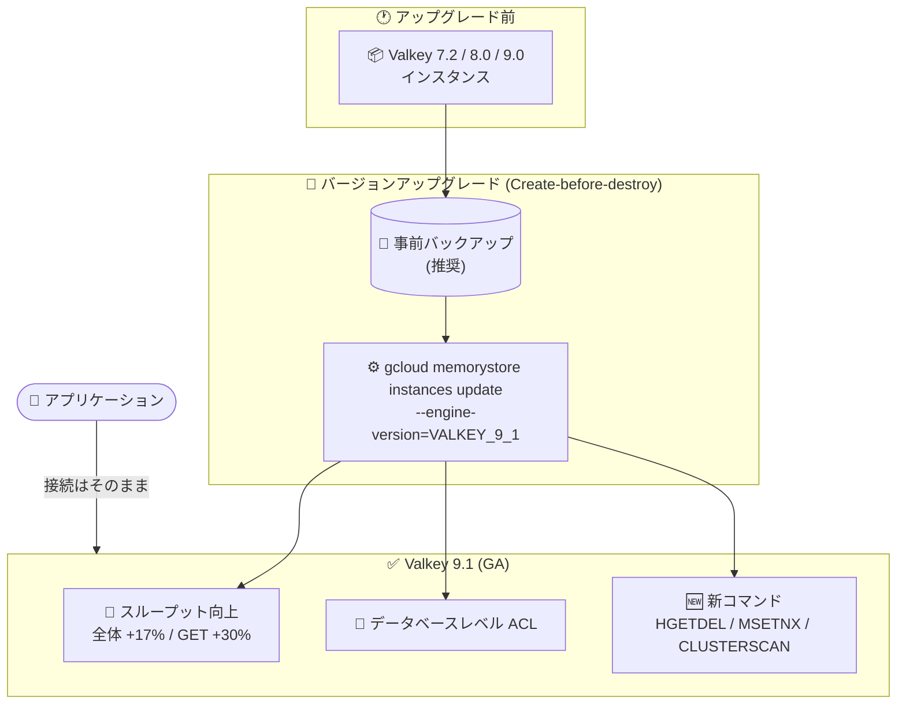

# Memorystore for Valkey: Valkey バージョン 9.1 サポートが GA

**リリース日**: 2026-09-24

**サービス**: Memorystore for Valkey

**機能**: Valkey バージョン 9.1 サポート

**ステータス**: 一般提供 (GA)

📊 [このアップデートのインフォグラフィックを見る](https://takech9203.github.io/google-cloud-news-summary/20260924-memorystore-valkey-9-1-ga.html)

## 概要

Memorystore for Valkey において、Valkey バージョン 9.1 のサポートが一般提供 (GA) になりました。2026 年 7 月 27 日に Preview として提供が開始されたバージョン 9.1 サポートが、今回本番ワークロードで利用可能な GA ステータスに昇格しました。これにより、Memorystore for Valkey は 7.2、8.0、9.0、9.1 の 4 つのメジャーバージョンをサポートします。

Valkey 9.1 の主な特徴は、スループットの向上、データベースレベルのアクセス制御、新コマンドの追加です。I/O スレッディングと文字列処理の内部最適化により、インスタンス全体のスループットが最大 17% 向上し、GET オペレーションでは最大 30% の向上が見込めます。また、ACL によるデータベースレベルのユーザーアクセス制限や、`HGETDEL`、`MSETNX`、`CLUSTERSCAN` といった新コマンドが利用可能になります。

低レイテンシのキャッシュ層やセッションストアとして Memorystore for Valkey を利用しているユーザーにとって、アプリケーション側の変更なしにパフォーマンス向上を得られるアップデートです。既存インスタンスは任意の旧バージョン (例: 7.2) から 9.1 へ直接アップグレードできます。

**アップデート前の課題**

- Valkey 9.1 サポートは Preview 段階 (2026 年 7 月 27 日提供開始) であり、Pre-GA Offerings Terms が適用されるため本番ワークロードでの採用が難しかった
- Valkey 9.0 以前ではデータベースレベルの ACL によるアクセス制御ができず、より粗い粒度での制御が必要だった
- ハッシュフィールドの取得と削除を単一のアトミック操作で行う手段 (`HGETDEL`) や、インスタンスの全ノード横断でのキースキャン (`CLUSTERSCAN`) が利用できなかった

**アップデート後の改善**

- Valkey 9.1 が GA となり、SLA の対象として本番環境で安心して利用できるようになった
- I/O スレッディングと文字列処理の最適化により、全体で最大 17%、GET オペレーションで最大 30% のスループット向上が追加コストなしで得られるようになった
- ACL によるデータベースレベルのアクセス制御と、`HGETDEL`、`MSETNX`、`CLUSTERSCAN` などの新コマンドが利用可能になった

## アーキテクチャ図



既存インスタンスは任意の旧バージョンから Valkey 9.1 へ直接アップグレードできます。アップグレードはメンテナンスと同様の Create-before-destroy 方式で行われ、完了後はアプリケーション変更なしにスループット向上などの恩恵を受けられます。

## サービスアップデートの詳細

### 主要機能

1. **スループットの向上**
   - I/O スレッディングと文字列処理の内部最適化により、インスタンス全体のスループットが最大 17% 向上
   - GET オペレーションでは最大 30% のスループット向上
   - アプリケーションコードの変更は不要で、バージョンアップグレードのみで効果を得られる

2. **データベースレベルのアクセス制御**
   - アクセス制御リスト (ACL) を使用して、データベースレベルでユーザーのアクセスを制限可能
   - Memorystore for Valkey では 2026 年 8 月 31 日に GA となった ACL ポリシー機能 (キー、コマンド、操作、Pub/Sub チャネル単位の制限) と組み合わせて、よりきめ細かなセキュリティを実現

3. **新コマンドの追加**
   - `HGETDEL`: ハッシュフィールドの値の取得と削除を単一のアトミック操作で実行
   - `MSETNX`: 複数のキーを共有の有効期限付きで設定
   - `CLUSTERSCAN`: インスタンスの全ノードを横断してキーをスキャン
   - `HSETEX` コマンドが `NX` および `XX` パラメータをサポート

## 技術仕様

### サポートバージョン

| Valkey メジャーバージョン | ステータス |
|------|------|
| 9.1 | GA (今回のアップデート) |
| 9.0 | GA (デフォルトバージョン) |
| 8.0 | GA |
| 7.2 | GA |

### バージョンアップグレードの挙動

| 項目 | 詳細 |
|------|------|
| アップグレードパス | 任意の新しいバージョンへ直接アップグレード可能 (例: 7.2 → 9.1) |
| ダウングレード | 不可 (アップグレードは不可逆) |
| アップグレード方式 | インスタンス内の全ノードを更新 (メンテナンスと同様の Create-before-destroy 方式) |
| 対応 API 値 | `VALKEY_9_1` (gcloud の `--engine-version` フラグ) |

## 設定方法

### 前提条件

1. Memorystore for Valkey インスタンスが作成済みであること
2. アップグレードは不可逆のため、事前にオンデマンドバックアップを作成しておくこと (推奨)
3. インスタンスのトラフィックが少ない時間帯にアップグレードを実施すること (推奨)

### 手順

#### ステップ 1: 事前バックアップの作成 (推奨)

```bash
gcloud memorystore instances backup my-instance \
  --project=my-project \
  --location=us-central1
```

アップグレードは不可逆のため、事前にインスタンスデータのバックアップを作成しておくことが推奨されます。

#### ステップ 2: バージョンのアップグレード

```bash
gcloud memorystore instances update my-instance \
  --project=my-project \
  --location=us-central1 \
  --engine-version=VALKEY_9_1
```

Google Cloud コンソールからも、インスタンス詳細画面の「構成」セクションで「Valkey バージョン」の横にある「アップグレード」をクリックして実施できます。

## メリット

### ビジネス面

- **追加コストなしの性能向上**: バージョンアップグレードのみで最大 17% (GET は最大 30%) のスループット向上が得られ、同じ構成でより多くのリクエストを処理できる
- **本番利用可能な GA ステータス**: Pre-GA Offerings Terms の制約がなくなり、本番ワークロードで安心して採用できる

### 技術面

- **アトミック操作の拡充**: `HGETDEL` により、ハッシュフィールドの取得と削除をクライアント側のトランザクション処理なしで安全に実行できる
- **セキュリティ強化**: データベースレベルの ACL により、マルチテナント的な利用でもユーザーごとのアクセス境界を明確化できる
- **運用性の向上**: `CLUSTERSCAN` により、クラスタ全ノードを横断したキースキャンが単一コマンドで可能になる

## デメリット・制約事項

### 制限事項

- バージョンアップグレードは不可逆で、9.1 へアップグレード後に旧バージョンへダウングレードすることはできない
- Memorystore for Valkey は Valkey コマンドライブラリ全体のサブセットをサポートしており、すべてのコマンドが利用できるわけではない

### 考慮すべき点

- アップグレードはメンテナンスと同様のプロセスで全ノードが更新されるため、トラフィックが少ない時間帯での実施が推奨される
- アップグレード前に、9.1 の新機能や挙動の変更がアプリケーションに与える影響を確認しておく必要がある
- 現時点でのデフォルトバージョンは 9.0 のため、新規インスタンスで 9.1 を使う場合は明示的にバージョンを指定する

## ユースケース

### ユースケース 1: 読み取り中心のキャッシュ層の性能向上

**シナリオ**: Web アプリケーションのセッションストアや DB クエリ結果のキャッシュとして Memorystore for Valkey を利用しており、GET オペレーションが大半を占めている。トラフィック増加に伴いスケールアウトを検討している。

**実装例**:
```bash
gcloud memorystore instances update session-cache \
  --project=my-project \
  --location=asia-northeast1 \
  --engine-version=VALKEY_9_1
```

**効果**: GET オペレーションのスループットが最大 30% 向上するため、ノード追加によるスケールアウトの前にバージョンアップグレードだけで処理能力を引き上げられ、コスト増を抑えられる。

### ユースケース 2: マルチチームでのデータベースレベルのアクセス分離

**シナリオ**: 1 つの Memorystore for Valkey インスタンスを複数チームで共有しており、チームごとに異なる論理データベースを割り当てている。従来はデータベース単位でのアクセス制限ができず、誤操作のリスクがあった。

**効果**: Valkey 9.1 のデータベースレベル ACL により、ユーザーごとにアクセス可能なデータベースを制限でき、チーム間のデータ分離とガバナンスを強化できる。

## 料金

Valkey 9.1 の利用自体に追加料金はなく、Memorystore for Valkey の通常の料金体系 (ノードタイプとノード数、リージョンに基づく課金) が適用されます。詳細は料金ページを参照してください。

- [Memorystore for Valkey 料金ページ](https://cloud.google.com/memorystore/valkey/pricing)

## 利用可能リージョン

Memorystore for Valkey が提供されているリージョンで利用できます。詳細は以下を参照してください。

- [Memorystore for Valkey ロケーション](https://docs.cloud.google.com/memorystore/docs/valkey/locations)

## 関連サービス・機能

- **Memorystore for Redis Cluster**: 同じ Memorystore ファミリーの Redis 互換マネージドサービス。Valkey への移行元として比較検討されることが多い
- **ACL ポリシー (2026 年 8 月 31 日 GA)**: キー、コマンド、操作、Pub/Sub チャネル単位のきめ細かなアクセス制御。Valkey 9.1 のデータベースレベル ACL と組み合わせて利用できる
- **ワークロード移行機能 (2026 年 8 月 13 日 GA)**: Google Cloud 上のセルフマネージド Redis / Valkey インスタンスから Memorystore for Valkey への移行をサポート
- **Cloud Monitoring**: ノードレベルのメトリクスでアップグレード前後のパフォーマンスを比較・監視できる

## 参考リンク

- 📊 [インフォグラフィック](https://takech9203.github.io/google-cloud-news-summary/20260924-memorystore-valkey-9-1-ga.html)
- [公式リリースノート](https://docs.cloud.google.com/release-notes#September_24_2026)
- [サポートされているバージョン](https://docs.cloud.google.com/memorystore/docs/valkey/supported-versions)
- [Valkey バージョンのアップグレードについて](https://docs.cloud.google.com/memorystore/docs/valkey/about-upgrading-version)
- [インスタンスの Valkey バージョンをアップグレードする](https://docs.cloud.google.com/memorystore/docs/valkey/upgrade-valkey-version)
- [料金ページ](https://cloud.google.com/memorystore/valkey/pricing)

## まとめ

Valkey 9.1 サポートの GA により、本番環境でもアプリケーション変更なしに最大 17% (GET は最大 30%) のスループット向上と、データベースレベル ACL や新コマンドといった機能強化を利用できるようになりました。7.2 や 8.0 など旧バージョンを利用中のインスタンスは任意のバージョンから直接 9.1 へアップグレードできるため、バックアップを取得のうえ、トラフィックの少ない時間帯にアップグレードを計画することを推奨します。

---

**タグ**: Memorystore, Valkey, GA, パフォーマンス, インメモリデータベース, キャッシュ, ACL
