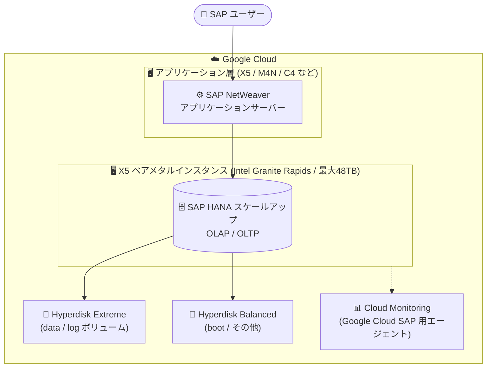

# SAP on Google Cloud: X5 シリーズ メモリ最適化ベアメタルマシンタイプの SAP 認定

**リリース日**: 2026-09-24

**サービス**: SAP on Google Cloud (Compute Engine)

**機能**: X5 シリーズ メモリ最適化ベアメタルマシンタイプの新規 SAP 認定

**ステータス**: Announcement (新規 SAP 認定)

📊 [このアップデートのインフォグラフィックを見る](https://takech9203.github.io/google-cloud-news-summary/20260924-sap-x5-bare-metal-certification.html)

## 概要

SAP HANA スケールアップ (OLAP および OLTP) と SAP NetWeaver ワークロード向けに、Compute Engine の X5 シリーズ メモリ最適化ベアメタルマシンタイプが SAP により認定されました。X5 シリーズは Intel Granite Rapids CPU プラットフォームを搭載し、最大 2,064 vCPU、最大 48 TB (49,152 GB) のメモリを提供する、Google Cloud で最大クラスのベアメタルマシンシリーズです。

今回の認定により、これまで X4 シリーズ (Intel Sapphire Rapids、最大 32 TB) が上限だった SAP 認定ベアメタルインスタンスのメモリ容量が 48 TB まで拡大しました。超大規模な SAP HANA データベースをクラウド上でスケールアップ構成のまま稼働させたいエンタープライズ企業、特に S/4HANA や BW/4HANA などの大規模基幹システムをオンプレミスの大型アプライアンスから移行したい企業が主な対象ユーザーです。

なお、最大構成の x5-2064-48T-metal は、SAP が RISE with SAP プログラムで管理する SAP ワークロード向けに提供されます。

**アップデート前の課題**

- SAP 認定のベアメタルマシンタイプは X4 シリーズ (Intel Sapphire Rapids、最大 1,920 vCPU / 32 TB メモリ) が最大であり、32 TB を超えるメモリを必要とする SAP HANA スケールアップ構成をクラウド上で稼働できなかった
- 32 TB を超える SAP HANA データベースは、スケールアウト構成への分割やデータ削減 (アーカイブ、データティアリング) の検討が必要だった
- 最新世代の Intel Granite Rapids CPU プラットフォームを SAP 本番ワークロードで利用する選択肢がなかった

**アップデート後の改善**

- 最大 48 TB のメモリを持つ X5 ベアメタルインスタンスが SAP HANA スケールアップ (OLAP / OLTP) と SAP NetWeaver で正式に利用可能になった
- 超大規模 SAP HANA データベースをスケールアウト分割せず、シンプルなスケールアップ構成のままクラウドへ移行できるようになった
- Intel Granite Rapids 世代の CPU 性能を SAP 認定構成で利用できるようになり、旧世代 (X4: Sapphire Rapids) からの性能向上が見込めるようになった

## アーキテクチャ図



X5 ベアメタルインスタンス上で SAP HANA をスケールアップ構成で稼働させる基本アーキテクチャです。ストレージは Hyperdisk のみをサポートし、SAP HANA の data / log ボリュームには Hyperdisk Extreme または Hyperdisk Balanced を使用します。

## サービスアップデートの詳細

### 主要機能

1. **SAP HANA スケールアップ (OLAP / OLTP) の認定**
   - X5 シリーズの全マシンタイプが SAP HANA のスケールアップ構成で認定
   - OLAP (BW/4HANA など分析系) と OLTP (S/4HANA など基幹系) の両ワークロードに対応
   - 認定 OS は RHEL および SUSE (SLES)

2. **SAP NetWeaver の認定**
   - SAP NetWeaver ベースのアプリケーションワークロードでも X5 シリーズが認定
   - データベース層とアプリケーション層の両方で最新世代ベアメタルを利用可能

3. **最大 48 TB メモリの超大規模構成**
   - x5-2064-48T-metal は 2,064 vCPU / 49,152 GB メモリを提供
   - 従来の SAP 認定ベアメタル最大構成 (X4: 32 TB) を 1.5 倍上回る容量
   - x5-2064-48T-metal は RISE with SAP プログラムで SAP が管理するワークロード向け

## 技術仕様

### SAP 認定された X5 マシンタイプ

| マシンタイプ | vCPU | メモリ | CPU プラットフォーム | 備考 |
|------|------|------|------|------|
| x5-688-12T-metal | 688 | 12,288 GB | Intel Granite Rapids | SAP HANA はスケールアップのみ |
| x5-688-16T-metal | 688 | 16,384 GB | Intel Granite Rapids | SAP HANA はスケールアップのみ |
| x5-1376-24T-metal | 1,376 | 24,576 GB | Intel Granite Rapids | SAP HANA はスケールアップのみ |
| x5-1376-32T-metal | 1,376 | 32,768 GB | Intel Granite Rapids | SAP HANA はスケールアップのみ |
| x5-2064-48T-metal | 2,064 | 49,152 GB | Intel Granite Rapids | RISE with SAP 管理ワークロード向け |

### X5 シリーズの制約・ストレージ仕様

| 項目 | 詳細 |
|------|------|
| ブロックストレージ | Hyperdisk のみ (ブートボリュームを含む)。SAP HANA 認定は Hyperdisk Extreme / Hyperdisk Balanced |
| マシンシェイプ | 事前定義タイプのみ (カスタムマシンタイプは利用不可) |
| 提供リージョン | 一部のゾーン / リージョンのみ |
| OS イメージ | 対応 OS イメージが限定される (RHEL / SUSE の対応バージョンを OS 詳細ページで確認) |
| SAP HANA 構成 | スケールアップ (OLAP / OLTP) で認定 |

## 設定方法

### 前提条件

1. X5 マシンシリーズが利用可能なリージョン / ゾーンを確認する ([利用可能なリージョンとゾーン](https://docs.cloud.google.com/compute/docs/regions-zones#available))
2. SAP 認定の OS (RHEL または SLES の対応バージョン) を選択する ([OS の詳細](https://docs.cloud.google.com/compute/docs/images/os-details))
3. ベアメタルインスタンスの利用について、必要に応じて Google Cloud アカウントチームに確認する

### 手順

#### ステップ 1: SAP HANA プランニングガイドでサイジングを確認

SAP HANA のメモリ要件に基づき、[SAP HANA プランニングガイドの X5 セクション](https://docs.cloud.google.com/sap/docs/sap-hana-planning-guide#x5-memory-optimized) を参照して適切なマシンタイプを選定します。

#### ステップ 2: X5 ベアメタルインスタンスの作成

```bash
# 例: X5 ベアメタルインスタンスの作成 (Hyperdisk Balanced をブートディスクに使用)
gcloud compute instances create sap-hana-x5-01 \
    --zone=ZONE \
    --machine-type=x5-688-12T-metal \
    --image-family=SAP_CERTIFIED_OS_IMAGE_FAMILY \
    --image-project=OS_IMAGE_PROJECT \
    --boot-disk-type=hyperdisk-balanced
```

X5 では Hyperdisk のみが利用可能なため、ブートディスクを含むすべてのディスクに Hyperdisk を指定します。

#### ステップ 3: SAP HANA 用ストレージの構成

SAP HANA の data / log ボリュームに Hyperdisk Extreme または Hyperdisk Balanced を作成してアタッチし、SAP HANA デプロイメントガイドに従ってインストールを実施します。

## メリット

### ビジネス面

- **超大規模 SAP システムのクラウド移行が可能に**: 32 TB を超えるメモリを必要とする SAP HANA データベースも、スケールアウト分割やデータ削減プロジェクトなしにクラウドへ移行できる
- **RISE with SAP との整合**: 最大構成 (48 TB) が RISE with SAP プログラムに対応しており、SAP マネージドのクラウド移行戦略に組み込める

### 技術面

- **スケールアップ構成の維持による運用簡素化**: 単一ノードのスケールアップ構成はスケールアウト構成に比べて運用・チューニングがシンプル
- **最新 CPU 世代による性能向上**: Intel Granite Rapids は X4 の Sapphire Rapids より新しい世代であり、コア数 (最大 2,064 vCPU) も大幅に増加
- **Hyperdisk による柔軟なストレージ性能**: Hyperdisk Extreme / Balanced により、IOPS・スループットをワークロードに合わせて調整可能

## デメリット・制約事項

### 制限事項

- ストレージは Hyperdisk のみ (Persistent Disk は利用不可、ブートボリュームも Hyperdisk が必要)
- 提供リージョン / ゾーンが限定される
- 事前定義マシンタイプのみで、カスタムマシンシェイプは利用不可
- 対応 OS イメージが限定される
- SAP HANA は現時点でスケールアップ構成のみの認定 (スケールアウト認定は記載なし)
- x5-2064-48T-metal (48 TB) は RISE with SAP プログラムで SAP が管理するワークロード向け

### 考慮すべき点

- ベアメタルインスタンスの一般的な特性 (ライブマイグレーション非対応、起動時間が長いなど) は同種の X4 シリーズと同様に事前検証が必要
- ベアメタルの料金・発注は Google Cloud アカウントチームへの確認が推奨される (X4 と同様の提供モデル)
- 導入前に SAP Note や [SAP HANA ハードウェアディレクトリ](https://www.sap.com/dmc/exp/2014-09-02-hana-hardware/enEN/#/solutions?filters=iaas;ve:29) で最新の認定状況を確認すること

## ユースケース

### ユースケース 1: 超大規模 S/4HANA (OLTP) のクラウド移行

**シナリオ**: オンプレミスの大型アプライアンスで稼働する 30 TB 超の S/4HANA データベースを、スケールアウト分割せずに Google Cloud へ移行したい。

**実装例**:
```
- データベース層: x5-1376-32T-metal (32 TB) または RISE with SAP 経由で x5-2064-48T-metal (48 TB)
- ストレージ: Hyperdisk Extreme (data / log)、Hyperdisk Balanced (boot / shared)
- アプリケーション層: SAP NetWeaver 認定マシンタイプ (X5 / M4N / C4 など)
```

**効果**: スケールアップ構成を維持したままクラウド移行でき、アプリケーション改修やデータ分割の工数を回避できる。

### ユースケース 2: 大規模 BW/4HANA (OLAP) の基盤刷新

**シナリオ**: X4 (Sapphire Rapids) 上で稼働中の大規模 BW/4HANA について、データ増加への対応と性能向上のため基盤を刷新したい。

**効果**: Granite Rapids 世代の CPU 性能向上とメモリ上限の引き上げ (32 TB → 48 TB) により、データ増加を見越した長期的なスケールアップ余地を確保できる。

## 料金

X5 ベアメタルマシンタイプの公開料金は執筆時点で確認できませんでした。同種の X4 ベアメタルと同様に、料金・発注については Google Cloud アカウントチームへの問い合わせが案内されています。最新情報は以下を参照してください。

- [Compute Engine の料金](https://cloud.google.com/compute/all-pricing)
- [確約利用割引 (CUD)](https://docs.cloud.google.com/compute/docs/committed-use-discounts/purchase-commitments)

## 利用可能リージョン

X5 マシンシリーズは一部のゾーン / リージョンでのみ利用可能です。最新の提供状況は [利用可能なリージョンとゾーン](https://docs.cloud.google.com/compute/docs/regions-zones#available) を参照してください。

## 関連サービス・機能

- **Compute Engine (メモリ最適化マシンファミリー)**: X5 は M1 / M2 / M3 / M4 / M4N / X4 に続くメモリ最適化シリーズで、SAP 向けの最上位ベアメタル構成
- **Google Cloud Hyperdisk**: X5 で唯一利用可能なブロックストレージ。SAP HANA の data / log には Hyperdisk Extreme / Balanced を使用
- **RISE with SAP**: x5-2064-48T-metal (48 TB) は RISE with SAP プログラムで SAP が管理するワークロード向けに提供
- **Google Cloud's Agent for SAP / Cloud Monitoring**: SAP 認定構成で必須となる監視エージェントとメトリクス基盤

## 参考リンク

- 📊 [インフォグラフィック](https://takech9203.github.io/google-cloud-news-summary/20260924-sap-x5-bare-metal-certification.html)
- [公式リリースノート](https://docs.cloud.google.com/release-notes#September_24_2026)
- [SAP on Google Cloud リリースノート](https://docs.cloud.google.com/sap/docs/release-notes)
- [SAP HANA プランニングガイド: X5 メモリ最適化ベアメタルマシンタイプ](https://docs.cloud.google.com/sap/docs/sap-hana-planning-guide#x5-memory-optimized)
- [SAP 認定アプリケーション: X5 メモリ最適化ベアメタルマシンタイプ](https://docs.cloud.google.com/sap/docs/certifications-sap-apps#sap-certified-x5)
- [SAP HANA 認定マシンタイプ一覧](https://docs.cloud.google.com/sap/docs/certifications-sap-hana)
- [Compute Engine メモリ最適化マシンファミリー](https://docs.cloud.google.com/compute/docs/memory-optimized-machines)

## まとめ

X5 シリーズの SAP 認定により、Google Cloud 上の SAP HANA スケールアップ構成のメモリ上限が 32 TB から 48 TB へ拡大し、最新の Intel Granite Rapids 世代を SAP 本番環境で利用できるようになりました。32 TB を超える大規模 SAP HANA を運用中、またはデータ増加を見込む企業は、X5 の提供リージョンと対応 OS を確認のうえ、移行・基盤刷新の候補として評価することを推奨します。48 TB 構成を検討する場合は RISE with SAP プログラムの利用が前提となる点に注意してください。

---

**タグ**: SAP, SAP HANA, SAP NetWeaver, Compute Engine, X5, ベアメタル, Intel Granite Rapids, メモリ最適化, Hyperdisk, RISE with SAP
